<h1>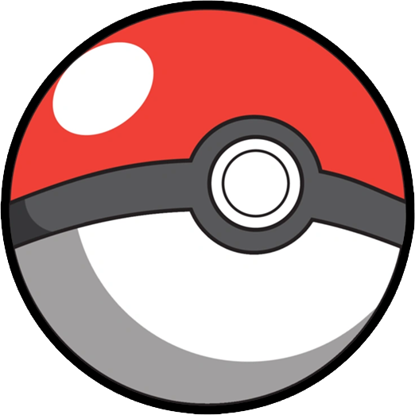 Pokémon Caught!</h1>

<h3>Pokédex</h3>

- **A**
  - [Absol](#absol) _MBG: MEGA Starter Set Mega Gengar ex_
- **C**
  - [Chandelure](#chandelure) _Trick or Trade BOOster Bundle_
  - [Charizard](#charizard) _SWSH04: Vivid Voltage_
  - [Charmander](#charmander) _ME02: Phantasmal Flames_
  - [Charmander](#charmander-1) _Pokémon GO_
  - [Charmander](#charmander-2) _SV03: Obsidian Flames_
  - [Charmander](#charmander-3) _SV: Paldean Fates_
  - [Charmander](#charmander-4) _SWSH04: Vivid Voltage_
  - [Charmander](#charmander-5) _XY - Evolutions_
  - [Charmeleon](#charmeleon) _Base Set_
  - [Charmeleon](#charmeleon-1) _ME02: Phantasmal Flames_
  - [Charmeleon](#charmeleon-2) _SM - Burning Shadows_
  - [Charmeleon](#charmeleon-3) _SV: Paldean Fates_
  - [Charmeleon](#charmeleon-4) _SV: Scarlet & Violet 151_
  - [Charmeleon](#charmeleon-5) _SWSH04: Vivid Voltage_
  - [Charmeleon (Delta Species)](#charmeleon-delta-species) _EX Crystal Guardians_
- **E**
  - [Eevee](#eevee) _Hidden Fates_
  - [Eevee](#eevee-1) _SV06: Twilight Masquerade_
  - [Eevee](#eevee-2) _SV: Prismatic Evolutions_
  - [Eevee](#eevee-3) _SV: Shrouded Fable_
  - [Eevee (Poké Ball Pattern)](#eevee-poké-ball-pattern) _SV: Prismatic Evolutions_
  - [Eevee ex](#eevee-ex) _SV: Prismatic Evolutions_
  - [Eevee V](#eevee-v) _SWSH: Sword & Shield Promo Cards_
  - [Eternatus](#eternatus) _MBG: MEGA Starter Set Mega Gengar ex_
- **F**
  - [Flareon](#flareon) _SV: Prismatic Evolutions_
  - [Flareon ex](#flareon-ex) _SV: Prismatic Evolutions_
  - [Flareon V](#flareon-v) _SWSH: Sword & Shield Promo Cards_
  - [Flareon VMAX](#flareon-vmax) _SWSH07: Evolving Skies_
- **G**
  - [Galarian Weezing](#galarian-weezing) _SWSH06: Chilling Reign_
  - [Galarian Weezing](#galarian-weezing-1) _Shining Fates_
  - [Gastly](#gastly) _Fossil_
  - [Gastly](#gastly-1) _MBG: MEGA Starter Set Mega Gengar ex_
  - [Gastly](#gastly-2) _ME02: Phantasmal Flames_
  - [Gastly](#gastly-3) _ME03: Perfect Order_
  - [Gastly](#gastly-4) _SV: Paldean Fates_
  - [Gastly](#gastly-5) _SV: Scarlet & Violet 151_
  - [Gastly](#gastly-6) _Trick or Trade BOOster Bundle_
  - [Gastly](#gastly-7) _Trick or Trade BOOster Bundle 2023_
  - [Gastly](#gastly-8) _XY - Evolutions_
  - [Gastly (Energy Symbol Pattern)](#gastly-energy-symbol-pattern) _ME: Ascended Heroes_
  - [Gengar](#gengar) _ME03: Perfect Order_
  - [Gengar](#gengar-1) _SWSH01: Sword & Shield Base Set_
  - [Gengar (2021 Copyright Date)](#gengar-2021-copyright-date) _Trick or Trade BOOster Bundle_
  - [Gengar (2022 Copyright Date)](#gengar-2022-copyright-date) _Trick or Trade BOOster Bundle 2023_
  - [Gengar (Cosmos Holo)](#gengar-cosmos-holo) _Trick or Trade BOOster Bundle 2024_
  - [Gengar V](#gengar-v) _SWSH08: Fusion Strike_
  - [Gourgeist](#gourgeist) _Trick or Trade BOOster Bundle_
- **H**
  - [Haunter](#haunter) _Base Set 2_
  - [Haunter](#haunter-1) _MBG: MEGA Starter Set Mega Gengar ex_
  - [Haunter](#haunter-2) _MBG: MEGA Starter Set Mega Gengar ex_
  - [Haunter](#haunter-3) _ME02: Phantasmal Flames_
  - [Haunter](#haunter-4) _ME03: Perfect Order_
  - [Haunter](#haunter-5) _SM - Crimson Invasion_
  - [Haunter](#haunter-6) _SV: Paldean Fates_
  - [Haunter](#haunter-7) _SV: Scarlet & Violet 151_
  - [Haunter](#haunter-8) _SWSH01: Sword & Shield Base Set_
  - [Haunter](#haunter-9) _Trick or Trade BOOster Bundle_
  - [Haunter](#haunter-10) _Trick or Trade BOOster Bundle 2023_
  - [Haunter](#haunter-11) _Trick or Trade BOOster Bundle 2024_
  - [Honchkrow](#honchkrow) _MBG: MEGA Starter Set Mega Gengar ex_
  - [Hoothoot](#hoothoot) _SV07: Stellar Crown_
  - [Houndoom](#houndoom) _Trick or Trade BOOster Bundle 2023_
- **I**
  - [Iron Jugulis](#iron-jugulis) _Trick or Trade BOOster Bundle 2024_
- **K**
  - [Koffing](#koffing) _SV09: Journey Together_
  - [Koffing](#koffing-1) _SWSH06: Chilling Reign_
- **L**
  - [Litwick](#litwick) _Trick or Trade BOOster Bundle_
- **M**
  - [Mega Gengar ex](#mega-gengar-ex) _MBG: MEGA Starter Set Mega Gengar ex_
  - [Mew V](#mew-v) _SWSH08: Fusion Strike_
  - [Murkrow](#murkrow) _MBG: MEGA Starter Set Mega Gengar ex_
- **N**
  - [Noctowl](#noctowl) _SV07: Stellar Crown_
- **O**
  - [Okidogi (Cosmos Holo)](#okidogi-cosmos-holo) _Trick or Trade BOOster Bundle 2024_
- **P**
  - [Pumpkaboo](#pumpkaboo) _ME04: Chaos Rising_
  - [Pumpkaboo](#pumpkaboo-1) _SM - Crimson Invasion_
  - [Pumpkaboo](#pumpkaboo-2) _SV04: Paradox Rift_
- **S**
  - [Sableye](#sableye) _MBG: MEGA Starter Set Mega Gengar ex_
  - [Sinistcha (Cosmos Holo)](#sinistcha-cosmos-holo) _Trick or Trade BOOster Bundle 2024_
  - [Spiritomb](#spiritomb) _SWSH06: Chilling Reign_
  - [Sudowoodo](#sudowoodo) _SWSH01: Sword & Shield Base Set_
- **T**
  - [Tatsugiri](#tatsugiri) _MBG: MEGA Starter Set Mega Gengar ex_
  - [Team Rocket's Koffing](#team-rockets-koffing) _SV10: Destined Rivals_
  - [Team Rocket's Weezing](#team-rockets-weezing) _SV10: Destined Rivals_
  - [Trevenant](#trevenant) _Trick or Trade BOOster Bundle 2023_
- **W**
  - [Weezing](#weezing) _Hidden Fates_
  - [Weezing](#weezing-1) _SV09: Journey Together_
  - [Weezing](#weezing-2) _SV: Scarlet & Violet 151_
  - [Weezing](#weezing-3) _XY - Fates Collide_
  - [Weezing (Team Plasma)](#weezing-team-plasma) _Plasma Storm_

<table>
  <tr><td colspan="2"><h3 id="absol">Absol</h3></td></tr>
  <tr>
    <th rowspan="14" width="400">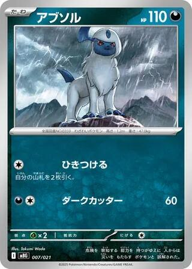</th>
  </tr>
  <tr><td><b>MBG: MEGA Starter Set Mega Gengar ex</b> <picture><source media="(prefers-color-scheme: dark)" srcset="./assets/sets-jp-dark/megagengar.png"></picture> 007/021</td></tr>
  <tr><td><b>Rarity</b>: -</td></tr>
  <tr><td><b>Type</b>:  Darkness</td></tr>
  <tr><td><b>HP</b>: 110</td></tr>
  <tr><td><b>Stage</b>: Basic</td></tr>
  <tr><td><b>Ability</b>: -</td></tr>
  <tr><td><b>Attack</b>: [Colorless] Allure - Draw 2 cards.</td></tr>
  <tr><td><b>Attack</b>: [Darkness][Colorless] Dark Cutter (60)</td></tr>
  <tr><td><b>Weakness</b>:  Grass ×2</td></tr>
  <tr><td><b>Resistance</b>: -</td></tr>
  <tr><td><b>Retreat</b>:  1</td></tr>
  <tr><td><b>Can I play it?</b>: ✗ No, Japanese cards are not allowed at tournaments here</td></tr>
  <tr><td><b>Category</b>: collection</td></tr>
</table>

<table>
  <tr><td colspan="2"><h3 id="chandelure">Chandelure <picture><source media="(prefers-color-scheme: dark)" srcset="./assets/rarities-dark/promo.png"></picture></h3></td></tr>
  <tr>
    <th rowspan="13" width="400">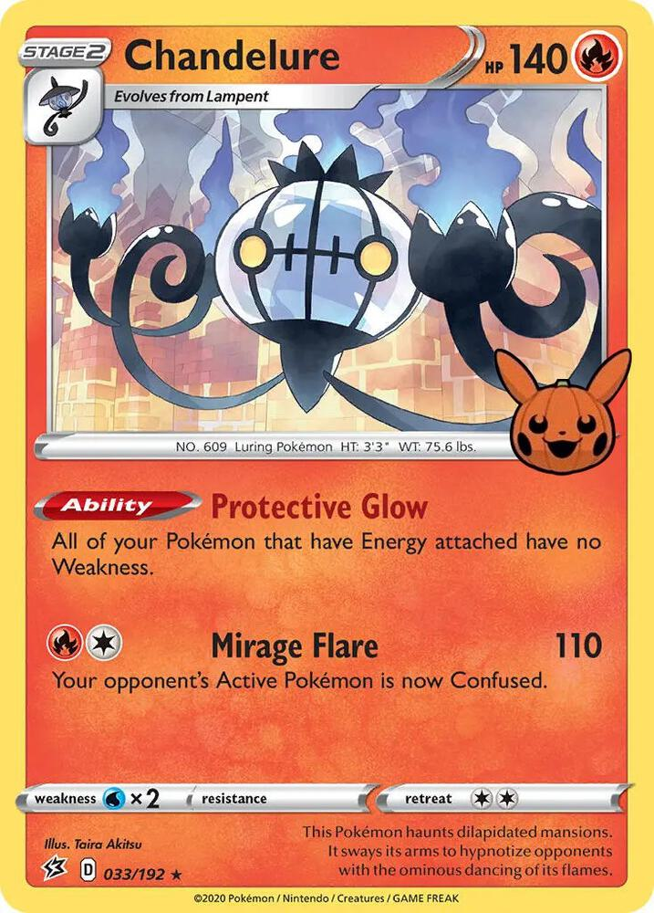</th>
  </tr>
  <tr><td><b>Trick or Trade BOOster Bundle</b> 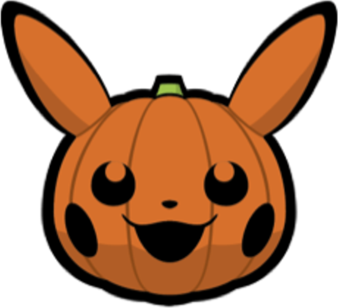 033/192</td></tr>
  <tr><td><b>Rarity</b>: <picture><source media="(prefers-color-scheme: dark)" srcset="./assets/rarities-dark/promo.png"></picture> Promo</td></tr>
  <tr><td><b>Type</b>:  Fire</td></tr>
  <tr><td><b>HP</b>: 140</td></tr>
  <tr><td><b>Stage</b>: Stage 2</td></tr>
  <tr><td><b>Ability</b>: Protective Glow All of your Pokémon that have Energy attached have no Weakness.</td></tr>
  <tr><td><b>Attack</b>: [1R] Mirage Flare (110) - Your opponent&#x27;s Active Pokémon is now Confused.</td></tr>
  <tr><td><b>Weakness</b>:  Water ×2</td></tr>
  <tr><td><b>Resistance</b>: -</td></tr>
  <tr><td><b>Retreat</b>:  2</td></tr>
  <tr><td><b>Can I play it?</b>: ✗ No, this card is too old for tournaments now</td></tr>
  <tr><td><b>Category</b>: collection</td></tr>
</table>

<table>
  <tr><td colspan="2"><h3 id="charizard">Charizard <picture><source media="(prefers-color-scheme: dark)" srcset="./assets/rarities-dark/rare.png"></picture></h3></td></tr>
  <tr>
    <th rowspan="13" width="400">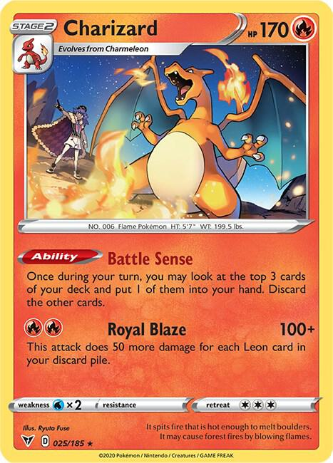</th>
  </tr>
  <tr><td><b>SWSH04: Vivid Voltage</b> <picture><source media="(prefers-color-scheme: dark)" srcset="./assets/sets-dark/vivid-voltage.png"></picture> 025/185</td></tr>
  <tr><td><b>Rarity</b>: <picture><source media="(prefers-color-scheme: dark)" srcset="./assets/rarities-dark/rare.png"></picture> Rare</td></tr>
  <tr><td><b>Type</b>:  Fire</td></tr>
  <tr><td><b>HP</b>: 170</td></tr>
  <tr><td><b>Stage</b>: Stage 2</td></tr>
  <tr><td><b>Ability</b>: Battle Sense Once during your turn, you may look at the top 3 cards of your deck and put 1 of them into your hand. Discard the other cards.</td></tr>
  <tr><td><b>Attack</b>: [RR] Royal Blaze (100+) - This attack does 50 more damage for each Leon in your discard pile.</td></tr>
  <tr><td><b>Weakness</b>:  Water ×2</td></tr>
  <tr><td><b>Resistance</b>: -</td></tr>
  <tr><td><b>Retreat</b>:  3</td></tr>
  <tr><td><b>Can I play it?</b>: ✗ No, this card is too old for tournaments now</td></tr>
  <tr><td><b>Category</b>: deck</td></tr>
</table>

<table>
  <tr><td colspan="2"><h3 id="charmander">Charmander <picture><source media="(prefers-color-scheme: dark)" srcset="./assets/rarities-dark/common.png"></picture></h3></td></tr>
  <tr>
    <th rowspan="13" width="400">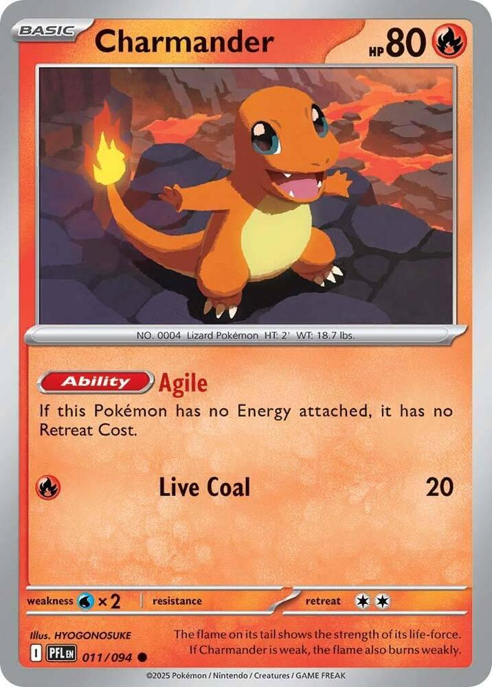</th>
  </tr>
  <tr><td><b>ME02: Phantasmal Flames</b> <picture><source media="(prefers-color-scheme: dark)" srcset="./assets/sets-dark/phantasmal-flames.png"></picture> 011/094</td></tr>
  <tr><td><b>Rarity</b>: <picture><source media="(prefers-color-scheme: dark)" srcset="./assets/rarities-dark/common.png"></picture> Common</td></tr>
  <tr><td><b>Type</b>:  Fire</td></tr>
  <tr><td><b>HP</b>: 80</td></tr>
  <tr><td><b>Stage</b>: Basic</td></tr>
  <tr><td><b>Ability</b>: Agile If this Pokémon has no Energy attached, it has no Retreat Cost.</td></tr>
  <tr><td><b>Attack</b>: [R] Live Coal (20)</td></tr>
  <tr><td><b>Weakness</b>:  Water ×2</td></tr>
  <tr><td><b>Resistance</b>: -</td></tr>
  <tr><td><b>Retreat</b>:  2</td></tr>
  <tr><td><b>Can I play it?</b>: ✓ Yes, this card is allowed in tournaments</td></tr>
  <tr><td><b>Category</b>: collection</td></tr>
</table>

<table>
  <tr><td colspan="2"><h3 id="charmander-1">Charmander <picture><source media="(prefers-color-scheme: dark)" srcset="./assets/rarities-dark/common.png"></picture></h3></td></tr>
  <tr>
    <th rowspan="13" width="400">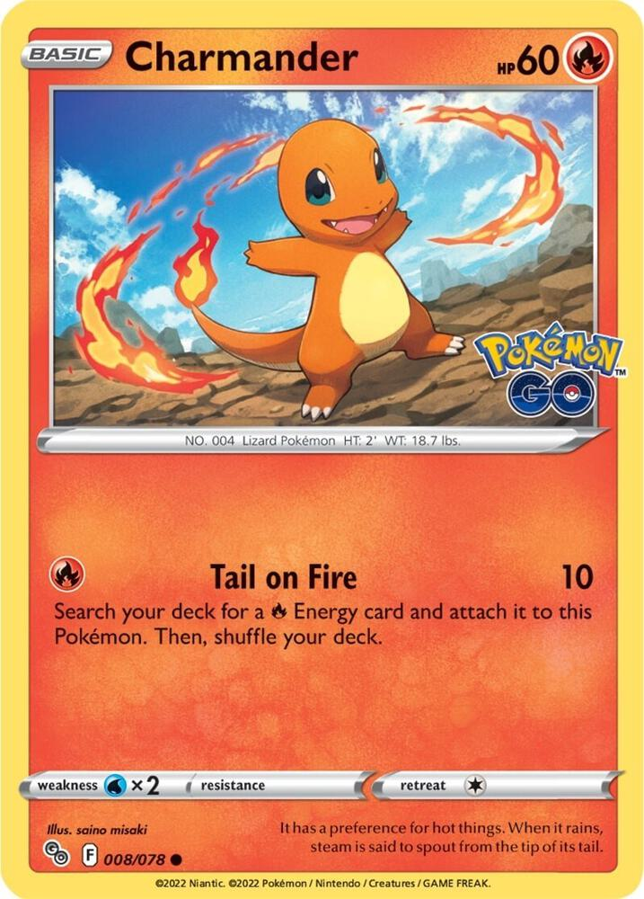</th>
  </tr>
  <tr><td><b>Pokémon GO</b> <picture><source media="(prefers-color-scheme: dark)" srcset="./assets/sets-dark/pokemon-go.png"></picture> 008/078</td></tr>
  <tr><td><b>Rarity</b>: <picture><source media="(prefers-color-scheme: dark)" srcset="./assets/rarities-dark/common.png"></picture> Common</td></tr>
  <tr><td><b>Type</b>:  Fire</td></tr>
  <tr><td><b>HP</b>: 60</td></tr>
  <tr><td><b>Stage</b>: Basic</td></tr>
  <tr><td><b>Ability</b>: -</td></tr>
  <tr><td><b>Attack</b>: [R] Tail on Fire (10) - Search your deck for a Fire Energy card and attach it to this Pokémon. Then, shuffle your deck.</td></tr>
  <tr><td><b>Weakness</b>:  Water ×2</td></tr>
  <tr><td><b>Resistance</b>: -</td></tr>
  <tr><td><b>Retreat</b>:  1</td></tr>
  <tr><td><b>Can I play it?</b>: ✗ No, this card is too old for tournaments now</td></tr>
  <tr><td><b>Category</b>: collection</td></tr>
</table>

<table>
  <tr><td colspan="2"><h3 id="charmander-2">Charmander <picture><source media="(prefers-color-scheme: dark)" srcset="./assets/rarities-dark/common.png"></picture></h3></td></tr>
  <tr>
    <th rowspan="13" width="400">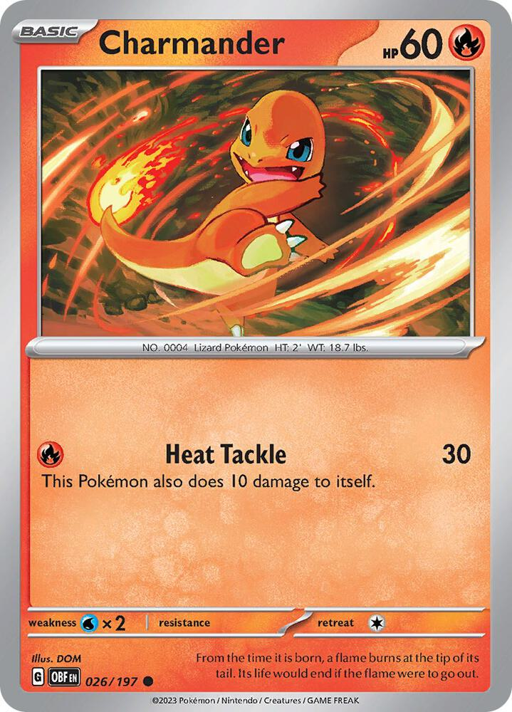</th>
  </tr>
  <tr><td><b>SV03: Obsidian Flames</b> <picture><source media="(prefers-color-scheme: dark)" srcset="./assets/sets-dark/obsidian-flames.png"></picture> 026/197</td></tr>
  <tr><td><b>Rarity</b>: <picture><source media="(prefers-color-scheme: dark)" srcset="./assets/rarities-dark/common.png"></picture> Common</td></tr>
  <tr><td><b>Type</b>:  Fire</td></tr>
  <tr><td><b>HP</b>: 60</td></tr>
  <tr><td><b>Stage</b>: Basic</td></tr>
  <tr><td><b>Ability</b>: -</td></tr>
  <tr><td><b>Attack</b>: [R] Heat Tackle: (30) - This Pokémon does 10 damage to itself.</td></tr>
  <tr><td><b>Weakness</b>:  Water ×2</td></tr>
  <tr><td><b>Resistance</b>: -</td></tr>
  <tr><td><b>Retreat</b>:  1</td></tr>
  <tr><td><b>Can I play it?</b>: ✗ No, this card is too old for tournaments now</td></tr>
  <tr><td><b>Category</b>: collection</td></tr>
</table>

<table>
  <tr><td colspan="2"><h3 id="charmander-3">Charmander <picture><source media="(prefers-color-scheme: dark)" srcset="./assets/rarities-dark/common.png"></picture></h3></td></tr>
  <tr>
    <th rowspan="14" width="400">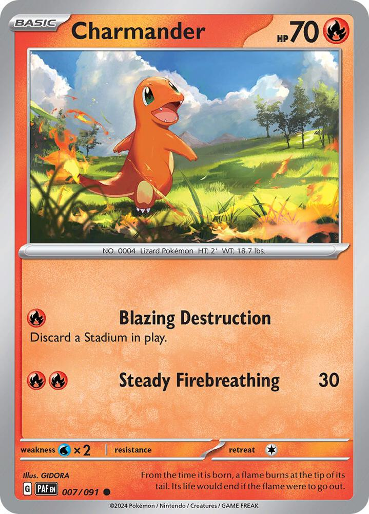</th>
  </tr>
  <tr><td><b>SV: Paldean Fates</b> <picture><source media="(prefers-color-scheme: dark)" srcset="./assets/sets-dark/paldean-fates.png"></picture> 007/091</td></tr>
  <tr><td><b>Rarity</b>: <picture><source media="(prefers-color-scheme: dark)" srcset="./assets/rarities-dark/common.png"></picture> Common</td></tr>
  <tr><td><b>Type</b>:  Fire</td></tr>
  <tr><td><b>HP</b>: 70</td></tr>
  <tr><td><b>Stage</b>: Basic</td></tr>
  <tr><td><b>Ability</b>: -</td></tr>
  <tr><td><b>Attack</b>: [R] Blazing Destruction - Discard a Stadium in play.</td></tr>
  <tr><td><b>Attack</b>: [RR] Steady Firebreathing (30)</td></tr>
  <tr><td><b>Weakness</b>:  Water ×2</td></tr>
  <tr><td><b>Resistance</b>: -</td></tr>
  <tr><td><b>Retreat</b>:  1</td></tr>
  <tr><td><b>Can I play it?</b>: ✗ No, this card is too old for tournaments now</td></tr>
  <tr><td><b>Category</b>: collection</td></tr>
</table>

<table>
  <tr><td colspan="2"><h3 id="charmander-4">Charmander <picture><source media="(prefers-color-scheme: dark)" srcset="./assets/rarities-dark/common.png"></picture></h3></td></tr>
  <tr>
    <th rowspan="14" width="400">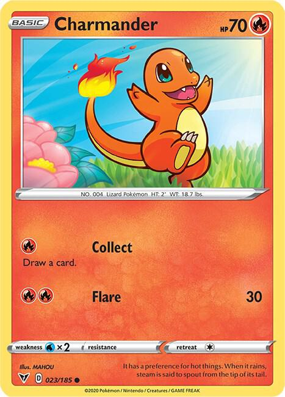</th>
  </tr>
  <tr><td><b>SWSH04: Vivid Voltage</b> <picture><source media="(prefers-color-scheme: dark)" srcset="./assets/sets-dark/vivid-voltage.png"></picture> 023/185</td></tr>
  <tr><td><b>Rarity</b>: <picture><source media="(prefers-color-scheme: dark)" srcset="./assets/rarities-dark/common.png"></picture> Common</td></tr>
  <tr><td><b>Type</b>:  Fire</td></tr>
  <tr><td><b>HP</b>: 70</td></tr>
  <tr><td><b>Stage</b>: Basic</td></tr>
  <tr><td><b>Ability</b>: -</td></tr>
  <tr><td><b>Attack</b>: [R] Collect - Draw a card.</td></tr>
  <tr><td><b>Attack</b>: [RR] Flare (30)</td></tr>
  <tr><td><b>Weakness</b>:  Water ×2</td></tr>
  <tr><td><b>Resistance</b>: -</td></tr>
  <tr><td><b>Retreat</b>:  1</td></tr>
  <tr><td><b>Can I play it?</b>: ✗ No, this card is too old for tournaments now</td></tr>
  <tr><td><b>Category</b>: deck</td></tr>
</table>

<table>
  <tr><td colspan="2"><h3 id="charmander-5">Charmander <picture><source media="(prefers-color-scheme: dark)" srcset="./assets/rarities-dark/common.png"></picture></h3></td></tr>
  <tr>
    <th rowspan="14" width="400">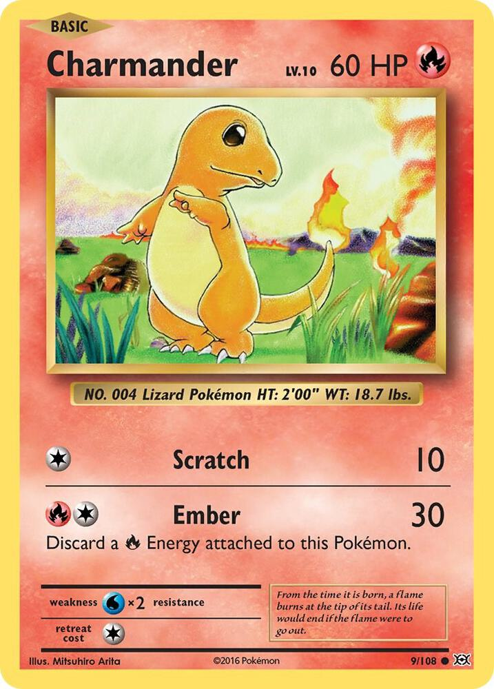</th>
  </tr>
  <tr><td><b>XY - Evolutions</b> <picture><source media="(prefers-color-scheme: dark)" srcset="./assets/sets-dark/evolutions.png"></picture> 9/108</td></tr>
  <tr><td><b>Rarity</b>: <picture><source media="(prefers-color-scheme: dark)" srcset="./assets/rarities-dark/common.png"></picture> Common</td></tr>
  <tr><td><b>Type</b>:  Fire</td></tr>
  <tr><td><b>HP</b>: 60</td></tr>
  <tr><td><b>Stage</b>: Basic</td></tr>
  <tr><td><b>Ability</b>: -</td></tr>
  <tr><td><b>Attack</b>: [1] Scratch (10)</td></tr>
  <tr><td><b>Attack</b>: [1R] Ember (30) - Discard a Fire Energy attached to this Pokémon.</td></tr>
  <tr><td><b>Weakness</b>:  Water ×2</td></tr>
  <tr><td><b>Resistance</b>: -</td></tr>
  <tr><td><b>Retreat</b>:  1</td></tr>
  <tr><td><b>Can I play it?</b>: ✗ No, this card is too old for tournaments now</td></tr>
  <tr><td><b>Category</b>: collection</td></tr>
</table>

<table>
  <tr><td colspan="2"><h3 id="charmeleon">Charmeleon <picture><source media="(prefers-color-scheme: dark)" srcset="./assets/rarities-dark/uncommon.png"></picture></h3></td></tr>
  <tr>
    <th rowspan="14" width="400">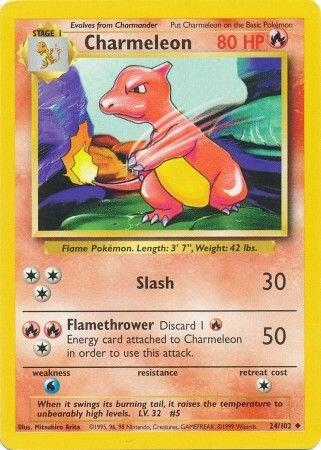</th>
  </tr>
  <tr><td><b>Base Set</b> 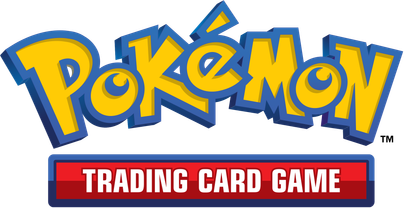 024/102</td></tr>
  <tr><td><b>Rarity</b>: <picture><source media="(prefers-color-scheme: dark)" srcset="./assets/rarities-dark/uncommon.png"></picture> Uncommon</td></tr>
  <tr><td><b>Type</b>:  Fire</td></tr>
  <tr><td><b>HP</b>: 80</td></tr>
  <tr><td><b>Stage</b>: Stage 1</td></tr>
  <tr><td><b>Ability</b>: -</td></tr>
  <tr><td><b>Attack</b>: [3] Slash (30)</td></tr>
  <tr><td><b>Attack</b>: [1RR] Flamethrower (50) - Discard 1 Fire Energy card attached to Charmeleon in order to use this attack.</td></tr>
  <tr><td><b>Weakness</b>:  Water</td></tr>
  <tr><td><b>Resistance</b>: -</td></tr>
  <tr><td><b>Retreat</b>:  1</td></tr>
  <tr><td><b>Can I play it?</b>: ✗ No, this card is too old for tournaments now</td></tr>
  <tr><td><b>Category</b>: collection</td></tr>
</table>

<table>
  <tr><td colspan="2"><h3 id="charmeleon-1">Charmeleon <picture><source media="(prefers-color-scheme: dark)" srcset="./assets/rarities-dark/common.png"></picture></h3></td></tr>
  <tr>
    <th rowspan="13" width="400">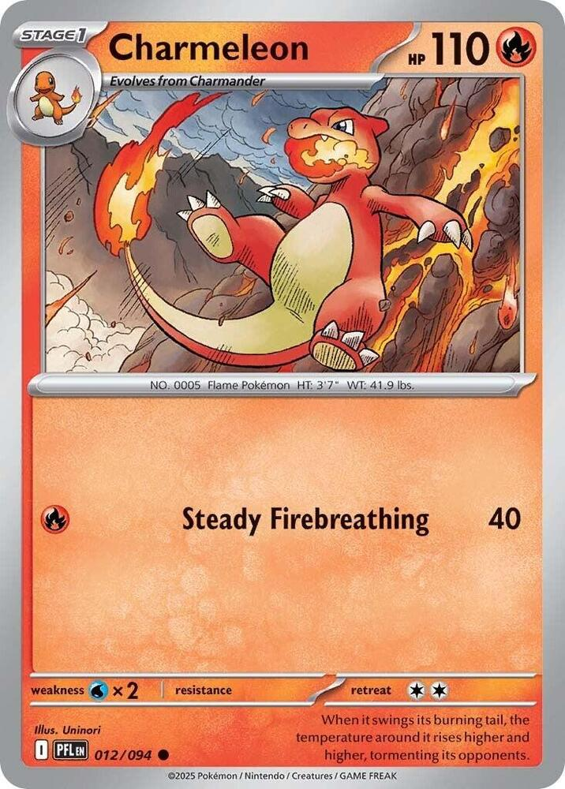</th>
  </tr>
  <tr><td><b>ME02: Phantasmal Flames</b> <picture><source media="(prefers-color-scheme: dark)" srcset="./assets/sets-dark/phantasmal-flames.png"></picture> 012/094</td></tr>
  <tr><td><b>Rarity</b>: <picture><source media="(prefers-color-scheme: dark)" srcset="./assets/rarities-dark/common.png"></picture> Common</td></tr>
  <tr><td><b>Type</b>:  Fire</td></tr>
  <tr><td><b>HP</b>: 110</td></tr>
  <tr><td><b>Stage</b>: Stage 1</td></tr>
  <tr><td><b>Ability</b>: -</td></tr>
  <tr><td><b>Attack</b>: [R] Steady Firebreathing (40)</td></tr>
  <tr><td><b>Weakness</b>:  Water ×2</td></tr>
  <tr><td><b>Resistance</b>: -</td></tr>
  <tr><td><b>Retreat</b>:  2</td></tr>
  <tr><td><b>Can I play it?</b>: ✓ Yes, this card is allowed in tournaments</td></tr>
  <tr><td><b>Category</b>: collection</td></tr>
</table>

<table>
  <tr><td colspan="2"><h3 id="charmeleon-2">Charmeleon <picture><source media="(prefers-color-scheme: dark)" srcset="./assets/rarities-dark/uncommon.png"></picture></h3></td></tr>
  <tr>
    <th rowspan="14" width="400">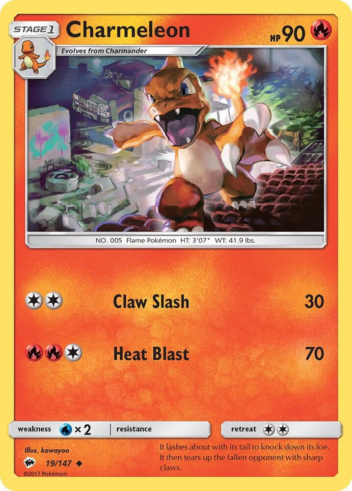</th>
  </tr>
  <tr><td><b>SM - Burning Shadows</b> <picture><source media="(prefers-color-scheme: dark)" srcset="./assets/sets-dark/burning-shadows.png"></picture> 19/147</td></tr>
  <tr><td><b>Rarity</b>: <picture><source media="(prefers-color-scheme: dark)" srcset="./assets/rarities-dark/uncommon.png"></picture> Uncommon</td></tr>
  <tr><td><b>Type</b>:  Fire</td></tr>
  <tr><td><b>HP</b>: 90</td></tr>
  <tr><td><b>Stage</b>: Stage 1</td></tr>
  <tr><td><b>Ability</b>: -</td></tr>
  <tr><td><b>Attack</b>: [2] Claw Slash [30]</td></tr>
  <tr><td><b>Attack</b>: [1RR] Heat Blast (70)</td></tr>
  <tr><td><b>Weakness</b>:  Water ×2</td></tr>
  <tr><td><b>Resistance</b>: -</td></tr>
  <tr><td><b>Retreat</b>:  2</td></tr>
  <tr><td><b>Can I play it?</b>: ✗ No, this card is too old for tournaments now</td></tr>
  <tr><td><b>Category</b>: collection</td></tr>
</table>

<table>
  <tr><td colspan="2"><h3 id="charmeleon-3">Charmeleon <picture><source media="(prefers-color-scheme: dark)" srcset="./assets/rarities-dark/uncommon.png"></picture></h3></td></tr>
  <tr>
    <th rowspan="12" width="400">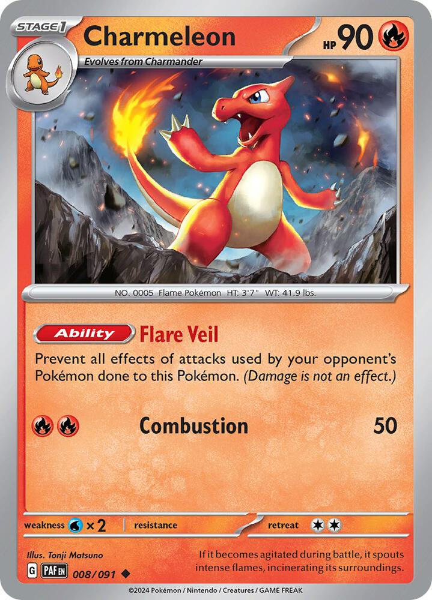</th>
  </tr>
  <tr><td><b>SV: Paldean Fates</b> <picture><source media="(prefers-color-scheme: dark)" srcset="./assets/sets-dark/paldean-fates.png"></picture> 008/091</td></tr>
  <tr><td><b>Rarity</b>: <picture><source media="(prefers-color-scheme: dark)" srcset="./assets/rarities-dark/uncommon.png"></picture> Uncommon</td></tr>
  <tr><td><b>Type</b>:  Fire</td></tr>
  <tr><td><b>HP</b>: 90</td></tr>
  <tr><td><b>Stage</b>: Stage 1</td></tr>
  <tr><td><b>Ability</b>: -</td></tr>
  <tr><td><b>Weakness</b>:  Water ×2</td></tr>
  <tr><td><b>Resistance</b>: -</td></tr>
  <tr><td><b>Retreat</b>:  2</td></tr>
  <tr><td><b>Can I play it?</b>: ✗ No, this card is too old for tournaments now</td></tr>
  <tr><td><b>Category</b>: collection</td></tr>
</table>

<table>
  <tr><td colspan="2"><h3 id="charmeleon-4">Charmeleon <picture><source media="(prefers-color-scheme: dark)" srcset="./assets/rarities-dark/uncommon.png"></picture></h3></td></tr>
  <tr>
    <th rowspan="14" width="400">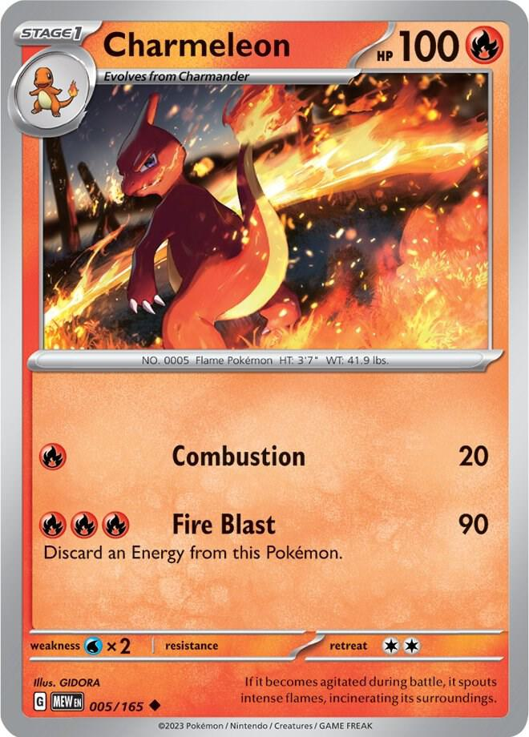</th>
  </tr>
  <tr><td><b>SV: Scarlet &amp; Violet 151</b> <picture><source media="(prefers-color-scheme: dark)" srcset="./assets/sets-dark/151.png"></picture> 005/165</td></tr>
  <tr><td><b>Rarity</b>: <picture><source media="(prefers-color-scheme: dark)" srcset="./assets/rarities-dark/uncommon.png"></picture> Uncommon</td></tr>
  <tr><td><b>Type</b>:  Fire</td></tr>
  <tr><td><b>HP</b>: 100</td></tr>
  <tr><td><b>Stage</b>: Stage 1</td></tr>
  <tr><td><b>Ability</b>: -</td></tr>
  <tr><td><b>Attack</b>: [R] Combustion (20)</td></tr>
  <tr><td><b>Attack</b>: [RRR] Fire Blast (90) - Discard an Energy from this Pokémon</td></tr>
  <tr><td><b>Weakness</b>:  Water ×2</td></tr>
  <tr><td><b>Resistance</b>: -</td></tr>
  <tr><td><b>Retreat</b>:  2</td></tr>
  <tr><td><b>Can I play it?</b>: ✗ No, this card is too old for tournaments now</td></tr>
  <tr><td><b>Category</b>: collection</td></tr>
</table>

<table>
  <tr><td colspan="2"><h3 id="charmeleon-5">Charmeleon <picture><source media="(prefers-color-scheme: dark)" srcset="./assets/rarities-dark/uncommon.png"></picture></h3></td></tr>
  <tr>
    <th rowspan="14" width="400">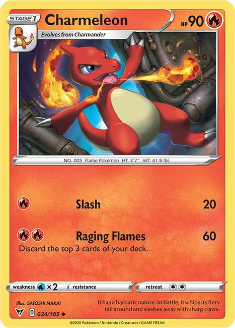</th>
  </tr>
  <tr><td><b>SWSH04: Vivid Voltage</b> <picture><source media="(prefers-color-scheme: dark)" srcset="./assets/sets-dark/vivid-voltage.png"></picture> 024/185</td></tr>
  <tr><td><b>Rarity</b>: <picture><source media="(prefers-color-scheme: dark)" srcset="./assets/rarities-dark/uncommon.png"></picture> Uncommon</td></tr>
  <tr><td><b>Type</b>:  Fire</td></tr>
  <tr><td><b>HP</b>: 90</td></tr>
  <tr><td><b>Stage</b>: Stage 1</td></tr>
  <tr><td><b>Ability</b>: -</td></tr>
  <tr><td><b>Attack</b>: [R] Slash (20)</td></tr>
  <tr><td><b>Attack</b>: [RR] Raging Flames (60) - Discard the top 3 cards of your deck.</td></tr>
  <tr><td><b>Weakness</b>:  Water ×2</td></tr>
  <tr><td><b>Resistance</b>: -</td></tr>
  <tr><td><b>Retreat</b>:  2</td></tr>
  <tr><td><b>Can I play it?</b>: ✗ No, this card is too old for tournaments now</td></tr>
  <tr><td><b>Category</b>: deck</td></tr>
</table>

<table>
  <tr><td colspan="2"><h3 id="charmeleon-delta-species">Charmeleon (Delta Species) <picture><source media="(prefers-color-scheme: dark)" srcset="./assets/rarities-dark/uncommon.png"></picture></h3></td></tr>
  <tr>
    <th rowspan="14" width="400">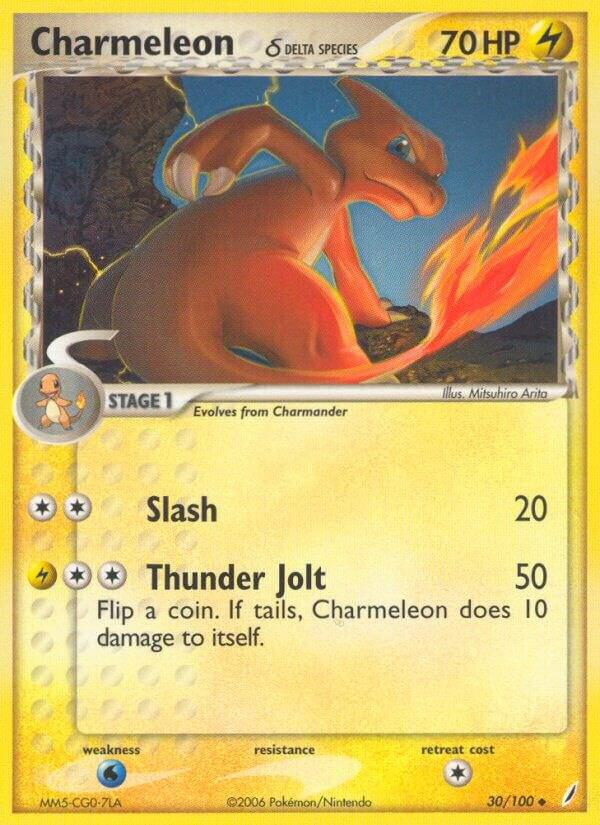</th>
  </tr>
  <tr><td><b>EX Crystal Guardians</b> <picture><source media="(prefers-color-scheme: dark)" srcset="./assets/sets-dark/crystal-guardians.png"></picture> 30/100</td></tr>
  <tr><td><b>Rarity</b>: <picture><source media="(prefers-color-scheme: dark)" srcset="./assets/rarities-dark/uncommon.png"></picture> Uncommon</td></tr>
  <tr><td><b>Type</b>:  Lightning</td></tr>
  <tr><td><b>HP</b>: 70</td></tr>
  <tr><td><b>Stage</b>: Stage 1</td></tr>
  <tr><td><b>Ability</b>: -</td></tr>
  <tr><td><b>Attack</b>: [2] Slash (20)</td></tr>
  <tr><td><b>Attack</b>: [2L] Thunder Jolt (50) Flip a coin. If tails, Charmeleon does 10 damage to itself.</td></tr>
  <tr><td><b>Weakness</b>:  Water</td></tr>
  <tr><td><b>Resistance</b>: -</td></tr>
  <tr><td><b>Retreat</b>:  1</td></tr>
  <tr><td><b>Can I play it?</b>: ✗ No, this card is too old for tournaments now</td></tr>
  <tr><td><b>Category</b>: collection</td></tr>
</table>

<table>
  <tr><td colspan="2"><h3 id="eevee">Eevee <picture><source media="(prefers-color-scheme: dark)" srcset="./assets/rarities-dark/common.png"></picture></h3></td></tr>
  <tr>
    <th rowspan="13" width="400">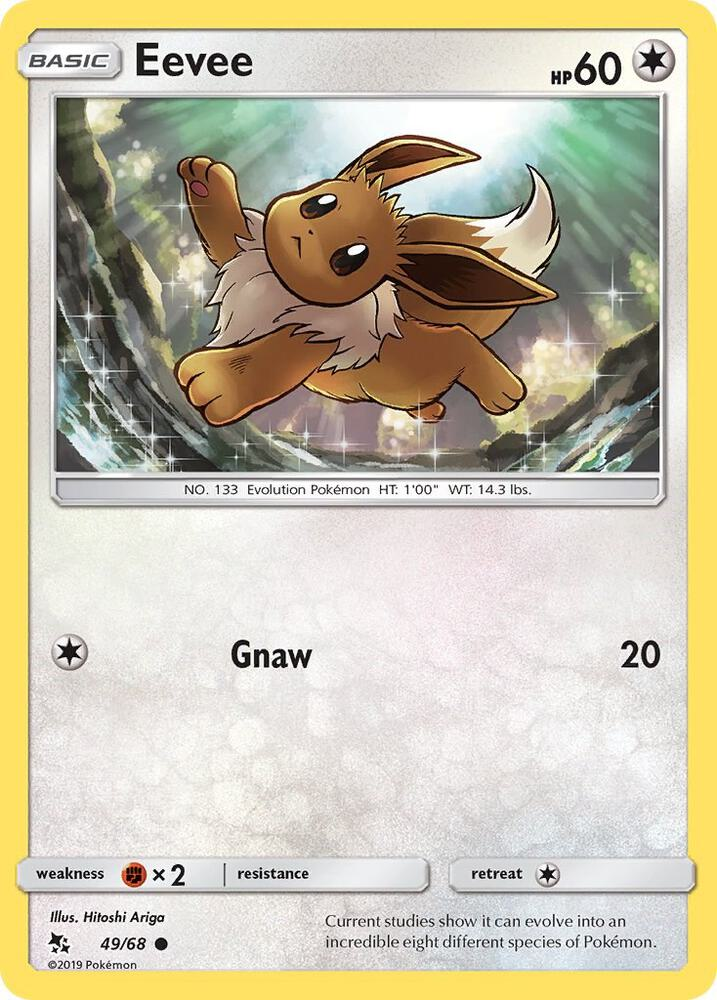</th>
  </tr>
  <tr><td><b>Hidden Fates</b> <picture><source media="(prefers-color-scheme: dark)" srcset="./assets/sets-dark/hidden-fates.png"></picture> 49/68</td></tr>
  <tr><td><b>Rarity</b>: <picture><source media="(prefers-color-scheme: dark)" srcset="./assets/rarities-dark/common.png"></picture> Common</td></tr>
  <tr><td><b>Type</b>:  Colorless</td></tr>
  <tr><td><b>HP</b>: 60</td></tr>
  <tr><td><b>Stage</b>: Basic</td></tr>
  <tr><td><b>Ability</b>: -</td></tr>
  <tr><td><b>Attack</b>: [1] Gnaw (20)</td></tr>
  <tr><td><b>Weakness</b>:  Fighting ×2</td></tr>
  <tr><td><b>Resistance</b>: -</td></tr>
  <tr><td><b>Retreat</b>:  1</td></tr>
  <tr><td><b>Can I play it?</b>: ✗ No, this card is too old for tournaments now</td></tr>
  <tr><td><b>Category</b>: collection</td></tr>
</table>

<table>
  <tr><td colspan="2"><h3 id="eevee-1">Eevee <picture><source media="(prefers-color-scheme: dark)" srcset="./assets/rarities-dark/common.png"></picture></h3></td></tr>
  <tr>
    <th rowspan="14" width="400">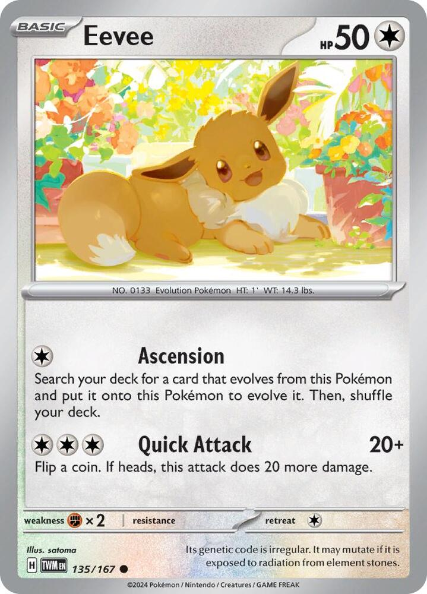</th>
  </tr>
  <tr><td><b>SV06: Twilight Masquerade</b> <picture><source media="(prefers-color-scheme: dark)" srcset="./assets/sets-dark/twilight-masquerade.png"></picture> 135/167</td></tr>
  <tr><td><b>Rarity</b>: <picture><source media="(prefers-color-scheme: dark)" srcset="./assets/rarities-dark/common.png"></picture> Common</td></tr>
  <tr><td><b>Type</b>:  Colorless</td></tr>
  <tr><td><b>HP</b>: 50</td></tr>
  <tr><td><b>Stage</b>: Basic</td></tr>
  <tr><td><b>Ability</b>: -</td></tr>
  <tr><td><b>Attack</b>: [C] Ascension Search your deck for a card that evolves from this Pokémon and put it onto this Pokémon to evolve it. Then, shuffle your deck.</td></tr>
  <tr><td><b>Attack</b>: [CCC] Quick Attack (20+) Flip a coin. If heads, this attack does 20 more damage.</td></tr>
  <tr><td><b>Weakness</b>:  Fighting ×2</td></tr>
  <tr><td><b>Resistance</b>: -</td></tr>
  <tr><td><b>Retreat</b>:  1</td></tr>
  <tr><td><b>Can I play it?</b>: ✓ Yes, this card is allowed in tournaments</td></tr>
  <tr><td><b>Category</b>: collection</td></tr>
</table>

<table>
  <tr><td colspan="2"><h3 id="eevee-2">Eevee <picture><source media="(prefers-color-scheme: dark)" srcset="./assets/rarities-dark/common.png"></picture></h3></td></tr>
  <tr>
    <th rowspan="13" width="400">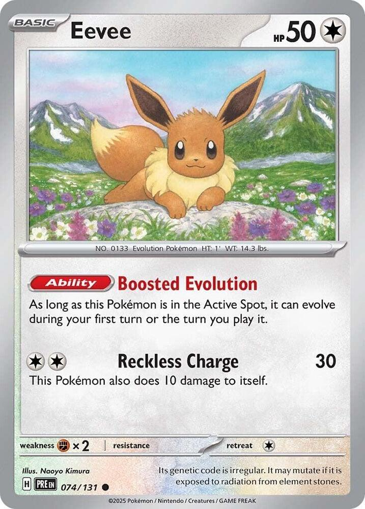</th>
  </tr>
  <tr><td><b>SV: Prismatic Evolutions</b> <picture><source media="(prefers-color-scheme: dark)" srcset="./assets/sets-dark/prismatic-evolutions.png"></picture> 074/131</td></tr>
  <tr><td><b>Rarity</b>: <picture><source media="(prefers-color-scheme: dark)" srcset="./assets/rarities-dark/common.png"></picture> Common</td></tr>
  <tr><td><b>Type</b>:  Colorless</td></tr>
  <tr><td><b>HP</b>: 50</td></tr>
  <tr><td><b>Stage</b>: Basic</td></tr>
  <tr><td><b>Ability</b>: Boosted Evolution As long as this Pokémon is in the Active Spot, it can evolve during your first turn or the turn you play it.</td></tr>
  <tr><td><b>Attack</b>: [CC] Reckless Charge (30) - This Pokémon also does 10 damage to itself.</td></tr>
  <tr><td><b>Weakness</b>:  Fighting ×2</td></tr>
  <tr><td><b>Resistance</b>: -</td></tr>
  <tr><td><b>Retreat</b>:  1</td></tr>
  <tr><td><b>Can I play it?</b>: ✓ Yes, this card is allowed in tournaments</td></tr>
  <tr><td><b>Category</b>: deck</td></tr>
</table>

<table>
  <tr><td colspan="2"><h3 id="eevee-3">Eevee <picture><source media="(prefers-color-scheme: dark)" srcset="./assets/rarities-dark/common.png"></picture></h3></td></tr>
  <tr>
    <th rowspan="14" width="400">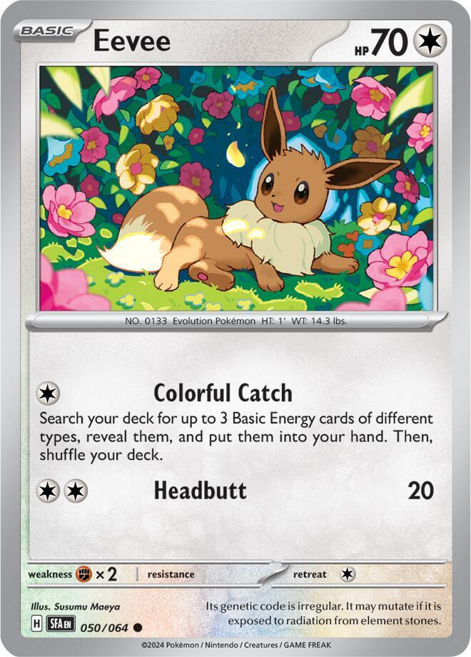</th>
  </tr>
  <tr><td><b>SV: Shrouded Fable</b> <picture><source media="(prefers-color-scheme: dark)" srcset="./assets/sets-dark/shrouded-fable.png"></picture> 050/064</td></tr>
  <tr><td><b>Rarity</b>: <picture><source media="(prefers-color-scheme: dark)" srcset="./assets/rarities-dark/common.png"></picture> Common</td></tr>
  <tr><td><b>Type</b>:  Colorless</td></tr>
  <tr><td><b>HP</b>: 70</td></tr>
  <tr><td><b>Stage</b>: Basic</td></tr>
  <tr><td><b>Ability</b>: -</td></tr>
  <tr><td><b>Attack</b>: [C] Colorful Catch - Search your deck for up to 3 Basic Energy cards of different types, reveal them, and put them into your hand. Then, shuffle your deck.</td></tr>
  <tr><td><b>Attack</b>: [CC] Headbutt (20)</td></tr>
  <tr><td><b>Weakness</b>:  Fighting ×2</td></tr>
  <tr><td><b>Resistance</b>: -</td></tr>
  <tr><td><b>Retreat</b>:  1</td></tr>
  <tr><td><b>Can I play it?</b>: ✓ Yes, this card is allowed in tournaments</td></tr>
  <tr><td><b>Category</b>: collection</td></tr>
</table>

<table>
  <tr><td colspan="2"><h3 id="eevee-poké-ball-pattern">Eevee (Poké Ball Pattern) <picture><source media="(prefers-color-scheme: dark)" srcset="./assets/rarities-dark/common.png"></picture></h3></td></tr>
  <tr>
    <th rowspan="13" width="400">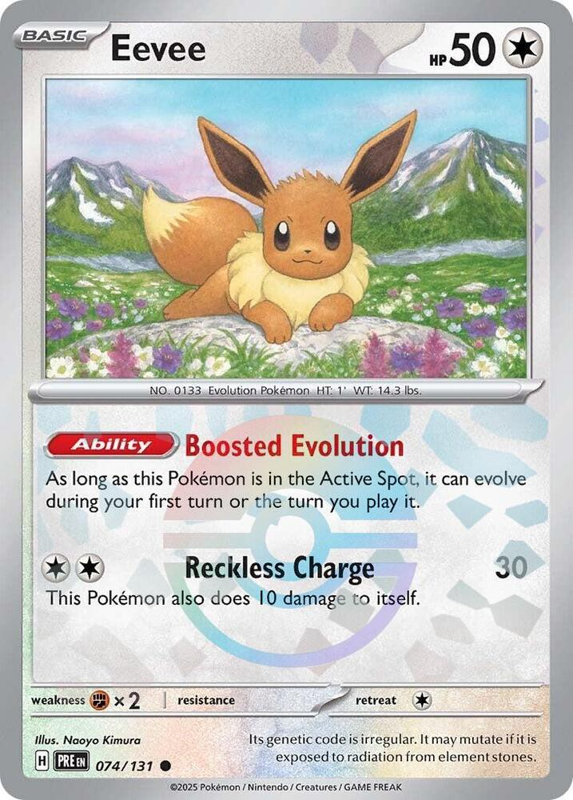</th>
  </tr>
  <tr><td><b>SV: Prismatic Evolutions</b> <picture><source media="(prefers-color-scheme: dark)" srcset="./assets/sets-dark/prismatic-evolutions.png"></picture> 074/131</td></tr>
  <tr><td><b>Rarity</b>: <picture><source media="(prefers-color-scheme: dark)" srcset="./assets/rarities-dark/common.png"></picture> Common</td></tr>
  <tr><td><b>Type</b>:  Colorless</td></tr>
  <tr><td><b>HP</b>: 50</td></tr>
  <tr><td><b>Stage</b>: Basic</td></tr>
  <tr><td><b>Ability</b>: Boosted Evolution As long as this Pokémon is in the Active Spot, it can evolve during your first turn or the turn you play it.</td></tr>
  <tr><td><b>Attack</b>: [CC] Reckless Charge (30) - This Pokémon also does 10 damage to itself.</td></tr>
  <tr><td><b>Weakness</b>:  Fighting ×2</td></tr>
  <tr><td><b>Resistance</b>: -</td></tr>
  <tr><td><b>Retreat</b>:  1</td></tr>
  <tr><td><b>Can I play it?</b>: ✓ Yes, this card is allowed in tournaments</td></tr>
  <tr><td><b>Category</b>: collection</td></tr>
</table>

<table>
  <tr><td colspan="2"><h3 id="eevee-ex">Eevee ex <picture><source media="(prefers-color-scheme: dark)" srcset="./assets/rarities-dark/double-rare.png"></picture></h3></td></tr>
  <tr>
    <th rowspan="13" width="400">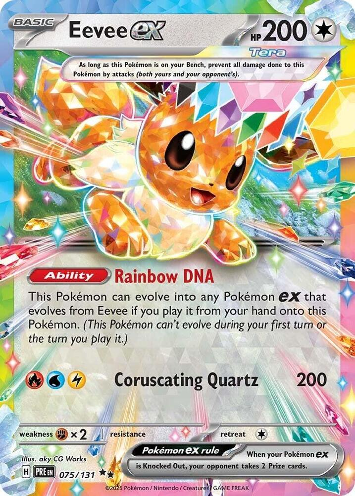</th>
  </tr>
  <tr><td><b>SV: Prismatic Evolutions</b> <picture><source media="(prefers-color-scheme: dark)" srcset="./assets/sets-dark/prismatic-evolutions.png"></picture> 075/131</td></tr>
  <tr><td><b>Rarity</b>: <picture><source media="(prefers-color-scheme: dark)" srcset="./assets/rarities-dark/double-rare.png"></picture> Double Rare</td></tr>
  <tr><td><b>Type</b>:  Colorless</td></tr>
  <tr><td><b>HP</b>: 200</td></tr>
  <tr><td><b>Stage</b>: Basic</td></tr>
  <tr><td><b>Ability</b>: Rainbow DNA This Pokémon can evolve into any Pokémon ex that evolves from Eevee if you play it from your hand onto this Pokémon. (This Pokémon can&#x27;t evolve during your first turn or the turn you play it.)</td></tr>
  <tr><td><b>Attack</b>: [RWL] Coruscating Quartz (200)</td></tr>
  <tr><td><b>Weakness</b>:  Fighting ×2</td></tr>
  <tr><td><b>Resistance</b>: -</td></tr>
  <tr><td><b>Retreat</b>:  1</td></tr>
  <tr><td><b>Can I play it?</b>: ✓ Yes, this card is allowed in tournaments</td></tr>
  <tr><td><b>Category</b>: collection</td></tr>
</table>

<table>
  <tr><td colspan="2"><h3 id="eevee-v">Eevee V <picture><source media="(prefers-color-scheme: dark)" srcset="./assets/rarities-dark/promo.png"></picture></h3></td></tr>
  <tr>
    <th rowspan="14" width="400">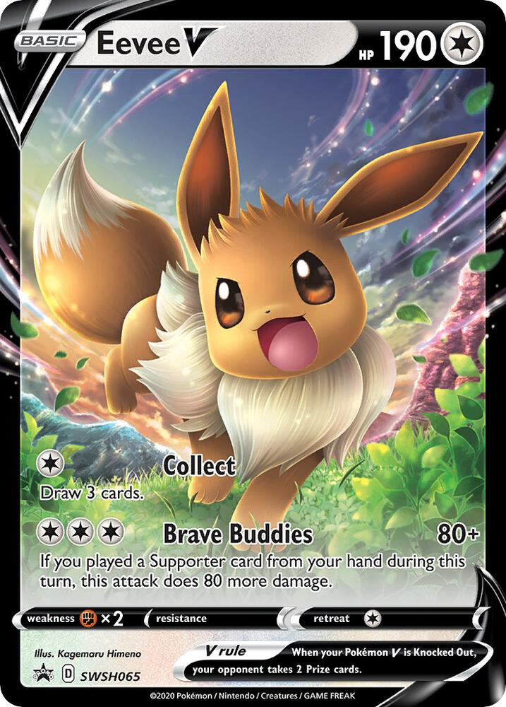</th>
  </tr>
  <tr><td><b>SWSH: Sword &amp; Shield Promo Cards</b> <picture><source media="(prefers-color-scheme: dark)" srcset="./assets/sets-dark/swsh-black-star-promos.png"></picture> SWSH065</td></tr>
  <tr><td><b>Rarity</b>: <picture><source media="(prefers-color-scheme: dark)" srcset="./assets/rarities-dark/promo.png"></picture> Promo</td></tr>
  <tr><td><b>Type</b>:  Colorless</td></tr>
  <tr><td><b>HP</b>: 190</td></tr>
  <tr><td><b>Stage</b>: Basic</td></tr>
  <tr><td><b>Ability</b>: -</td></tr>
  <tr><td><b>Attack</b>: [1] Collect - Draw 3 cards.</td></tr>
  <tr><td><b>Attack</b>: [3] Brave Buddies (80+) - If you played a Supporter card from your hand during this turn, this attack does 80 more damage.</td></tr>
  <tr><td><b>Weakness</b>:  Fighting ×2</td></tr>
  <tr><td><b>Resistance</b>: -</td></tr>
  <tr><td><b>Retreat</b>:  1</td></tr>
  <tr><td><b>Can I play it?</b>: ✗ No, this card is too old for tournaments now</td></tr>
  <tr><td><b>Category</b>: collection</td></tr>
</table>

<table>
  <tr><td colspan="2"><h3 id="eternatus">Eternatus</h3></td></tr>
  <tr>
    <th rowspan="14" width="400">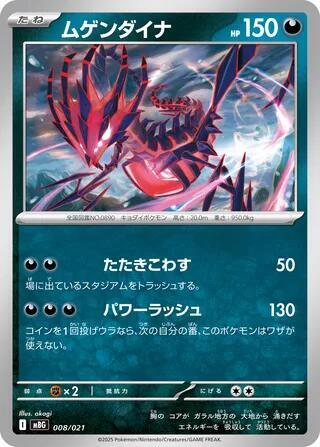</th>
  </tr>
  <tr><td><b>MBG: MEGA Starter Set Mega Gengar ex</b> <picture><source media="(prefers-color-scheme: dark)" srcset="./assets/sets-jp-dark/megagengar.png"></picture> 008/021</td></tr>
  <tr><td><b>Rarity</b>: -</td></tr>
  <tr><td><b>Type</b>:  Darkness</td></tr>
  <tr><td><b>HP</b>: 150</td></tr>
  <tr><td><b>Stage</b>: Basic</td></tr>
  <tr><td><b>Ability</b>: -</td></tr>
  <tr><td><b>Attack</b>: [Darkness][Darkness] Shatter (50) - Discard a Stadium in play.</td></tr>
  <tr><td><b>Attack</b>: [Darkness][Darkness][Darkness] Power Rush (130) - Flip a coin. If tails, during your next turn, this Pokémon can&#x27;t attack.</td></tr>
  <tr><td><b>Weakness</b>:  Fighting ×2</td></tr>
  <tr><td><b>Resistance</b>: -</td></tr>
  <tr><td><b>Retreat</b>:  2</td></tr>
  <tr><td><b>Can I play it?</b>: ✗ No, Japanese cards are not allowed at tournaments here</td></tr>
  <tr><td><b>Category</b>: collection</td></tr>
</table>

<table>
  <tr><td colspan="2"><h3 id="flareon">Flareon <picture><source media="(prefers-color-scheme: dark)" srcset="./assets/rarities-dark/rare.png"></picture></h3></td></tr>
  <tr>
    <th rowspan="14" width="400">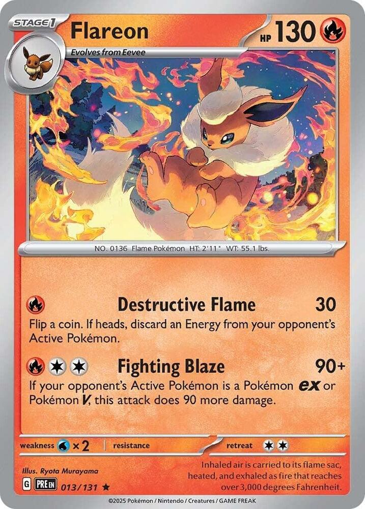</th>
  </tr>
  <tr><td><b>SV: Prismatic Evolutions</b> <picture><source media="(prefers-color-scheme: dark)" srcset="./assets/sets-dark/prismatic-evolutions.png"></picture> 013/131</td></tr>
  <tr><td><b>Rarity</b>: <picture><source media="(prefers-color-scheme: dark)" srcset="./assets/rarities-dark/rare.png"></picture> Rare</td></tr>
  <tr><td><b>Type</b>:  Fire</td></tr>
  <tr><td><b>HP</b>: 130</td></tr>
  <tr><td><b>Stage</b>: Stage 1</td></tr>
  <tr><td><b>Ability</b>: -</td></tr>
  <tr><td><b>Attack</b>: [R] Destructive Flame (30) - Flip a coin. If heads, discard an Energy from your opponent&#x27;s Active Pokémon.</td></tr>
  <tr><td><b>Attack</b>: [RCC] Fighting Blaze (90+) - If your opponent&#x27;s Active Pokémon is a Pokémon ex or Pokémon V, this attack does 90 more damage.</td></tr>
  <tr><td><b>Weakness</b>:  Water ×2</td></tr>
  <tr><td><b>Resistance</b>: -</td></tr>
  <tr><td><b>Retreat</b>:  2</td></tr>
  <tr><td><b>Can I play it?</b>: ✗ No, this card is too old for tournaments now</td></tr>
  <tr><td><b>Category</b>: deck</td></tr>
</table>

<table>
  <tr><td colspan="2"><h3 id="flareon-ex">Flareon ex <picture><source media="(prefers-color-scheme: dark)" srcset="./assets/rarities-dark/double-rare.png"></picture></h3></td></tr>
  <tr>
    <th rowspan="14" width="400">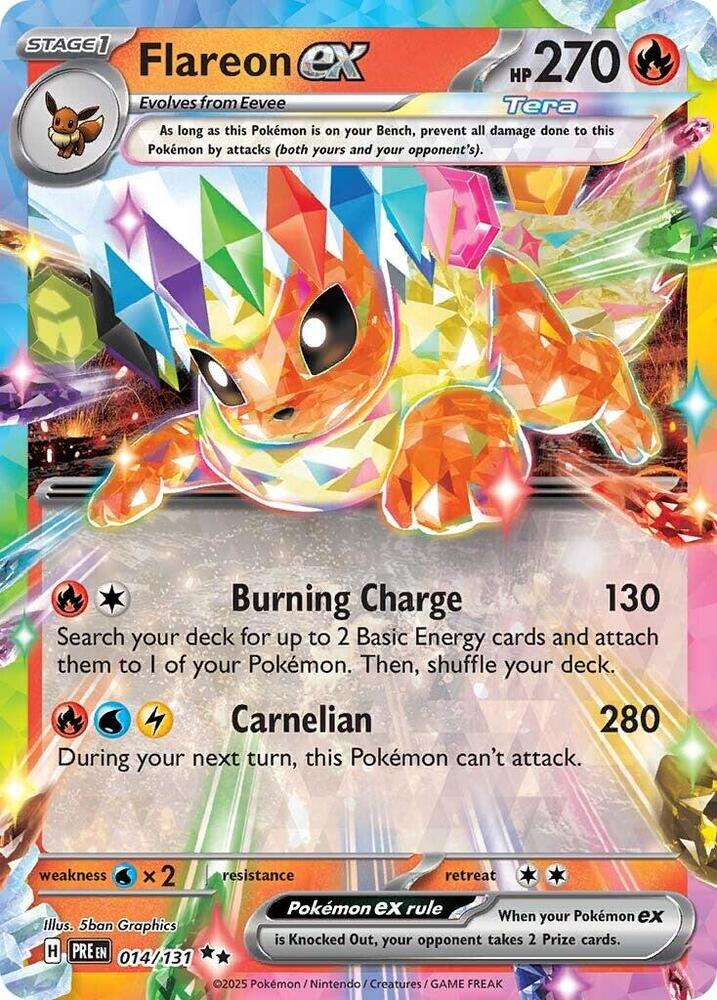</th>
  </tr>
  <tr><td><b>SV: Prismatic Evolutions</b> <picture><source media="(prefers-color-scheme: dark)" srcset="./assets/sets-dark/prismatic-evolutions.png"></picture> 014/131</td></tr>
  <tr><td><b>Rarity</b>: <picture><source media="(prefers-color-scheme: dark)" srcset="./assets/rarities-dark/double-rare.png"></picture> Double Rare</td></tr>
  <tr><td><b>Type</b>:  Fire</td></tr>
  <tr><td><b>HP</b>: 270</td></tr>
  <tr><td><b>Stage</b>: Stage 1</td></tr>
  <tr><td><b>Ability</b>: -</td></tr>
  <tr><td><b>Attack</b>: [RC] Burning Charge (130) - Search your deck for up to 2 Basic Energy cards and attach them to 1 of your Pokémon. Then, shuffle your deck.</td></tr>
  <tr><td><b>Attack</b>: [RWL] Carnelian (280) - During your next turn, this Pokémon can&#x27;t attack.</td></tr>
  <tr><td><b>Weakness</b>:  Water ×2</td></tr>
  <tr><td><b>Resistance</b>: -</td></tr>
  <tr><td><b>Retreat</b>:  2</td></tr>
  <tr><td><b>Can I play it?</b>: ✓ Yes, this card is allowed in tournaments</td></tr>
  <tr><td><b>Category</b>: collection</td></tr>
</table>

<table>
  <tr><td colspan="2"><h3 id="flareon-v">Flareon V <picture><source media="(prefers-color-scheme: dark)" srcset="./assets/rarities-dark/promo.png"></picture></h3></td></tr>
  <tr>
    <th rowspan="14" width="400">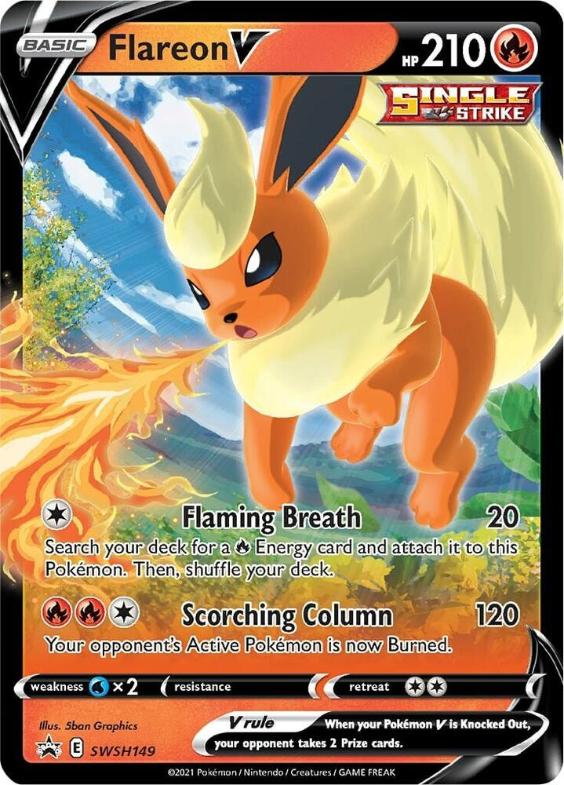</th>
  </tr>
  <tr><td><b>SWSH: Sword &amp; Shield Promo Cards</b> <picture><source media="(prefers-color-scheme: dark)" srcset="./assets/sets-dark/swsh-black-star-promos.png"></picture> SWSH149</td></tr>
  <tr><td><b>Rarity</b>: <picture><source media="(prefers-color-scheme: dark)" srcset="./assets/rarities-dark/promo.png"></picture> Promo</td></tr>
  <tr><td><b>Type</b>:  Fire</td></tr>
  <tr><td><b>HP</b>: 210</td></tr>
  <tr><td><b>Stage</b>: Basic</td></tr>
  <tr><td><b>Ability</b>: -</td></tr>
  <tr><td><b>Attack</b>: [1] Flaming Breath (20) - Search your deck for a R Energy card and attach it to this Pokémon. Then, shuffle your deck.</td></tr>
  <tr><td><b>Attack</b>: [1RR] Scorching Column (120) - Your opponent&#x27;s Active Pokémon is now Burned.</td></tr>
  <tr><td><b>Weakness</b>:  Water ×2</td></tr>
  <tr><td><b>Resistance</b>: -</td></tr>
  <tr><td><b>Retreat</b>:  2</td></tr>
  <tr><td><b>Can I play it?</b>: ✗ No, this card is too old for tournaments now</td></tr>
  <tr><td><b>Category</b>: collection</td></tr>
</table>

<table>
  <tr><td colspan="2"><h3 id="flareon-vmax">Flareon VMAX </h3></td></tr>
  <tr>
    <th rowspan="13" width="400">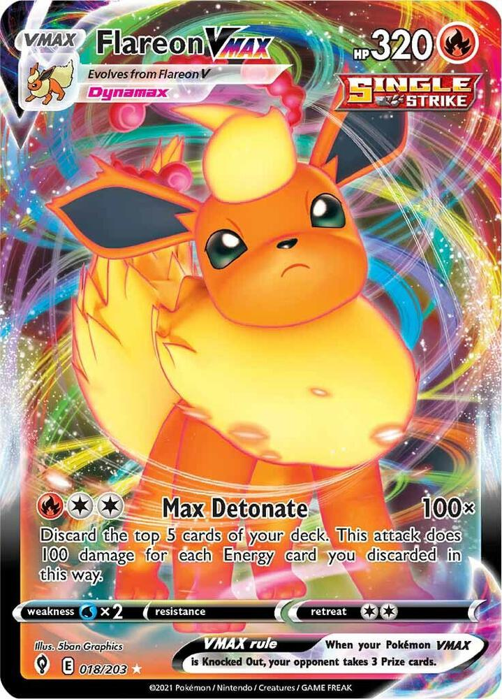</th>
  </tr>
  <tr><td><b>SWSH07: Evolving Skies</b> <picture><source media="(prefers-color-scheme: dark)" srcset="./assets/sets-dark/evolving-skies.png"></picture> 018/203</td></tr>
  <tr><td><b>Rarity</b>:  Ultra Rare</td></tr>
  <tr><td><b>Type</b>:  Fire</td></tr>
  <tr><td><b>HP</b>: 320</td></tr>
  <tr><td><b>Stage</b>: VMAX</td></tr>
  <tr><td><b>Ability</b>: -</td></tr>
  <tr><td><b>Attack</b>: [2R] Max Detonate (100x) - Discard the top 5 cards of your deck. This attack does 100 damage for each Energy card you discarded in this way.</td></tr>
  <tr><td><b>Weakness</b>:  Water ×2</td></tr>
  <tr><td><b>Resistance</b>: -</td></tr>
  <tr><td><b>Retreat</b>:  2</td></tr>
  <tr><td><b>Can I play it?</b>: ✗ No, this card is too old for tournaments now</td></tr>
  <tr><td><b>Category</b>: collection</td></tr>
</table>

<table>
  <tr><td colspan="2"><h3 id="galarian-weezing">Galarian Weezing <picture><source media="(prefers-color-scheme: dark)" srcset="./assets/rarities-dark/rare.png"></picture></h3></td></tr>
  <tr>
    <th rowspan="13" width="400">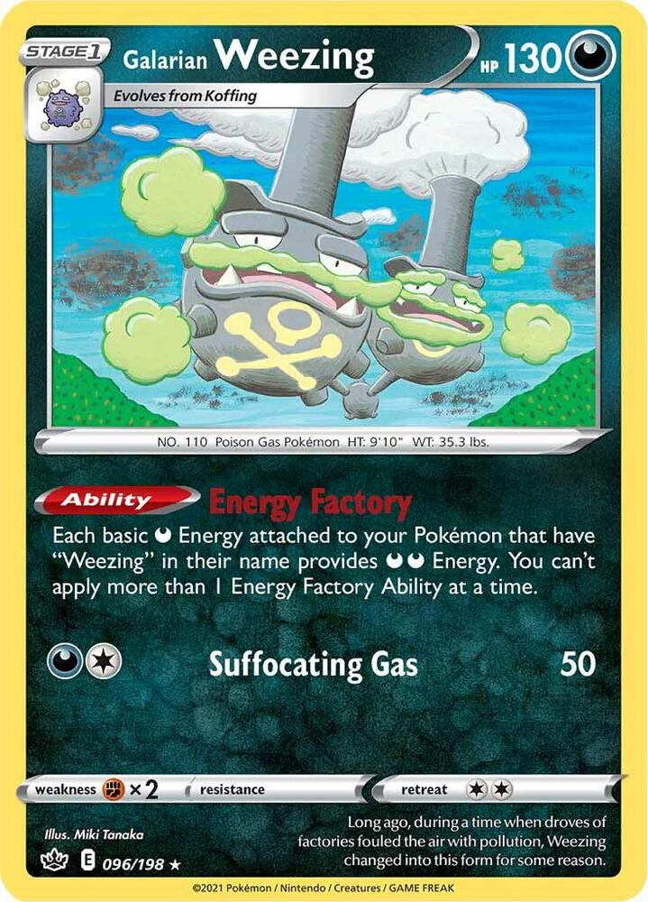</th>
  </tr>
  <tr><td><b>SWSH06: Chilling Reign</b> <picture><source media="(prefers-color-scheme: dark)" srcset="./assets/sets-dark/chilling-reign.png"></picture> 096/198</td></tr>
  <tr><td><b>Rarity</b>: <picture><source media="(prefers-color-scheme: dark)" srcset="./assets/rarities-dark/rare.png"></picture> Rare</td></tr>
  <tr><td><b>Type</b>:  Darkness</td></tr>
  <tr><td><b>HP</b>: 130</td></tr>
  <tr><td><b>Stage</b>: Stage 1</td></tr>
  <tr><td><b>Ability</b>: Energy Factory Each basic Darkness Energy attached to your Pokémon that have &quot;Weezing&quot; in their name provide Darkness Darkness Energy. You can&#x27;t apply more than 1 Energy Factory Ability at a time.</td></tr>
  <tr><td><b>Attack</b>: [1D] Suffocating Gas (50)</td></tr>
  <tr><td><b>Weakness</b>:  Fighting ×2</td></tr>
  <tr><td><b>Resistance</b>: -</td></tr>
  <tr><td><b>Retreat</b>:  2</td></tr>
  <tr><td><b>Can I play it?</b>: ✗ No, this card is too old for tournaments now</td></tr>
  <tr><td><b>Category</b>: collection</td></tr>
</table>

<table>
  <tr><td colspan="2"><h3 id="galarian-weezing-1">Galarian Weezing <picture><source media="(prefers-color-scheme: dark)" srcset="./assets/rarities-dark/rare.png"></picture></h3></td></tr>
  <tr>
    <th rowspan="13" width="400">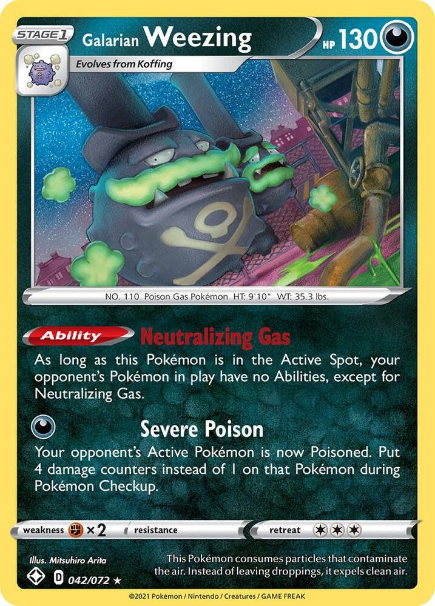</th>
  </tr>
  <tr><td><b>Shining Fates</b> <picture><source media="(prefers-color-scheme: dark)" srcset="./assets/sets-dark/shining-fates.png"></picture> 042/072</td></tr>
  <tr><td><b>Rarity</b>: <picture><source media="(prefers-color-scheme: dark)" srcset="./assets/rarities-dark/rare.png"></picture> Holo Rare</td></tr>
  <tr><td><b>Type</b>:  Darkness</td></tr>
  <tr><td><b>HP</b>: 130</td></tr>
  <tr><td><b>Stage</b>: Stage 1</td></tr>
  <tr><td><b>Ability</b>: Neutralizing Gas As long as this Pokémon is in the Active Spot, your opponent&#x27;s Pokémon in play have no Abilities, except for Neutralizing Gas.</td></tr>
  <tr><td><b>Attack</b>: [D] Severe Poison - Your opponent&#x27;s Active Pokémon is now Poisoned. Put 4 damage counters instead of 1 on that Pokémon during Pokémon Checkup.</td></tr>
  <tr><td><b>Weakness</b>:  Fighting ×2</td></tr>
  <tr><td><b>Resistance</b>: -</td></tr>
  <tr><td><b>Retreat</b>:  3</td></tr>
  <tr><td><b>Can I play it?</b>: ✗ No, this card is too old for tournaments now</td></tr>
  <tr><td><b>Category</b>: collection</td></tr>
</table>

<table>
  <tr><td colspan="2"><h3 id="gastly">Gastly <picture><source media="(prefers-color-scheme: dark)" srcset="./assets/rarities-dark/uncommon.png"></picture></h3></td></tr>
  <tr>
    <th rowspan="14" width="400">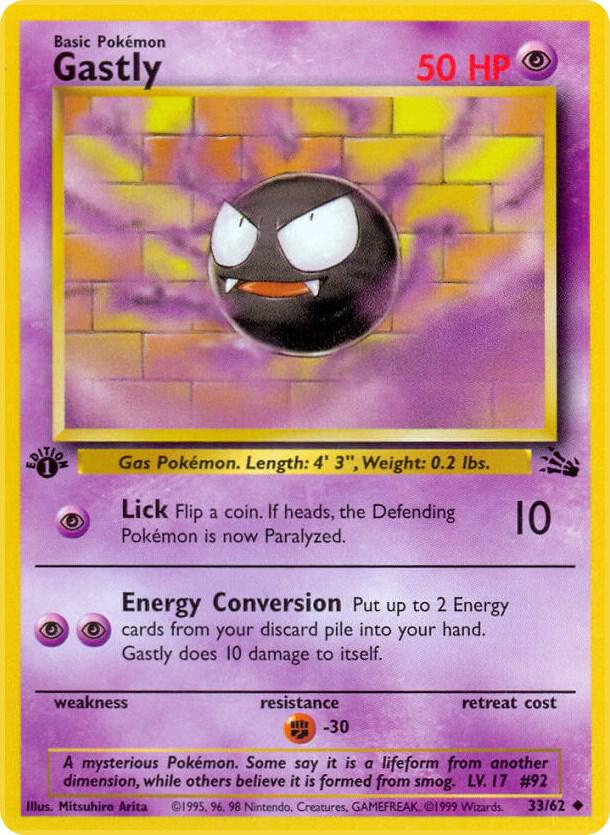</th>
  </tr>
  <tr><td><b>Fossil</b> <picture><source media="(prefers-color-scheme: dark)" srcset="./assets/sets-dark/fossil.png"></picture> 33/62</td></tr>
  <tr><td><b>Rarity</b>: <picture><source media="(prefers-color-scheme: dark)" srcset="./assets/rarities-dark/uncommon.png"></picture> Uncommon</td></tr>
  <tr><td><b>Type</b>:  Psychic</td></tr>
  <tr><td><b>HP</b>: 50</td></tr>
  <tr><td><b>Stage</b>: Basic</td></tr>
  <tr><td><b>Ability</b>: -</td></tr>
  <tr><td><b>Attack</b>: [P] Lick (10) - Flip a coin. If heads, the Defending Pokémon is now Paralyzed.</td></tr>
  <tr><td><b>Attack</b>: [PP] Energy Conversion - Put up to 2 Energy cards from your discard pile into your hand. Gastly does 10 damage to itself.</td></tr>
  <tr><td><b>Weakness</b>: -</td></tr>
  <tr><td><b>Resistance</b>:  Fighting -30</td></tr>
  <tr><td><b>Retreat</b>: -</td></tr>
  <tr><td><b>Can I play it?</b>: ✗ No, this card is too old for tournaments now</td></tr>
  <tr><td><b>Category</b>: collection</td></tr>
</table>

<table>
  <tr><td colspan="2"><h3 id="gastly-1">Gastly</h3></td></tr>
  <tr>
    <th rowspan="13" width="400">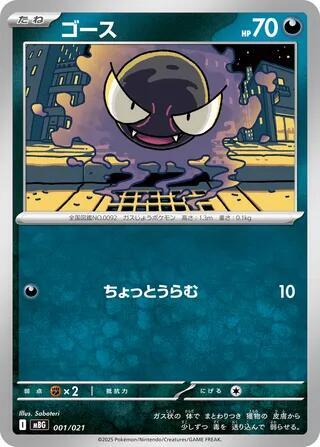</th>
  </tr>
  <tr><td><b>MBG: MEGA Starter Set Mega Gengar ex</b> <picture><source media="(prefers-color-scheme: dark)" srcset="./assets/sets-jp-dark/megagengar.png"></picture> 001/021</td></tr>
  <tr><td><b>Rarity</b>: -</td></tr>
  <tr><td><b>Type</b>:  Darkness</td></tr>
  <tr><td><b>HP</b>: 70</td></tr>
  <tr><td><b>Stage</b>: Basic</td></tr>
  <tr><td><b>Ability</b>: -</td></tr>
  <tr><td><b>Attack</b>: [Darkness] Petty Grudge (10)</td></tr>
  <tr><td><b>Weakness</b>:  Fighting ×2</td></tr>
  <tr><td><b>Resistance</b>: -</td></tr>
  <tr><td><b>Retreat</b>:  1</td></tr>
  <tr><td><b>Can I play it?</b>: ✗ No, Japanese cards are not allowed at tournaments here</td></tr>
  <tr><td><b>Category</b>: collection</td></tr>
</table>

<table>
  <tr><td colspan="2"><h3 id="gastly-2">Gastly <picture><source media="(prefers-color-scheme: dark)" srcset="./assets/rarities-dark/common.png"></picture></h3></td></tr>
  <tr>
    <th rowspan="13" width="400">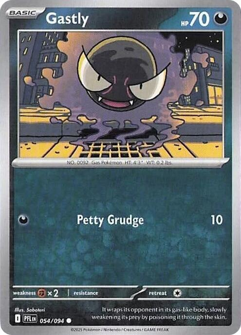</th>
  </tr>
  <tr><td><b>ME02: Phantasmal Flames</b> <picture><source media="(prefers-color-scheme: dark)" srcset="./assets/sets-dark/phantasmal-flames.png"></picture> 054/094</td></tr>
  <tr><td><b>Rarity</b>: <picture><source media="(prefers-color-scheme: dark)" srcset="./assets/rarities-dark/common.png"></picture> Common</td></tr>
  <tr><td><b>Type</b>:  Darkness</td></tr>
  <tr><td><b>HP</b>: 70</td></tr>
  <tr><td><b>Stage</b>: Basic</td></tr>
  <tr><td><b>Ability</b>: -</td></tr>
  <tr><td><b>Attack</b>: [D] Petty Grudge (10)</td></tr>
  <tr><td><b>Weakness</b>:  Fighting ×2</td></tr>
  <tr><td><b>Resistance</b>: -</td></tr>
  <tr><td><b>Retreat</b>:  1</td></tr>
  <tr><td><b>Can I play it?</b>: ✓ Yes, this card is allowed in tournaments</td></tr>
  <tr><td><b>Category</b>: collection</td></tr>
</table>

<table>
  <tr><td colspan="2"><h3 id="gastly-3">Gastly <picture><source media="(prefers-color-scheme: dark)" srcset="./assets/rarities-dark/common.png"></picture></h3></td></tr>
  <tr>
    <th rowspan="13" width="400">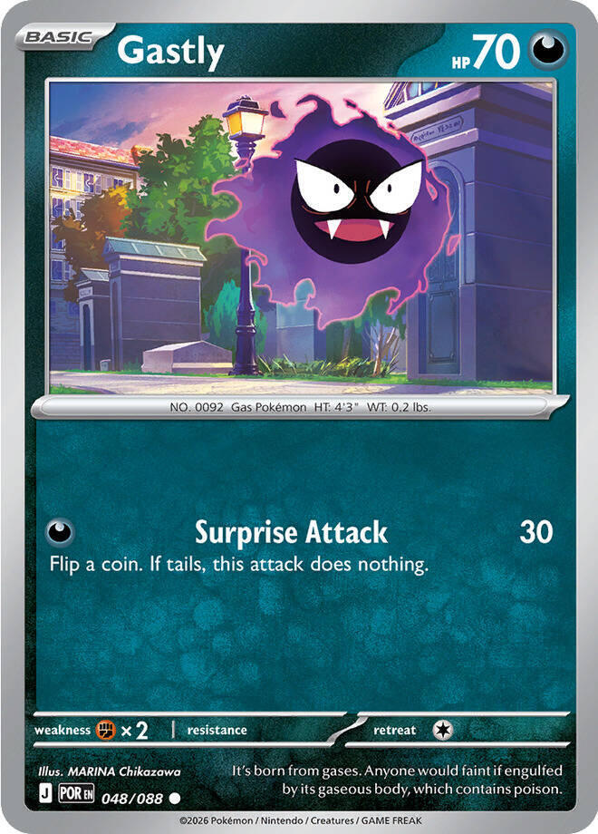</th>
  </tr>
  <tr><td><b>ME03: Perfect Order</b> <picture><source media="(prefers-color-scheme: dark)" srcset="./assets/sets-dark/perfect-order.png"></picture> 048/088</td></tr>
  <tr><td><b>Rarity</b>: <picture><source media="(prefers-color-scheme: dark)" srcset="./assets/rarities-dark/common.png"></picture> Common</td></tr>
  <tr><td><b>Type</b>:  Darkness</td></tr>
  <tr><td><b>HP</b>: 70</td></tr>
  <tr><td><b>Stage</b>: Basic</td></tr>
  <tr><td><b>Ability</b>: -</td></tr>
  <tr><td><b>Attack</b>: [D] Surprise Attack (30) - Flip a coin. If tails, this attack does nothing.</td></tr>
  <tr><td><b>Weakness</b>:  Fighting ×2</td></tr>
  <tr><td><b>Resistance</b>: -</td></tr>
  <tr><td><b>Retreat</b>:  1</td></tr>
  <tr><td><b>Can I play it?</b>: ✓ Yes, this card is allowed in tournaments</td></tr>
  <tr><td><b>Category</b>: deck</td></tr>
</table>

<table>
  <tr><td colspan="2"><h3 id="gastly-4">Gastly <picture><source media="(prefers-color-scheme: dark)" srcset="./assets/rarities-dark/common.png"></picture></h3></td></tr>
  <tr>
    <th rowspan="12" width="400">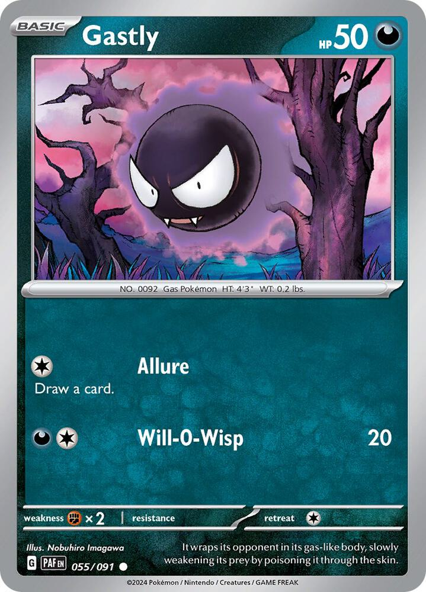</th>
  </tr>
  <tr><td><b>SV: Paldean Fates</b> <picture><source media="(prefers-color-scheme: dark)" srcset="./assets/sets-dark/paldean-fates.png"></picture> 055/091</td></tr>
  <tr><td><b>Rarity</b>: <picture><source media="(prefers-color-scheme: dark)" srcset="./assets/rarities-dark/common.png"></picture> Common</td></tr>
  <tr><td><b>Type</b>:  Darkness</td></tr>
  <tr><td><b>HP</b>: 50</td></tr>
  <tr><td><b>Stage</b>: Basic</td></tr>
  <tr><td><b>Ability</b>: -</td></tr>
  <tr><td><b>Weakness</b>:  Fighting ×2</td></tr>
  <tr><td><b>Resistance</b>: -</td></tr>
  <tr><td><b>Retreat</b>:  1</td></tr>
  <tr><td><b>Can I play it?</b>: ✗ No, this card is too old for tournaments now</td></tr>
  <tr><td><b>Category</b>: collection</td></tr>
</table>

<table>
  <tr><td colspan="2"><h3 id="gastly-5">Gastly <picture><source media="(prefers-color-scheme: dark)" srcset="./assets/rarities-dark/common.png"></picture></h3></td></tr>
  <tr>
    <th rowspan="13" width="400">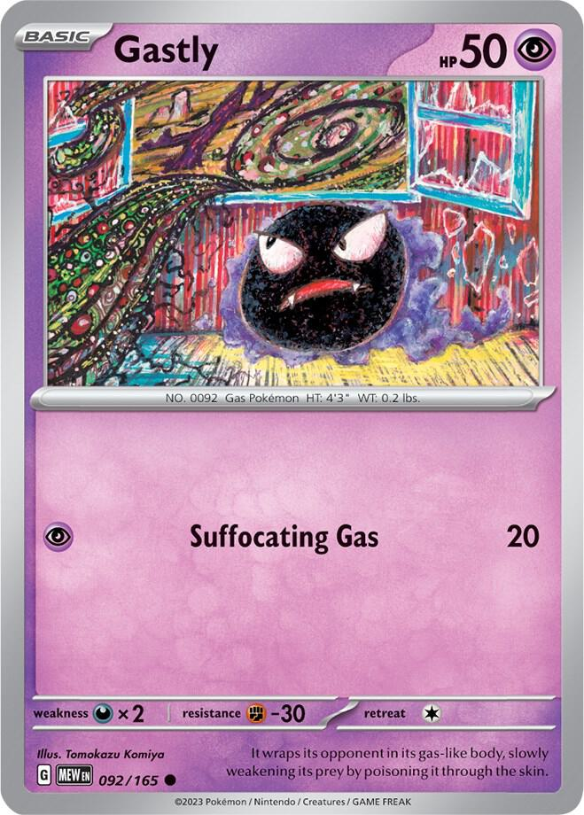</th>
  </tr>
  <tr><td><b>SV: Scarlet &amp; Violet 151</b> <picture><source media="(prefers-color-scheme: dark)" srcset="./assets/sets-dark/151.png"></picture> 092/165</td></tr>
  <tr><td><b>Rarity</b>: <picture><source media="(prefers-color-scheme: dark)" srcset="./assets/rarities-dark/common.png"></picture> Common</td></tr>
  <tr><td><b>Type</b>:  Psychic</td></tr>
  <tr><td><b>HP</b>: 50</td></tr>
  <tr><td><b>Stage</b>: Basic</td></tr>
  <tr><td><b>Ability</b>: -</td></tr>
  <tr><td><b>Attack</b>: [P] Suffocating Gas (20)</td></tr>
  <tr><td><b>Weakness</b>:  Darkness ×2</td></tr>
  <tr><td><b>Resistance</b>:  Fighting -30</td></tr>
  <tr><td><b>Retreat</b>:  1</td></tr>
  <tr><td><b>Can I play it?</b>: ✗ No, this card is too old for tournaments now</td></tr>
  <tr><td><b>Category</b>: collection</td></tr>
</table>

<table>
  <tr><td colspan="2"><h3 id="gastly-6">Gastly <picture><source media="(prefers-color-scheme: dark)" srcset="./assets/rarities-dark/promo.png"></picture></h3></td></tr>
  <tr>
    <th rowspan="13" width="400">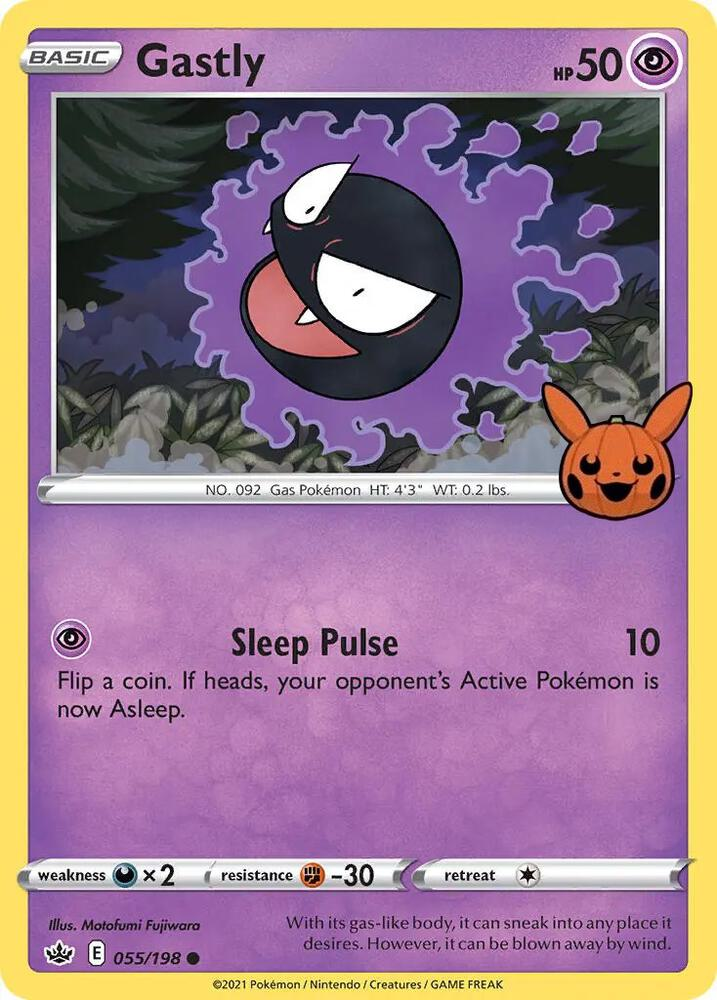</th>
  </tr>
  <tr><td><b>Trick or Trade BOOster Bundle</b>  055/198</td></tr>
  <tr><td><b>Rarity</b>: <picture><source media="(prefers-color-scheme: dark)" srcset="./assets/rarities-dark/promo.png"></picture> Promo</td></tr>
  <tr><td><b>Type</b>:  Psychic</td></tr>
  <tr><td><b>HP</b>: 50</td></tr>
  <tr><td><b>Stage</b>: Basic</td></tr>
  <tr><td><b>Ability</b>: -</td></tr>
  <tr><td><b>Attack</b>: [P] Sleep Pulse (10) - Flip a coin. If heads, your opponent&#x27;s Active Pokémon is now Asleep.</td></tr>
  <tr><td><b>Weakness</b>:  Darkness ×2</td></tr>
  <tr><td><b>Resistance</b>:  Fighting -30</td></tr>
  <tr><td><b>Retreat</b>:  1</td></tr>
  <tr><td><b>Can I play it?</b>: ✗ No, this card is too old for tournaments now</td></tr>
  <tr><td><b>Category</b>: collection</td></tr>
</table>

<table>
  <tr><td colspan="2"><h3 id="gastly-7">Gastly <picture><source media="(prefers-color-scheme: dark)" srcset="./assets/rarities-dark/common.png"></picture></h3></td></tr>
  <tr>
    <th rowspan="13" width="400">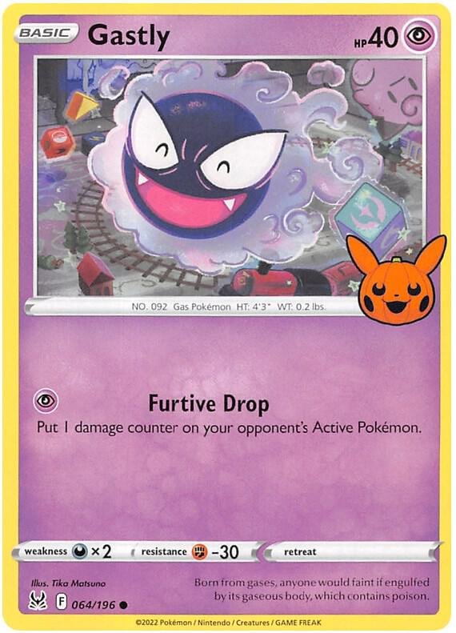</th>
  </tr>
  <tr><td><b>Trick or Trade BOOster Bundle 2023</b>  064/196</td></tr>
  <tr><td><b>Rarity</b>: <picture><source media="(prefers-color-scheme: dark)" srcset="./assets/rarities-dark/common.png"></picture> Common</td></tr>
  <tr><td><b>Type</b>:  Psychic</td></tr>
  <tr><td><b>HP</b>: 40</td></tr>
  <tr><td><b>Stage</b>: Basic</td></tr>
  <tr><td><b>Ability</b>: -</td></tr>
  <tr><td><b>Attack</b>: [P] Furtive Drop - Put 1 damage counter on your opponent&#x27;s Active Pokémon.</td></tr>
  <tr><td><b>Weakness</b>:  Darkness ×2</td></tr>
  <tr><td><b>Resistance</b>:  Fighting -30</td></tr>
  <tr><td><b>Retreat</b>: -</td></tr>
  <tr><td><b>Can I play it?</b>: ✗ No, this card is too old for tournaments now</td></tr>
  <tr><td><b>Category</b>: collection</td></tr>
</table>

<table>
  <tr><td colspan="2"><h3 id="gastly-8">Gastly <picture><source media="(prefers-color-scheme: dark)" srcset="./assets/rarities-dark/common.png"></picture></h3></td></tr>
  <tr>
    <th rowspan="14" width="400">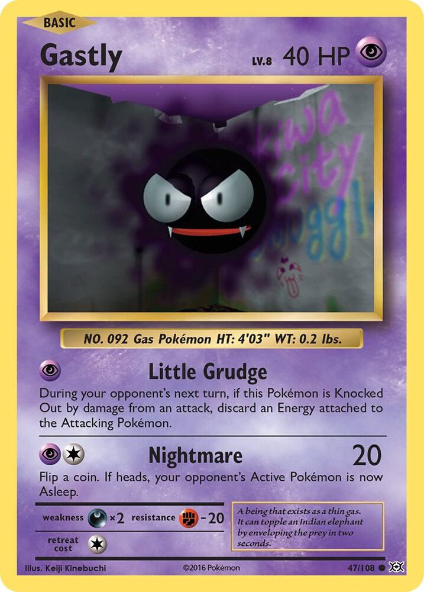</th>
  </tr>
  <tr><td><b>XY - Evolutions</b> <picture><source media="(prefers-color-scheme: dark)" srcset="./assets/sets-dark/evolutions.png"></picture> 47/108</td></tr>
  <tr><td><b>Rarity</b>: <picture><source media="(prefers-color-scheme: dark)" srcset="./assets/rarities-dark/common.png"></picture> Common</td></tr>
  <tr><td><b>Type</b>:  Psychic</td></tr>
  <tr><td><b>HP</b>: 40</td></tr>
  <tr><td><b>Stage</b>: Basic</td></tr>
  <tr><td><b>Ability</b>: -</td></tr>
  <tr><td><b>Attack</b>: [P] Little Grudge - During your opponent&#x27;s next turn, if this Pokémon is Knocked Out by damage from an attack, discard an Energy attached to the Attacking Pokémon.</td></tr>
  <tr><td><b>Attack</b>: [1P] Nightmare (20) - Flip a coin. If heads, your opponent&#x27;s Active Pokémon is now Asleep.</td></tr>
  <tr><td><b>Weakness</b>:  Darkness ×2</td></tr>
  <tr><td><b>Resistance</b>:  Fighting -20</td></tr>
  <tr><td><b>Retreat</b>:  1</td></tr>
  <tr><td><b>Can I play it?</b>: ✗ No, this card is too old for tournaments now</td></tr>
  <tr><td><b>Category</b>: collection</td></tr>
</table>

<table>
  <tr><td colspan="2"><h3 id="gastly-energy-symbol-pattern">Gastly (Energy Symbol Pattern) <picture><source media="(prefers-color-scheme: dark)" srcset="./assets/rarities-dark/common.png"></picture></h3></td></tr>
  <tr>
    <th rowspan="13" width="400">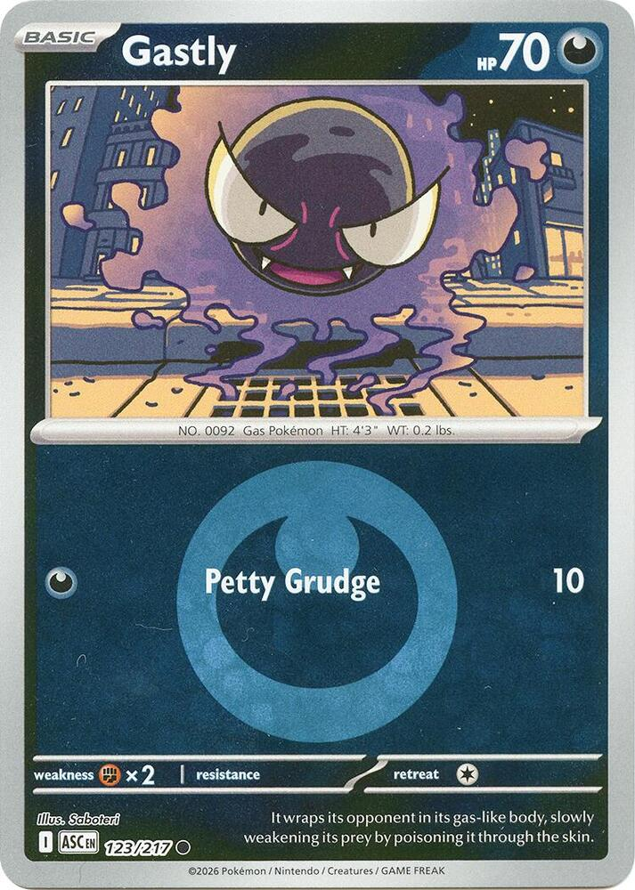</th>
  </tr>
  <tr><td><b>ME: Ascended Heroes</b> <picture><source media="(prefers-color-scheme: dark)" srcset="./assets/sets-dark/ascended-heroes.png"></picture> 123/217</td></tr>
  <tr><td><b>Rarity</b>: <picture><source media="(prefers-color-scheme: dark)" srcset="./assets/rarities-dark/common.png"></picture> Common</td></tr>
  <tr><td><b>Type</b>:  Darkness</td></tr>
  <tr><td><b>HP</b>: 70</td></tr>
  <tr><td><b>Stage</b>: Basic</td></tr>
  <tr><td><b>Ability</b>: -</td></tr>
  <tr><td><b>Attack</b>: [D] Petty Grudge (10)</td></tr>
  <tr><td><b>Weakness</b>:  Fighting ×2</td></tr>
  <tr><td><b>Resistance</b>: -</td></tr>
  <tr><td><b>Retreat</b>:  1</td></tr>
  <tr><td><b>Can I play it?</b>: ✓ Yes, this card is allowed in tournaments</td></tr>
  <tr><td><b>Category</b>: collection</td></tr>
</table>

<table>
  <tr><td colspan="2"><h3 id="gengar">Gengar <picture><source media="(prefers-color-scheme: dark)" srcset="./assets/rarities-dark/rare.png"></picture></h3></td></tr>
  <tr>
    <th rowspan="13" width="400">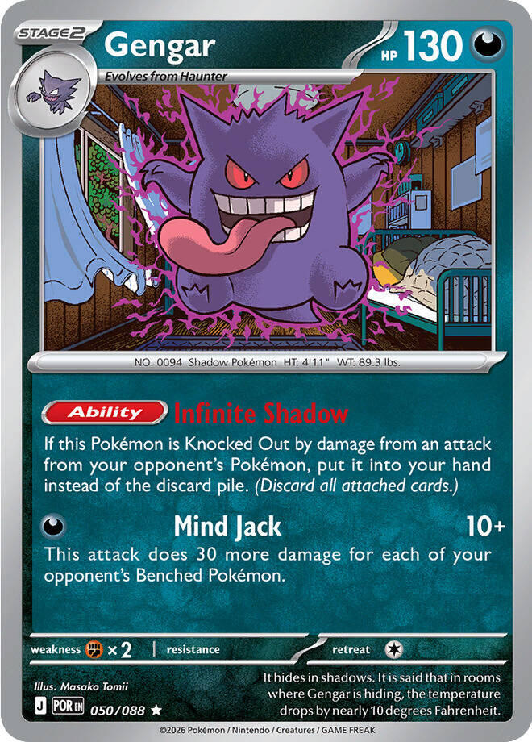</th>
  </tr>
  <tr><td><b>ME03: Perfect Order</b> <picture><source media="(prefers-color-scheme: dark)" srcset="./assets/sets-dark/perfect-order.png"></picture> 050/088</td></tr>
  <tr><td><b>Rarity</b>: <picture><source media="(prefers-color-scheme: dark)" srcset="./assets/rarities-dark/rare.png"></picture> Rare</td></tr>
  <tr><td><b>Type</b>:  Darkness</td></tr>
  <tr><td><b>HP</b>: 130</td></tr>
  <tr><td><b>Stage</b>: Stage 2</td></tr>
  <tr><td><b>Ability</b>: Infinite Shadow If this Pokémon is Knocked Out by damage from an attack from your opponent&#x27;s Pokémon, put it into your hand instead of the discard pile. (Discard all attached cards.)</td></tr>
  <tr><td><b>Attack</b>: [D] Mind Jack (10+) - This attack does 30 more damage for each of your opponent&#x27;s Benched Pokémon.</td></tr>
  <tr><td><b>Weakness</b>:  Fighting ×2</td></tr>
  <tr><td><b>Resistance</b>: -</td></tr>
  <tr><td><b>Retreat</b>:  1</td></tr>
  <tr><td><b>Can I play it?</b>: ✓ Yes, this card is allowed in tournaments</td></tr>
  <tr><td><b>Category</b>: deck</td></tr>
</table>

<table>
  <tr><td colspan="2"><h3 id="gengar-1">Gengar <picture><source media="(prefers-color-scheme: dark)" srcset="./assets/rarities-dark/rare.png"></picture></h3></td></tr>
  <tr>
    <th rowspan="13" width="400">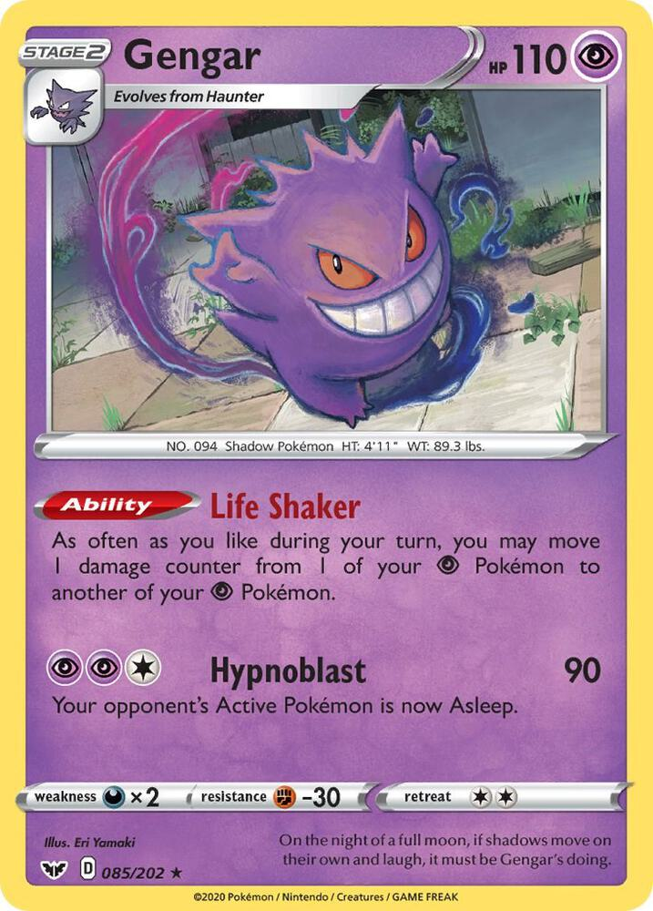</th>
  </tr>
  <tr><td><b>SWSH01: Sword &amp; Shield Base Set</b> <picture><source media="(prefers-color-scheme: dark)" srcset="./assets/sets-dark/sword-and-shield.png"></picture> 085/202</td></tr>
  <tr><td><b>Rarity</b>: <picture><source media="(prefers-color-scheme: dark)" srcset="./assets/rarities-dark/rare.png"></picture> Holo Rare</td></tr>
  <tr><td><b>Type</b>:  Psychic</td></tr>
  <tr><td><b>HP</b>: 110</td></tr>
  <tr><td><b>Stage</b>: Stage 2</td></tr>
  <tr><td><b>Ability</b>: Life Shaker As often as you like during your turn (before your attack), you may move 1 damage counter from 1 of your Psychic Pokémon to another of your Psychic Pokémon.</td></tr>
  <tr><td><b>Attack</b>: [1PP] Hypnoblast (90) - Your opponent&#x27;s Active Pokémon is now Asleep.</td></tr>
  <tr><td><b>Weakness</b>:  Darkness ×2</td></tr>
  <tr><td><b>Resistance</b>:  Fighting -30</td></tr>
  <tr><td><b>Retreat</b>:  2</td></tr>
  <tr><td><b>Can I play it?</b>: ✗ No, this card is too old for tournaments now</td></tr>
  <tr><td><b>Category</b>: collection</td></tr>
</table>

<table>
  <tr><td colspan="2"><h3 id="gengar-2021-copyright-date">Gengar (2021 Copyright Date) <picture><source media="(prefers-color-scheme: dark)" srcset="./assets/rarities-dark/promo.png"></picture></h3></td></tr>
  <tr>
    <th rowspan="13" width="400">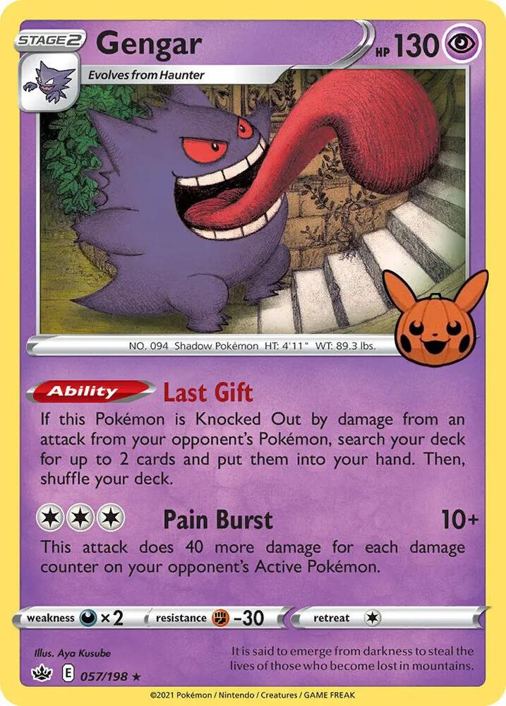</th>
  </tr>
  <tr><td><b>Trick or Trade BOOster Bundle</b>  057/198</td></tr>
  <tr><td><b>Rarity</b>: <picture><source media="(prefers-color-scheme: dark)" srcset="./assets/rarities-dark/promo.png"></picture> Promo</td></tr>
  <tr><td><b>Type</b>:  Psychic</td></tr>
  <tr><td><b>HP</b>: 130</td></tr>
  <tr><td><b>Stage</b>: Stage 2</td></tr>
  <tr><td><b>Ability</b>: Last Gift If this Pokémon is Knocked Out by damage from an attack from your opponent&#x27;s Pokémon, search your deck for up to 2 cards and put them into your hand. Then, shuffle your deck.</td></tr>
  <tr><td><b>Attack</b>: [3] Pain Burst (10+) - This attack does 40 more damage for each damage counter on your opponent&#x27;s Active Pokémon.</td></tr>
  <tr><td><b>Weakness</b>:  Darkness ×2</td></tr>
  <tr><td><b>Resistance</b>:  Fighting -30</td></tr>
  <tr><td><b>Retreat</b>:  1</td></tr>
  <tr><td><b>Can I play it?</b>: ✗ No, this card is too old for tournaments now</td></tr>
  <tr><td><b>Category</b>: collection</td></tr>
</table>

<table>
  <tr><td colspan="2"><h3 id="gengar-2022-copyright-date">Gengar (2022 Copyright Date) <picture><source media="(prefers-color-scheme: dark)" srcset="./assets/rarities-dark/rare.png"></picture></h3></td></tr>
  <tr>
    <th rowspan="13" width="400">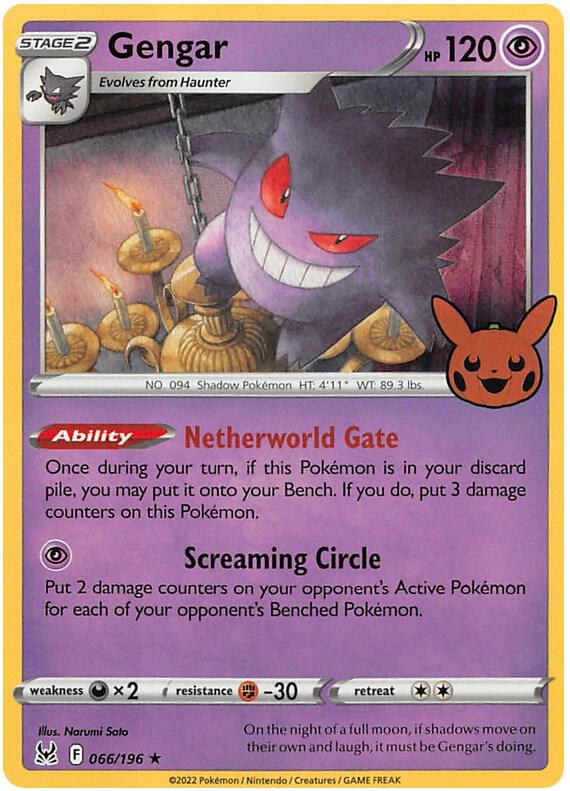</th>
  </tr>
  <tr><td><b>Trick or Trade BOOster Bundle 2023</b>  066/196</td></tr>
  <tr><td><b>Rarity</b>: <picture><source media="(prefers-color-scheme: dark)" srcset="./assets/rarities-dark/rare.png"></picture> Holo Rare</td></tr>
  <tr><td><b>Type</b>:  Psychic</td></tr>
  <tr><td><b>HP</b>: 120</td></tr>
  <tr><td><b>Stage</b>: Stage 2</td></tr>
  <tr><td><b>Ability</b>: Netherworld Gate Once during your turn, if this Pokémon is in your discard pile, you may put it onto your Bench. If you do, put 3 damage counters on this Pokémon.</td></tr>
  <tr><td><b>Attack</b>: [P] Screaming Circle - Put 2 damage counters on your opponent&#x27;s Active Pokémon for each of your opponent&#x27;s Benched Pokémon.</td></tr>
  <tr><td><b>Weakness</b>:  Darkness ×2</td></tr>
  <tr><td><b>Resistance</b>:  Fighting -30</td></tr>
  <tr><td><b>Retreat</b>:  2</td></tr>
  <tr><td><b>Can I play it?</b>: ✗ No, this card is too old for tournaments now</td></tr>
  <tr><td><b>Category</b>: collection</td></tr>
</table>

<table>
  <tr><td colspan="2"><h3 id="gengar-cosmos-holo">Gengar (Cosmos Holo) <picture><source media="(prefers-color-scheme: dark)" srcset="./assets/rarities-dark/rare.png"></picture></h3></td></tr>
  <tr>
    <th rowspan="13" width="400">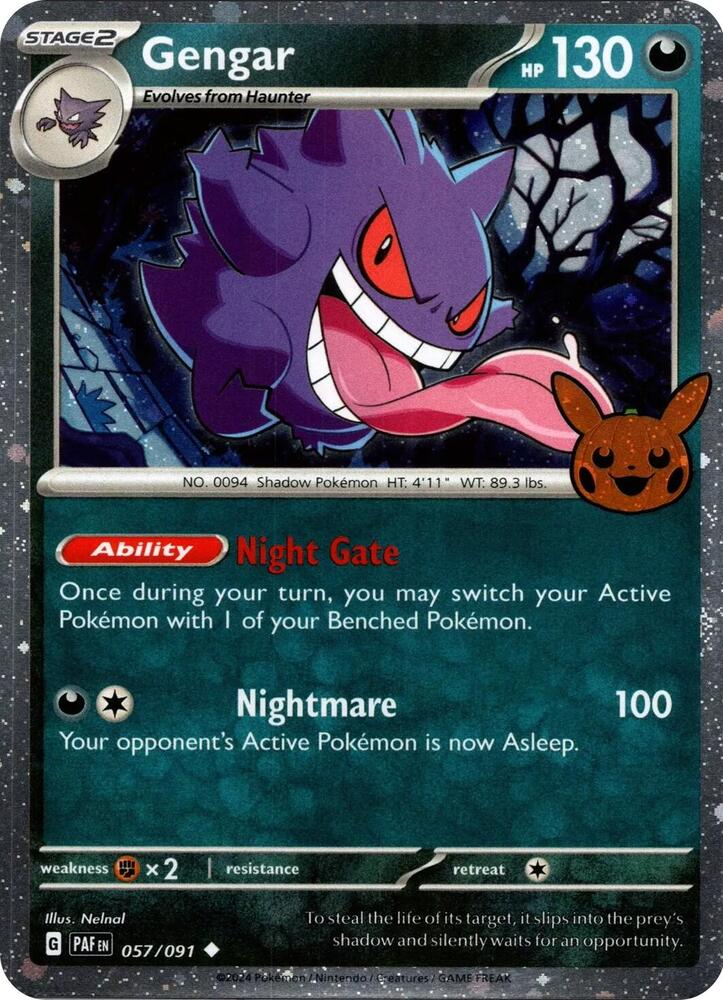</th>
  </tr>
  <tr><td><b>Trick or Trade BOOster Bundle 2024</b>  057/091</td></tr>
  <tr><td><b>Rarity</b>: <picture><source media="(prefers-color-scheme: dark)" srcset="./assets/rarities-dark/rare.png"></picture> Holo Rare</td></tr>
  <tr><td><b>Type</b>:  Darkness</td></tr>
  <tr><td><b>HP</b>: 130</td></tr>
  <tr><td><b>Stage</b>: Stage 2</td></tr>
  <tr><td><b>Ability</b>: Night Gate Once during your turn, you may switch your Active Pokémon with 1 of your Benched Pokémon.</td></tr>
  <tr><td><b>Attack</b>: [D1] Nightmare (100) - Your opponent&#x27;s Active Pokémon is now Asleep.</td></tr>
  <tr><td><b>Weakness</b>:  Fighting ×2</td></tr>
  <tr><td><b>Resistance</b>: -</td></tr>
  <tr><td><b>Retreat</b>:  1</td></tr>
  <tr><td><b>Can I play it?</b>: ✗ No, this card is too old for tournaments now</td></tr>
  <tr><td><b>Category</b>: collection</td></tr>
</table>

<table>
  <tr><td colspan="2"><h3 id="gengar-v">Gengar V </h3></td></tr>
  <tr>
    <th rowspan="14" width="400">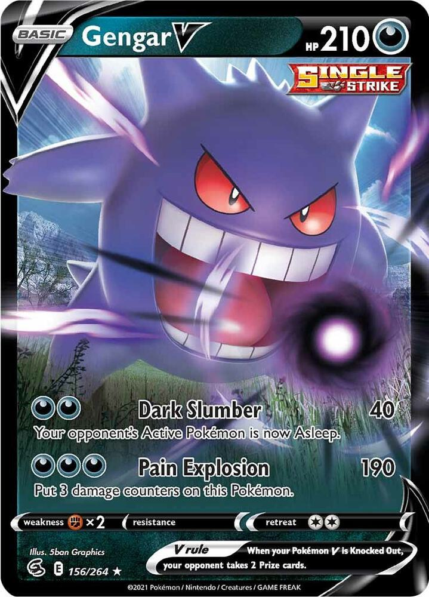</th>
  </tr>
  <tr><td><b>SWSH08: Fusion Strike</b> <picture><source media="(prefers-color-scheme: dark)" srcset="./assets/sets-dark/fusion-strike.png"></picture> 156/264</td></tr>
  <tr><td><b>Rarity</b>:  Ultra Rare</td></tr>
  <tr><td><b>Type</b>:  Darkness</td></tr>
  <tr><td><b>HP</b>: 210</td></tr>
  <tr><td><b>Stage</b>: Basic</td></tr>
  <tr><td><b>Ability</b>: -</td></tr>
  <tr><td><b>Attack</b>: [DD] Dark Slumber (40) - Your opponent&#x27;s Active Pokémon is now Asleep.</td></tr>
  <tr><td><b>Attack</b>: [DDD] Pain Explosion (190) - Put 3 damage counters on this Pokémon.</td></tr>
  <tr><td><b>Weakness</b>:  Fighting ×2</td></tr>
  <tr><td><b>Resistance</b>: -</td></tr>
  <tr><td><b>Retreat</b>:  2</td></tr>
  <tr><td><b>Can I play it?</b>: ✗ No, this card is too old for tournaments now</td></tr>
  <tr><td><b>Category</b>: collection</td></tr>
</table>

<table>
  <tr><td colspan="2"><h3 id="gourgeist">Gourgeist <picture><source media="(prefers-color-scheme: dark)" srcset="./assets/rarities-dark/promo.png"></picture></h3></td></tr>
  <tr>
    <th rowspan="13" width="400">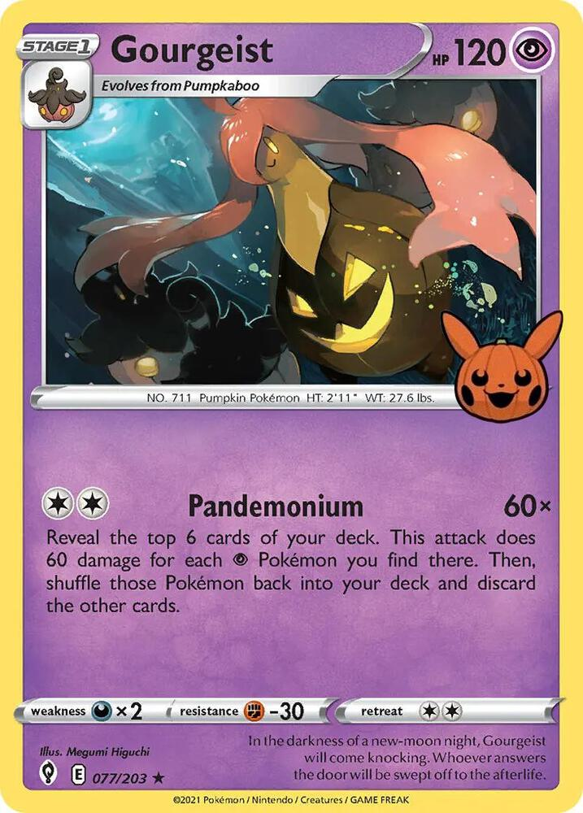</th>
  </tr>
  <tr><td><b>Trick or Trade BOOster Bundle</b>  077/203</td></tr>
  <tr><td><b>Rarity</b>: <picture><source media="(prefers-color-scheme: dark)" srcset="./assets/rarities-dark/promo.png"></picture> Promo</td></tr>
  <tr><td><b>Type</b>:  Psychic</td></tr>
  <tr><td><b>HP</b>: 120</td></tr>
  <tr><td><b>Stage</b>: Stage 1</td></tr>
  <tr><td><b>Ability</b>: -</td></tr>
  <tr><td><b>Attack</b>: [2] Pandemonium (60x) - Reveal the top 6 cards of your deck. This attack does 60 damage for each Psychic Pokémon you find there. Then, shuffle those Pokémon back into your deck and discard the other cards.</td></tr>
  <tr><td><b>Weakness</b>:  Darkness ×2</td></tr>
  <tr><td><b>Resistance</b>:  Fighting -30</td></tr>
  <tr><td><b>Retreat</b>:  2</td></tr>
  <tr><td><b>Can I play it?</b>: ✗ No, this card is too old for tournaments now</td></tr>
  <tr><td><b>Category</b>: collection</td></tr>
</table>

<table>
  <tr><td colspan="2"><h3 id="haunter">Haunter <picture><source media="(prefers-color-scheme: dark)" srcset="./assets/rarities-dark/uncommon.png"></picture></h3></td></tr>
  <tr>
    <th rowspan="14" width="400">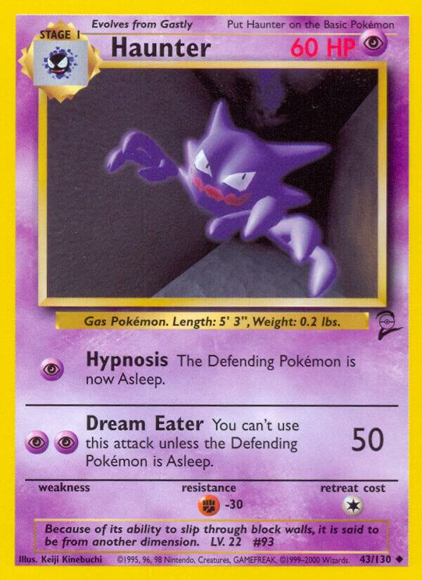</th>
  </tr>
  <tr><td><b>Base Set 2</b> <picture><source media="(prefers-color-scheme: dark)" srcset="./assets/sets-dark/base-set-2.png"></picture> 043/130</td></tr>
  <tr><td><b>Rarity</b>: <picture><source media="(prefers-color-scheme: dark)" srcset="./assets/rarities-dark/uncommon.png"></picture> Uncommon</td></tr>
  <tr><td><b>Type</b>:  Psychic</td></tr>
  <tr><td><b>HP</b>: 60</td></tr>
  <tr><td><b>Stage</b>: Stage 1</td></tr>
  <tr><td><b>Ability</b>: -</td></tr>
  <tr><td><b>Attack</b>: [P] Hypnosis - The Defending Pokémon is now Asleep.</td></tr>
  <tr><td><b>Attack</b>: [PP] Dream Eater (50) - You can&#x27;t use this attack unless the Defending Pokémon is Asleep.</td></tr>
  <tr><td><b>Weakness</b>: -</td></tr>
  <tr><td><b>Resistance</b>:  Fighting -30</td></tr>
  <tr><td><b>Retreat</b>:  1</td></tr>
  <tr><td><b>Can I play it?</b>: ✗ No, this card is too old for tournaments now</td></tr>
  <tr><td><b>Category</b>: collection</td></tr>
</table>

<table>
  <tr><td colspan="2"><h3 id="haunter-1">Haunter</h3></td></tr>
  <tr>
    <th rowspan="13" width="400">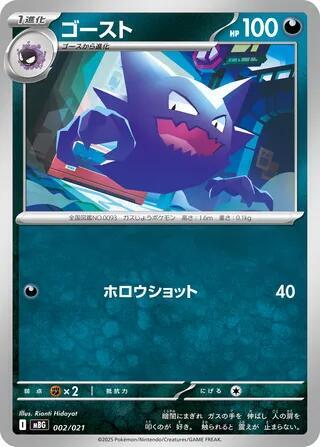</th>
  </tr>
  <tr><td><b>MBG: MEGA Starter Set Mega Gengar ex</b> <picture><source media="(prefers-color-scheme: dark)" srcset="./assets/sets-jp-dark/megagengar.png"></picture> 002/021</td></tr>
  <tr><td><b>Rarity</b>: -</td></tr>
  <tr><td><b>Type</b>:  Darkness</td></tr>
  <tr><td><b>HP</b>: 100</td></tr>
  <tr><td><b>Stage</b>: Stage 1</td></tr>
  <tr><td><b>Ability</b>: -</td></tr>
  <tr><td><b>Attack</b>: [Darkness] Spooky Shot (40)</td></tr>
  <tr><td><b>Weakness</b>:  Fighting ×2</td></tr>
  <tr><td><b>Resistance</b>: -</td></tr>
  <tr><td><b>Retreat</b>:  1</td></tr>
  <tr><td><b>Can I play it?</b>: ✗ No, Japanese cards are not allowed at tournaments here</td></tr>
  <tr><td><b>Category</b>: collection</td></tr>
</table>

<table>
  <tr><td colspan="2"><h3 id="haunter-2">Haunter </h3></td></tr>
  <tr>
    <th rowspan="13" width="400">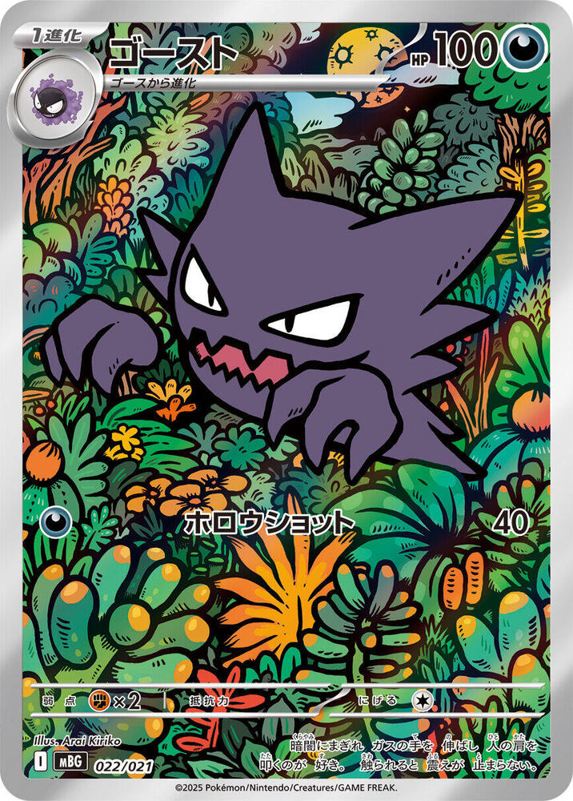</th>
  </tr>
  <tr><td><b>MBG: MEGA Starter Set Mega Gengar ex</b> <picture><source media="(prefers-color-scheme: dark)" srcset="./assets/sets-jp-dark/megagengar.png"></picture> 022/021</td></tr>
  <tr><td><b>Rarity</b>:  Art Rare</td></tr>
  <tr><td><b>Type</b>:  Darkness</td></tr>
  <tr><td><b>HP</b>: 100</td></tr>
  <tr><td><b>Stage</b>: Stage 1</td></tr>
  <tr><td><b>Ability</b>: -</td></tr>
  <tr><td><b>Attack</b>: [Darkness] Spooky Shot (40)</td></tr>
  <tr><td><b>Weakness</b>:  Fighting ×2</td></tr>
  <tr><td><b>Resistance</b>: -</td></tr>
  <tr><td><b>Retreat</b>:  1</td></tr>
  <tr><td><b>Can I play it?</b>: ✗ No, Japanese cards are not allowed at tournaments here</td></tr>
  <tr><td><b>Category</b>: collection</td></tr>
</table>

<table>
  <tr><td colspan="2"><h3 id="haunter-3">Haunter <picture><source media="(prefers-color-scheme: dark)" srcset="./assets/rarities-dark/uncommon.png"></picture></h3></td></tr>
  <tr>
    <th rowspan="13" width="400">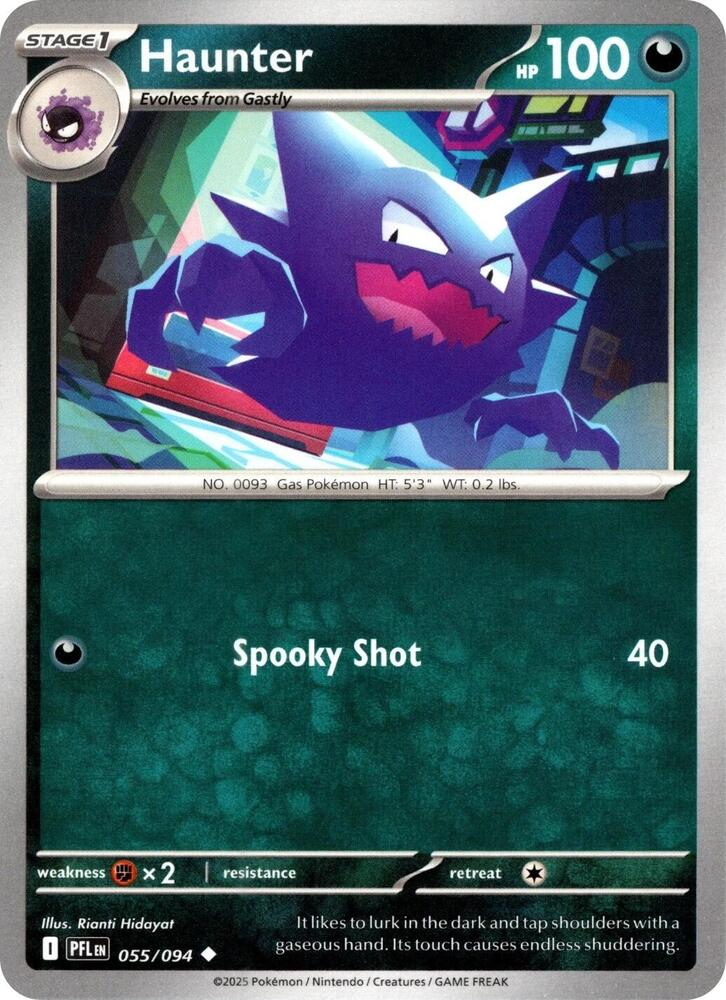</th>
  </tr>
  <tr><td><b>ME02: Phantasmal Flames</b> <picture><source media="(prefers-color-scheme: dark)" srcset="./assets/sets-dark/phantasmal-flames.png"></picture> 055/094</td></tr>
  <tr><td><b>Rarity</b>: <picture><source media="(prefers-color-scheme: dark)" srcset="./assets/rarities-dark/uncommon.png"></picture> Uncommon</td></tr>
  <tr><td><b>Type</b>:  Darkness</td></tr>
  <tr><td><b>HP</b>: 100</td></tr>
  <tr><td><b>Stage</b>: Stage 1</td></tr>
  <tr><td><b>Ability</b>: -</td></tr>
  <tr><td><b>Attack</b>: [D] Spooky Shot (40)</td></tr>
  <tr><td><b>Weakness</b>:  Fighting ×2</td></tr>
  <tr><td><b>Resistance</b>: -</td></tr>
  <tr><td><b>Retreat</b>:  1</td></tr>
  <tr><td><b>Can I play it?</b>: ✓ Yes, this card is allowed in tournaments</td></tr>
  <tr><td><b>Category</b>: deck</td></tr>
</table>

<table>
  <tr><td colspan="2"><h3 id="haunter-4">Haunter <picture><source media="(prefers-color-scheme: dark)" srcset="./assets/rarities-dark/common.png"></picture></h3></td></tr>
  <tr>
    <th rowspan="13" width="400">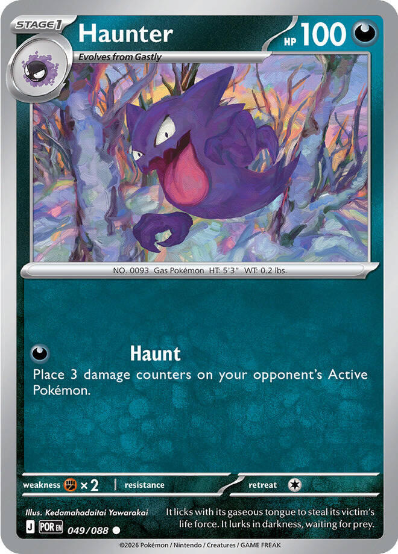</th>
  </tr>
  <tr><td><b>ME03: Perfect Order</b> <picture><source media="(prefers-color-scheme: dark)" srcset="./assets/sets-dark/perfect-order.png"></picture> 049/088</td></tr>
  <tr><td><b>Rarity</b>: <picture><source media="(prefers-color-scheme: dark)" srcset="./assets/rarities-dark/common.png"></picture> Common</td></tr>
  <tr><td><b>Type</b>:  Darkness</td></tr>
  <tr><td><b>HP</b>: 100</td></tr>
  <tr><td><b>Stage</b>: Stage 1</td></tr>
  <tr><td><b>Ability</b>: -</td></tr>
  <tr><td><b>Attack</b>: [D] Haunt - Place 3 damage counters on your opponent&#x27;s Active Pokémon.</td></tr>
  <tr><td><b>Weakness</b>:  Fighting ×2</td></tr>
  <tr><td><b>Resistance</b>: -</td></tr>
  <tr><td><b>Retreat</b>:  1</td></tr>
  <tr><td><b>Can I play it?</b>: ✓ Yes, this card is allowed in tournaments</td></tr>
  <tr><td><b>Category</b>: collection</td></tr>
</table>

<table>
  <tr><td colspan="2"><h3 id="haunter-5">Haunter <picture><source media="(prefers-color-scheme: dark)" srcset="./assets/rarities-dark/uncommon.png"></picture></h3></td></tr>
  <tr>
    <th rowspan="13" width="400">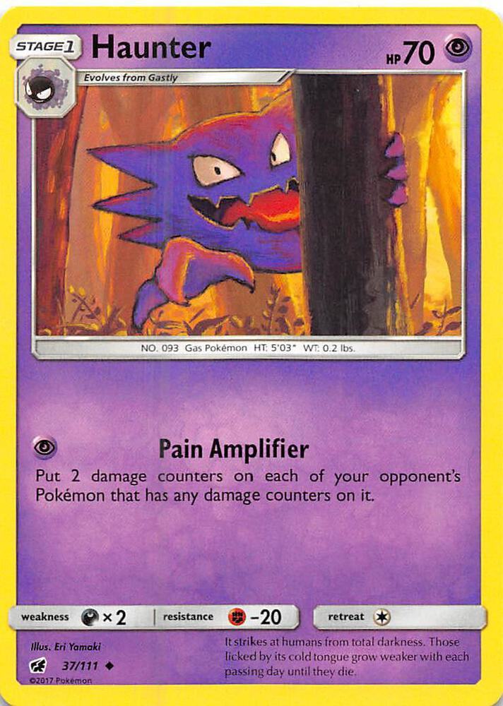</th>
  </tr>
  <tr><td><b>SM - Crimson Invasion</b> <picture><source media="(prefers-color-scheme: dark)" srcset="./assets/sets-dark/crimson-invasion.png"></picture> 37/111</td></tr>
  <tr><td><b>Rarity</b>: <picture><source media="(prefers-color-scheme: dark)" srcset="./assets/rarities-dark/uncommon.png"></picture> Uncommon</td></tr>
  <tr><td><b>Type</b>:  Psychic</td></tr>
  <tr><td><b>HP</b>: 70</td></tr>
  <tr><td><b>Stage</b>: Stage 1</td></tr>
  <tr><td><b>Ability</b>: -</td></tr>
  <tr><td><b>Attack</b>: [P] Pain Amplifier - Put 2 damage counters on each of your opponent&#x27;s Pokémon that has any damage counters on it.</td></tr>
  <tr><td><b>Weakness</b>:  Darkness ×2</td></tr>
  <tr><td><b>Resistance</b>:  Fighting -20</td></tr>
  <tr><td><b>Retreat</b>:  1</td></tr>
  <tr><td><b>Can I play it?</b>: ✗ No, this card is too old for tournaments now</td></tr>
  <tr><td><b>Category</b>: collection</td></tr>
</table>

<table>
  <tr><td colspan="2"><h3 id="haunter-6">Haunter <picture><source media="(prefers-color-scheme: dark)" srcset="./assets/rarities-dark/common.png"></picture></h3></td></tr>
  <tr>
    <th rowspan="12" width="400">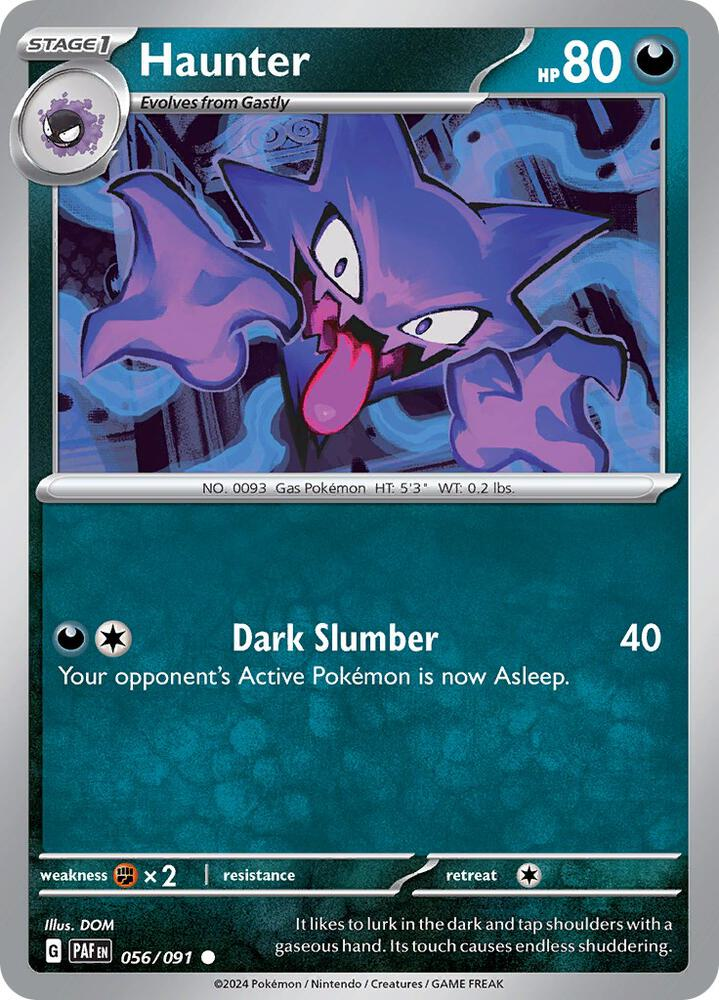</th>
  </tr>
  <tr><td><b>SV: Paldean Fates</b> <picture><source media="(prefers-color-scheme: dark)" srcset="./assets/sets-dark/paldean-fates.png"></picture> 056/091</td></tr>
  <tr><td><b>Rarity</b>: <picture><source media="(prefers-color-scheme: dark)" srcset="./assets/rarities-dark/common.png"></picture> Common</td></tr>
  <tr><td><b>Type</b>:  Darkness</td></tr>
  <tr><td><b>HP</b>: 80</td></tr>
  <tr><td><b>Stage</b>: Stage 1</td></tr>
  <tr><td><b>Ability</b>: -</td></tr>
  <tr><td><b>Weakness</b>:  Fighting ×2</td></tr>
  <tr><td><b>Resistance</b>: -</td></tr>
  <tr><td><b>Retreat</b>:  1</td></tr>
  <tr><td><b>Can I play it?</b>: ✗ No, this card is too old for tournaments now</td></tr>
  <tr><td><b>Category</b>: collection</td></tr>
</table>

<table>
  <tr><td colspan="2"><h3 id="haunter-7">Haunter <picture><source media="(prefers-color-scheme: dark)" srcset="./assets/rarities-dark/uncommon.png"></picture></h3></td></tr>
  <tr>
    <th rowspan="13" width="400">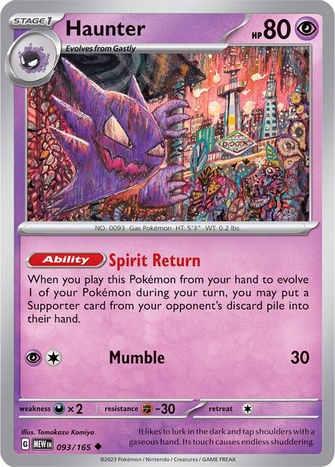</th>
  </tr>
  <tr><td><b>SV: Scarlet &amp; Violet 151</b> <picture><source media="(prefers-color-scheme: dark)" srcset="./assets/sets-dark/151.png"></picture> 093/165</td></tr>
  <tr><td><b>Rarity</b>: <picture><source media="(prefers-color-scheme: dark)" srcset="./assets/rarities-dark/uncommon.png"></picture> Uncommon</td></tr>
  <tr><td><b>Type</b>:  Psychic</td></tr>
  <tr><td><b>HP</b>: 80</td></tr>
  <tr><td><b>Stage</b>: Stage 1</td></tr>
  <tr><td><b>Ability</b>: Spirit Return When you play this Pokémon from your hand to evolve 1 of your Pokémon during your turn, you may put a Supporter card from your opponent&#x27;s discard pile into their hand.</td></tr>
  <tr><td><b>Attack</b>: [1P] Mumble (30)</td></tr>
  <tr><td><b>Weakness</b>:  Darkness ×2</td></tr>
  <tr><td><b>Resistance</b>:  Fighting -30</td></tr>
  <tr><td><b>Retreat</b>:  1</td></tr>
  <tr><td><b>Can I play it?</b>: ✗ No, this card is too old for tournaments now</td></tr>
  <tr><td><b>Category</b>: collection</td></tr>
</table>

<table>
  <tr><td colspan="2"><h3 id="haunter-8">Haunter <picture><source media="(prefers-color-scheme: dark)" srcset="./assets/rarities-dark/uncommon.png"></picture></h3></td></tr>
  <tr>
    <th rowspan="14" width="400">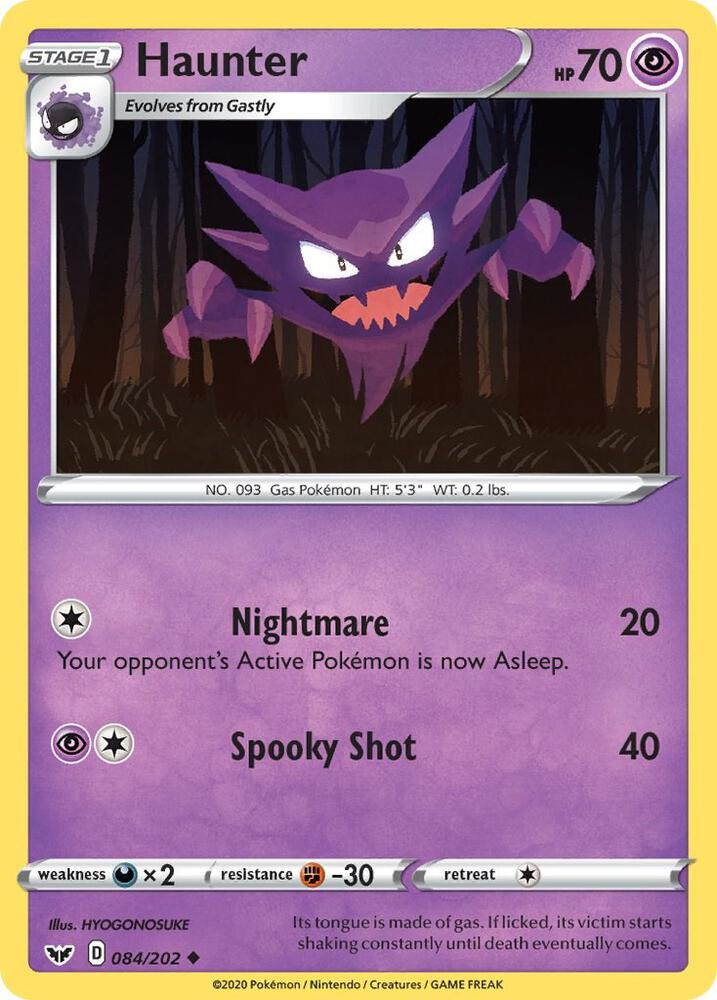</th>
  </tr>
  <tr><td><b>SWSH01: Sword &amp; Shield Base Set</b> <picture><source media="(prefers-color-scheme: dark)" srcset="./assets/sets-dark/sword-and-shield.png"></picture> 084/202</td></tr>
  <tr><td><b>Rarity</b>: <picture><source media="(prefers-color-scheme: dark)" srcset="./assets/rarities-dark/uncommon.png"></picture> Uncommon</td></tr>
  <tr><td><b>Type</b>:  Psychic</td></tr>
  <tr><td><b>HP</b>: 70</td></tr>
  <tr><td><b>Stage</b>: Stage 1</td></tr>
  <tr><td><b>Ability</b>: -</td></tr>
  <tr><td><b>Attack</b>: [1] Nightmare (20) - Your opponent&#x27;s Active Pokémon is now Asleep.</td></tr>
  <tr><td><b>Attack</b>: [1P] Spooky Shot (40)</td></tr>
  <tr><td><b>Weakness</b>:  Darkness ×2</td></tr>
  <tr><td><b>Resistance</b>:  Fighting -30</td></tr>
  <tr><td><b>Retreat</b>:  1</td></tr>
  <tr><td><b>Can I play it?</b>: ✗ No, this card is too old for tournaments now</td></tr>
  <tr><td><b>Category</b>: collection</td></tr>
</table>

<table>
  <tr><td colspan="2"><h3 id="haunter-9">Haunter <picture><source media="(prefers-color-scheme: dark)" srcset="./assets/rarities-dark/promo.png"></picture></h3></td></tr>
  <tr>
    <th rowspan="13" width="400">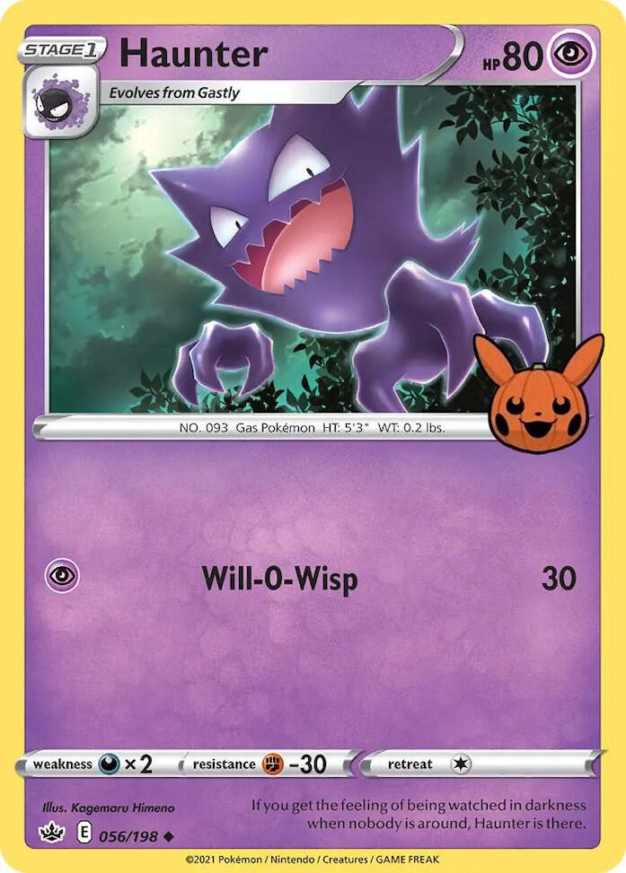</th>
  </tr>
  <tr><td><b>Trick or Trade BOOster Bundle</b>  056/198</td></tr>
  <tr><td><b>Rarity</b>: <picture><source media="(prefers-color-scheme: dark)" srcset="./assets/rarities-dark/promo.png"></picture> Promo</td></tr>
  <tr><td><b>Type</b>:  Psychic</td></tr>
  <tr><td><b>HP</b>: 80</td></tr>
  <tr><td><b>Stage</b>: Stage 1</td></tr>
  <tr><td><b>Ability</b>: -</td></tr>
  <tr><td><b>Attack</b>: [P] Will-O-Wisp (30)</td></tr>
  <tr><td><b>Weakness</b>:  Darkness ×2</td></tr>
  <tr><td><b>Resistance</b>:  Fighting -30</td></tr>
  <tr><td><b>Retreat</b>:  1</td></tr>
  <tr><td><b>Can I play it?</b>: ✗ No, this card is too old for tournaments now</td></tr>
  <tr><td><b>Category</b>: collection</td></tr>
</table>

<table>
  <tr><td colspan="2"><h3 id="haunter-10">Haunter <picture><source media="(prefers-color-scheme: dark)" srcset="./assets/rarities-dark/uncommon.png"></picture></h3></td></tr>
  <tr>
    <th rowspan="13" width="400">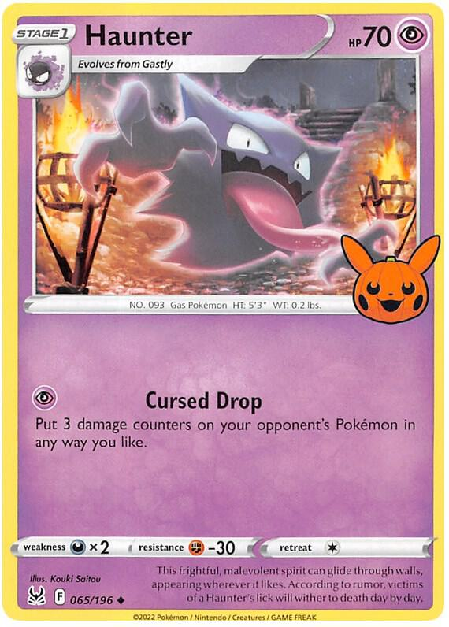</th>
  </tr>
  <tr><td><b>Trick or Trade BOOster Bundle 2023</b>  065/196</td></tr>
  <tr><td><b>Rarity</b>: <picture><source media="(prefers-color-scheme: dark)" srcset="./assets/rarities-dark/uncommon.png"></picture> Uncommon</td></tr>
  <tr><td><b>Type</b>:  Psychic</td></tr>
  <tr><td><b>HP</b>: 70</td></tr>
  <tr><td><b>Stage</b>: Stage 1</td></tr>
  <tr><td><b>Ability</b>: -</td></tr>
  <tr><td><b>Attack</b>: [P] Cursed Drop - Put 3 damage counters on your opponent&#x27;s Pokémon in any way you like.</td></tr>
  <tr><td><b>Weakness</b>:  Darkness ×2</td></tr>
  <tr><td><b>Resistance</b>:  Fighting -30</td></tr>
  <tr><td><b>Retreat</b>:  1</td></tr>
  <tr><td><b>Can I play it?</b>: ✗ No, this card is too old for tournaments now</td></tr>
  <tr><td><b>Category</b>: collection</td></tr>
</table>

<table>
  <tr><td colspan="2"><h3 id="haunter-11">Haunter <picture><source media="(prefers-color-scheme: dark)" srcset="./assets/rarities-dark/common.png"></picture></h3></td></tr>
  <tr>
    <th rowspan="13" width="400">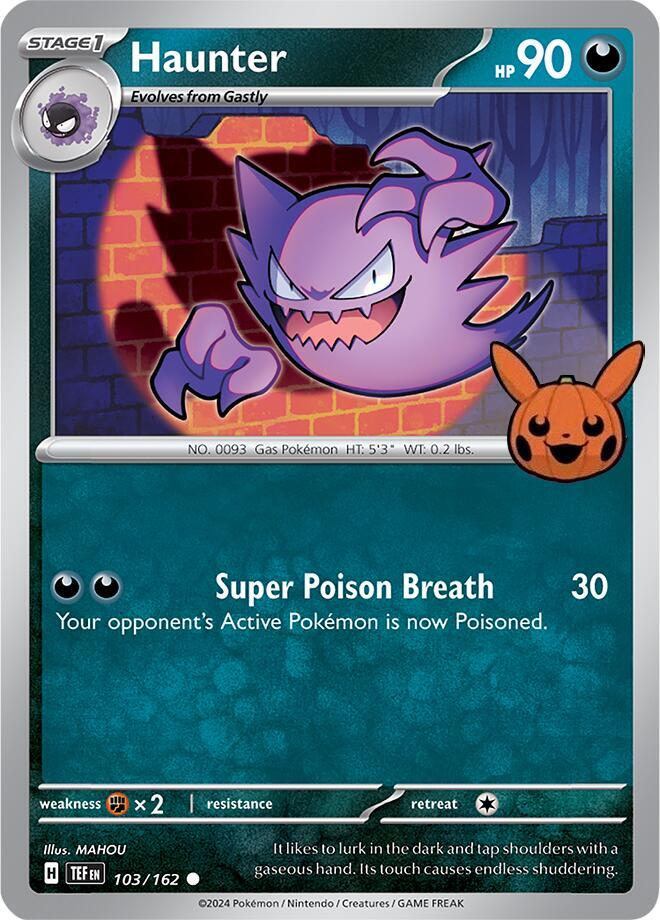</th>
  </tr>
  <tr><td><b>Trick or Trade BOOster Bundle 2024</b>  103/162</td></tr>
  <tr><td><b>Rarity</b>: <picture><source media="(prefers-color-scheme: dark)" srcset="./assets/rarities-dark/common.png"></picture> Common</td></tr>
  <tr><td><b>Type</b>:  Darkness</td></tr>
  <tr><td><b>HP</b>: 90</td></tr>
  <tr><td><b>Stage</b>: Stage 1</td></tr>
  <tr><td><b>Ability</b>: -</td></tr>
  <tr><td><b>Attack</b>: [D][D] Super Poison Breath (30) Your opponent’s Active Pokémon is now Poisoned.</td></tr>
  <tr><td><b>Weakness</b>:  Fighting ×2</td></tr>
  <tr><td><b>Resistance</b>: -</td></tr>
  <tr><td><b>Retreat</b>:  1</td></tr>
  <tr><td><b>Can I play it?</b>: ✗ No, this card is too old for tournaments now</td></tr>
  <tr><td><b>Category</b>: collection</td></tr>
</table>

<table>
  <tr><td colspan="2"><h3 id="honchkrow">Honchkrow</h3></td></tr>
  <tr>
    <th rowspan="14" width="400">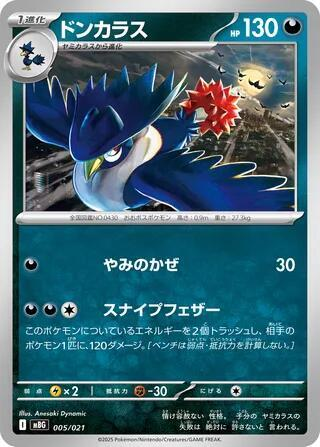</th>
  </tr>
  <tr><td><b>MBG: MEGA Starter Set Mega Gengar ex</b> <picture><source media="(prefers-color-scheme: dark)" srcset="./assets/sets-jp-dark/megagengar.png"></picture> 005/021</td></tr>
  <tr><td><b>Rarity</b>: -</td></tr>
  <tr><td><b>Type</b>:  Darkness</td></tr>
  <tr><td><b>HP</b>: 130</td></tr>
  <tr><td><b>Stage</b>: Stage 1</td></tr>
  <tr><td><b>Ability</b>: -</td></tr>
  <tr><td><b>Attack</b>: [Darkness] Wind of Darkness (30)</td></tr>
  <tr><td><b>Attack</b>: [Darkness][Darkness][Colorless] Snipe Feather - Discard 2 Energy from this Pokémon. This attack does 120 damage to 1 of your opponent&#x27;s Pokémon. (Don&#x27;t apply Weakness and Resistance for Benched Pokémon.)</td></tr>
  <tr><td><b>Weakness</b>:  Lightning ×2</td></tr>
  <tr><td><b>Resistance</b>:  Fighting -30</td></tr>
  <tr><td><b>Retreat</b>:  1</td></tr>
  <tr><td><b>Can I play it?</b>: ✗ No, Japanese cards are not allowed at tournaments here</td></tr>
  <tr><td><b>Category</b>: collection</td></tr>
</table>

<table>
  <tr><td colspan="2"><h3 id="hoothoot">Hoothoot <picture><source media="(prefers-color-scheme: dark)" srcset="./assets/rarities-dark/common.png"></picture></h3></td></tr>
  <tr>
    <th rowspan="13" width="400">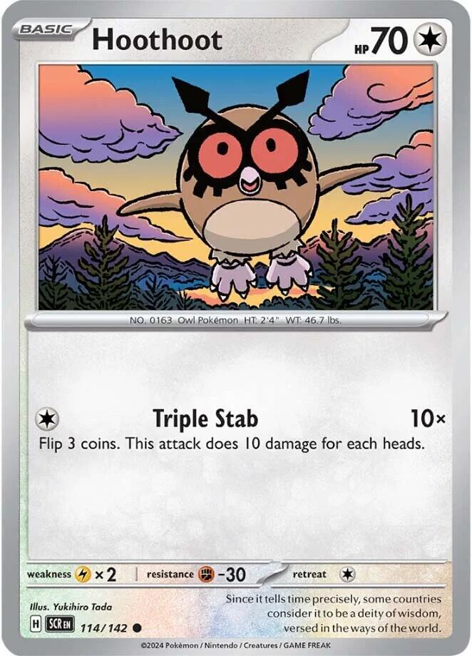</th>
  </tr>
  <tr><td><b>SV07: Stellar Crown</b> <picture><source media="(prefers-color-scheme: dark)" srcset="./assets/sets-dark/stellar-crown.png"></picture> 114/142</td></tr>
  <tr><td><b>Rarity</b>: <picture><source media="(prefers-color-scheme: dark)" srcset="./assets/rarities-dark/common.png"></picture> Common</td></tr>
  <tr><td><b>Type</b>:  Colorless</td></tr>
  <tr><td><b>HP</b>: 70</td></tr>
  <tr><td><b>Stage</b>: Basic</td></tr>
  <tr><td><b>Ability</b>: -</td></tr>
  <tr><td><b>Attack</b>: [C] Triple Stab (10x) - Flip 3 coins. This attack does 10 damage for each heads.</td></tr>
  <tr><td><b>Weakness</b>:  Lightning ×2</td></tr>
  <tr><td><b>Resistance</b>:  Fighting -30</td></tr>
  <tr><td><b>Retreat</b>:  1</td></tr>
  <tr><td><b>Can I play it?</b>: ✓ Yes, this card is allowed in tournaments</td></tr>
  <tr><td><b>Category</b>: collection</td></tr>
</table>

<table>
  <tr><td colspan="2"><h3 id="houndoom">Houndoom <picture><source media="(prefers-color-scheme: dark)" srcset="./assets/rarities-dark/common.png"></picture></h3></td></tr>
  <tr>
    <th rowspan="14" width="400">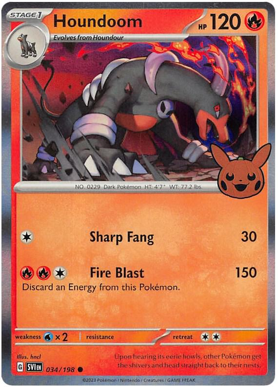</th>
  </tr>
  <tr><td><b>Trick or Trade BOOster Bundle 2023</b>  034/198</td></tr>
  <tr><td><b>Rarity</b>: <picture><source media="(prefers-color-scheme: dark)" srcset="./assets/rarities-dark/common.png"></picture> Common</td></tr>
  <tr><td><b>Type</b>:  Fire</td></tr>
  <tr><td><b>HP</b>: 120</td></tr>
  <tr><td><b>Stage</b>: Stage 1</td></tr>
  <tr><td><b>Ability</b>: -</td></tr>
  <tr><td><b>Attack</b>: [1] Sharp Fang (30)</td></tr>
  <tr><td><b>Attack</b>: [1RR] Fire Blast (150) - Discard a [R] Energy attached to this Pokémon.</td></tr>
  <tr><td><b>Weakness</b>:  Water ×2</td></tr>
  <tr><td><b>Resistance</b>: -</td></tr>
  <tr><td><b>Retreat</b>:  2</td></tr>
  <tr><td><b>Can I play it?</b>: ✗ No, this card is too old for tournaments now</td></tr>
  <tr><td><b>Category</b>: collection</td></tr>
</table>

<table>
  <tr><td colspan="2"><h3 id="iron-jugulis">Iron Jugulis <picture><source media="(prefers-color-scheme: dark)" srcset="./assets/rarities-dark/uncommon.png"></picture></h3></td></tr>
  <tr>
    <th rowspan="13" width="400">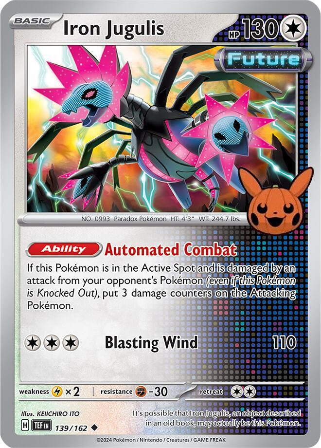</th>
  </tr>
  <tr><td><b>Trick or Trade BOOster Bundle 2024</b>  139/162</td></tr>
  <tr><td><b>Rarity</b>: <picture><source media="(prefers-color-scheme: dark)" srcset="./assets/rarities-dark/uncommon.png"></picture> Uncommon</td></tr>
  <tr><td><b>Type</b>:  Colorless</td></tr>
  <tr><td><b>HP</b>: 130</td></tr>
  <tr><td><b>Stage</b>: Basic</td></tr>
  <tr><td><b>Ability</b>: Auto Marshal If this Pokémon is in the Active Spot and is damaged by an attack from your opponent&#x27;s Pokémon (even if this Pokémon is Knocked Out), put 3 damage counters on the Attacking Pokémon.</td></tr>
  <tr><td><b>Attack</b>: [C][C][C] Blasting Wind (110)</td></tr>
  <tr><td><b>Weakness</b>:  Lightning ×2</td></tr>
  <tr><td><b>Resistance</b>:  Fighting -30</td></tr>
  <tr><td><b>Retreat</b>:  2</td></tr>
  <tr><td><b>Can I play it?</b>: ✗ No, this card is too old for tournaments now</td></tr>
  <tr><td><b>Category</b>: collection</td></tr>
</table>

<table>
  <tr><td colspan="2"><h3 id="koffing">Koffing <picture><source media="(prefers-color-scheme: dark)" srcset="./assets/rarities-dark/common.png"></picture></h3></td></tr>
  <tr>
    <th rowspan="14" width="400">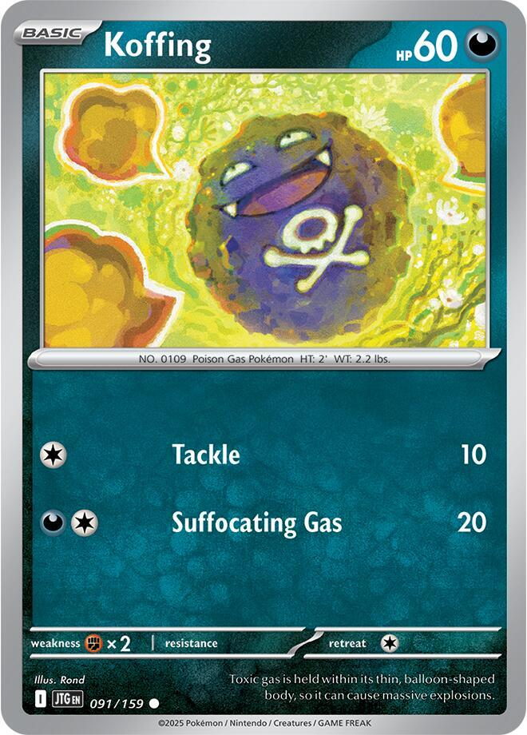</th>
  </tr>
  <tr><td><b>SV09: Journey Together</b> <picture><source media="(prefers-color-scheme: dark)" srcset="./assets/sets-dark/journey-together.png"></picture> 091/159</td></tr>
  <tr><td><b>Rarity</b>: <picture><source media="(prefers-color-scheme: dark)" srcset="./assets/rarities-dark/common.png"></picture> Common</td></tr>
  <tr><td><b>Type</b>:  Darkness</td></tr>
  <tr><td><b>HP</b>: 60</td></tr>
  <tr><td><b>Stage</b>: Basic</td></tr>
  <tr><td><b>Ability</b>: -</td></tr>
  <tr><td><b>Attack</b>: [1] Tackle (10)</td></tr>
  <tr><td><b>Attack</b>: [1D] Suffocating Gas (20)</td></tr>
  <tr><td><b>Weakness</b>:  Fighting ×2</td></tr>
  <tr><td><b>Resistance</b>: -</td></tr>
  <tr><td><b>Retreat</b>:  1</td></tr>
  <tr><td><b>Can I play it?</b>: ✓ Yes, this card is allowed in tournaments</td></tr>
  <tr><td><b>Category</b>: deck</td></tr>
</table>

<table>
  <tr><td colspan="2"><h3 id="koffing-1">Koffing <picture><source media="(prefers-color-scheme: dark)" srcset="./assets/rarities-dark/common.png"></picture></h3></td></tr>
  <tr>
    <th rowspan="13" width="400">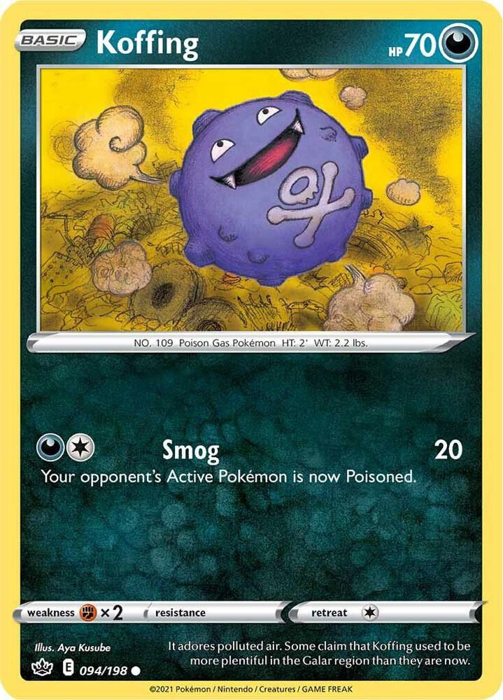</th>
  </tr>
  <tr><td><b>SWSH06: Chilling Reign</b> <picture><source media="(prefers-color-scheme: dark)" srcset="./assets/sets-dark/chilling-reign.png"></picture> 094/198</td></tr>
  <tr><td><b>Rarity</b>: <picture><source media="(prefers-color-scheme: dark)" srcset="./assets/rarities-dark/common.png"></picture> Common</td></tr>
  <tr><td><b>Type</b>:  Darkness</td></tr>
  <tr><td><b>HP</b>: 70</td></tr>
  <tr><td><b>Stage</b>: Basic</td></tr>
  <tr><td><b>Ability</b>: -</td></tr>
  <tr><td><b>Attack</b>: [1D] Smog (20) - Your opponent&#x27;s Active Pokémon is now Poisoned.</td></tr>
  <tr><td><b>Weakness</b>:  Fighting ×2</td></tr>
  <tr><td><b>Resistance</b>: -</td></tr>
  <tr><td><b>Retreat</b>:  1</td></tr>
  <tr><td><b>Can I play it?</b>: ✗ No, this card is too old for tournaments now</td></tr>
  <tr><td><b>Category</b>: collection</td></tr>
</table>

<table>
  <tr><td colspan="2"><h3 id="litwick">Litwick <picture><source media="(prefers-color-scheme: dark)" srcset="./assets/rarities-dark/promo.png"></picture></h3></td></tr>
  <tr>
    <th rowspan="13" width="400">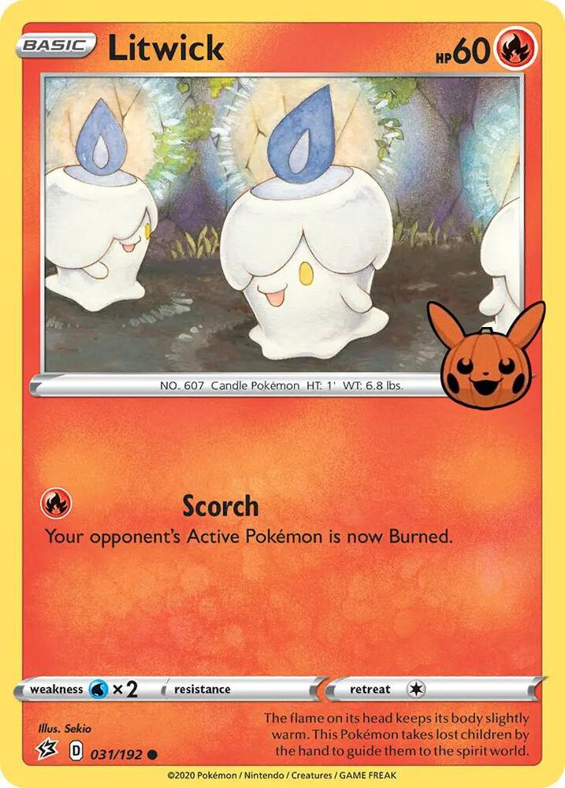</th>
  </tr>
  <tr><td><b>Trick or Trade BOOster Bundle</b>  031/192</td></tr>
  <tr><td><b>Rarity</b>: <picture><source media="(prefers-color-scheme: dark)" srcset="./assets/rarities-dark/promo.png"></picture> Promo</td></tr>
  <tr><td><b>Type</b>:  Fire</td></tr>
  <tr><td><b>HP</b>: 60</td></tr>
  <tr><td><b>Stage</b>: Basic</td></tr>
  <tr><td><b>Ability</b>: -</td></tr>
  <tr><td><b>Attack</b>: [R] Scorch - Your opponent&#x27;s Active Pokémon is now Burned.</td></tr>
  <tr><td><b>Weakness</b>:  Water ×2</td></tr>
  <tr><td><b>Resistance</b>: -</td></tr>
  <tr><td><b>Retreat</b>:  1</td></tr>
  <tr><td><b>Can I play it?</b>: ✗ No, this card is too old for tournaments now</td></tr>
  <tr><td><b>Category</b>: collection</td></tr>
</table>

<table>
  <tr><td colspan="2"><h3 id="mega-gengar-ex"> Mega Gengar ex <picture><source media="(prefers-color-scheme: dark)" srcset="./assets/rarities-dark/double-rare.png"></picture></h3></td></tr>
  <tr>
    <th rowspan="13" width="400">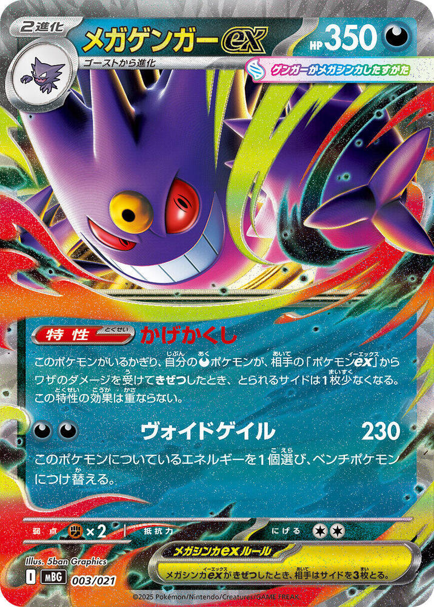</th>
  </tr>
  <tr><td><b>MBG: MEGA Starter Set Mega Gengar ex</b> <picture><source media="(prefers-color-scheme: dark)" srcset="./assets/sets-jp-dark/megagengar.png"></picture> 003/021</td></tr>
  <tr><td><b>Rarity</b>: <picture><source media="(prefers-color-scheme: dark)" srcset="./assets/rarities-dark/double-rare.png"></picture> Double Rare</td></tr>
  <tr><td><b>Type</b>:  Darkness</td></tr>
  <tr><td><b>HP</b>: 350</td></tr>
  <tr><td><b>Stage</b>: Mega ex</td></tr>
  <tr><td><b>Ability</b>: Concealed in Shadow Whenever any of your Darkness Pokémon is Knocked Out by damage from an attack from your opponent&#x27;s Pokémon ex, that player takes 1 fewer Prize card. The effect of Concealed in Shadow doesn&#x27;t stack.</td></tr>
  <tr><td><b>Attack</b>: [Darkness][Darkness] Void Gale (230) - Move an Energy from this Pokémon to 1 of your Benched Pokémon.</td></tr>
  <tr><td><b>Weakness</b>:  Fighting ×2</td></tr>
  <tr><td><b>Resistance</b>: -</td></tr>
  <tr><td><b>Retreat</b>:  2</td></tr>
  <tr><td><b>Can I play it?</b>: ✗ No, Japanese cards are not allowed at tournaments here</td></tr>
  <tr><td><b>Category</b>: collection</td></tr>
</table>

<table>
  <tr><td colspan="2"><h3 id="mew-v">Mew V </h3></td></tr>
  <tr>
    <th rowspan="14" width="400">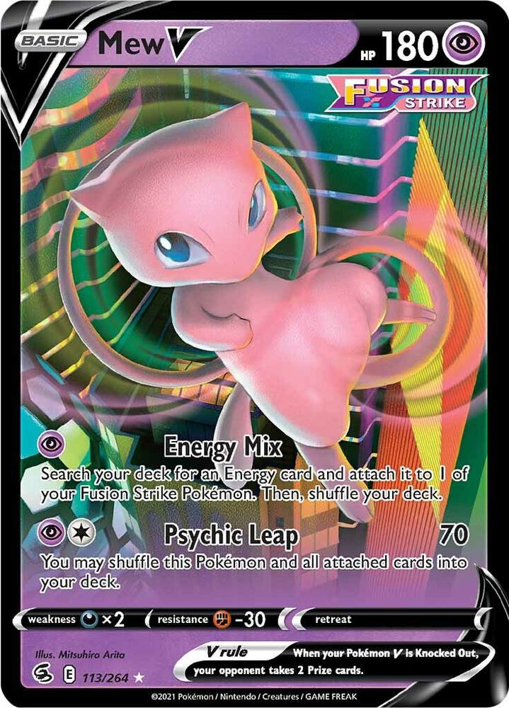</th>
  </tr>
  <tr><td><b>SWSH08: Fusion Strike</b> <picture><source media="(prefers-color-scheme: dark)" srcset="./assets/sets-dark/fusion-strike.png"></picture> 113/264</td></tr>
  <tr><td><b>Rarity</b>:  Ultra Rare</td></tr>
  <tr><td><b>Type</b>:  Psychic</td></tr>
  <tr><td><b>HP</b>: 180</td></tr>
  <tr><td><b>Stage</b>: Basic</td></tr>
  <tr><td><b>Ability</b>: -</td></tr>
  <tr><td><b>Attack</b>: [P] Energy Mix - Search your deck for an Energy card and attach it to 1 of your Fusion Strike Pokémon. Then, shuffle your deck.</td></tr>
  <tr><td><b>Attack</b>: [1P] Psychic Leap (70) - You may shuffle this Pokémon and all attached cards into your deck.</td></tr>
  <tr><td><b>Weakness</b>:  Darkness ×2</td></tr>
  <tr><td><b>Resistance</b>:  Fighting -30</td></tr>
  <tr><td><b>Retreat</b>: 0</td></tr>
  <tr><td><b>Can I play it?</b>: ✗ No, this card is too old for tournaments now</td></tr>
  <tr><td><b>Category</b>: collection</td></tr>
</table>

<table>
  <tr><td colspan="2"><h3 id="murkrow">Murkrow</h3></td></tr>
  <tr>
    <th rowspan="13" width="400">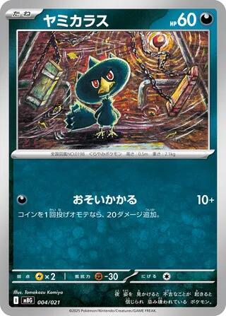</th>
  </tr>
  <tr><td><b>MBG: MEGA Starter Set Mega Gengar ex</b> <picture><source media="(prefers-color-scheme: dark)" srcset="./assets/sets-jp-dark/megagengar.png"></picture> 004/021</td></tr>
  <tr><td><b>Rarity</b>: -</td></tr>
  <tr><td><b>Type</b>:  Darkness</td></tr>
  <tr><td><b>HP</b>: 60</td></tr>
  <tr><td><b>Stage</b>: Basic</td></tr>
  <tr><td><b>Ability</b>: -</td></tr>
  <tr><td><b>Attack</b>: [Darkness] Ambush (10+) - Flip a coin. If heads, this attack does 20 more damage.</td></tr>
  <tr><td><b>Weakness</b>:  Lightning ×2</td></tr>
  <tr><td><b>Resistance</b>:  Fighting -30</td></tr>
  <tr><td><b>Retreat</b>:  1</td></tr>
  <tr><td><b>Can I play it?</b>: ✗ No, Japanese cards are not allowed at tournaments here</td></tr>
  <tr><td><b>Category</b>: collection</td></tr>
</table>

<table>
  <tr><td colspan="2"><h3 id="noctowl">Noctowl <picture><source media="(prefers-color-scheme: dark)" srcset="./assets/rarities-dark/rare.png"></picture></h3></td></tr>
  <tr>
    <th rowspan="13" width="400">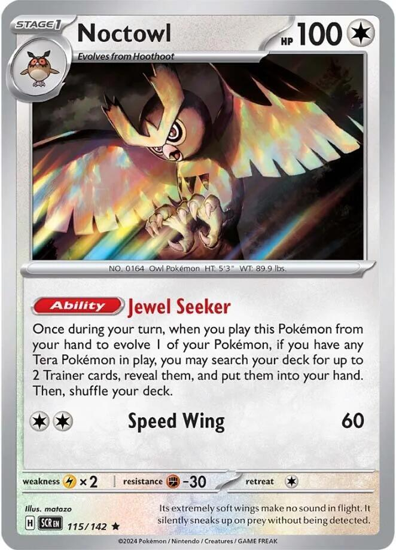</th>
  </tr>
  <tr><td><b>SV07: Stellar Crown</b> <picture><source media="(prefers-color-scheme: dark)" srcset="./assets/sets-dark/stellar-crown.png"></picture> 115/142</td></tr>
  <tr><td><b>Rarity</b>: <picture><source media="(prefers-color-scheme: dark)" srcset="./assets/rarities-dark/rare.png"></picture> Rare</td></tr>
  <tr><td><b>Type</b>:  Colorless</td></tr>
  <tr><td><b>HP</b>: 100</td></tr>
  <tr><td><b>Stage</b>: Stage 1</td></tr>
  <tr><td><b>Ability</b>: Jewel Seeker Once during your turn, when you play this Pokémon from your hand to evolve 1 of your Pokémon, if you have any Tera Pokémon in play, you may search your deck for up to 2 Trainer cards, reveal them, and put them into your hand. Then, shuffle your deck.</td></tr>
  <tr><td><b>Attack</b>: [CC] Speed Wing (60)</td></tr>
  <tr><td><b>Weakness</b>:  Lightning ×2</td></tr>
  <tr><td><b>Resistance</b>:  Fighting -30</td></tr>
  <tr><td><b>Retreat</b>:  1</td></tr>
  <tr><td><b>Can I play it?</b>: ✓ Yes, this card is allowed in tournaments</td></tr>
  <tr><td><b>Category</b>: collection</td></tr>
</table>

<table>
  <tr><td colspan="2"><h3 id="okidogi-cosmos-holo">Okidogi (Cosmos Holo) <picture><source media="(prefers-color-scheme: dark)" srcset="./assets/rarities-dark/rare.png"></picture></h3></td></tr>
  <tr>
    <th rowspan="13" width="400">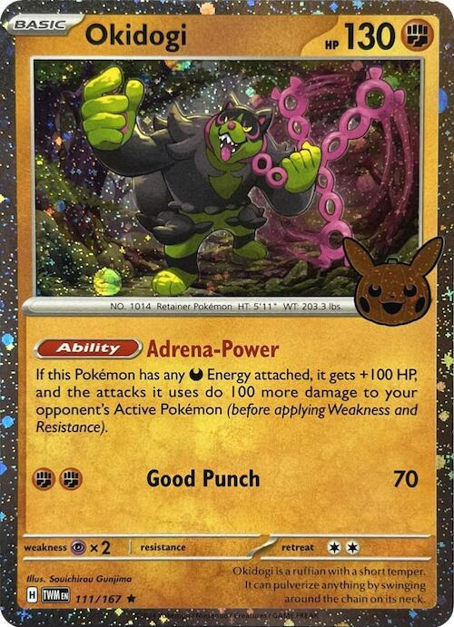</th>
  </tr>
  <tr><td><b>Trick or Trade BOOster Bundle 2024</b>  111/167</td></tr>
  <tr><td><b>Rarity</b>: <picture><source media="(prefers-color-scheme: dark)" srcset="./assets/rarities-dark/rare.png"></picture> Holo Rare</td></tr>
  <tr><td><b>Type</b>:  Fighting</td></tr>
  <tr><td><b>HP</b>: 130</td></tr>
  <tr><td><b>Stage</b>: Basic</td></tr>
  <tr><td><b>Ability</b>: Adrena-Power If this Pokémon has any Darkness Energy attached, it gets +100 HP, and the attacks it uses do 100 more damage to your opponent&#x27;s Active Pokémon (before applying Weakness and Resistance).</td></tr>
  <tr><td><b>Attack</b>: [FF] Good Punch (70)</td></tr>
  <tr><td><b>Weakness</b>:  Psychic ×2</td></tr>
  <tr><td><b>Resistance</b>: -</td></tr>
  <tr><td><b>Retreat</b>:  2</td></tr>
  <tr><td><b>Can I play it?</b>: ✗ No, this card is too old for tournaments now</td></tr>
  <tr><td><b>Category</b>: collection</td></tr>
</table>

<table>
  <tr><td colspan="2"><h3 id="pumpkaboo">Pumpkaboo <picture><source media="(prefers-color-scheme: dark)" srcset="./assets/rarities-dark/common.png"></picture></h3></td></tr>
  <tr>
    <th rowspan="13" width="400">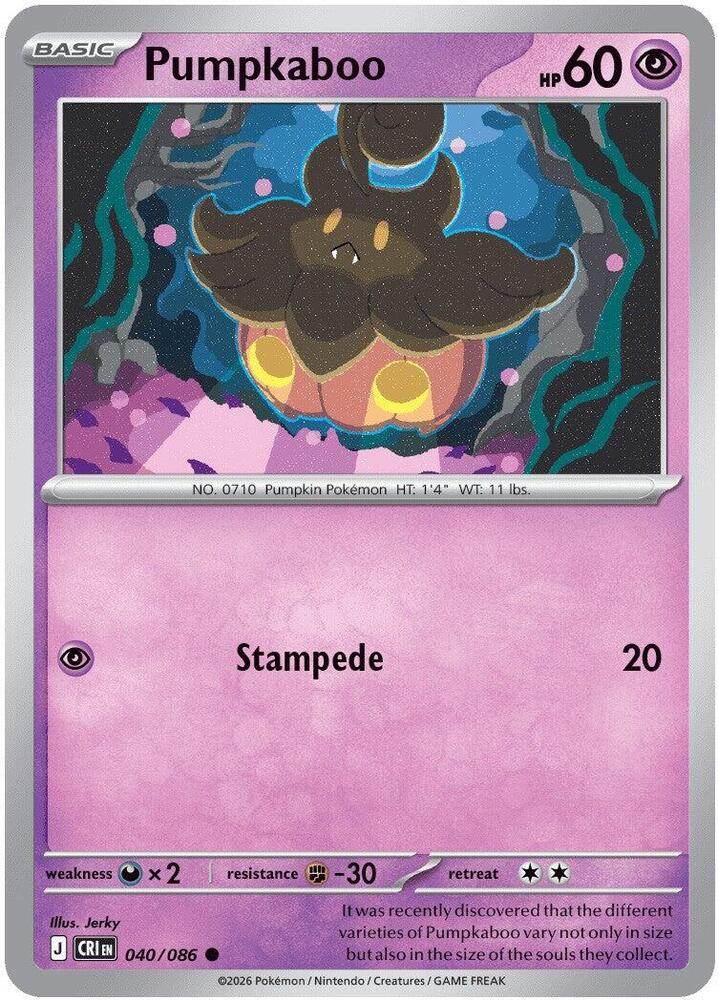</th>
  </tr>
  <tr><td><b>ME04: Chaos Rising</b> <picture><source media="(prefers-color-scheme: dark)" srcset="./assets/sets-dark/chaos-rising.png"></picture> 040/086</td></tr>
  <tr><td><b>Rarity</b>: <picture><source media="(prefers-color-scheme: dark)" srcset="./assets/rarities-dark/common.png"></picture> Common</td></tr>
  <tr><td><b>Type</b>:  Psychic</td></tr>
  <tr><td><b>HP</b>: 60</td></tr>
  <tr><td><b>Stage</b>: Basic</td></tr>
  <tr><td><b>Ability</b>: -</td></tr>
  <tr><td><b>Attack</b>: [P] Stampede (20)</td></tr>
  <tr><td><b>Weakness</b>:  Darkness ×2</td></tr>
  <tr><td><b>Resistance</b>:  Fighting -30</td></tr>
  <tr><td><b>Retreat</b>:  2</td></tr>
  <tr><td><b>Can I play it?</b>: ✓ Yes, this card is allowed in tournaments</td></tr>
  <tr><td><b>Category</b>: collection</td></tr>
</table>

<table>
  <tr><td colspan="2"><h3 id="pumpkaboo-1">Pumpkaboo <picture><source media="(prefers-color-scheme: dark)" srcset="./assets/rarities-dark/common.png"></picture></h3></td></tr>
  <tr>
    <th rowspan="13" width="400">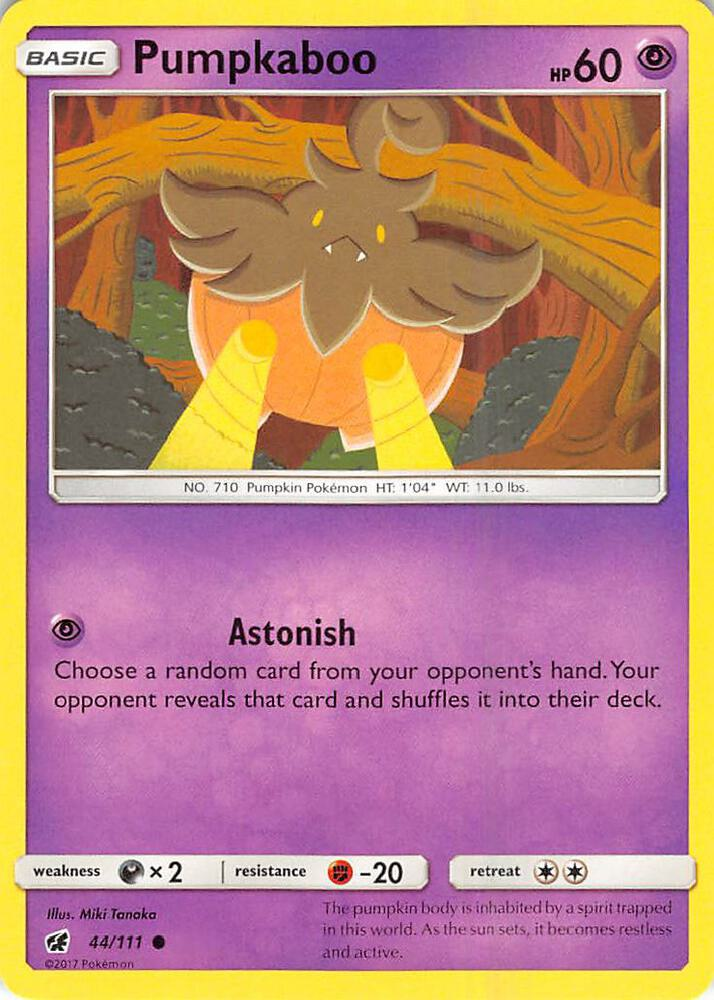</th>
  </tr>
  <tr><td><b>SM - Crimson Invasion</b> <picture><source media="(prefers-color-scheme: dark)" srcset="./assets/sets-dark/crimson-invasion.png"></picture> 44/111</td></tr>
  <tr><td><b>Rarity</b>: <picture><source media="(prefers-color-scheme: dark)" srcset="./assets/rarities-dark/common.png"></picture> Common</td></tr>
  <tr><td><b>Type</b>:  Psychic</td></tr>
  <tr><td><b>HP</b>: 60</td></tr>
  <tr><td><b>Stage</b>: Basic</td></tr>
  <tr><td><b>Ability</b>: -</td></tr>
  <tr><td><b>Attack</b>: [P] Astonish - Choose a random card from your opponent&#x27;s hand. Your opponent reveals that card and shuffles it into their deck.</td></tr>
  <tr><td><b>Weakness</b>:  Darkness ×2</td></tr>
  <tr><td><b>Resistance</b>:  Fighting -20</td></tr>
  <tr><td><b>Retreat</b>:  2</td></tr>
  <tr><td><b>Can I play it?</b>: ✗ No, this card is too old for tournaments now</td></tr>
  <tr><td><b>Category</b>: collection</td></tr>
</table>

<table>
  <tr><td colspan="2"><h3 id="pumpkaboo-2">Pumpkaboo <picture><source media="(prefers-color-scheme: dark)" srcset="./assets/rarities-dark/common.png"></picture></h3></td></tr>
  <tr>
    <th rowspan="14" width="400">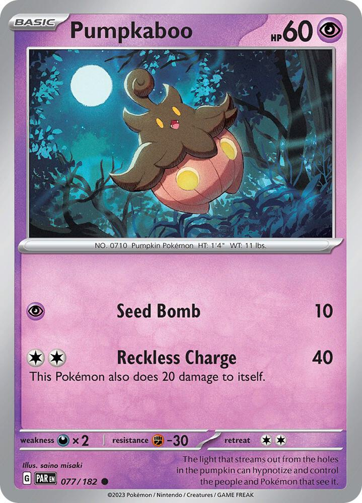</th>
  </tr>
  <tr><td><b>SV04: Paradox Rift</b> <picture><source media="(prefers-color-scheme: dark)" srcset="./assets/sets-dark/paradox-rift.png"></picture> 077/182</td></tr>
  <tr><td><b>Rarity</b>: <picture><source media="(prefers-color-scheme: dark)" srcset="./assets/rarities-dark/common.png"></picture> Common</td></tr>
  <tr><td><b>Type</b>:  Psychic</td></tr>
  <tr><td><b>HP</b>: 60</td></tr>
  <tr><td><b>Stage</b>: Basic</td></tr>
  <tr><td><b>Ability</b>: -</td></tr>
  <tr><td><b>Attack</b>: [P] Seed Bomb (10)</td></tr>
  <tr><td><b>Attack</b>: [2] Reckless Charge (40) - This Pokémon also does 20 damage to itself.</td></tr>
  <tr><td><b>Weakness</b>:  Darkness ×2</td></tr>
  <tr><td><b>Resistance</b>:  Fighting -30</td></tr>
  <tr><td><b>Retreat</b>:  2</td></tr>
  <tr><td><b>Can I play it?</b>: ✗ No, this card is too old for tournaments now</td></tr>
  <tr><td><b>Category</b>: collection</td></tr>
</table>

<table>
  <tr><td colspan="2"><h3 id="sableye">Sableye</h3></td></tr>
  <tr>
    <th rowspan="13" width="400">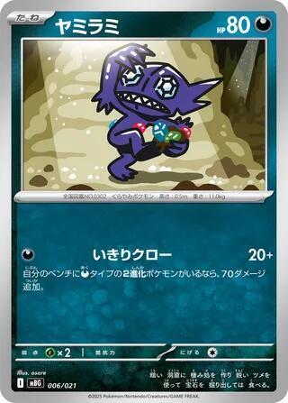</th>
  </tr>
  <tr><td><b>MBG: MEGA Starter Set Mega Gengar ex</b> <picture><source media="(prefers-color-scheme: dark)" srcset="./assets/sets-jp-dark/megagengar.png"></picture> 006/021</td></tr>
  <tr><td><b>Rarity</b>: -</td></tr>
  <tr><td><b>Type</b>:  Darkness</td></tr>
  <tr><td><b>HP</b>: 80</td></tr>
  <tr><td><b>Stage</b>: Basic</td></tr>
  <tr><td><b>Ability</b>: -</td></tr>
  <tr><td><b>Attack</b>: [Darkness] Arrogant Claw (20+) - If you have any Stage 2 Darkness Pokémon on your Bench, this attack does 70 more damage.</td></tr>
  <tr><td><b>Weakness</b>:  Grass ×2</td></tr>
  <tr><td><b>Resistance</b>: -</td></tr>
  <tr><td><b>Retreat</b>:  1</td></tr>
  <tr><td><b>Can I play it?</b>: ✗ No, Japanese cards are not allowed at tournaments here</td></tr>
  <tr><td><b>Category</b>: collection</td></tr>
</table>

<table>
  <tr><td colspan="2"><h3 id="sinistcha-cosmos-holo">Sinistcha (Cosmos Holo) <picture><source media="(prefers-color-scheme: dark)" srcset="./assets/rarities-dark/rare.png"></picture></h3></td></tr>
  <tr>
    <th rowspan="14" width="400">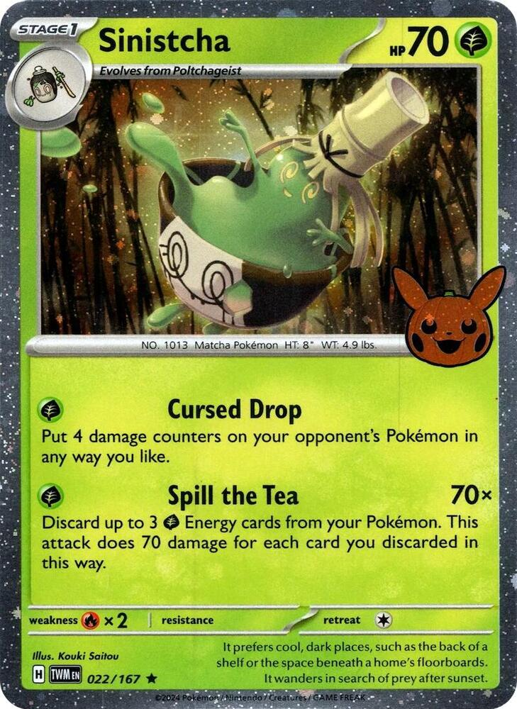</th>
  </tr>
  <tr><td><b>Trick or Trade BOOster Bundle 2024</b>  022/167</td></tr>
  <tr><td><b>Rarity</b>: <picture><source media="(prefers-color-scheme: dark)" srcset="./assets/rarities-dark/rare.png"></picture> Holo Rare</td></tr>
  <tr><td><b>Type</b>:  Grass</td></tr>
  <tr><td><b>HP</b>: 70</td></tr>
  <tr><td><b>Stage</b>: Stage 1</td></tr>
  <tr><td><b>Ability</b>: -</td></tr>
  <tr><td><b>Attack</b>: [G] Cursed Drop Put 4 damage counters on your opponent&#x27;s Pokémon in any way you like.</td></tr>
  <tr><td><b>Attack</b>: [G] Spi[LL] the Tea (70x) Discard up to 3 G Energy cards from your Pokémon. This attack does 70 damage for each card you discarded this way.</td></tr>
  <tr><td><b>Weakness</b>:  Fire ×2</td></tr>
  <tr><td><b>Resistance</b>: -</td></tr>
  <tr><td><b>Retreat</b>:  1</td></tr>
  <tr><td><b>Can I play it?</b>: ✗ No, this card is too old for tournaments now</td></tr>
  <tr><td><b>Category</b>: collection</td></tr>
</table>

<table>
  <tr><td colspan="2"><h3 id="spiritomb">Spiritomb <picture><source media="(prefers-color-scheme: dark)" srcset="./assets/rarities-dark/rare.png"></picture></h3></td></tr>
  <tr>
    <th rowspan="14" width="400">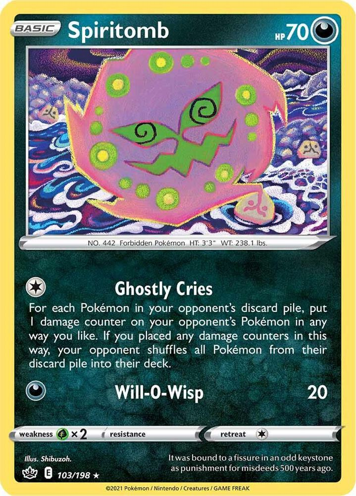</th>
  </tr>
  <tr><td><b>SWSH06: Chilling Reign</b> <picture><source media="(prefers-color-scheme: dark)" srcset="./assets/sets-dark/chilling-reign.png"></picture> 103/198</td></tr>
  <tr><td><b>Rarity</b>: <picture><source media="(prefers-color-scheme: dark)" srcset="./assets/rarities-dark/rare.png"></picture> Rare</td></tr>
  <tr><td><b>Type</b>:  Darkness</td></tr>
  <tr><td><b>HP</b>: 70</td></tr>
  <tr><td><b>Stage</b>: Basic</td></tr>
  <tr><td><b>Ability</b>: -</td></tr>
  <tr><td><b>Attack</b>: [1] Ghostly Cries - For each Pokémon in your opponent&#x27;s discard pile, put 1 damage counter on your opponent&#x27;s Pokémon in any way you like. If you placed any damage counters in this way, your opponent shuffles all Pokémon from their discard pile into their deck.</td></tr>
  <tr><td><b>Attack</b>: [D] Will-O-Wisp (20)</td></tr>
  <tr><td><b>Weakness</b>:  Grass ×2</td></tr>
  <tr><td><b>Resistance</b>: -</td></tr>
  <tr><td><b>Retreat</b>:  1</td></tr>
  <tr><td><b>Can I play it?</b>: ✗ No, this card is too old for tournaments now</td></tr>
  <tr><td><b>Category</b>: collection</td></tr>
</table>

<table>
  <tr><td colspan="2"><h3 id="sudowoodo">Sudowoodo <picture><source media="(prefers-color-scheme: dark)" srcset="./assets/rarities-dark/uncommon.png"></picture></h3></td></tr>
  <tr>
    <th rowspan="14" width="400">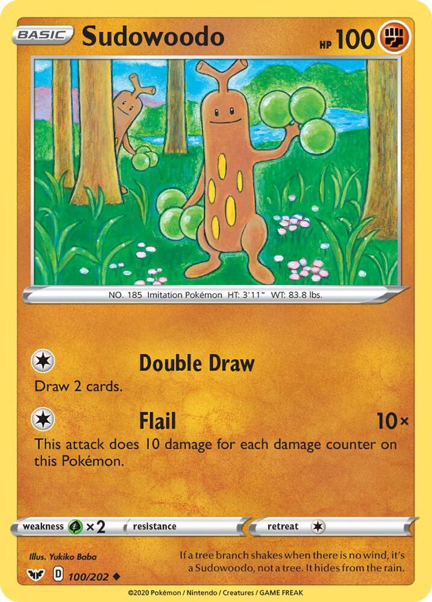</th>
  </tr>
  <tr><td><b>SWSH01: Sword &amp; Shield Base Set</b> <picture><source media="(prefers-color-scheme: dark)" srcset="./assets/sets-dark/sword-and-shield.png"></picture> 100/202</td></tr>
  <tr><td><b>Rarity</b>: <picture><source media="(prefers-color-scheme: dark)" srcset="./assets/rarities-dark/uncommon.png"></picture> Uncommon</td></tr>
  <tr><td><b>Type</b>:  Fighting</td></tr>
  <tr><td><b>HP</b>: 100</td></tr>
  <tr><td><b>Stage</b>: Basic</td></tr>
  <tr><td><b>Ability</b>: -</td></tr>
  <tr><td><b>Attack</b>: [1] Double Draw - Draw 2 cards.</td></tr>
  <tr><td><b>Attack</b>: [1] Flail (10x) - This attack does 10 damage for each damage counter on this Pokémon.</td></tr>
  <tr><td><b>Weakness</b>:  Grass ×2</td></tr>
  <tr><td><b>Resistance</b>: -</td></tr>
  <tr><td><b>Retreat</b>:  1</td></tr>
  <tr><td><b>Can I play it?</b>: ✗ No, this card is too old for tournaments now</td></tr>
  <tr><td><b>Category</b>: deck</td></tr>
</table>

<table>
  <tr><td colspan="2"><h3 id="tatsugiri">Tatsugiri</h3></td></tr>
  <tr>
    <th rowspan="13" width="400">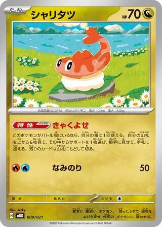</th>
  </tr>
  <tr><td><b>MBG: MEGA Starter Set Mega Gengar ex</b> <picture><source media="(prefers-color-scheme: dark)" srcset="./assets/sets-jp-dark/megagengar.png"></picture> 009/021</td></tr>
  <tr><td><b>Rarity</b>: -</td></tr>
  <tr><td><b>Type</b>:  Dragon</td></tr>
  <tr><td><b>HP</b>: 70</td></tr>
  <tr><td><b>Stage</b>: Basic</td></tr>
  <tr><td><b>Ability</b>: Attract Customers Once during your turn, if this Pokémon is in the Active Spot, you may look at the top 6 cards of your deck, reveal a Supporter card you find there, and put it into your hand. Shuffle the other cards back into your deck.</td></tr>
  <tr><td><b>Attack</b>: [Fire][Water] Surf (50)</td></tr>
  <tr><td><b>Weakness</b>: -</td></tr>
  <tr><td><b>Resistance</b>: -</td></tr>
  <tr><td><b>Retreat</b>:  1</td></tr>
  <tr><td><b>Can I play it?</b>: ✗ No, Japanese cards are not allowed at tournaments here</td></tr>
  <tr><td><b>Category</b>: collection</td></tr>
</table>

<table>
  <tr><td colspan="2"><h3 id="team-rockets-koffing">Team Rocket&#x27;s Koffing <picture><source media="(prefers-color-scheme: dark)" srcset="./assets/rarities-dark/common.png"></picture></h3></td></tr>
  <tr>
    <th rowspan="13" width="400">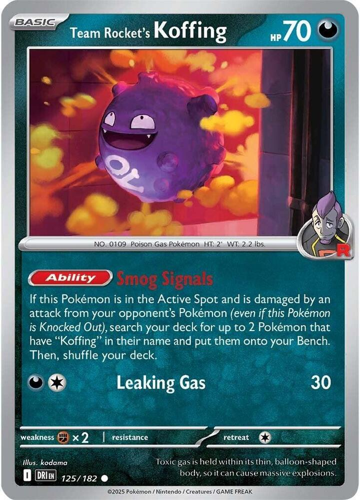</th>
  </tr>
  <tr><td><b>SV10: Destined Rivals</b> <picture><source media="(prefers-color-scheme: dark)" srcset="./assets/sets-dark/destined-rivals.png"></picture> 125/182</td></tr>
  <tr><td><b>Rarity</b>: <picture><source media="(prefers-color-scheme: dark)" srcset="./assets/rarities-dark/common.png"></picture> Common</td></tr>
  <tr><td><b>Type</b>:  Darkness</td></tr>
  <tr><td><b>HP</b>: 70</td></tr>
  <tr><td><b>Stage</b>: Basic</td></tr>
  <tr><td><b>Ability</b>: Smog Signals If this Pokémon is in the Active Spot and is damaged by an attack from your opponent&#x27;s Pokémon (even if this Pokémon is Knocked Out), search your deck for up to 2 Pokémon that have &quot;Koffing&quot; in their name and put them onto your Bench. Then, shuffle your deck.</td></tr>
  <tr><td><b>Attack</b>: [DC] Leaking Gas (30)</td></tr>
  <tr><td><b>Weakness</b>:  Fighting ×2</td></tr>
  <tr><td><b>Resistance</b>: -</td></tr>
  <tr><td><b>Retreat</b>:  1</td></tr>
  <tr><td><b>Can I play it?</b>: ✓ Yes, this card is allowed in tournaments</td></tr>
  <tr><td><b>Category</b>: collection</td></tr>
</table>

<table>
  <tr><td colspan="2"><h3 id="team-rockets-weezing">Team Rocket&#x27;s Weezing <picture><source media="(prefers-color-scheme: dark)" srcset="./assets/rarities-dark/uncommon.png"></picture></h3></td></tr>
  <tr>
    <th rowspan="13" width="400">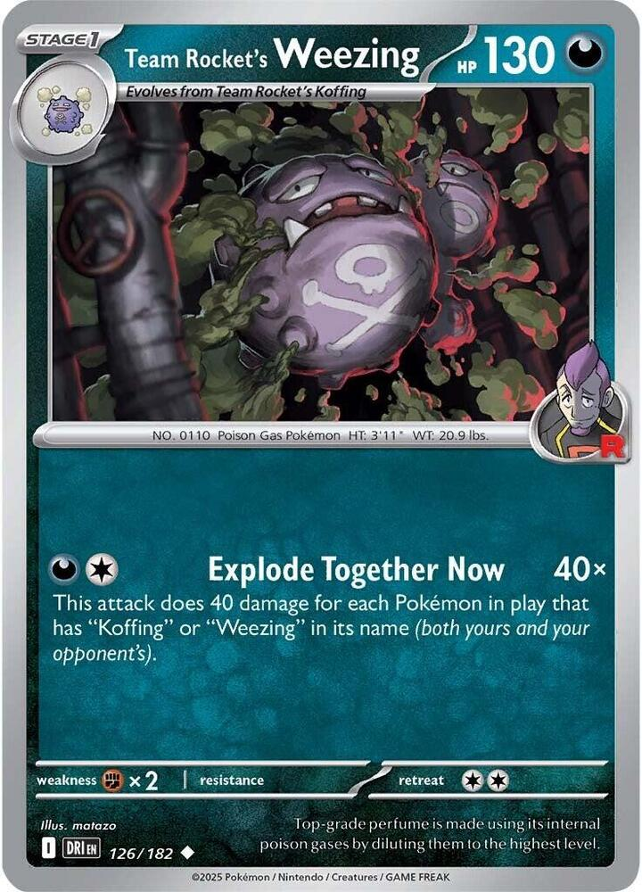</th>
  </tr>
  <tr><td><b>SV10: Destined Rivals</b> <picture><source media="(prefers-color-scheme: dark)" srcset="./assets/sets-dark/destined-rivals.png"></picture> 126/182</td></tr>
  <tr><td><b>Rarity</b>: <picture><source media="(prefers-color-scheme: dark)" srcset="./assets/rarities-dark/uncommon.png"></picture> Uncommon</td></tr>
  <tr><td><b>Type</b>:  Darkness</td></tr>
  <tr><td><b>HP</b>: 130</td></tr>
  <tr><td><b>Stage</b>: Stage 1</td></tr>
  <tr><td><b>Ability</b>: -</td></tr>
  <tr><td><b>Attack</b>: [DC] Explode Together Now (40x) - This attack does 40 damage for each Pokémon in play that has &quot;Koffing&quot; or &quot;Weezing&quot; in its name (both yours and your opponent&#x27;s).</td></tr>
  <tr><td><b>Weakness</b>:  Fighting ×2</td></tr>
  <tr><td><b>Resistance</b>: -</td></tr>
  <tr><td><b>Retreat</b>:  2</td></tr>
  <tr><td><b>Can I play it?</b>: ✓ Yes, this card is allowed in tournaments</td></tr>
  <tr><td><b>Category</b>: collection</td></tr>
</table>

<table>
  <tr><td colspan="2"><h3 id="trevenant">Trevenant <picture><source media="(prefers-color-scheme: dark)" srcset="./assets/rarities-dark/rare.png"></picture></h3></td></tr>
  <tr>
    <th rowspan="13" width="400">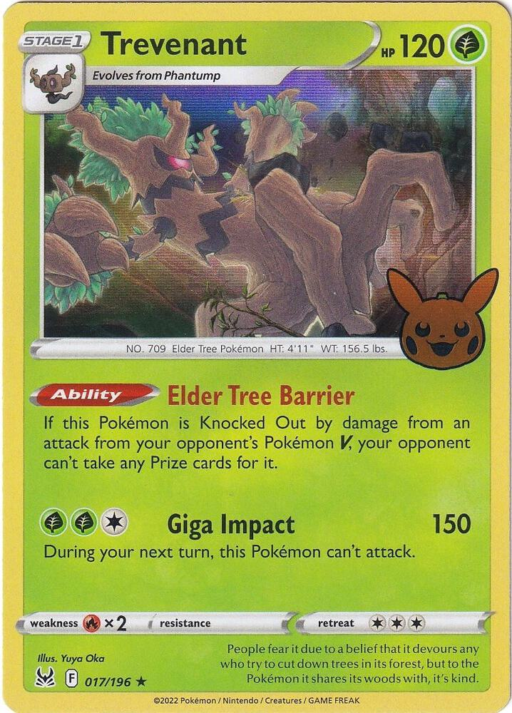</th>
  </tr>
  <tr><td><b>Trick or Trade BOOster Bundle 2023</b>  017/196</td></tr>
  <tr><td><b>Rarity</b>: <picture><source media="(prefers-color-scheme: dark)" srcset="./assets/rarities-dark/rare.png"></picture> Holo Rare</td></tr>
  <tr><td><b>Type</b>:  Grass</td></tr>
  <tr><td><b>HP</b>: 120</td></tr>
  <tr><td><b>Stage</b>: Stage 1</td></tr>
  <tr><td><b>Ability</b>: Elder Tree Barrier If this Pokémon is Knocked Out by damage from an attack from your opponent&#x27;s Pokémon V, your opponent can&#x27;t take any Prize cards for it.</td></tr>
  <tr><td><b>Attack</b>: [1GG] Giga Impact (150) - During your next turn, this Pokémon can&#x27;t attack.</td></tr>
  <tr><td><b>Weakness</b>:  Fire ×2</td></tr>
  <tr><td><b>Resistance</b>: -</td></tr>
  <tr><td><b>Retreat</b>:  3</td></tr>
  <tr><td><b>Can I play it?</b>: ✗ No, this card is too old for tournaments now</td></tr>
  <tr><td><b>Category</b>: collection</td></tr>
</table>

<table>
  <tr><td colspan="2"><h3 id="weezing">Weezing <picture><source media="(prefers-color-scheme: dark)" srcset="./assets/rarities-dark/rare.png"></picture></h3></td></tr>
  <tr>
    <th rowspan="13" width="400">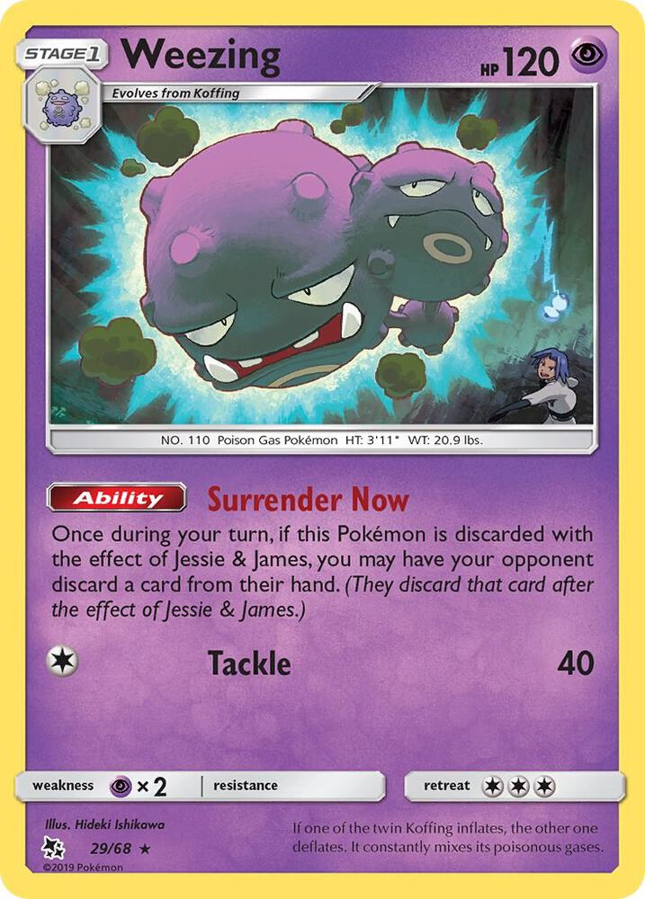</th>
  </tr>
  <tr><td><b>Hidden Fates</b> <picture><source media="(prefers-color-scheme: dark)" srcset="./assets/sets-dark/hidden-fates.png"></picture> 29/68</td></tr>
  <tr><td><b>Rarity</b>: <picture><source media="(prefers-color-scheme: dark)" srcset="./assets/rarities-dark/rare.png"></picture> Rare</td></tr>
  <tr><td><b>Type</b>:  Psychic</td></tr>
  <tr><td><b>HP</b>: 120</td></tr>
  <tr><td><b>Stage</b>: Stage 1</td></tr>
  <tr><td><b>Ability</b>: Surrender Now Once during your turn, if this Pokémon is discarded with the effect of Jessie &amp; James, you may have your opponent discard a card from their hand. (They discard that card after the effect of Jessie &amp; James.)</td></tr>
  <tr><td><b>Attack</b>: [1] Tackle (40)</td></tr>
  <tr><td><b>Weakness</b>:  Psychic ×2</td></tr>
  <tr><td><b>Resistance</b>: -</td></tr>
  <tr><td><b>Retreat</b>:  3</td></tr>
  <tr><td><b>Can I play it?</b>: ✗ No, this card is too old for tournaments now</td></tr>
  <tr><td><b>Category</b>: collection</td></tr>
</table>

<table>
  <tr><td colspan="2"><h3 id="weezing-1">Weezing <picture><source media="(prefers-color-scheme: dark)" srcset="./assets/rarities-dark/uncommon.png"></picture></h3></td></tr>
  <tr>
    <th rowspan="14" width="400">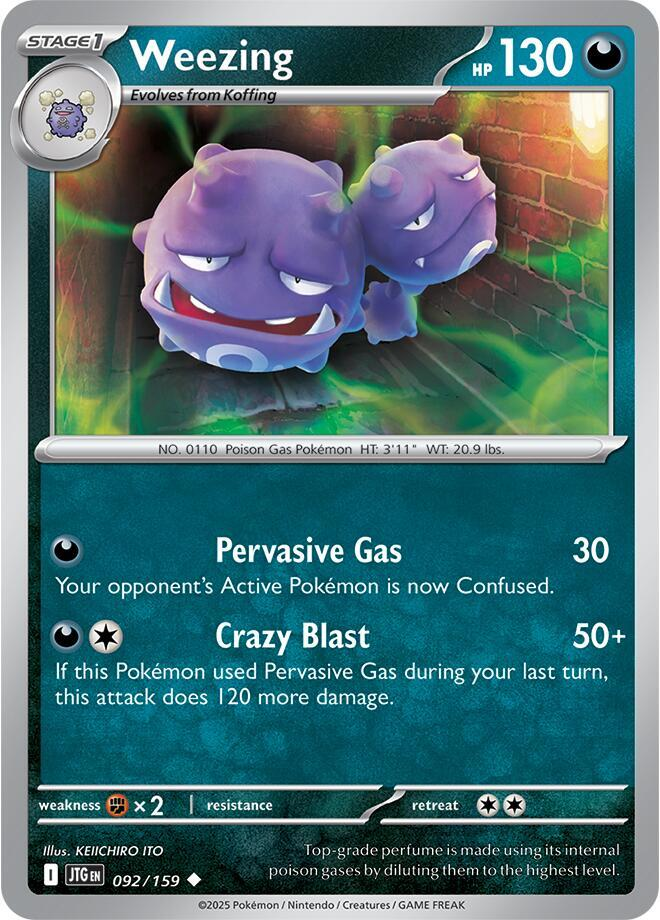</th>
  </tr>
  <tr><td><b>SV09: Journey Together</b> <picture><source media="(prefers-color-scheme: dark)" srcset="./assets/sets-dark/journey-together.png"></picture> 092/159</td></tr>
  <tr><td><b>Rarity</b>: <picture><source media="(prefers-color-scheme: dark)" srcset="./assets/rarities-dark/uncommon.png"></picture> Uncommon</td></tr>
  <tr><td><b>Type</b>:  Darkness</td></tr>
  <tr><td><b>HP</b>: 130</td></tr>
  <tr><td><b>Stage</b>: Stage 1</td></tr>
  <tr><td><b>Ability</b>: -</td></tr>
  <tr><td><b>Attack</b>: [D] Pervasive Gas (30) - Your opponent’s Active Pokémon is now Confused.</td></tr>
  <tr><td><b>Attack</b>: [1D] Crazy Blast (50+) - If this Pokémon used Pervasive Gas during your last turn, this attack does 120 more damage.</td></tr>
  <tr><td><b>Weakness</b>:  Fighting ×2</td></tr>
  <tr><td><b>Resistance</b>: -</td></tr>
  <tr><td><b>Retreat</b>:  2</td></tr>
  <tr><td><b>Can I play it?</b>: ✓ Yes, this card is allowed in tournaments</td></tr>
  <tr><td><b>Category</b>: deck</td></tr>
</table>

<table>
  <tr><td colspan="2"><h3 id="weezing-2">Weezing <picture><source media="(prefers-color-scheme: dark)" srcset="./assets/rarities-dark/rare.png"></picture></h3></td></tr>
  <tr>
    <th rowspan="13" width="400">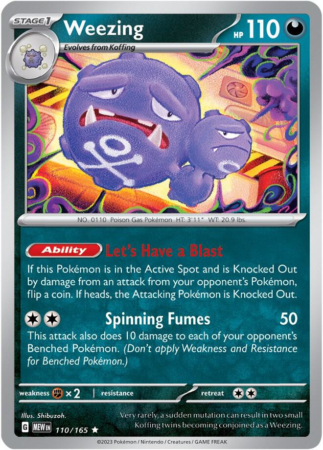</th>
  </tr>
  <tr><td><b>SV: Scarlet &amp; Violet 151</b> <picture><source media="(prefers-color-scheme: dark)" srcset="./assets/sets-dark/151.png"></picture> 110/165</td></tr>
  <tr><td><b>Rarity</b>: <picture><source media="(prefers-color-scheme: dark)" srcset="./assets/rarities-dark/rare.png"></picture> Rare</td></tr>
  <tr><td><b>Type</b>:  Darkness</td></tr>
  <tr><td><b>HP</b>: 110</td></tr>
  <tr><td><b>Stage</b>: Stage 1</td></tr>
  <tr><td><b>Ability</b>: Let&#x27;s Have a Blast If this Pokémon is in the Active Spot and is Knocked Out by damage from an attack from your opponent&#x27;s Pokémon, flip a coin. If heads, the Attacking Pokémon is Knocked Out.</td></tr>
  <tr><td><b>Attack</b>: [2] Spinning Fumes (50) - This attack also does 10 damage to each of your opponent&#x27;s Benched Pokémon. (Don&#x27;t apply Weakness and Resistance for Benched Pokémon.)</td></tr>
  <tr><td><b>Weakness</b>:  Fighting ×2</td></tr>
  <tr><td><b>Resistance</b>: -</td></tr>
  <tr><td><b>Retreat</b>:  2</td></tr>
  <tr><td><b>Can I play it?</b>: ✗ No, this card is too old for tournaments now</td></tr>
  <tr><td><b>Category</b>: collection</td></tr>
</table>

<table>
  <tr><td colspan="2"><h3 id="weezing-3">Weezing <picture><source media="(prefers-color-scheme: dark)" srcset="./assets/rarities-dark/uncommon.png"></picture></h3></td></tr>
  <tr>
    <th rowspan="14" width="400">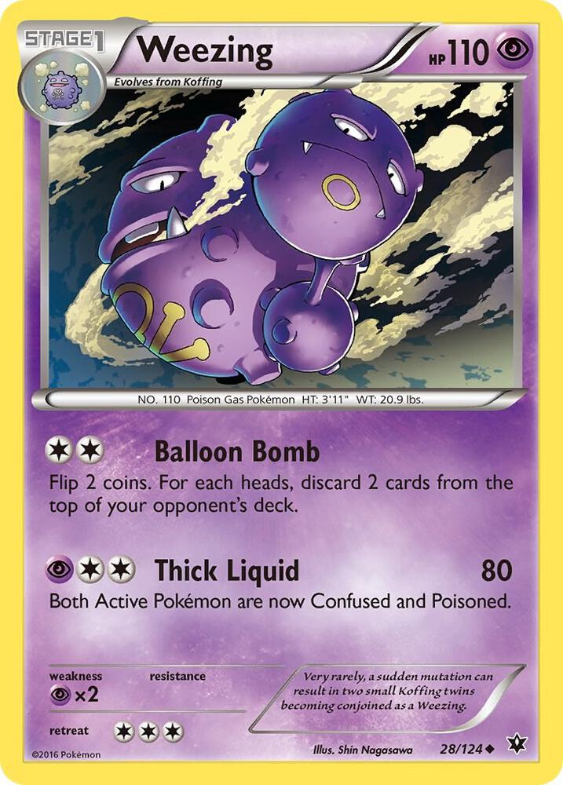</th>
  </tr>
  <tr><td><b>XY - Fates Collide</b> <picture><source media="(prefers-color-scheme: dark)" srcset="./assets/sets-dark/fates-collide.png"></picture> 28/124</td></tr>
  <tr><td><b>Rarity</b>: <picture><source media="(prefers-color-scheme: dark)" srcset="./assets/rarities-dark/uncommon.png"></picture> Uncommon</td></tr>
  <tr><td><b>Type</b>:  Psychic</td></tr>
  <tr><td><b>HP</b>: 110</td></tr>
  <tr><td><b>Stage</b>: Stage 1</td></tr>
  <tr><td><b>Ability</b>: -</td></tr>
  <tr><td><b>Attack</b>: [2] Balloon Bomb - Flip 2 coins. For each heads, discard 2 cards from the top of your opponent&#x27;s deck.</td></tr>
  <tr><td><b>Attack</b>: [2P] Thick Liquid (80) - Both Active Pokémon are now Confused and Poisoned.</td></tr>
  <tr><td><b>Weakness</b>:  Psychic ×2</td></tr>
  <tr><td><b>Resistance</b>: -</td></tr>
  <tr><td><b>Retreat</b>:  3</td></tr>
  <tr><td><b>Can I play it?</b>: ✗ No, this card is too old for tournaments now</td></tr>
  <tr><td><b>Category</b>: collection</td></tr>
</table>

<table>
  <tr><td colspan="2"><h3 id="weezing-team-plasma">Weezing (Team Plasma) <picture><source media="(prefers-color-scheme: dark)" srcset="./assets/rarities-dark/rare.png"></picture></h3></td></tr>
  <tr>
    <th rowspan="13" width="400">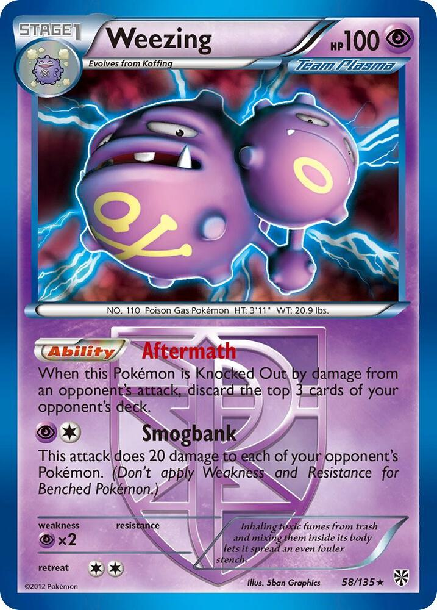</th>
  </tr>
  <tr><td><b>Plasma Storm</b> <picture><source media="(prefers-color-scheme: dark)" srcset="./assets/sets-dark/plasma-storm.png"></picture> 58/135</td></tr>
  <tr><td><b>Rarity</b>: <picture><source media="(prefers-color-scheme: dark)" srcset="./assets/rarities-dark/rare.png"></picture> Holo Rare</td></tr>
  <tr><td><b>Type</b>:  Psychic</td></tr>
  <tr><td><b>HP</b>: 100</td></tr>
  <tr><td><b>Stage</b>: Stage 1</td></tr>
  <tr><td><b>Ability</b>: Aftermath - When this Pokémon is Knocked Out by damage from an opponent&#x27;s attack, discard the top 3 cards of your opponent&#x27;s deck. (Ability)</td></tr>
  <tr><td><b>Attack</b>: [1P] Smogbank - This attack does 20 damage to each of your opponent&#x27;s Pokémon. (Don&#x27;t apply Weakness and Resistance for Benched Pokémon.)</td></tr>
  <tr><td><b>Weakness</b>:  Psychic ×2</td></tr>
  <tr><td><b>Resistance</b>: -</td></tr>
  <tr><td><b>Retreat</b>:  2</td></tr>
  <tr><td><b>Can I play it?</b>: ✗ No, this card is too old for tournaments now</td></tr>
  <tr><td><b>Category</b>: collection</td></tr>
</table>
