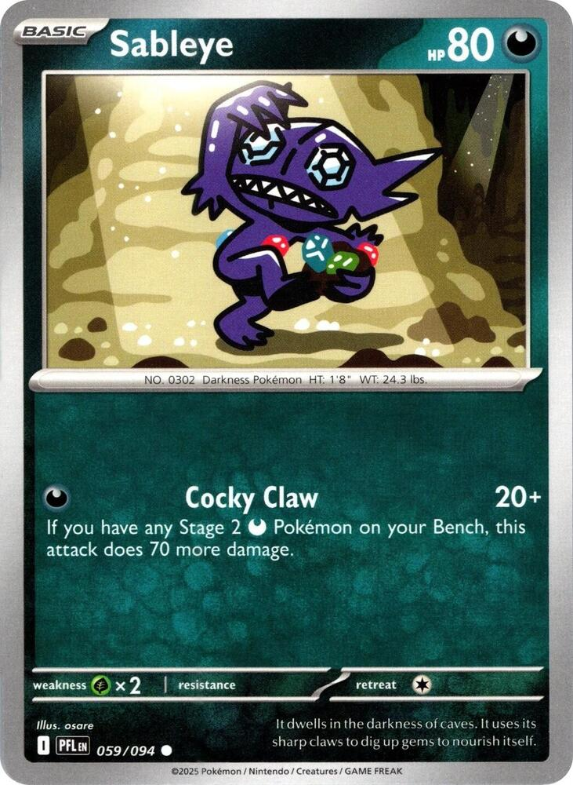
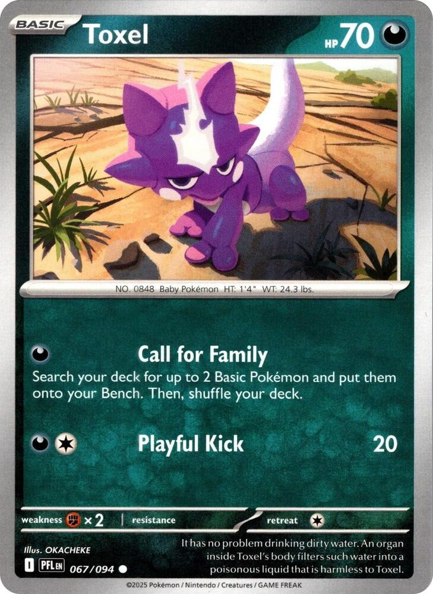
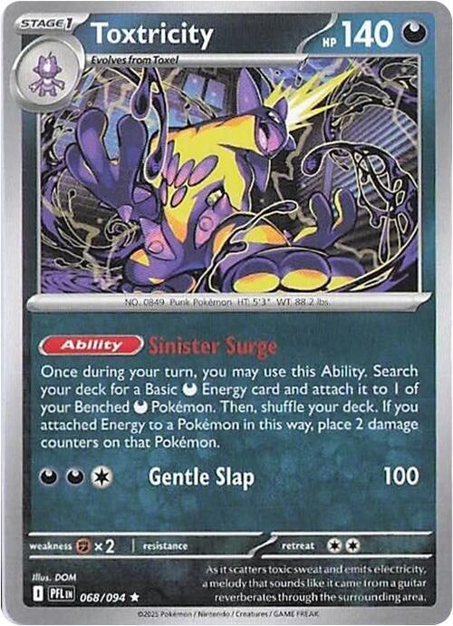
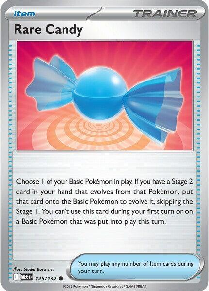
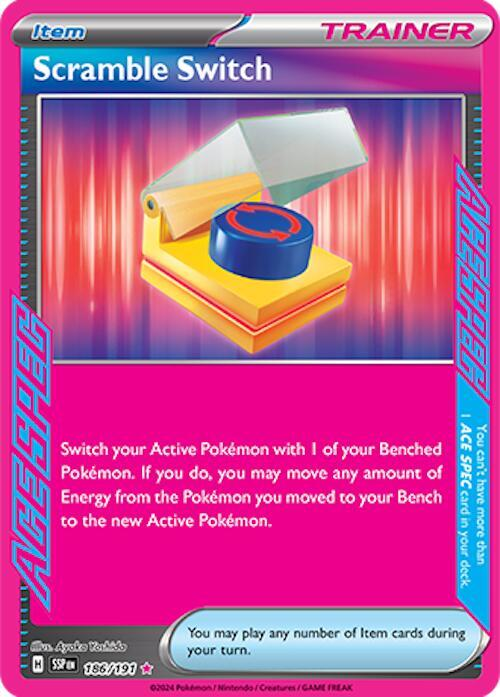
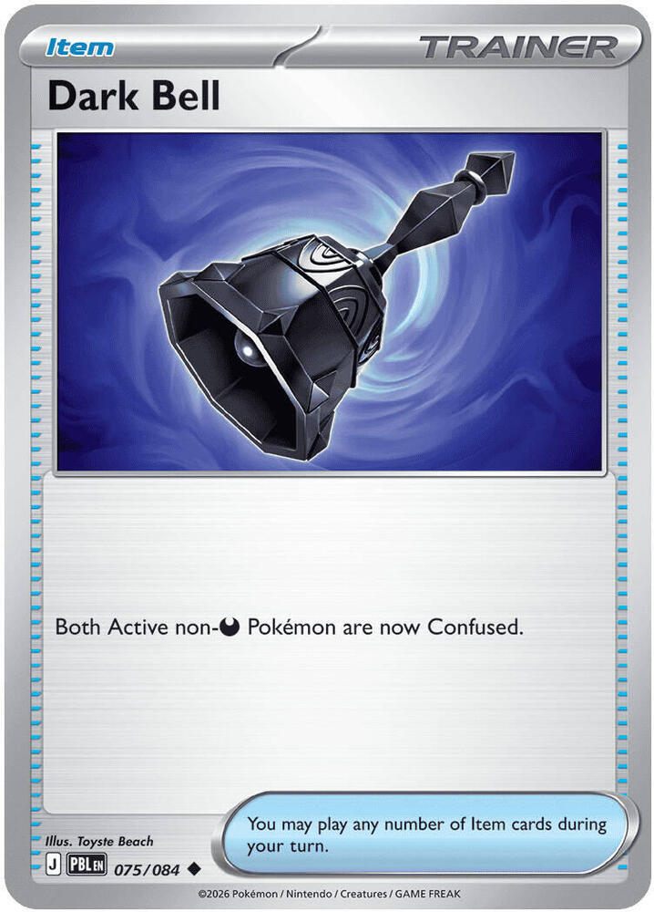
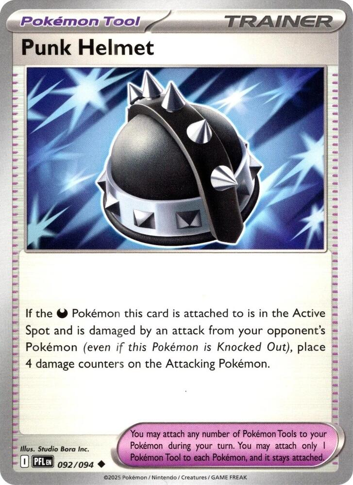
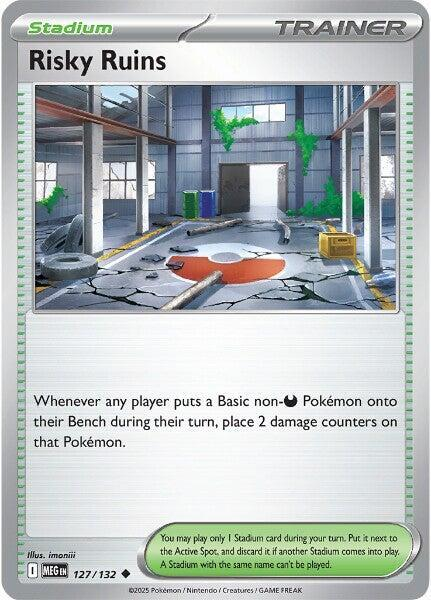
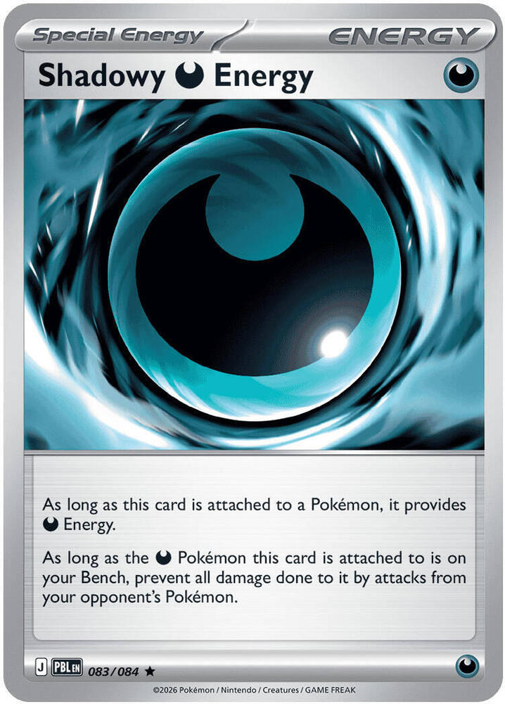
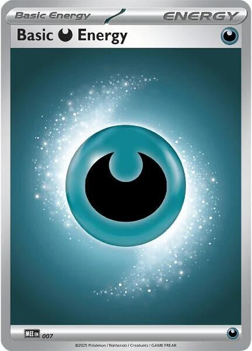

# Xero's Gengar Gang

> [!NOTE]
> **How to read this file.**
>
> Every card in the deck gets its own entry below, in the order you actually think about them during a game: the Pokémon first (evolution lines together), then Supporters, Items, Tools, the Stadium, and finally Energy. Game words are defined once, in [the table rules](./rules.md), rather than re-explained here.
>
> Each entry has the same four parts:
>
> - **General use** — the plain-English "what is this card for," one paragraph. If you read nothing else, read these.
> - **Pairing** — the other cards in the deck that this one wants to be next to. Follow these like links; they form the deck's actual skeleton.
> - **Strategy** — the deeper reasoning. Timing, math, traps, and the reasons a play that looks fine is actually wrong.
> - **Evolution** (Pokémon only) — where this card sits in its chain, so you can see at a glance what it needs and what it becomes.
>
> The stat table repeats what is printed on the card, so you can check a number without getting up.
>
> At the bottom is **[Game Plans](#game-plans)** — the named game plans. Those are the part worth memorizing. The card entries teach you the pieces; that section teaches you the game.
>
> **Deck total: 60 cards.** 21 Pokémon, 29 Trainers, 10 Energy. Every attacker is worth **1 Prize card**, which is what keeps games against a theme deck close and fair, and what makes an ex deck pay double for every trade it wins.
>
> **This is the third build.** The second one traded situational Trainers for Pokémon and an Energy engine. This one fixes where the Energy actually goes: Scramble Switch takes the ACE SPEC slot that was sitting empty, Night Stretcher doubles, half the Shadowy Darkness becomes Basic Darkness that *Sinister Surge* can still find on turn seven, and Ultra Ball leaves because three Dawn already fetch the whole Gengar line.

---

> ### Table of Contents
>
> **Pokémon** — [Gastly](#gastly) · [Haunter](#haunter) · [Gengar](#gengar) · [Koffing](#koffing) · [Weezing](#weezing) · [Sableye](#sableye) · [Toxel](#toxel) · [Toxtricity](#toxtricity)
> **Supporters** — [Dawn](#dawn) · [Lillie's Determination](#lillies-determination) · [Gwynn](#gwynn) · [Boss's Orders](#bosss-orders-ghetsis)
> **Items** — [Buddy-Buddy Poffin](#buddy-buddy-poffin) · [Rare Candy](#rare-candy) · [Night Stretcher](#night-stretcher) · [Switch](#switch) · [Scramble Switch](#scramble-switch) · [Dark Bell](#dark-bell)
> **Tool / Stadium** — [Punk Helmet](#punk-helmet) · [Risky Ruins](#risky-ruins)
> **Energy** — [Shadowy Darkness Energy](#shadowy-darkness-energy) · [Basic Darkness Energy](#basic-darkness-energy)
>
> [**Game Plans**](#game-plans) · [**Deck List**](#deck-list)

---

## Deck List

**Pokémon (21)**

| Qty | Card | Set | Number | Reg |
| --- | --- | --- | --- | --- |
| 4 | Gastly | Perfect Order | 048 | J |
| 2 | Haunter | Phantasmal Flames | 055 | I |
| 3 | Gengar | Perfect Order | 050 | J |
| 3 | Koffing | Journey Together | 091 | I |
| 3 | Weezing | Journey Together | 092 | I |
| 2 | Sableye | Phantasmal Flames | 059 | I |
| 2 | Toxel | Phantasmal Flames | 067 | I |
| 2 | Toxtricity | Phantasmal Flames | 068 | I |

**Trainers — Supporters (10)**

| Qty | Card | Set | Number | Reg |
| --- | --- | --- | --- | --- |
| 3 | Dawn | Phantasmal Flames | 087 | I |
| 2 | Lillie's Determination | Mega Evolution | 119 | I |
| 2 | Gwynn | Pitch Black | 078 | J |
| 3 | Boss's Orders [Ghetsis] | Mega Evolution | 114 | I |

**Trainers — Items (15)**

| Qty | Card | Set | Number | Reg |
| --- | --- | --- | --- | --- |
| 4 | Buddy-Buddy Poffin | Temporal Forces | 144 | H |
| 3 | Rare Candy | Mega Evolution | 125 | I |
| 4 | Night Stretcher | Shrouded Fable | 061 | H |
| 1 | Switch | Mega Evolution | 130 | I |
| 1 | Scramble Switch | Surging Sparks | 186 | H |
| 2 | Dark Bell | Pitch Black | 075 | J |

**Trainers — Tool & Stadium (4)**

| Qty | Card | Set | Number | Reg |
| --- | --- | --- | --- | --- |
| 2 | Punk Helmet | Phantasmal Flames | 092 | I |
| 2 | Risky Ruins | Mega Evolution | 127 | I |

**Energy (10)**

| Qty | Card | Set | Number | Reg |
| --- | --- | --- | --- | --- |
| 2 | Shadowy Darkness Energy | Pitch Black | 083 | J |
| 8 | Basic Darkness Energy | Mega Evolution Energies | 007 | — |

**21 + 10 + 15 + 4 + 10 = 60.** ✓

---
---

# Pokémon

---

### Gastly


| Key | Val |
| :--- | :--- |
| **Qty** | 4 |
| **Set** | ME03: Perfect Order |
| **Number** | 048/088 |
| **Type** | Darkness |
| **HP** | 70 |
| **Stage** | Basic |
| **Weakness** | Fighting ×2 |
| **Resistance** | — |
| **Retreat** | 1 |
| **Attack** | *Surprise Attack* **[D] 30** — Flip a coin. If tails, this attack does nothing. |
| **Regulation** | J |

<br clear="all">

#### Evolution

**gastly** → haunter → gengar

#### General use

Gastly is a seed, not a fighter. Its entire job is to be sitting on your Bench on turn one so that something better can be placed on top of it later. You run the maximum four copies not because Gastly is good but because you cannot build a Gengar without one, and drawing zero Basic Pokémon means you have to mulligan.

Do not fall in love with *Surprise Attack*. A coin flip for 30 is a last resort — the attack you use when your board fell apart and you have nothing else. Treat it as a way to not waste a turn, never as a plan.

#### Pairing

- **[Buddy-Buddy Poffin](#buddy-buddy-poffin)** — at 70 HP, Gastly is a legal target, and Poffin fetches two Basics at once straight onto the Bench.
- **[Rare Candy](#rare-candy)** — Gastly is the Basic that Rare Candy jumps to Gengar.
- **[Dawn](#dawn)** — grabs a Gastly and its whole family in one card.
- **[Gwynn](#gwynn)** — a spare Gastly in hand is worth 3 cards of draw.
- **[Shadowy Darkness Energy](#shadowy-darkness-energy)** — makes a benched Gastly untouchable while it grows up.

#### Strategy

The Perfect Order print is specifically the one you want. 70 HP instead of 60 is not a rounding error: it is the difference between surviving a Charmander's opening poke and not, and — critically — 70 HP is exactly the ceiling for **Buddy-Buddy Poffin**. A 60 HP Gastly would still work; an 80 HP one would not.

The most common beginner mistake with this card is playing one Gastly and holding the rest. Play them. Two or three Gastly on the Bench early is not overcommitting — it is insurance, because your opponent can only knock out one thing per turn, and every Gastly you did not bench is a Gengar you cannot build later.

The one real cost of a wide Bench is that some decks draw more the more Pokémon you have in play. That is a price worth paying almost every time.

---

### Haunter


| Key | Val |
| :--- | :--- |
| **Qty** | 2 |
| **Set** | ME02: Phantasmal Flames |
| **Number** | 055/094 |
| **Type** | Darkness |
| **HP** | 100 |
| **Stage** | Stage 1 (from Gastly) |
| **Weakness** | Fighting ×2 |
| **Resistance** | — |
| **Retreat** | 1 |
| **Attack** | *Spooky Shot* **[D] 40** |
| **Regulation** | I |

<br clear="all">

#### Evolution

gastly → **haunter** → gengar

#### General use

Haunter is the slow road to Gengar. When you have Rare Candy you skip it entirely; when you do not, Haunter is how you get there anyway. Only two copies are in the deck because it is a backup route, not the main one.

*Spooky Shot* for a flat 40 with no coin flip is quietly useful — it is more reliable damage than Gastly's attack, and 40 is enough to finish off something the opponent left damaged.

#### Pairing

- **[Gengar](#gengar)** — the only reason Haunter exists in this list.
- **[Dawn](#dawn)** — the "Stage 1" slot on Dawn is almost always Haunter.
- **[Rare Candy](#rare-candy)** — the card that lets you *skip* Haunter. When Candy is in hand, leave Haunter in the deck.

#### Strategy

Here is the timing rule that matters: **Rare Candy cannot be used on your first turn, and cannot be used on a Basic you played that same turn.** So the fastest possible Gengar is turn two — bench Gastly turn one, Candy it turn two. If you miss that window, Haunter becomes your path, and evolving Gastly → Haunter on turn two still lets you reach Gengar on turn three.

That means Haunter is rarely a wasted play even when you *do* draw Rare Candy later. A Haunter on the board on turn two is a Gengar on turn three. A Gastly on the board on turn two that is waiting for a Candy might be a Gengar on turn three, or might be a Gastly on turn five.

> [!TIP]
> You already own three Standard-legal Haunters: **POR 049** (*Haunt* — 3 damage counters, placed wherever you like), **PFL 055** (*Spooky Shot* 40), and **TEF 103** (*Super Poison Breath* [DD] 30 + Poisoned). Any two of them work. PFL 055 is listed here because flat 40 is the most beginner-friendly, but POR 049 is arguably stronger since damage counters ignore Weakness and Resistance and can be aimed at a Benched Pokémon.

---

### Gengar


| Key | Val |
| :--- | :--- |
| **Qty** | 3 |
| **Set** | ME03: Perfect Order |
| **Number** | 050/088 |
| **Type** | Darkness |
| **HP** | 130 |
| **Stage** | Stage 2 (from Haunter) |
| **Weakness** | Fighting ×2 |
| **Resistance** | — |
| **Retreat** | 1 |
| **Ability** | *Infinite Shadow* — If this Pokémon is Knocked Out by damage from an attack from your opponent's Pokémon, put it into your hand instead of the discard pile. (Discard all attached cards.) |
| **Attack** | *Mind Jack* **[D] 10+** — Does 30 more damage for each of your opponent's Benched Pokémon. |
| **Regulation** | J |

<br clear="all">

#### Evolution

gastly → haunter → **gengar**

#### General use

Gengar is the closer, and it is a *punisher*. It costs one single Darkness Energy and its damage is decided entirely by how greedy your opponent has been with their Bench. Against a wide board it hits like a truck for one Energy. Against an empty board it does 10.

Learn this table. It is the most important arithmetic in the deck:

| Opponent's Benched Pokémon | Mind Jack damage |
| :--- | :--- |
| 0 | 10 |
| 1 | 40 |
| 2 | 70 |
| 3 | 100 |
| 4 | **130** |
| 5 | **160** |

Read that table against HP tiers rather than against one opponent. **A four-Bench Mind Jack at 130 clears the entire single-prize tier** — the 50 to 130 HP Basics and Stage 1s every deck is built out of. A five-Bench 160 adds most Stage 2 non-ex.

What it can never do is clear the ex tier. Mind Jack maxes at **160**, and Pokémon ex start around 190 and run past 300. Gengar is the card that farms a board; it is not the card that kills their best thing. That job belongs to Weezing, and past that to [Punk Helmet](#punk-helmet) softening the target first.

#### Pairing

- **[Boss's Orders](#bosss-orders-ghetsis)** — drags the exact target you want into range. Read the warning in Strategy first.
- **[Rare Candy](#rare-candy)** — the fast lane from Gastly, skipping Haunter.
- **[Dawn](#dawn)** — assembles the entire line from your deck in one Supporter.
- **[Shadowy Darkness Energy](#shadowy-darkness-energy)** — protects Gengar completely while it waits on the Bench.
- **[Risky Ruins](#risky-ruins)** — punishes the opponent for building the wide Bench that Mind Jack feeds on. They are trapped either way.
- **[Night Stretcher](#night-stretcher)** — brings a discarded Gengar back.
- **[Sableye](#sableye)** — a Gengar on the Bench is what switches *Cocky Claw* on. The closer powers the opener.

#### Strategy

**The Boss's Orders trap.** Boss's Orders pulls one of your opponent's Benched Pokémon into the Active Spot — which *removes it from their Bench* and therefore lowers Mind Jack by 30. If they have five on the Bench and you Boss up a 70 HP Basic, you are now hitting for 130, not 160. That is still plenty to kill the Basic, but if you were counting on 160 to finish something wounded, you just talked yourself out of 30 damage. **Count the Bench after the Boss, not before.**

**Infinite Shadow is recycling, not immortality.** This is the single most misunderstood card in the deck, so be precise about it:

> [!WARNING]
> *Infinite Shadow* **does not deny your opponent a Prize card.** A knockout always awards one, no matter where the card goes afterwards. What the Ability does is return Gengar to your **hand** instead of the discard pile — and because an evolution stack moves as a unit, **Gastly and Haunter come back with it.** Only the *attached* cards (Energy, Tools) are discarded.
>
> So it is excellent value — three cards back for free — but it is never a reason to *let* Gengar die. Losing Gengar still costs you a Prize and a full turn of re-setup.

The right way to think about it: Infinite Shadow means you can play Gengar aggressively without fearing that a knockout ends your Gengar plan for the game. You will get it back. You just would rather not need to.

**One Energy.** Do not over-invest. Mind Jack costs exactly one [D] and never wants a second. Every Energy past the first on a Gengar is an Energy that should have gone on a Weezing.

---

### Koffing


| Key | Val |
| :--- | :--- |
| **Qty** | 3 |
| **Set** | SV09: Journey Together |
| **Number** | 091/159 |
| **Type** | Darkness |
| **HP** | 60 |
| **Stage** | Basic |
| **Weakness** | Fighting ×2 |
| **Resistance** | — |
| **Retreat** | 1 |
| **Attack 1** | *Tackle* **[C] 10** |
| **Attack 2** | *Suffocating Gas* **[D][C] 20** |
| **Regulation** | I |

<br clear="all">

#### Evolution

**koffing** → weezing

#### General use

Koffing is the other seed, and unlike Gastly it only needs *one* step to become a real threat. That makes it the Basic you most want in your opening hand. Bench it turn one, evolve it turn two, and you are attacking with a 130 HP Weezing while your Gengar is still growing.

*Tackle* for [C] is worth knowing about: it is the only attack in the deck that does not require Darkness Energy, so a Koffing can attack off a Shadowy Darkness Energy or any Energy at all in a pinch.

#### Pairing

- **[Weezing](#weezing)** — the whole point.
- **[Buddy-Buddy Poffin](#buddy-buddy-poffin)** — 60 HP is comfortably under the 70 HP cap.
- **[Dawn](#dawn)** — Koffing is a fine "Basic" slot on Dawn if you already have Gastly.
- **[Night Stretcher](#night-stretcher)** — recovers one Gwynn threw away.

#### Strategy

At 60 HP, Koffing is fragile, and every Pokémon in this deck is Weak to **Fighting ×2**, so any Fighting attacker erases it with a rounding error. Evolve promptly. A Koffing that sits on the Bench for three turns is a Koffing that gets sniped.

Three copies, not four, is deliberate. Weezing is the deck's workhorse, but you only ever need one Weezing in play at a time, and the extra slot buys you a Trainer that finds what you actually need.

> [!NOTE]
> This is a **regular** Koffing. It does **not** evolve into Team Rocket's Weezing — that card requires *Team Rocket's Koffing* specifically, and would need its own separate line. Names must match exactly.

---

### Weezing


| Key | Val |
| :--- | :--- |
| **Qty** | 3 |
| **Set** | SV09: Journey Together |
| **Number** | 092/159 |
| **Type** | Darkness |
| **HP** | 130 |
| **Stage** | Stage 1 (from Koffing) |
| **Weakness** | Fighting ×2 |
| **Resistance** | — |
| **Retreat** | 2 |
| **Attack 1** | *Pervasive Gas* **[D] 30** — Your opponent's Active Pokémon is now Confused. |
| **Attack 2** | *Crazy Blast* **[D][C] 50+** — If this Pokémon used Pervasive Gas during your last turn, this attack does 120 more damage. |
| **Regulation** | I |

<br clear="all">

#### Evolution

**koffing** → **weezing**

*(Koffing also evolves into Galarian Weezing, a separate card kept out of this deck — see the Casual Swaps section of `gengar-weezing-deck.md`.)*

#### General use

Weezing is the engine of this deck and the card your son will hate the most. It is a two-turn combo on a single card:

**Turn one — *Pervasive Gas*.** 30 damage, and their Active is now Confused.
**Turn two — *Crazy Blast*.** 50 + 120 = **170 damage.**

**170 is the biggest number this deck produces**, and it is the only one that clears the whole single-prize tier in a single attack. Every non-ex Stage 2 Fox owns sits at or under it. It does that on the second turn of a combo that costs no Trainer cards at all.

Against a Pokémon ex it is a two-shot rather than a one-shot, with one loud exception: **Darkness hits Psychic for double**, so a 170 lands as **340** on his Team Rocket's Mewtwo ex.

Meanwhile the Confusion from step one means there is a 50% chance your opponent's turn in between simply does not happen.

#### Pairing

- **[Dark Bell](#dark-bell)** — re-applies Confusion without spending your attack, so you can Crazy Blast *and* keep them Confused.
- **[Punk Helmet](#punk-helmet)** — Weezing wants to stay Active for two turns, which is exactly when a retaliation Tool pays off.
- **[Shadowy Darkness Energy](#shadowy-darkness-energy)** — protects the *next* Weezing on the Bench while this one is working.
- **[Switch](#switch)** — Weezing's retreat cost of 2 is genuinely expensive; Switch is the escape hatch.
- **[Boss's Orders](#bosss-orders-ghetsis)** — a Confused Pokémon that gets swapped out loses its Confusion, but Boss's Orders lets *you* choose what comes up next.
- **[Toxtricity](#toxtricity)** — *Sinister Surge* puts the second Energy on the Benched Weezing, so the fuse is lit the turn it steps forward.

#### Strategy

**The combo is fragile in exactly one way, and you control it.** *Crazy Blast* checks whether **this Pokémon** used *Pervasive Gas* during your last turn. That means:

- ❌ Do not retreat the Weezing in between.
- ❌ Do not Switch it out and back.
- ❌ Do not use Pervasive Gas with one Weezing and Crazy Blast with a different one.
- ✅ Do make sure it already has **two** Energy attached before you commit, so an unlucky draw cannot strand you. *Sinister Surge* is how: charge the Weezing on the Bench, then promote it loaded.

**Confusion is much better than it looks.** Under current rules, when a Confused Pokémon attacks, its controller flips a coin. On tails the attack does nothing, **3 damage counters (30 damage) go on the Confused Pokémon**, and their turn is over. So *Pervasive Gas* is not "30 damage and an annoyance" — it is 30 damage plus a coin flip where heads means they attack and tails means they take another 30 and waste a turn.

And Confusion only clears when the Pokémon **leaves the Active Spot**. Against anything with a retreat cost of 2 or 3 that is brutal: a Confused attacker is more or less stuck there unless they spend a Switch on it.

**The Weezing / Gengar handoff.** These two cards want opposite boards. Weezing does a flat 170 regardless of what the opponent has benched. Gengar scales with their Bench. So: **lead with Weezing while your opponent's board is thin, and close with Gengar once it has filled out.** That is the whole rhythm of the deck.

---

### Sableye



| Key | Val |
| :--- | :--- |
| **Qty** | 2 |
| **Set** | ME02: Phantasmal Flames |
| **Number** | 059/094 |
| **Type** | Darkness |
| **HP** | 80 |
| **Stage** | Basic |
| **Weakness** | Grass ×2 |
| **Resistance** | — |
| **Retreat** | 1 |
| **Attack** | *Cocky Claw* **[D] 20+** — If you have any Stage 2 Darkness Pokémon on your Bench, this attack does 70 more damage. |
| **Regulation** | I |

<br clear="all">

#### Evolution

**sableye** — does not evolve. It fights as it is.

#### General use

Ninety damage for one Energy, as a Basic, worth one Prize. The condition is a board this deck builds anyway: a Stage 2 Darkness Pokémon **on your Bench**, and Gengar is a Stage 2 Darkness Pokémon that spends most of the game exactly there. Sableye is the attacker for the turns Weezing is charging and the turns Gengar is waiting, which used to be the turns this deck did nothing.

#### Pairing

- **[Gengar](#gengar)** — the switch that turns *Cocky Claw* on. Build the Gengar, park it on the Bench, and every Sableye in play hits for 90.
- **[Toxel](#toxel)** — *Call for Family* is how Sableye reaches the Bench, because Buddy-Buddy Poffin cannot fetch it.
- **[Toxtricity](#toxtricity)** — *Sinister Surge* loads a benched Sableye so it attacks the turn it steps forward.
- **[Gwynn](#gwynn)** — a spare Sableye in hand late is three cards of draw.

#### Strategy

**Read the condition twice: "on your Bench."** A Gengar sitting in the Active Spot turns Cocky Claw off. When Gengar steps forward to close with Mind Jack, know that your Sableyes drop back to 20 until it returns.

Ninety kills most of the single-prize tier on the nose, for one Energy, from a body Fox feels silly spending a big attack on. Against a deck of Pokémon ex the math is humbler, but a one-Prize 90-per-turn body is exactly the trade a two-Prize deck hates making.

The Grass Weakness is irrelevant against Fire, but his Team Rocket's Tarountula and Spidops are Grass. If Spidops is fighting, keep Sableye home.

> [!WARNING]
> **Sableye is 80 HP, and Buddy-Buddy Poffin stops at 70.** It is the one Basic in this deck Poffin cannot touch. Toxel's *Call for Family* has no HP cap; that is the delivery route.

---

### Toxel



| Key | Val |
| :--- | :--- |
| **Qty** | 2 |
| **Set** | ME02: Phantasmal Flames |
| **Number** | 067/094 |
| **Type** | Darkness |
| **HP** | 70 |
| **Stage** | Basic |
| **Weakness** | Fighting ×2 |
| **Resistance** | — |
| **Retreat** | 1 |
| **Attack 1** | *Call for Family* **[D]** — Search your deck for up to 2 Basic Pokémon and put them onto your Bench. Then, shuffle your deck. |
| **Attack 2** | *Playful Kick* **[D][C] 20** |
| **Regulation** | I |

<br clear="all">

#### Evolution

**toxel** → toxtricity

#### General use

The third seed, and the deck's best going-second play. Going second you may attack on turn one, and *Call for Family* is an attack that puts **two more Basic Pokémon on your Bench** — any Basics, no HP cap. Two extra bodies on turn one beats 10 damage every single time.

#### Pairing

- **[Toxtricity](#toxtricity)** — the whole point. Evolve on turn two and the Energy engine starts.
- **[Sableye](#sableye)** — the Basic Poffin cannot fetch, delivered by the attack that can.
- **[Buddy-Buddy Poffin](#buddy-buddy-poffin)** — at 70 HP, Toxel itself is a legal Poffin target.

#### Strategy

**Going second, lead Toxel.** Poffin plus *Call for Family* on turn one is four Basics from one opening hand; the board is built before Fox finishes his second turn. Going first you cannot attack, so Toxel is just a benched seed like Gastly, and that is fine too.

Toxel is fragile at 70 HP with a Fighting Weakness, and unlike Gastly it matters if it dies, because only two are in the deck. Bench it, use it, evolve it.

---

### Toxtricity



| Key | Val |
| :--- | :--- |
| **Qty** | 2 |
| **Set** | ME02: Phantasmal Flames |
| **Number** | 068/094 |
| **Type** | Darkness |
| **HP** | 140 |
| **Stage** | Stage 1 (from Toxel) |
| **Weakness** | Fighting ×2 |
| **Resistance** | — |
| **Retreat** | 2 |
| **Ability** | *Sinister Surge* — Once during your turn, you may search your deck for a Basic Darkness Energy card and attach it to 1 of your Benched Darkness Pokémon. Then, shuffle your deck. If you attached Energy to a Pokémon in this way, place 2 damage counters on that Pokémon. |
| **Attack** | *Gentle Slap* **[D][D][C] 100** |
| **Regulation** | I |

<br clear="all">

#### Evolution

toxel → **toxtricity**

#### General use

**The card the first build was missing.** The old list attached one Energy per turn, had nothing that accelerated, and ran dry by game three; that was the loss condition more often than any attack was. *Sinister Surge* attaches a **second** Basic Darkness every turn, from the deck, to your Bench, for free. Weezings now arrive in the Active Spot already loaded.

The price is two damage counters on whatever it feeds. Read that as rent, not damage: a Weezing at 110 still does everything a Weezing at 130 does, and a Gengar that dies comes back through *Infinite Shadow* anyway.

#### Pairing

- **[Weezing](#weezing)** — the main customer. Charge the next Weezing on the Bench while this one fights, and the Two-Turn Fuse never waits on a draw.
- **[Gengar](#gengar)** — Mind Jack costs one Energy, and Surge pays it without spending your hand attachment.
- **[Basic Darkness Energy](#basic-darkness-energy)** — eight in the deck so the search never whiffs. **Surge cannot fetch Shadowy Darkness Energy**; Basic only.
- **[Night Stretcher](#night-stretcher)** — returns a Basic Darkness to your hand, and Surge puts it back to work from the deck side.

#### Strategy

**Benched Darkness Pokémon only.** Surge cannot feed the Active, and it cannot feed itself a target that is fighting. The rhythm is: hand attachment to the front, Surge to the back.

**Choose the counter-catcher deliberately.** The 2 counters go on whoever received the Energy. Good targets: a Gengar (recycles itself), a Weezing about to trade anyway, a Sableye that expects to die in one hit regardless. Bad target: a Weezing at 130 that you need to survive one more hit — two Surges put it 20 HP inside a range it was outside of.

*Gentle Slap* is a real attack. When both Weezings are down and Gengar is not ready, 100 flat from a 140 HP body holds the fort.

---
---

# Trainers — Supporters

> **The one-Supporter rule.** You may play only **one Supporter per turn.** With 10 Supporters in this deck, deciding *which* one is the most frequent real decision you will make. Rule of thumb: **Dawn** when the board is missing pieces, **Lillie's Determination** when your hand is bad, **Gwynn** when your hand is full of the wrong Pokémon, **Boss's Orders** when you can win a Prize this turn.

---

### Dawn


| Key | Val |
| :--- | :--- |
| **Qty** | 3 |
| **Set** | ME02: Phantasmal Flames |
| **Number** | 087/094 |
| **Type** | Trainer — Supporter |
| **Regulation** | I |

> Search your deck for a Basic Pokémon, a Stage 1 Pokémon, and a Stage 2 Pokémon, reveal them, and put them into your hand. Then, shuffle your deck.

<br clear="all">

#### General use

Dawn is the card that makes a Stage 2 deck possible. In one Supporter it hands you an entire Gengar line — Gastly, Haunter, Gengar — from the deck to your hand. Without a card like this, a three-stage evolution line is a fantasy you draw one third of.

Note the wording: it takes **one of each stage**. You cannot use it to grab three Gastly. That is fine, because one of each is precisely what you want.

#### Pairing

- **[Gastly](#gastly)** / **[Haunter](#haunter)** / **[Gengar](#gengar)** — the three slots, filled perfectly.
- **[Rare Candy](#rare-candy)** — Dawn gets you the Gastly *and* the Gengar; Candy connects them. This is the deck's best two-card sequence.
- **[Weezing](#weezing)** — Weezing is a valid Stage 1 target if you already have a Haunter and would rather have the Weezing.

#### Strategy

Dawn is at its very best on **turn one**, and this is worth being deliberate about. Turn one you cannot Rare Candy anyway, so spending your Supporter to load your hand with the entire line costs you nothing and sets up a turn-two Gengar.

Compare that to spending turn one on Lillie's Determination: you draw eight random cards and *hope*. Dawn guarantees.

The flexible slot is the Stage 1. If your Koffing is already down and you would rather have the Weezing than the Haunter, take Weezing — you can always Rare Candy past Haunter later. Dawn does not care which Stage 1 you name.

**Three copies in this build, and it is now the deck's main tutor.** Ultra Ball is gone, so Dawn is how a specific Pokémon gets found. One card that hands you a Basic, a Stage 1, and a Stage 2 does Ultra Ball's job better anyway, and it never asks you to discard two cards to do it.

---

### Lillie's Determination


| Key | Val |
| :--- | :--- |
| **Qty** | 2 |
| **Set** | ME01: Mega Evolution |
| **Number** | 119/132 |
| **Type** | Trainer — Supporter |
| **Regulation** | I |

> Shuffle your hand into your deck. Then, draw 6 cards. If you have exactly 6 Prize cards remaining, draw 8 cards instead.

<br clear="all">

#### General use

This is your reset button. Bad hand? Shuffle it away and draw six new cards. Because it *shuffles* rather than discards, nothing is lost — the cards you did not want go back into the deck where you can find them later.

The bonus condition is the interesting part: **if you still have all six Prize cards, you draw eight instead of six.** That is a straightforward "play me early" bonus, and eight cards is an enormous hand.

#### Pairing

- Every card in the deck. This is generic draw; its partner is whatever you are missing.
- **[Dawn](#dawn)** — the two most common turn-one plays. Choose between them, never both (one Supporter per turn).
- **[Night Stretcher](#night-stretcher)** — Lillie's shuffles cards *back in*, so unlike Gwynn it never needs recovery.

#### Strategy

**The eight-card window closes the moment you take a Prize.** Once you knock something out, you are at five Prizes and Lillie's is a six-card draw forever after. So there is real tension: the 8-card mode is only available while you are still behind or even.

The clean answer for this deck: **if your opening hand is genuinely bad, use Lillie's on turn one for eight cards.** If your opening hand is workable, use Dawn instead and save Lillie's for when things go wrong.

**Watch what you shuffle away.** Lillie's shuffles your *entire* hand, including that Rare Candy and that Gengar you were saving. Before you play it, ask whether you are trading three good cards for six random ones. If your hand has two cards you actively need, Lillie's is usually wrong.

---

### Gwynn


| Key | Val |
| :--- | :--- |
| **Qty** | 2 |
| **Set** | ME05: Pitch Black |
| **Number** | 078/084 |
| **Type** | Trainer — Supporter |
| **Regulation** | J |

> Discard up to 2 Pokémon that don't have a Rule Box from your hand, and draw 3 cards for each card you discarded in this way. (Pokémon ex, Pokémon V, etc. have Rule Boxes.)

<br clear="all">

#### General use

Gwynn turns dead Pokémon into cards. Discard up to two Pokémon from your hand, draw three each — so up to **six cards for two cards you did not want anyway.**

**Every single Pokémon in this deck has no Rule Box**, so every one of them is a legal discard. That is not an accident; it is one of the quiet payoffs for building an all-non-ex deck.

#### Pairing

- **[Night Stretcher](#night-stretcher)** — the other half of the card. Gwynn throws a Gengar away; Night Stretcher takes it back. Together they are "draw 3, no cost."
- **[Gastly](#gastly)** / **[Koffing](#koffing)** — the surplus Basics you inevitably accumulate are Gwynn's best fuel.

#### Strategy

**Gwynn is a late-game card.** Early on, every Pokémon in your hand is something you want to play. By the middle of the game you are holding a fourth Gastly and a spare Koffing that will never see the board — that is when Gwynn is a six-card draw with no real cost.

The advanced line is **deliberate discarding**. If you are holding a Gengar you cannot build this turn, discarding it to Gwynn for three cards and retrieving it later with Night Stretcher is card *advantage*, not a loss. You paid one Item to convert a stuck card into three fresh ones.

**Two copies in this build.** Gwynn is conditional — it needs Pokémon in hand to do anything at all — so one copy showed up too rarely to be the draw the deck was counting on. With 21 Pokémon the fuel is plentiful, and with Lillie's down to two, Gwynn is now half of how this deck refills its hand.

---

### Boss's Orders [Ghetsis]


| Key | Val |
| :--- | :--- |
| **Qty** | 3 |
| **Set** | ME01: Mega Evolution |
| **Number** | 114/132 |
| **Type** | Trainer — Supporter |
| **Regulation** | I |

> Switch in 1 of your opponent's Benched Pokémon to the Active Spot.

<br clear="all">

#### General use

This is how you decide who you fight. Your opponent puts their strong Pokémon in front and hides the wounded ones on the Bench; Boss's Orders reaches past the wall and drags out whatever you want to kill.

It is the classic finisher. In the last turns of a game, "I take my sixth Prize" is usually spelled *Boss's Orders*.

#### Pairing

- **[Gengar](#gengar)** — pull up something Mind Jack can kill. **But read the warning below.**
- **[Weezing](#weezing)** — Crazy Blast for 170 into a target of your choosing.
- **[Risky Ruins](#risky-ruins)** — Ruins chips their Basics as they bench them; Boss's Orders collects the ones already softened up.

#### Strategy

> [!WARNING]
> **Boss's Orders lowers your own Mind Jack.** The Pokémon you drag up is no longer *Benched*, so your opponent's Bench count drops by one and Mind Jack loses 30 damage. Do the math in this order: Boss first, then count the Bench, then check the target's HP.

**Target by retreat cost, not just by HP.** Something at retreat 2 or 3 that you drag up wounded cannot easily be hidden again; they either attack with it and stay in range, or they burn a Switch. Learn the retreat costs on their side the way you already count their Bench.

**Then target by Weakness.** Every Pokémon in this deck is Weak to Fighting ×2, so any Fighting attacker they play is the card that genuinely threatens you and the one worth spending a Boss's Orders on early. In the other direction, Darkness doubles into Psychic, so a benched Psychic ex is a Boss's Orders away from a one-shot.

**Three copies, and still not a card to waste.** Boss's Orders is not a draw card and not a setup card. If playing it does not take a Prize this turn or prevent one next turn, play a different Supporter.

---
---

# Trainers — Items

> Items are free. Play as many as you like in a turn. When in doubt, play your Items *before* your Supporter — you will often learn something that changes which Supporter you want.

---

### Buddy-Buddy Poffin


| Key | Val |
| :--- | :--- |
| **Qty** | 4 |
| **Set** | SV05: Temporal Forces |
| **Number** | 144/162 |
| **Type** | Trainer — Item |
| **Regulation** | H |

> Search your deck for up to 2 Basic Pokémon with 70 HP or less and put them onto your bench. Then, shuffle your deck.

<br clear="all">

#### General use

The best Item in the deck, and it is not close. One card, no cost, and **two Basic Pokémon go directly onto your Bench** — not into your hand, straight into play. It builds your whole board in a single card.

The deck was built around its restriction. Gastly and Toxel are 70 HP and Koffing is 60, all legal targets. **Sableye at 80 HP is the one exception** — Poffin cannot fetch it. Toxel's *Call for Family* has no HP cap and covers that gap.

#### Pairing

- **[Gastly](#gastly)** — 70 HP, right at the cap.
- **[Koffing](#koffing)** — 60 HP, comfortably under.
- **[Rare Candy](#rare-candy)** — careful: a Basic put down by Poffin *this turn* cannot be Rare Candied until next turn.
- **[Shadowy Darkness Energy](#shadowy-darkness-energy)** — Poffin puts two fragile Basics on the Bench; Shadowy makes one of them untouchable.

#### Strategy

**Turn one, play Poffin before anything else.** Gastly and Koffing on the Bench turn one means Weezing on turn two and Gengar on turn two or three. Nothing else in the deck accelerates you that much.

The classic mistake is fetching two Gastly. Fetch **one Gastly and one Koffing** — they are the front halves of your two different attackers, and having both means you are not hostage to one line.

> [!NOTE]
> **The timing trap.** Rare Candy cannot be used on a Basic that was put into play that turn. So Poffin → Gastly → Rare Candy is *not* a turn-one or same-turn play. Poffin the Gastly this turn, Candy it next turn.

Four copies, always. This is the card that makes the deck function.

---

### Rare Candy



| Key | Val |
| :--- | :--- |
| **Qty** | 3 |
| **Set** | ME01: Mega Evolution |
| **Number** | 125/132 |
| **Type** | Trainer — Item |
| **Regulation** | I |

> Choose 1 of your Basic Pokémon in play. If you have a Stage 2 card in your hand that evolves from that Pokémon, put that card onto the Basic Pokémon to evolve it, skipping the Stage 1. You can't use this card during your first turn or on a Basic Pokémon that was put into play this turn.

<br clear="all">

#### General use

Rare Candy is a time machine. Gastly goes straight to Gengar, and the Haunter step never happens. It turns a three-turn project into a one-turn play.

**Two hard restrictions, both easy to forget:**

1. Not during your **first turn**, ever.
2. Not on a Basic that was **put into play this turn** — whether you played it from hand, or Poffin/Nest Ball put it there.

#### Pairing

- **[Gastly](#gastly)** → **[Gengar](#gengar)** — the only line it works on in this deck.
- **[Dawn](#dawn)** — Dawn hands you Gastly and Gengar in one card; Candy welds them together.
- **[Buddy-Buddy Poffin](#buddy-buddy-poffin)** — sets up the Gastly *a turn early*, so the Candy is legal when you want it.

#### Strategy

The fastest legal Gengar in this deck is **turn two**: bench Gastly on turn one, Rare Candy on turn two. Internalize that sequence — it is the deck's best possible opening, and it exists precisely because you benched the Gastly a turn before you needed it.

**Do not Rare Candy a Gastly that is Active and about to die.** Putting your Gengar onto a Gastly that is one hit from a knockout hands your opponent a Prize and your Stage 2 in the same turn. Candy the Gastly on your **Bench**, and bring Gengar Active on a turn of your choosing.

Three copies for one Stage 2 line, backed by two Haunters and Dawn. Rare Candy is only good when you *also* have the Gengar in hand, so it needs to be common enough that the two line up, and no commoner.

---

### Night Stretcher


| Key | Val |
| :--- | :--- |
| **Qty** | 4 |
| **Set** | SV: Shrouded Fable |
| **Number** | 061/064 |
| **Type** | Trainer — Item |
| **Regulation** | H |

> Put a Pokémon or a Basic Energy card from your discard pile into your hand.

<br clear="all">

#### General use

Undo. Anything that ended up in the discard pile — a knocked-out Gengar, a Koffing you fed to Gwynn, a Basic Darkness Energy that went away with a knockout — comes back to your hand.

Because it is an Item and not a Supporter, it costs you nothing but a card slot.

#### Pairing

- **[Gwynn](#gwynn)** — the intended partnership. Gwynn's discard becomes temporary.
- **[Gengar](#gengar)** — the backup plan for a Gengar that got knocked out *without* Infinite Shadow applying.
- **[Basic Darkness Energy](#basic-darkness-energy)** — Energy recovery matters more than it seems in a 12-Energy deck.

#### Strategy

**Only Basic Energy.** Note the exact wording: a Pokémon **or a Basic Energy card**. **Shadowy Darkness Energy is a Special Energy and cannot be retrieved with Night Stretcher.** Once one of those is discarded it is gone for good. That is a real reason to be thoughtful about where you attach them.

**Energy recovery matters less than it did, and differently.** The first build ran dry because knockouts drained twelve Energy with nothing refilling the board; Toxtricity now refills it from the deck every turn. What Night Stretcher does in this build is feed the deck side of that loop — a Basic Darkness pulled back from the discard is a card *Sinister Surge* can find again.

**Four copies in this build, up from two.** With only two Shadowy Darkness left, most of your Energy is now Basic and therefore recoverable, and Night Stretcher is what recovers it. It is also the reason Gwynn can discard freely. Still worth holding one back: the turn you most need it is the turn after your Gengar dies.

---

### Switch


| Key | Val |
| :--- | :--- |
| **Qty** | 1 |
| **Set** | ME01: Mega Evolution |
| **Number** | 130/132 |
| **Type** | Trainer — Item |
| **Regulation** | I |

> Switch your Active Pokémon with 1 of your Benched Pokémon.

<br clear="all">

#### General use

Free retreat. Move your Active Pokémon to the Bench and bring up whoever you like, without paying any Energy cost.

In a deck where Weezing has a **retreat cost of 2**, that is a meaningful amount of Energy saved.

#### Pairing

- **[Weezing](#weezing)** — retreat 2 is the deck's heaviest, and Switch is how you get out for free.
- **[Gengar](#gengar)** — bring the closer up on exactly the turn you want it.
- **[Punk Helmet](#punk-helmet)** — Punk Helmet only works while its Pokémon is Active, so Switch is how you get the helmeted Pokémon into position.

#### Strategy

**The Confusion catch.** Switching a Pokémon out clears its Special Conditions — so if *you* get Confused (which you cannot be by your own cards, but can be by theirs), Switch cures it. Conversely, remember that your opponent's Switch cures the Confusion you worked for with Pervasive Gas. There are only so many Switches in their deck; make them use one.

**Do not Switch mid-combo.** The single most expensive misplay available to you is Switching a Weezing out between *Pervasive Gas* and *Crazy Blast*. Crazy Blast checks whether **this Pokémon** used Pervasive Gas last turn, and a Weezing that went to the Bench and came back has still not lost that history — but a *different* Weezing has no history at all. Keep track of which one is which.

**One copy now**, because [Scramble Switch](#scramble-switch) is the second one and it also rescues the Energy. Between them you get two repositions a game, so save both for a stranded attacker rather than for convenience.

---

### Scramble Switch



| Key | Val |
| :--- | :--- |
| **Qty** | 1 |
| **Set** | SV08: Surging Sparks |
| **Number** | 186/191 |
| **Type** | Trainer — Item, **ACE SPEC** |
| **Regulation** | H |

> Switch your Active Pokémon with 1 of your Benched Pokémon. If you do, you may move any amount of Energy from the Pokémon you moved to your Bench to the new Active Pokémon.

<br clear="all">

#### General use

A Switch that carries the Energy with it. Move your Active to the Bench, bring up whoever you like, and take **any amount of Energy** off the retreating Pokémon and put it on the new one. It is an Item, so it costs you nothing but the card.

This is the deck's one **ACE SPEC**, and you may play exactly one ACE SPEC card of any kind in a deck.

#### Pairing

- **[Weezing](#weezing)** — a Weezing that has finished its fuse is holding two Energy and about to be knocked out. This is how those two Energy survive.
- **[Toxtricity](#toxtricity)** — *Sinister Surge* can only feed the Bench, so Energy piles up in the back. Scramble Switch is how it reaches the front.
- **[Gengar](#gengar)** — brings the closer up already powered, using Energy that was going to be discarded anyway.
- **[Boss's Orders](#bosss-orders-ghetsis)** — an Item, so both happen on the same turn.

#### Strategy

**This is the answer to the deck's real Energy problem.** *Sinister Surge* attaches only to Benched Pokémon, and your hand gives one attachment a turn to the front. So the Active is always the Pokémon that is hardest to fuel, and any Energy on a Pokémon that dies goes to the discard with it. Scramble Switch fixes both halves at once: it moves stranded Energy forward, and it rescues Energy from a body that is about to be knocked out.

**Time it one turn early.** The instinct is to save it until something is about to die. The better habit is to use it the turn *before*, when you can still choose which attacker comes up. A Weezing at 30 HP is a Weezing your opponent has already decided to kill.

**It is not a second Switch.** There is one copy and no replacing it, so a plain retreat or the [Switch](#switch) should cover ordinary repositioning. Spend this one only when the Energy transfer is the point.

---

### Dark Bell



| Key | Val |
| :--- | :--- |
| **Qty** | 2 |
| **Set** | ME05: Pitch Black |
| **Number** | 075/084 |
| **Type** | Trainer — Item |
| **Regulation** | J |

> Both Active non-Darkness Pokémon are now Confused.

<br clear="all">

#### General use

Read it carefully: **both Active non-Darkness Pokémon.** It is written as a symmetrical card, and it is completely one-sided in your favour — because **every Pokémon in this deck is Darkness**, yours can never be affected.

Almost everything Fox plays is Colorless, Fire, Psychic, Grass, or Water. All of it gets Confused, for free, as an Item, without using your attack.

The exception is his Team Rocket's deck, which is half Darkness. Crobat ex, Weezing, Golbat, Zubat, and Koffing all share your immunity and Dark Bell simply does nothing to them.

#### Pairing

- **[Weezing](#weezing)** — the crucial one. Dark Bell applies Confusion so *Crazy Blast* does not have to.
- **[Gengar](#gengar)** — Gengar has no way to Confuse anything on its own; Dark Bell gives it one.
- **[Risky Ruins](#risky-ruins)** — the other "hurts only non-Darkness" card. Same design trick, same payoff.

#### Strategy

**This is the card that unlocks the deck's best turn.** Normally Weezing's combo alternates: Confuse, then hit hard, then Confuse again, then hit hard. Dark Bell breaks the alternation. You Dark Bell for the Confusion and then attack with *Crazy Blast* for 170 on the same turn — Confusion **and** maximum damage, together.

**Confusion is worth more than it looks.** On tails: the attack does nothing, 30 damage goes onto the Confused Pokémon, and the turn ends. So Dark Bell is a coin flip that says "your opponent might just skip this turn and take 30." And Confusion clears **only when the Pokémon leaves the Active Spot** — against anything at retreat 2 or 3, that is a genuine cage.

**Save them.** Two copies. The right moment is when their best attacker is Active and fully powered up, not on a turn-one Basic.

---
---

# Trainers — Tool & Stadium

---

### Punk Helmet



| Key | Val |
| :--- | :--- |
| **Qty** | 2 |
| **Set** | ME02: Phantasmal Flames |
| **Number** | 092/094 |
| **Type** | Trainer — Pokémon Tool |
| **Regulation** | I |

> If the Darkness Pokémon this card is attached to is in the Active Spot and is damaged by an attack from your opponent's Pokémon (even if this Pokémon is Knocked Out), place 4 damage counters on the Attacking Pokémon.

<br clear="all">

#### General use

Spiky armour. Attach it to a Darkness Pokémon, and any opponent who attacks that Pokémon while it is Active takes **40 damage** back — **even if the attack knocks your Pokémon out.**

It is a Pokémon Tool, so it stays attached and keeps working every turn. One Tool per Pokémon.

#### Pairing

- **[Weezing](#weezing)** — the ideal holder. Weezing wants to sit Active for two turns anyway, so it will get attacked.
- **[Gengar](#gengar)** — also fine, though the Tool is discarded by Infinite Shadow along with everything else attached.
- **[Switch](#switch)** — the Tool does nothing on the Bench, so Switch is how you get it where it matters.

#### Strategy

**It only works in the Active Spot.** A Punk Helmet on a Benched Pokémon is a dead card. Attach it to whoever is about to fight, or to whoever you are about to bring up.

**The math is what makes it good.** 40 damage is more than half of most Basics, and it stacks turn over turn. Two attacks into a helmeted Weezing is 80 free damage on whatever hit it, and 80 is usually the difference between a target being a two-shot and a one-shot.

**That is the real combo.** Mind Jack stops at 160 and their best attacker is usually above it. Punk Helmet is the card that closes the gap: let them chew through a helmeted Weezing, collect 40 or 80 for free, and *then* the target is inside range.

> [!TIP]
> Even when your Pokémon is knocked out, the 40 still happens. So a Weezing that is going to die anyway should die wearing a helmet.

**Two copies in this build.** A single Tool turns up in about one game in eight, which is not often enough for a card whose whole job is making your opponent hesitate before attacking. At two it shows up in roughly a quarter of openings and the threat becomes real.

---

### Risky Ruins



| Key | Val |
| :--- | :--- |
| **Qty** | 2 |
| **Set** | ME01: Mega Evolution |
| **Number** | 127/132 |
| **Type** | Trainer — Stadium |
| **Regulation** | I |

> Whenever any player puts a Basic non-Darkness Pokémon onto their Bench during their turn, place 2 damage counters on that Pokémon.

<br clear="all">

#### General use

A Stadium stays in play for both players until someone replaces it. This one taxes every Basic Pokémon your opponent benches — **20 damage, every time** — and because all of your Pokémon are Darkness, it never touches you.

It is a slow, grinding card. It does nothing dramatic on any single turn and quietly wins games.

#### Pairing

- **[Gengar](#gengar)** — the vice grip. Gengar punishes a wide Bench; Risky Ruins punishes *building* a wide Bench. Your opponent cannot avoid both.
- **[Dark Bell](#dark-bell)** — same "non-Darkness only" trick.
- **[Boss's Orders](#bosss-orders-ghetsis)** — collects the Pokémon that Ruins already softened.

#### Strategy

**It taxes the thing every deck has to do.** Any deck built on evolution lines needs several Basics down early, and each one costs 20 HP under Risky Ruins. Over a game that is 60 to 100 free damage.

Two details make it better than it reads. The counters **stay on the card when it evolves**, so a 20 you charged a Basic is still there on the Stage 2 later. And because these are damage *counters* rather than attack damage, they go straight through Tera and every other "prevent all damage from attacks" effect on his Bench.

**The Stadium war.** His Team Rocket's deck runs three **Team Rocket's Factory**. Only one Stadium can be in play at a time, and playing a new one discards the old, which is why you run **two** Risky Ruins.

You will lose the last placement to three copies, and that is fine. Ruins only triggers when a Basic is *benched*, which is almost entirely a turn one to four event. He needs his Stadium up all game; you only need yours up early.

> [!CAUTION]
> **Risky Ruins arms Sudowoodo.** Sudowoodo's *Flail* does 10 damage for each damage counter **on itself**, and it is a Fighting type — which means it hits your Darkness Pokémon for **double**. Risky Ruins putting 2 counters on a benched Sudowoodo is 20 extra Flail damage, doubled to **40** against you.
>
> This is a genuine trade-off, not a reason to cut the card. But it means: when Sudowoodo comes down under your Risky Ruins, treat it as a priority target and kill it before it accumulates more counters.

---
---

# Energy

---

### Shadowy Darkness Energy



| Key | Val |
| :--- | :--- |
| **Qty** | 2 |
| **Set** | ME05: Pitch Black |
| **Number** | 083/084 |
| **Type** | Energy — **Special** |
| **Regulation** | J |

> As long as this card is attached to a Pokémon, it provides [D] Energy. As long as the [D] Pokémon this card is attached to is on your Bench, prevent all damage done to it by attacks from your opponent's Pokémon.

<br clear="all">

#### General use

Two cards in one. It is a Darkness Energy — it pays for Mind Jack, Pervasive Gas, everything — **and** while the Pokémon holding it sits on your **Bench**, that Pokémon takes **zero damage from attacks.** Not reduced. Zero.

Because it counts as Energy, attaching it is never a wasted turn. You get protection now and firepower later.

#### Pairing

- **[Gengar](#gengar)** — the headline pairing. Gengar spends two or three turns growing up on the Bench, which is exactly when it is most vulnerable.
- **[Gastly](#gastly)** — protect the Gastly *before* it becomes Gengar, and the Energy is already there when it evolves.
- **[Weezing](#weezing)** — a spare Weezing on the Bench is your backup plan; make it untouchable.
- **[Buddy-Buddy Poffin](#buddy-buddy-poffin)** — Poffin puts two fragile Basics down; Shadowy shields one of them immediately.

#### Strategy

**Attach it to your Bench, not your Active.** This is the whole trick and it is worth saying plainly: the protection only applies **while the Pokémon is on your Bench**. The moment it becomes Active, the shield is off and it is just a Darkness Energy. That is fine — it still pays for attacks — but it means you attach it early, to something in the back, and it protects that thing right up until the turn it steps forward to fight.

**It stops damage from attacks only.** It does not stop damage counters placed by card effects, and it does not stop Special Conditions. Against most of what Fox plays, attacks are essentially the whole threat, so it is close to absolute.

> [!WARNING]
> **Night Stretcher cannot get this back.** Night Stretcher retrieves "a Pokémon or a **Basic** Energy card." Shadowy Darkness Energy is a **Special** Energy, so once it is discarded — by a knockout, by Infinite Shadow, or by a discard cost — it is gone permanently. You have exactly two for the whole game.

**Two, down from four.** Four is the legal cap, because the four-copy limit applies to Special Energy and only *Basic* Energy is exempt. But two of the four became Basic Darkness on purpose: Special Energy cannot be recovered, and *Sinister Surge* cannot find it either, so every Shadowy in the deck is one fewer card the engine can search for. Two is enough to protect the Gastly that becomes your first Gengar, which is the only job that ever really mattered.

---

### Basic Darkness Energy



| Key | Val |
| :--- | :--- |
| **Qty** | 8 |
| **Set** | MEE: Mega Evolution Energies (or any print **2007 or later**) |
| **Number** | 007 |
| **Type** | Energy — **Basic** |
| **Regulation** | — (Basic Energy never rotates) |

> *No rules text. Provides [D] Energy.*

<br clear="all">

#### General use

The fuel. Every attack in this deck costs Darkness Energy, and every one of these pays for it. One attachment per turn, no exceptions.

Basic Energy is exempt from the four-copy rule — you may run as many as you want.

#### Pairing

- Everything. **[Gengar](#gengar)** needs one. **[Weezing](#weezing)** needs two.
- **[Night Stretcher](#night-stretcher)** — Basic Energy *can* be retrieved from the discard, unlike Shadowy.

#### Strategy

**Ten Energy total, and the deck attaches twice a turn.** Your hand attachment is no longer the speed limit. Toxtricity's *Sinister Surge* attaches a second Basic Darkness from the deck to your Bench every turn, free.

**Eight Basics is a floor, not a target.** *Sinister Surge* searches the **deck**, and Night Stretcher only returns Energy to your **hand**, so nothing ever refills what Surge is hunting for. Cut much below eight and the Ability starts whiffing around turn six, which is exactly when you need it most.

The practical consequence: **the hand attachment goes to the front, Surge feeds the back.** The Weezing that is fighting gets your attachment; the Weezing, Sableye, or Gengar waiting behind it gets the Surge. Nobody arrives in the Active Spot empty anymore.

**Attach ahead of the play.** Put Energy on Benched Pokémon *before* you need them Active. A Weezing that comes up with two Energy already attached can Crazy Blast the turn after it arrives; one that comes up empty is two turns from doing anything.

> [!WARNING]
> **Buy Basic Darkness Energy printed 2007 or later.** Darkness Energy debuted in Neo Genesis (2000) as a **Special Energy** and stayed that way until Diamond & Pearl. Anything older is capped at 4 copies, carries a damage-boost effect, and is not Standard legal. TCGplayer labels the old one `Darkness Energy (Special)`; the Basic version has **no rules text at all** — that is the tell. Metal Energy has the identical history; no other type does.

---
---

# Game Plans

> These are the named plans. Learn the six below and you know how to pilot the deck. Everything above is just the parts list.

---

## 1. The Two-Turn Fuse

**The core combo, and the reason the deck works.**

```
Turn A:  Weezing → Pervasive Gas       30 damage + Confused
Turn B:  Weezing → Crazy Blast         50 + 120 = 170 damage
```

**170 clears every single-prize Pokémon Fox owns**, and doubles to 340 against anything Psychic. This deck's single strongest play is a two-turn sequence off one Pokémon, using no Trainer cards at all.

**The rules to obey:**

1. **The same Weezing must do both attacks.** Crazy Blast checks "if *this Pokémon* used Pervasive Gas during your last turn." A second Weezing does not inherit the fuse.
2. **Have both Energy attached before you start.** Crazy Blast costs [D][C] — two Energy. If you light the fuse with only one Energy down and then whiff your draw, you sit there for a turn and the bonus expires.
3. **Do not retreat, Switch, or Scramble Switch in between** unless you are certain you will bring the same Weezing back. Every turn it is not Active is a turn *Pervasive Gas* was not used "last turn."

**Why the middle turn is safe.** Between your two attacks, your opponent gets a turn — but their Active is **Confused**. On tails their attack does nothing, they take 30, and their turn ends. That is a coin flip on whether their turn happens at all, and it lands right where you are most exposed.

**The upgraded version.** Once you draw a [Dark Bell](#dark-bell), you no longer have to alternate. Dark Bell applies the Confusion as an Item, so you Crazy Blast **and** Confuse on the same turn. That is the deck's best turn, full stop.

---

## 2. Growing a Ghost in the Dark

**How to build a Stage 2 without getting punished for it.**

The universal weakness of a Stage 2 deck is the two or three turns where your best card is a defenceless Basic sitting on the Bench. This deck has a specific, complete answer to that.

**The sequence:**

| Turn | Play |
| :--- | :--- |
| 1 | **Buddy-Buddy Poffin** → Gastly + Koffing onto the Bench. **Dawn** → Gastly, Haunter, Gengar into hand. |
| 1 | Attach **Shadowy Darkness Energy** to the Benched Gastly. It is now immune to attacks. |
| 2 | **Rare Candy** on the protected Gastly → **Gengar**, still on the Bench, still immune, already holding its one Energy. |
| 2+ | Evolve Koffing → **Weezing**, bring it Active, start the Two-Turn Fuse. |
| 4-5 | Weezing has done its work. Bring Gengar Active with the Energy already on it and start taking Prizes. |


**Why it works.** Shadowy Darkness Energy prevents *all* damage from attacks while the holder is Benched — so the Gastly cannot be sniped, and neither can the Gengar it becomes. And because Shadowy is still an Energy, the Gengar walks into the Active Spot already powered up. You spent zero tempo on defence.

**The two timing rules you will forget:**

- Rare Candy is **illegal on your first turn**, period.
- Rare Candy is **illegal on a Basic that came into play that turn** — including one that Poffin put there.

Both are solved by the same habit: **bench your Basics one turn earlier than you think you need them.**

---

## 3. The Bench Tax

**Gengar and Risky Ruins as a pincer.**

Nearly every deck wants a wide Bench. Evolution lines need their Basics down a turn early. Draw abilities want bodies to sit on. Energy accelerators want somewhere to put the Energy.

You attack that from both sides at once:

- **[Risky Ruins](#risky-ruins)** charges **20 damage** for every non-Darkness Basic they bench.
- **[Mind Jack](#gengar)** charges **30 damage** for every Pokémon still sitting on that Bench.

There is no line of play that avoids both. Bench wide and Mind Jack hits for 130-160. Bench narrow and Mind Jack is weak — but they have no board, no evolutions coming, and Weezing beats them down at a flat 170 regardless.

**Piloting note.** This is why the deck runs **two** Risky Ruins. Do not lead with the first one into an empty board on turn one; wait until they have Basics worth punishing, and keep the second in hand for after they replace it.

**Do the Boss's Orders math in the right order.** [Boss's Orders](#bosss-orders-ghetsis) moves a Pokémon *off* their Bench, dropping Mind Jack by 30. Boss first, count second, then check whether the target actually dies.

---

## 4. Wearing the Helmet

**How to kill the things Mind Jack cannot reach.**

Mind Jack's ceiling is **160**, and the target that matters is usually above it: a Pokémon ex at 200 to 310, or a Stage 2 at 170. Gengar can never one-shot those. That is not a flaw in the deck — it is the reason [Punk Helmet](#punk-helmet) is in it.

**The plan:**

1. Put a Punk Helmet on the Weezing you expect to lose.
2. Let their attacker chew through it. You take the hit; they take **40**.
3. If your Weezing survives and gets hit again, that is **80**.
4. Their attacker has lost 40 or 80 HP without you spending an attack, which is often the difference between two hits and one.
5. [Boss's Orders](#bosss-orders-ghetsis) it back up if it retreated, and finish it.

**The key clause:** the 40 happens **even if your Pokémon is Knocked Out.** So a Weezing that is going to die anyway should die wearing a helmet. There is no downside — a Punk Helmet in your hand at the end of the game did nothing at all.

**Check their retreat cost before you commit.** Anything at retreat 2 or 3 is expensive for them to hide once it is Active and damaged. Combine with [Dark Bell](#dark-bell) and a Confused, wounded attacker is stuck in front of you flipping coins.

---

## 5. Trading Ghosts

**Playing the Prize race when every card is worth one Prize.**

Both decks are built entirely from non-ex Pokémon, so **every knockout is worth exactly one Prize** and the race is six to six. That makes this a game about *efficiency*: you want each of your Pokémon to take at least one Prize before it dies.

**What that means in practice:**

- **A Weezing that Pervasive Gassed and then Crazy Blasted has paid for itself.** Two attacks, likely one knockout. If it dies after that, the trade was even and you got 30 chip damage for free.
- **A Gengar that dies is not really dead.** [Infinite Shadow](#gengar) returns the whole stack — Gastly, Haunter, and Gengar — to your hand. You lose the attached Energy and a Prize, but you keep the pieces. Your opponent has to do that work *three times* to actually remove Gengar from the game.
- **Do not chase small Prizes with big investments.** Knocking out a fresh 50 HP Eevee with a fully powered Weezing is a poor use of a turn if something far bigger is sitting on the Bench getting ready.

> [!WARNING]
> The most common misunderstanding of this deck: **Infinite Shadow does not deny a Prize.** Your opponent gets their Prize card for the knockout no matter what. The Ability is card recovery, not a shield. Never sandbag a Gengar into a knockout thinking it is free.

**Where the race is actually decided.** Your best bodies are 130 HP, and most real attackers clear 130 in one hit. So assume everything you own dies the turn it is looked at, and make sure **every Pokémon you play attacks at least once before that happens.** A Weezing that never got to Crazy Blast is a Prize you handed over for nothing.

That cuts both ways in your favour when he brings a deck of Pokémon ex. Every one of his knockouts costs you one Prize; every one of yours costs him two. You can afford to lose the body count and still win the race.

---

## 6. Reading the Opening Hand

**A decision tree for turn one, which is the turn that decides most games.**

**Step one: do you have a Basic Pokémon?** If not, you must mulligan — reveal your hand, shuffle it back, draw seven again, and your opponent draws one extra card.

> [!NOTE]
> **The old rough edge is fixed.** The first build ran 7 Basic Pokémon and mulliganed roughly four games in ten. This build runs **11 Basics** (4 Gastly, 3 Koffing, 2 Sableye, 2 Toxel), which is about a **22% mulligan rate**. You will still start over about one game in five; that is normal for an evolution deck and no longer worth a deck slot to improve.

**Step two: what does turn one look like?**

| Your hand has… | Play |
| :--- | :--- |
| **Buddy-Buddy Poffin** | Play it first, always. Fetch **one Gastly and one Koffing** — not two of either. |
| **A workable board + Dawn** | **Dawn.** Load your hand with Gastly / Haunter / Gengar. Best turn-one Supporter in the deck. |
| **A bad hand, few cards** | **Lillie's Determination** for **8** (you still have all 6 Prizes). This bonus disappears the moment you take a Prize — use it now or lose it. |
| **Toxel, going second** | Bench everything, make Toxel Active, ***Call for Family*** — two more Basics beats 10 damage every time. |
| **Gastly and Gengar already in hand** | Bench the Gastly. Do **not** try to Rare Candy — it is illegal on turn one. Candy it next turn. |
| **Spare Pokémon clogging the hand** | Hold Gwynn for later; on turn one those "spare" Pokémon are cards you want to play. |

**Step three: the attachment.** If you have a **Shadowy Darkness Energy**, it goes on the Benched Gastly — that Gastly is your Gengar, and now nothing can touch it. Otherwise attach a Basic Darkness to whichever Basic is closest to attacking.

**And remember:** if you go **first**, you cannot attack on your first turn. Use that turn entirely for setup — Poffin, Dawn, evolutions, attachments — and do not feel bad about it.

---

## 7. Things That Will Cost You a Game

A checklist of the specific mistakes this deck invites.

| Mistake | What actually happens |
| :--- | :--- |
| Boss's Orders, *then* counting the Bench for Mind Jack | You pulled one off their Bench. Mind Jack just lost 30. |
| Retreating a Weezing between Pervasive Gas and Crazy Blast | The 120 bonus is gone. You do 50 instead of 170. |
| Scramble Switching a Weezing mid-fuse | Same mistake wearing a better card. Crazy Blast checks *this Pokémon*, and it left the Active Spot. |
| Spending Scramble Switch as an ordinary Switch | It is your only ACE SPEC and your only way to rescue Energy from a dying attacker. Retreat, or use the plain Switch. |
| Rare Candy onto an Active Gastly that is about to die | They take a Prize *and* your Stage 2 in one turn. Candy the Benched one. |
| Attaching Shadowy Darkness Energy to your Active Pokémon | The protection only works on the **Bench**. You just spent a shield on nothing. |
| Trying to Night Stretcher a Shadowy Darkness Energy | Basic Energy only. Special Energy is gone forever. |
| Rare Candy on a Basic that Poffin fetched this turn | Illegal. It must have been in play since before this turn. |
| Punk Helmet on a Benched Pokémon | Does nothing. It only triggers in the **Active Spot**. |
| Letting a Gengar die "because Infinite Shadow" | They still get the Prize card. It was never free. |
| Playing your only Risky Ruins on an empty turn-one board | Their Magma Basin replaces it and you have nothing to answer with. |
| Poffin targeting Sableye | Illegal — Sableye is 80 HP and Poffin stops at 70. Toxel's *Call for Family* is the route. |
| Sinister Surge onto your Active Pokémon | Illegal — the Ability reads **Benched**. Hand attachment feeds the front. |
| Mind Jack with Gengar Active, expecting Cocky Claw's 90 | Cocky Claw needs a Stage 2 Darkness Pokémon **on the Bench**. Gengar can close or empower Sableye, not both. |
| Adding **Old Cemetery** for flavour | It damages non-*Psychic* Pokémon on Energy attach. Every card in this deck is Darkness. It hurts only you. |

---

## 8. Teaching Notes

*For explaining this to a ten-year-old across the table.*

- **Lead with the Weezing plan, not the Gengar plan.** "Poison them, then blow them up" is a two-step story a kid can hold in their head. The Stage 2 math can come later.
- **The Mind Jack table is the lesson worth teaching.** It is the first time a Pokémon TCG card asks a player to *look at the opponent's board and do arithmetic before choosing an attack*. That is the single biggest skill jump from theme-deck play to real play.
- **Confusion teaches probability honestly.** Half the time nothing happens. That is not the card being bad; that is the card being a coin flip, and coin flips even out. Good practice for not tilting.
- **Infinite Shadow is a great "read the card twice" moment.** It looks like it makes Gengar immortal. It does not. Being able to say *why* — "they still get a Prize" — is exactly the kind of careful reading the game rewards.
- **This deck is deliberately fair.** Weezing's 170 clears the single-prize tier but not a Pokémon ex, Mind Jack scales off a Bench your opponent controls, and every card you own is Weak to Fighting ×2. Neither side has a card the other cannot answer. If games are lopsided, it is piloting, not the lists — which is the whole point.

---

## Versus Fox's Decks

Three lists he can put on the table, and they want completely different things from you.

#### Night Watch — Eevee, Flareon ex, Noctowl

Bodies: Eevee 50, Hoothoot 70, Noctowl 100, Eevee ex 200, Flareon ex 270.

- **Mind Jack at a four-Bench clears everything below Eevee ex.** The 130 tier is his whole engine.
- **His attackers are Pokémon ex, so they are worth 2 Prizes and yours are worth 1.** He needs six knockouts; you need three. Lose the body count and win anyway.
- **Tera is the wall.** A Benched Eevee ex or Flareon ex takes zero damage from attacks. [Risky Ruins](#risky-ruins) places damage *counters*, not attack damage, so it goes straight through — and the counters ride up when an Eevee evolves into something bigger.
- His Flareon 013 and Magma Basin are Regulation G and F. Neither is Standard legal, so they only appear in kitchen-table games.

#### The Team Rocket's deck

Bodies: Zubat 50, Tarountula 50, Mimikyu 60, Koffing 70, Golbat 80, Articuno 120, Spidops 130, Weezing 130, Mewtwo ex 280, Crobat ex 310.

- **Team Rocket's Mewtwo ex is Psychic, and Darkness doubles into Psychic.** *Crazy Blast* at 170 lands as **340** into its 280 HP. A clean one-shot on his best card, from a Pokémon worth one Prize. The same is true of his Mimikyu.
- **This is the matchup where your two one-sided cards go quiet.** Half his deck is Darkness, and both [Dark Bell](#dark-bell) and [Risky Ruins](#risky-ruins) skip Darkness Pokémon. Crobat ex, Weezing, Golbat, Zubat, and Koffing cannot be Confused by Dark Bell, and Zubat and Koffing are not taxed when he benches them.
- **Crobat ex at 310 needs two hits from anything you own.** Wear a [Punk Helmet](#punk-helmet) into it and let the 40s do the second one.

#### The Charizard starter

Regulation D, so it is not Standard legal and only shows up at the kitchen table. If it does: Charizard is 170 HP and *Crazy Blast* is exactly lethal, which is the number this deck was originally built around.
