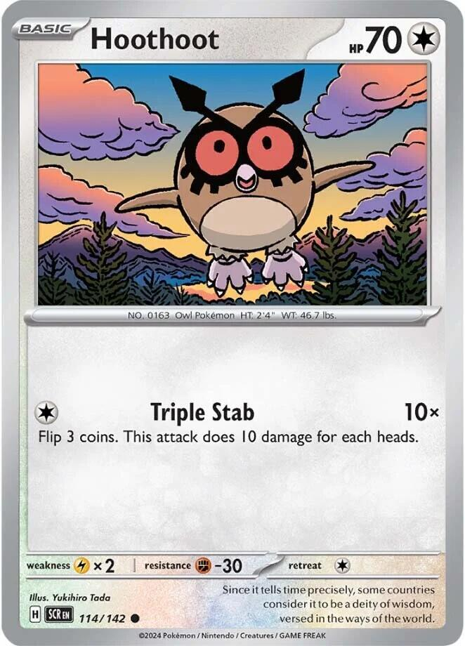
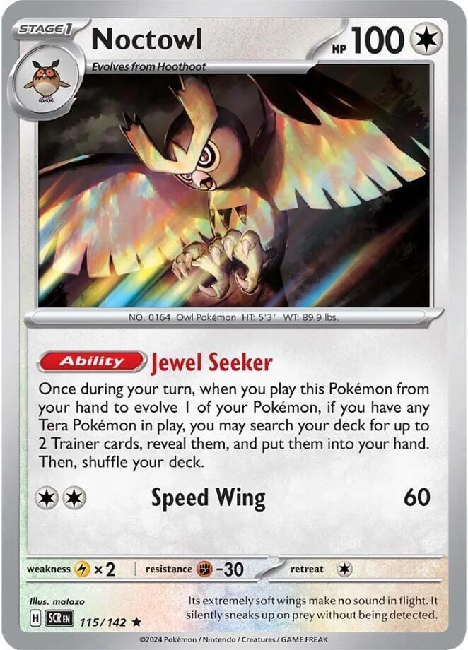
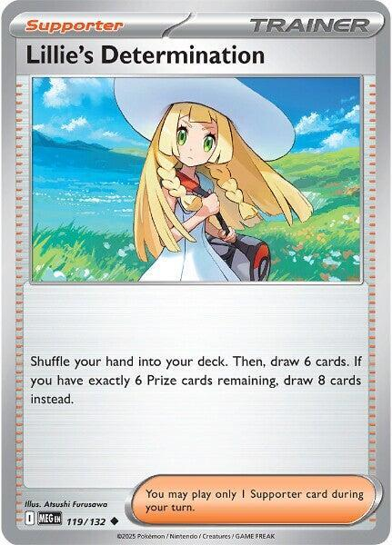
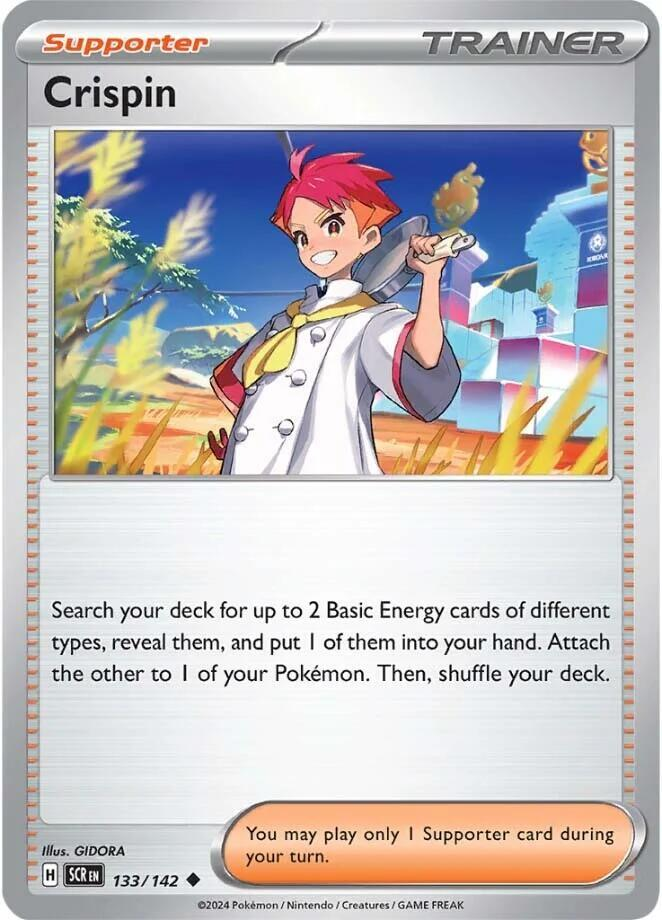
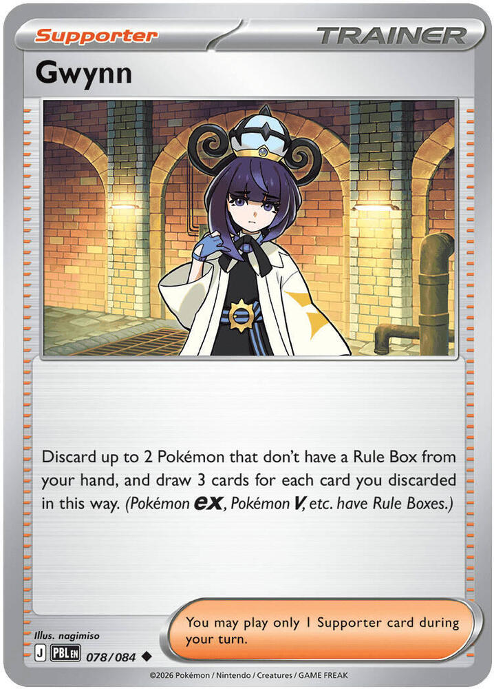
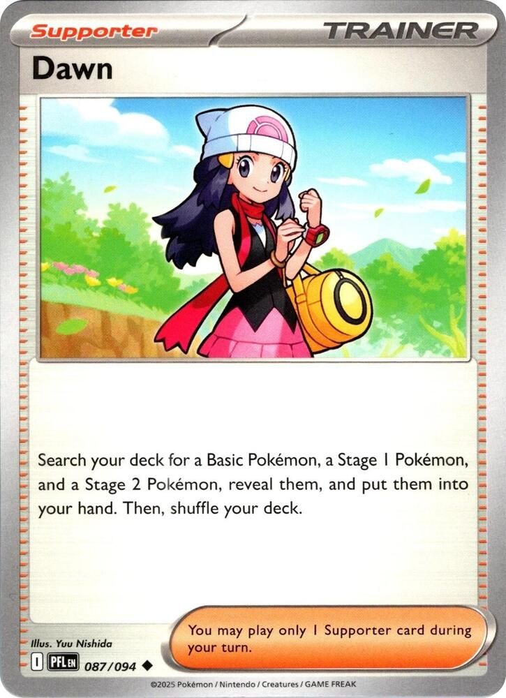
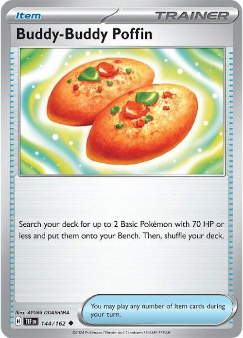
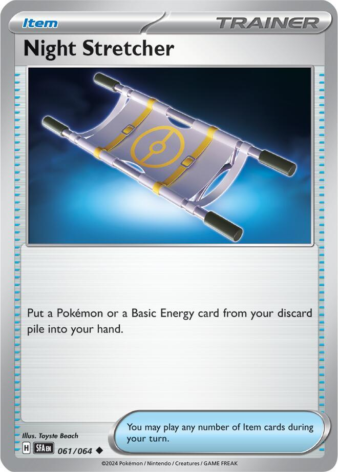
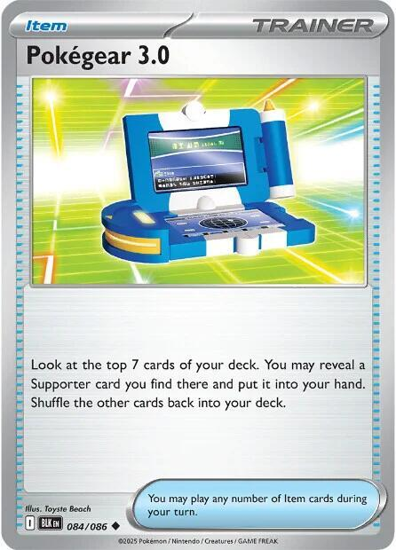
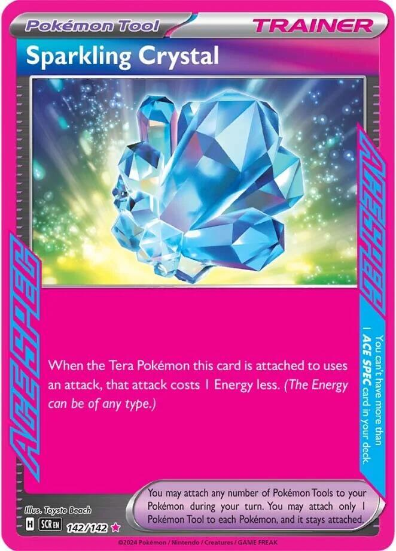

# Flareon Engine

> [!NOTE]
> **How to read this file.**
>
> This is your tournament deck. All 60 cards are in here, one at a time.
>
> The game words live in **[the table rules](./rules.md)**. Most of them you already know from Fire Force; the ones in [the big-card words](./rules.md#the-big-card-words) — ex, Rule Box, Tera, ACE SPEC — are the ones that make this deck different, and those matter.
>
> Then each card has its own page. Every card page has the same parts:
>
> - **General use** — what the card is *for*. Plain and short. If you only read one part, read this one.
> - **Pairing** — the other cards that work well with this one. These are links. Click them and you can follow a combo around the file.
> - **Strategy** — the deeper stuff. When to play it, when *not* to, and the tricks people miss.
> - **Evolution** (Pokémon only) — where the card sits in its family.
>
> The little table on each card page just copies the numbers off the real card, so you can check something fast.
>
> At the end is **[Game Plans](#game-plans)**. That's the good part. The card pages teach you the pieces. The Game Plans teach you how to win.

---

> [!TIP]
> **Your deck is 60 cards.** 16 Pokémon, 31 Trainers, 13 Energy.
>
> This deck is **legal at real tournaments.** Your Fire Force deck isn't, because some of those cards are too old. Every card in here has the right letter on it.

> [!WARNING]
> **This deck plays by different Prize rules, and it's the biggest change.**
>
> In your Fire Force deck, every Pokémon on both sides was worth **1 Prize card**. Even trades. Not here.
>
> **[Flareon ex](#flareon-ex) and [Eevee ex](#eevee-ex) are worth 2 Prize cards each.** So your dad needs only **3 knockouts** to win.
>
> His deck has big Pokémon worth 2 and 3 Prizes too. But his Mega Gengar ex has a trick that makes your knockouts worth **less**. Read **[The Prize Race Changed](#5-the-prize-race-changed)** before you play a single game with this deck.

---

> ### Table of Contents
>
> **Pokémon** — [Eevee](#eevee) · [Eevee ex](#eevee-ex) · [Flareon ex](#flareon-ex) · [Hoothoot](#hoothoot) · [Noctowl](#noctowl)
> **Supporters** — [Lillie's Determination](#lillies-determination) · [Crispin](#crispin) · [Boss's Orders](#bosss-orders-ghetsis) · [Gwynn](#gwynn) · [Dawn](#dawn)
> **Items** — [Buddy-Buddy Poffin](#buddy-buddy-poffin) · [Ultra Ball](#ultra-ball) · [Switch](#switch) · [Night Stretcher](#night-stretcher) · [Pokegear 3.0](#pokegear-30)
> **Tool** — [Sparkling Crystal](#sparkling-crystal)
> **Energy** — [Basic Fire Energy](#basic-fire-energy) · [Basic Water Energy](#basic-water-energy)
>
> [**The Thesis**](#the-thesis) · [**Game Plans**](#game-plans) · [**Beating Dad's Lucky Haunt**](#7-beating-dads-lucky-haunt) · [**Honest Weaknesses**](#honest-weaknesses) · [**Deck List**](#deck-list)

---

## The Thesis

**Flareon ex is not an attacker that happens to find Energy. It is an Energy engine that happens to hit for 130.**

> ***Burning Charge*** [R][C], **130 damage.** Search your deck for up to **2 Basic Energy cards** and attach them to 1 of your Pokémon.

Read what that doesn't say. It doesn't say *Fire* Energy. It says **Basic Energy** — any type, any two, attached to anyone you like. Every attack is also a double Energy attachment.

Three things follow, and they shape the whole deck:

1. **You are never Energy-screwed.** The attack finds Energy from the deck, which is why 13 Energy is enough.
2. **The engine can pay for off-type attacks.** That is what the three Water are really for, and it is what makes [Rainbow DNA](./eevee-standard.md) possible at all.
3. **130 for two Energy is fine damage on its own.** You are not paying extra for the engine.

The second pillar is **Tera**, on every eeveelution ex:

> ***Tera*** — As long as this Pokémon is on your **Bench**, prevent all damage done to it by attacks (both yours and your opponent's).

A benched Flareon ex is untouchable, which is [game plan 4](#4-the-bench-is-a-fortress). And Tera switches on the third piece: [Noctowl's](#noctowl) *Jewel Seeker*, two searched Trainers every time one evolves, which is [game plan 3](#3-jewel-seeker-is-your-real-draw-engine).

---

## Deck List

**Pokémon (16)**

| Qty | Card | Set | Number | Reg |
| --- | --- | --- | --- | --- |
| 4 | Eevee | Prismatic Evolutions | 074 | H |
| 2 | Eevee ex | Prismatic Evolutions | 075 | H |
| 3 | Flareon ex | Prismatic Evolutions | 014 | H |
| 4 | Hoothoot | Stellar Crown | 114 | H |
| 3 | Noctowl | Stellar Crown | 115 | H |

**Trainers — Supporters (15)**

| Qty | Card | Set | Number | Reg |
| --- | --- | --- | --- | --- |
| 4 | Lillie's Determination | Mega Evolution | 119 | I |
| 4 | Crispin | Stellar Crown | 133 | H |
| 3 | Boss's Orders [Ghetsis] | Mega Evolution | 114 | I |
| 2 | Gwynn | Pitch Black | 078 | J |
| 2 | Dawn | Phantasmal Flames | 087 | I |

**Trainers — Items (15)**

| Qty | Card | Set | Number | Reg |
| --- | --- | --- | --- | --- |
| 4 | Buddy-Buddy Poffin | Temporal Forces | 144 | H |
| 4 | Ultra Ball | Mega Evolution | 131 | I |
| 3 | Switch | Mega Evolution | 130 | I |
| 3 | Night Stretcher | Shrouded Fable | 061 | H |
| 1 | Pokegear 3.0 | Black Bolt | 084 | I |

**Trainers — Tool & Stadium (1)**

| Qty | Card | Set | Number | Reg |
| --- | --- | --- | --- | --- |
| 1 | Sparkling Crystal | Stellar Crown | 142 | H |

**Energy (13)**

| Qty | Card | Set | Number | Reg |
| --- | --- | --- | --- | --- |
| 10 | Basic Fire Energy | Mega Evolution Energies | 002 | — |
| 3 | Basic Water Energy | any | — | — |

**16 + 15 + 15 + 1 + 13 = 60.** ✓

---
---

# Pokémon

---

### Eevee


| Key | Val |
| :--- | :--- |
| **How many** | 4 |
| **Set** | SV: Prismatic Evolutions |
| **Number** | 074/131 |
| **Type** | Colorless |
| **HP** | 50 |
| **Stage** | Basic |
| **Weakness** | Fighting ×2 |
| **Retreat** | 1 |
| **Ability** | *Boosted Evolution* — as long as this Pokémon is in the **Active Spot**, it can evolve during your first turn or the turn you play it. |
| **Attack 1** | *Reckless Charge* **[C][C] 30** — this Pokémon also does 10 damage to itself. |

<br clear="all">

#### Evolution

**eevee** → flareon ex

#### General use

Eevee is the fast start, and *Boosted Evolution* is the whole reason.

Normally you play a Basic, wait a turn, then evolve it. Eevee doesn't wait. Play it into the **Active Spot** and you can put [Flareon ex](#flareon-ex) on top of it **the same turn** — even on turn one.

That's a 270 HP attacker on the board before your dad has done anything.

#### Pairing

- **[Flareon ex](#flareon-ex)** — the only thing you want Eevee to become.
- **[Buddy-Buddy Poffin](#buddy-buddy-poffin)** — fetches two Eevee out of your deck for free. They land on the **Bench** though, so read the Strategy below.
- **[Ultra Ball](#ultra-ball)** — grabs the exact Eevee you need.
- **[Night Stretcher](#night-stretcher)** — pulls a knocked-out Eevee back out of the discard pile.

#### Strategy

**The trap is the Bench.** *Boosted Evolution* says **Active Spot**, and it means it. An Eevee sitting on your Bench is a normal Eevee: you have to wait a full turn to evolve it.

So the Eevee you're going to evolve right now has to come **from your hand, into the Active Spot.** [Buddy-Buddy Poffin](#buddy-buddy-poffin) puts Pokémon on the **Bench**, so Poffin is for your *spare* Eevee and your Hoothoot, not for the one you want to grow immediately.

**50 HP is nothing.** Almost anything your dad plays knocks out an Eevee, and his *Chaotic Pain* can do it on your Bench too. That's fine, because you're not planning to leave it there. You play it, you evolve it, and by the time he gets a turn it's a Flareon ex.

**Don't attack with it.** *Reckless Charge* does 30 and hurts itself for 10. On a 50 HP Pokémon that's a third of its life for almost no damage. If you're attacking with Eevee, something went wrong three turns ago.

> [!WARNING]
> **Watch out for Risky Ruins.** Your dad's Stadium puts **2 damage counters (20 damage)** on every Basic Pokémon that isn't a Darkness Pokémon when it goes on the Bench during a turn. None of yours are Darkness.
>
> A benched Eevee under Risky Ruins shows up at **30 HP**. And the damage **stays on it after it evolves**, so your Flareon ex arrives with 20 damage already on it. That 20 matters against your dad. A Flareon ex with 250 HP left is exactly in range of his Okidogi ex's 260.
>
> Pokémon you put down before the game starts never get the counters, and neither does anything you bench before his Ruins hits the table. So play your Poffins early.

---

### Eevee ex


| Key | Val |
| :--- | :--- |
| **How many** | 2 |
| **Set** | SV: Prismatic Evolutions |
| **Number** | 075/131 |
| **Type** | Colorless |
| **HP** | 200 |
| **Stage** | Basic |
| **Weakness** | Fighting ×2 |
| **Retreat** | 1 |
| **Prizes given up** | **2** |
| **Ability 1** | *Rainbow DNA* — this Pokémon can evolve into **any Pokémon ex that evolves from Eevee** if you play it from your hand onto this Pokémon. |
| **Ability 2** | *Tera* — as long as this Pokémon is on your **Bench**, prevent all damage done to this Pokémon by attacks (both yours and your opponent's). |
| **Attack 1** | *Coruscating Quartz* **[R][W][L] 200** |

<br clear="all">

#### Evolution

**eevee ex** → flareon ex

#### General use

Eevee ex is the tough version of Eevee. **200 HP instead of 50.**

It does not have *Boosted Evolution*, so it can't evolve the turn you play it. What it gives you instead is a body that takes most decks two hits to remove.

It also has ***Tera***, the same Ability as [Flareon ex](#flareon-ex). **On your Bench, attacks do zero damage to it.** Most decks can't pick off an Eevee ex while it waits. Your dad's deck can, because his *Chaotic Pain* places damage counters instead of doing damage; see [His answer to *Tera*](#his-answer-to-tera-is-chaotic-pain).

Use plain [Eevee](#eevee) when you want speed. Use Eevee ex when you have a turn to spare and you'd rather not lose anything.

#### Pairing

- **[Flareon ex](#flareon-ex)** — what *Rainbow DNA* turns it into.
- **[Ultra Ball](#ultra-ball)** — the only reliable way to find it. It's too big for Buddy-Buddy Poffin.
- **[Switch](#switch)** — retreat cost 1 is cheap, but Switch is free.
- **[Sparkling Crystal](#sparkling-crystal)** — Eevee ex is a **Tera** Pokémon, so the Tool is allowed to go on it.

#### Strategy

**It is worth 2 Prize cards.** A 200 HP Pokémon feels safe, and then your dad lands two *Chaotic Pains* on it and takes a third of the game for it. Big is not the same as safe when the prize is doubled.

**Buddy-Buddy Poffin cannot find it.** Poffin only fetches Basics with **70 HP or less**. Eevee ex has 200. [Ultra Ball](#ultra-ball) is your search card for this one.

> [!IMPORTANT]
> **Normally you cannot use *Coruscating Quartz*.** It costs **[R][W][L]** — Fire, Water, **and Lightning**. Your deck has 10 Fire and 3 Water and **zero Lightning**.
>
> So most of the time Eevee ex isn't in here to attack. It's a 200 HP body that turns into a Flareon ex, and that's fine.
>
> **The exception is [Sparkling Crystal](#sparkling-crystal).** It takes 1 Energy off the cost, **of any type**. Take off the Lightning and *Coruscating Quartz* costs **[R][W]** — one Fire, one Water, both of which you have. That's a real 200-damage attack off a 200 HP Basic.

---

### Flareon ex


| Key | Val |
| :--- | :--- |
| **How many** | 3 |
| **Set** | SV: Prismatic Evolutions |
| **Number** | 014/131 |
| **Type** | Fire |
| **HP** | 270 |
| **Stage** | Stage 1 (from Eevee) |
| **Weakness** | Water ×2 |
| **Retreat** | 2 |
| **Prizes given up** | **2** |
| **Ability** | *Tera* — as long as this Pokémon is on your **Bench**, prevent all damage done to this Pokémon by attacks (both yours and your opponent's). |
| **Attack 1** | *Burning Charge* **[R][C] 130** — search your deck for up to **2 Basic Energy** cards and attach them to 1 of your Pokémon. |
| **Attack 2** | *Carnelian* **[R][W][L] 280** — during your next turn, this Pokémon can't attack. |

<br clear="all">

#### Evolution

eevee → **flareon ex**

#### General use

**This is the whole deck.** Everything else exists to get a Flareon ex out and keep it attacking.

*Burning Charge* is the card. It does **130 damage** — and then it goes and finds **two more Energy** out of your deck and attaches them anywhere you like. You attack and you build up at the same time, every single turn.

**130 knocks out your dad's small Pokémon, not his big ones.** Gastly, Toxel, Haunter, and Chansey all go down in **one hit**, with no Leon, no set-up, and no coin flips. His ex Pokémon have 250 to 350 HP, so each one takes two or three hits. [The numbers to remember](#the-numbers-to-remember) has all of them.

#### Pairing

- **[Eevee](#eevee)** — the fast way to get here, on turn one.
- **[Eevee ex](#eevee-ex)** — the tough way to get here.
- **[Sparkling Crystal](#sparkling-crystal)** — makes *Burning Charge* cost **one** Energy instead of two.
- **[Crispin](#crispin)** — hands you the Fire Energy to start the engine.
- **[Switch](#switch)** — pulls a hurt Flareon ex back to the Bench, where *Tera* makes it untouchable.
- **[Noctowl](#noctowl)** — its Ability only works if you have a **Tera** Pokémon in play. Flareon ex and [Eevee ex](#eevee-ex) both count.

#### Strategy

***Tera* is the best Ability in the deck, and it only works on the Bench.** While a Flareon ex is benched, attacks do **zero** damage to it. Not reduced. Zero.

Against most decks, that means the only Pokémon they can attack is whichever one is in your **Active Spot**.

**Your dad's deck is the exception.** His Gengar ex's *Chaotic Pain* doesn't do damage. It *places 13 damage counters*, and *Tera* can't stop counters. So against your dad, a benched Flareon ex is safe from *Void Gale*, *Chain-Crazed*, and *Return*, and it is **not** safe from *Chaotic Pain*.

**So the pattern is: build on the Bench, step forward, hit, step back.** Attack with one Flareon ex, and when it gets low, [Switch](#switch) it to the Bench and bring up a fresh one. Against most decks the hurt one is now completely safe.

**Against your dad, step back only with more than 130 HP left.** A Flareon ex with 130 or less dies to one *Chaotic Pain* wherever it sits. If it is going to die anyway, let it swing one more time.

**Free Energy every turn adds up fast.** *Burning Charge* attaches 2 Energy on top of the 1 you attach by hand. That's 3 Energy a turn while you're also doing 130 damage. Put them on the Flareon ex sitting on your Bench, so your *next* attacker is already loaded before it ever steps out.

> [!IMPORTANT]
> ***Carnelian* costs [R][W][L], and your deck has no Lightning Energy.** So normally you can't use it at all.
>
> **Unless you have [Sparkling Crystal](#sparkling-crystal) attached.** It takes 1 Energy off the cost, **of any type**. Drop the Lightning and *Carnelian* costs **[R][W]** — one Fire, one Water. That you can do, and *Burning Charge* can go and fetch you the Water.
>
> Even then, think before using it. 280 damage looks amazing, but *"this Pokémon can't attack next turn"* means you give your dad a completely free turn. In a deck where losing a Flareon ex costs you **2 Prize cards**, a free turn is exactly what he wants.
>
> Two *Burning Charges* do **260** across two turns and never skip. Against most Pokémon that's almost the same damage with none of the risk. Use *Burning Charge*.
>
> **Your dad's Gengar ex is the exception.** It has exactly 280 HP, so two *Burning Charges* leave it alive at 20, and *Carnelian* knocks it out in one hit. See [Gengar ex, his closer](#gengar-ex-his-closer-280-hp).

---

### Hoothoot



| Key | Val |
| :--- | :--- |
| **How many** | 4 |
| **Set** | SV07: Stellar Crown |
| **Number** | 114/142 |
| **Type** | Colorless |
| **HP** | 70 |
| **Stage** | Basic |
| **Weakness** | Lightning ×2 |
| **Resistance** | Fighting −30 |
| **Retreat** | 1 |
| **Attack 1** | *Triple Stab* **[C] 10×** — flip 3 coins. This attack does 10 damage for each heads. |

<br clear="all">

#### Evolution

**hoothoot** → noctowl

#### General use

Hoothoot has one job: **be a Hoothoot so it can become a [Noctowl](#noctowl).** That's it. It never attacks and it never wins you a game by itself.

You have 4 because Noctowl's Ability is the best draw engine in the deck, and you can't have a Noctowl without a Hoothoot underneath it first.

#### Pairing

- **[Noctowl](#noctowl)** — the only reason Hoothoot is in the deck.
- **[Buddy-Buddy Poffin](#buddy-buddy-poffin)** — 70 HP exactly, so Poffin can fetch it. That's not a coincidence.
- **[Gwynn](#gwynn)** — Hoothoot has no Rule Box, so a spare one is perfect Gwynn fuel.

#### Strategy

**Bench them early and bench more than one.** Every Hoothoot on your Bench is a Noctowl you can evolve later, and each evolution is **two free Trainer cards**. Holding Hoothoot back in your hand is holding back your own draw engine.

**70 HP is the magic number for [Buddy-Buddy Poffin](#buddy-buddy-poffin).** Poffin fetches Basics with **70 HP or less**, and Hoothoot is exactly 70. So one Poffin can grab an Eevee *and* a Hoothoot in one go, for free, without using your Supporter.

**Don't attack with it.** *Triple Stab* flips 3 coins for 10 each. On average that's 15 damage. Your dad's smallest Pokémon has 70 HP.

---

### Noctowl



| Key | Val |
| :--- | :--- |
| **How many** | 3 |
| **Set** | SV07: Stellar Crown |
| **Number** | 115/142 |
| **Type** | Colorless |
| **HP** | 100 |
| **Stage** | Stage 1 (from Hoothoot) |
| **Weakness** | Lightning ×2 |
| **Resistance** | Fighting −30 |
| **Retreat** | 1 |
| **Ability** | *Jewel Seeker* — once during your turn, when you play this Pokémon from your hand to evolve 1 of your Pokémon, **if you have any Tera Pokémon in play**, search your deck for up to **2 Trainer cards** and put them into your hand. |
| **Attack 1** | *Speed Wing* **[C][C] 60** |

<br clear="all">

#### Evolution

hoothoot → **noctowl**

#### General use

Noctowl is your draw engine, and it doesn't work like a normal one.

Most draw cards give you random cards. *Jewel Seeker* lets you **pick the exact two Trainers you want** out of your whole deck. Need a Boss's Orders to finish the game? Go get it. Need a Switch to escape? Go get it.

The catch is in the wording: it only fires **the moment you evolve a Hoothoot into it**, and only if you have a **Tera** Pokémon in play. Both [Flareon ex](#flareon-ex) and [Eevee ex](#eevee-ex) are Tera, so that part is almost always true.

#### Pairing

- **[Flareon ex](#flareon-ex)** — a Tera Pokémon, which is what switches *Jewel Seeker* on.
- **[Eevee ex](#eevee-ex)** — also Tera, so it turns *Jewel Seeker* on too. Even a benched one counts.
- **[Hoothoot](#hoothoot)** — has to be on your Bench first.
- **[Boss's Orders](#bosss-orders-ghetsis)** — the best thing to go and fetch when you're close to winning.
- **[Sparkling Crystal](#sparkling-crystal)** — if you haven't drawn it yet, *Jewel Seeker* can go find it.

#### Strategy

**You have 3 Noctowl, so you get 3 uses. Don't waste them.** The most common mistake is evolving every Hoothoot the moment you draw a Noctowl. That burns all three uses early, when you don't need anything specific.

**Save one.** Keep a Hoothoot on the Bench and a Noctowl in your hand, and evolve it on the turn you actually need a card. That's not a draw engine any more — that's a card that says *"go get any two Trainers in my deck."*

**Check the Tera condition first.** You need a Flareon ex *or* an Eevee ex somewhere in play. If both are gone, *Jewel Seeker* does nothing. Evolve the Hoothoot anyway if you need the HP, just don't count on the cards.

**100 HP is real.** Noctowl can hold the Active Spot for a turn while you set up behind it. *Speed Wing* does 60, which is 10 short of a Gastly or a Toxel.

**Against your dad, Noctowl is a secret finisher.** It isn't a Pokémon ex, so his Mega Gengar ex can't shrink the Prizes it takes, and if it finishes a Gengar ex and his coin comes up heads, he only gets 1 Prize for it. When one of his Pokémon is down to 60 HP or less, let Noctowl take it. [Mega Gengar ex shrinks your Prizes](#mega-gengar-ex-shrinks-your-prizes) explains why.

> [!TIP]
> ***Jewel Seeker* fires when you evolve, not when you attack.** So it costs you nothing. You can use it, then play a Supporter, then attack, all on the same turn. Abilities are free.

---
---

# Trainers — Supporters

> [!IMPORTANT]
> **You may play only ONE Supporter per turn.** You have 10 of them. Picking the right one is the biggest decision you make most turns.

---

### Lillie's Determination



| Key | Val |
| :--- | :--- |
| **How many** | 4 |
| **Set** | ME01: Mega Evolution |
| **Number** | 119/132 |
| **Type** | Trainer — Supporter |

> Shuffle your hand into your deck. Then, draw 6 cards. If you have exactly 6 Prize cards remaining, draw **8** cards instead.

<br clear="all">

#### General use

This is your reset button. Bad hand? Shuffle the whole thing away and draw a fresh 6.

The important part is that it **shuffles**, it doesn't discard. Nothing is lost. If you shuffle away a Flareon ex, it goes back into your deck where [Ultra Ball](#ultra-ball) can find it again.

#### Pairing

- **[Ultra Ball](#ultra-ball)** — play your Ultra Balls **first**, then Lillie's. Balls turn junk into the card you want; Lillie's throws everything away either way.
- **[Noctowl](#noctowl)** — *Jewel Seeker* is free and happens before your Supporter. Use it first so you know what you still need.

#### Strategy

**Play it on turn one whenever you can.** If you still have all **6 Prize cards**, Lillie's draws **8** instead of 6. That bonus only exists before anyone has knocked anything out, so it's a first-turn card. Two extra cards for free is a lot.

**Empty your hand before you play it.** Every card you were holding gets shuffled away. So play your Items first, attach your Energy first, evolve first — then Lillie's, then attack. Follow **[The Turn Checklist](#9-the-turn-checklist)** and this happens automatically.

---

### Crispin



| Key | Val |
| :--- | :--- |
| **How many** | 4 |
| **Set** | SV07: Stellar Crown |
| **Number** | 133/142 |
| **Type** | Trainer — Supporter |

> Search your deck for up to 2 Basic Energy cards of **different types**. Put 1 into your hand and attach the other to 1 of your Pokémon.

<br clear="all">

#### General use

Crispin gets your engine started. It finds Energy in your deck and puts one of them **straight onto a Pokémon** — that attachment doesn't use up your one-per-turn attachment.

So on a Crispin turn you can attach **two** Energy: one by hand, one from Crispin.

#### Pairing

- **[Flareon ex](#flareon-ex)** — Crispin gets you to *Burning Charge* a turn earlier, and after that Burning Charge does the finding for you.
- **[Basic Water Energy](#basic-water-energy)** — the reason those 3 Water cards are in the deck at all.

#### Strategy

**"Different types" is a rule, not a suggestion.** You can't grab two Fire. You must take one Fire and one of something else, and the only something else you own is **Water**. So the real result of Crispin is: **one Fire Energy, plus one Water Energy.**

**Usually: attach the Fire, keep the Water.** Early on you're playing Crispin to get *Burning Charge* online, and that wants Fire.

**But hold on to that Water.** If you have [Sparkling Crystal](#sparkling-crystal) on a Flareon ex, one Fire plus one Water is exactly what *Carnelian* costs. Crispin can hand you both halves of a 280-damage attack in a single card.

**It's a turn-one and turn-two card.** Once a Flareon ex is attacking, *Burning Charge* finds 2 Energy every single turn for free, and Crispin becomes the weakest Supporter in your deck. Play it early, then stop.

---

### Boss's Orders [Ghetsis]


| Key | Val |
| :--- | :--- |
| **How many** | 3 |
| **Set** | ME01: Mega Evolution |
| **Number** | 114/132 |
| **Type** | Trainer — Supporter |

> Switch in 1 of your opponent's Benched Pokémon to the Active Spot.

<br clear="all">

#### General use

Boss's Orders reaches past whatever your dad is hiding behind and drags out the Pokémon you actually want to knock out.

This is how you finish games. He hides a hurt Gengar ex on the Bench; you drag it out and finish it.

#### Pairing

- **[Flareon ex](#flareon-ex)**: 130 damage knocks out his Gastly, Toxel, Haunter, or Chansey in one hit. His ex Pokémon need two or three.
- **[Noctowl](#noctowl)** — *Jewel Seeker* can go and find a Boss's Orders on the exact turn you need it.

#### Strategy

**Save them for Prize cards, not for fun.** You only have 3. Each one should be the difference between taking a Prize and not taking one.

**Count first.** Before you play it, work out whether 130 actually knocks out the thing you're dragging. Against your dad it does for his small Pokémon. His ex Pokémon have 250 to 350 HP, so drag one out only when it's already hurt, or when you can hit it two turns in a row.

**The best thing to drag out of his deck is [Blissey ex](#blissey-ex-the-one-to-drag-out).** It costs 4 Energy to retreat, so it gets stuck, and it's worth 2 Prizes even when his Mega Gengar ex is in play.

**He has a Boss's Orders too, but his real answer to *Tera* is *Chaotic Pain*.** See **[Beating Dad's Lucky Haunt](#7-beating-dads-lucky-haunt)**. A Flareon ex on your Bench is safe from his attacks that do damage. It is not safe from his damage counters.

---

### Gwynn



| Key | Val |
| :--- | :--- |
| **How many** | 2 |
| **Set** | ME05: Pitch Black |
| **Number** | 078/084 |
| **Type** | Trainer — Supporter |

> Discard up to 2 Pokémon that **don't have a Rule Box** from your hand, and draw 3 cards for each card you discarded in this way.

<br clear="all">

#### General use

Gwynn turns spare Pokémon into cards. Discard two, draw six.

The words **"don't have a Rule Box"** are doing all the work here. That means Gwynn can discard your [Eevee](#eevee), [Hoothoot](#hoothoot), and [Noctowl](#noctowl). It **cannot** discard [Flareon ex](#flareon-ex) or [Eevee ex](#eevee-ex).

#### Pairing

- **[Hoothoot](#hoothoot)** — you have 4 and you rarely need all of them. Best Gwynn fuel in the deck.
- **[Night Stretcher](#night-stretcher)** — gets a discarded Pokémon straight back. Gwynn isn't really throwing them away.

#### Strategy

**Six cards for two you weren't using is a great deal.** Late in the game you'll be holding a spare Hoothoot and a spare Eevee that will never be played. That's a 6-card Gwynn.

**Check the Rule Box before you plan around it.** If your hand is a Flareon ex and an Eevee ex, Gwynn draws you **nothing.** It is a dead card in that hand. Play [Lillie's Determination](#lillies-determination) instead.

**Discard *up to* 2.** You can discard just one and draw 3, if that's all you can spare.

---

### Dawn



| Key | Val |
| :--- | :--- |
| **How many** | 2 |
| **Set** | ME02: Phantasmal Flames |
| **Number** | 087/094 |
| **Type** | Trainer — Supporter |

> Search your deck for a Basic Pokémon, a Stage 1 Pokémon, and a Stage 2 Pokémon, reveal them, and put them into your hand. Then, shuffle your deck.

<br clear="all">

#### General use

Dawn reaches into your deck and pulls out a whole evolution line at once. In this deck that means an [Eevee](#eevee) and the [Flareon ex](#flareon-ex) it grows into, both into your hand, off one card.

Your deck has no Stage 2 Pokémon in it at all. That's fine. You are allowed to find fewer cards than a card asks for, so you take the two that exist and shuffle.

#### Pairing

- **[Eevee](#eevee)** and **[Flareon ex](#flareon-ex)** — the Basic and the Stage 1. This is the pair Dawn is in the deck for.
- **[Hoothoot](#hoothoot)** and **[Noctowl](#noctowl)** — the other legal pair. Take these when what you're missing is the draw engine, not the attacker.
- **[Ultra Ball](#ultra-ball)** — Ultra Ball finds the same Flareon ex but charges you 2 cards out of your hand. If you have Dawn, play Dawn and keep the Ultra Ball for later.

#### Strategy

**This is a setup card, so it is at its best on turn one or two.** [Buddy-Buddy Poffin](#buddy-buddy-poffin) fills your Bench with Basics. Dawn does the other half: it hands you the Eevee *and* the thing it evolves into, so your next turn is already decided.

**You only get one Supporter a turn, and you only have 2 Dawn.** Playing Dawn means not playing [Lillie's Determination](#lillies-determination). Early, when you know exactly which card you're missing, Dawn wins. Later, when you just need more cards, Lillie's wins.

**Dead late.** Once your board is built, Dawn finds you two Pokémon you already have in play. If it's still in your hand at that point it's [Gwynn](#gwynn) fuel, not a play.

---
---

# Trainers — Items

> [!IMPORTANT]
> **Items are free.** Play as many as you want in one turn. Play them **before** your Supporter, so you know what you still need.

---

### Buddy-Buddy Poffin



| Key | Val |
| :--- | :--- |
| **How many** | 4 |
| **Set** | SV05: Temporal Forces |
| **Number** | 144/162 |
| **Type** | Trainer — Item |

> Search your deck for up to 2 Basic Pokémon with **70 HP or less** and put them onto your Bench.

<br clear="all">

#### General use

Two Pokémon out of your deck, onto your Bench, for free, without using your Supporter for the turn. This is the best Item in the deck.

The usual grab is **one [Eevee](#eevee) and one [Hoothoot](#hoothoot)**. Both are 70 HP or less. Both are things you want on the Bench.

#### Pairing

- **[Hoothoot](#hoothoot)** — exactly 70 HP, so Poffin can always fetch it.
- **[Eevee](#eevee)** — 50 HP, also fine.
- **[Noctowl](#noctowl)** — Poffin puts the Hoothoot down; Noctowl evolves it next turn for two free Trainers.

#### Strategy

> [!CAUTION]
> **Poffin puts Pokémon on the BENCH.** [Eevee's](#eevee) *Boosted Evolution* only works in the **Active Spot**.
>
> So a Poffin Eevee **cannot** become a Flareon ex this turn. If you want the turn-one Flareon ex, that Eevee has to come out of your **hand** and into the **Active Spot**. Use Poffin for your *second* Eevee and your Hoothoot.
>
> Getting this backwards is the single easiest way to lose a whole turn with this deck.

**It cannot find [Eevee ex](#eevee-ex).** 200 HP is way over the limit. Use [Ultra Ball](#ultra-ball) for that.

**It's free, so play it early.** There is almost never a reason to hold a Poffin. Bench bodies are what this deck runs on.

---

### Ultra Ball


| Key | Val |
| :--- | :--- |
| **How many** | 4 |
| **Set** | ME01: Mega Evolution |
| **Number** | 131/132 |
| **Type** | Trainer — Item |

> You can use this card only if you **discard 2 other cards** from your hand. Search your deck for **a Pokémon**, reveal it, and put it into your hand.

<br clear="all">

#### General use

Ultra Ball finds **any** Pokémon in your deck. Not "a Basic," not "70 HP or less." Any of them. Flareon ex, Eevee ex, Noctowl, whatever you need.

The price is discarding 2 cards from your hand first.

#### Pairing

- **[Eevee ex](#eevee-ex)** — the only card in the deck that can find it.
- **[Flareon ex](#flareon-ex)** — when you need a second one right now.
- **[Night Stretcher](#night-stretcher)** — gets back a Pokémon you discarded to pay for the Ball.
- **[Lillie's Determination](#lillies-determination)** — play your Ultra Balls **first**, then Lillie's.

#### Strategy

**Pay with cards you can get back.** A spare Hoothoot is the best discard in the deck — you have 4, you need maybe 2, and [Night Stretcher](#night-stretcher) can fetch one back anyway. A spare Basic Energy is fine too, since *Burning Charge* pulls Energy from your deck, not your hand.

**Never pay with your last Flareon ex.** Obvious when you read it here, easy to do at the table when you're rushing.

**Order matters.** Ultra Ball first, [Lillie's Determination](#lillies-determination) second. If you do it the other way round you shuffle away the cards you were going to pay with.

---

### Switch


| Key | Val |
| :--- | :--- |
| **How many** | 3 |
| **Set** | ME01: Mega Evolution |
| **Number** | 130/132 |
| **Type** | Trainer — Item |

> Switch your Active Pokémon with 1 of your Benched Pokémon.

<br clear="all">

#### General use

Switch moves your Active Pokémon to the Bench and brings up whoever you want, **for free** — no Energy, no retreat cost.

In most decks Switch is a small convenience card. In this deck it's a defensive weapon, because of *Tera*.

#### Pairing

- **[Flareon ex](#flareon-ex)** — Switch a hurt one back to the Bench and attacks can't touch it any more. This is the best card interaction in your deck.
- **[Noctowl](#noctowl)** — *Jewel Seeker* can go and find a Switch when you're stuck.

#### Strategy

**Switch beats Confusion.** A Special Condition goes away the moment a Pokémon leaves the Active Spot. Plenty of tournament decks Confuse or Paralyze your Active Pokémon, and a Confused Flareon ex is a coin flip away from doing nothing all turn.

Switching out clears it instantly, and unlike retreating it costs no Energy.

**Switch turns a hurt Flareon ex into a safe one, against most decks.** Your Flareon ex is at 40 HP and about to die. Switch it to the Bench. Now *Tera* means it takes **zero** damage from attacks. It's still hurt, but they can't finish it unless they have a Boss's Orders.

**Against your dad, it doesn't work that way.** His Gengar ex's *Chaotic Pain* places 130 worth of damage counters on any of your Pokémon, Bench included, so a Flareon ex at 40 HP dies on the Bench too. Against him, Switch is for bringing up a **fresh** attacker, not for hiding a hurt one.

**Three copies is not many.** Don't burn one just to reposition. Save them for Special Conditions and for saving a Flareon ex.

---

### Night Stretcher



| Key | Val |
| :--- | :--- |
| **How many** | 3 |
| **Set** | SV: Shrouded Fable |
| **Number** | 061/064 |
| **Type** | Trainer — Item |

> Put **a Pokémon or a Basic Energy card** from your discard pile into your hand.

<br clear="all">

#### General use

Night Stretcher reaches into your discard pile and takes one thing back. A Pokémon **or** a Basic Energy — you choose when you play it.

It's why discarding to [Ultra Ball](#ultra-ball) and [Gwynn](#gwynn) doesn't really hurt.

#### Pairing

- **[Ultra Ball](#ultra-ball)** — pay with a Hoothoot, take the Hoothoot back later.
- **[Gwynn](#gwynn)** — same trick, two cards at a time.
- **[Flareon ex](#flareon-ex)** — when your dad knocks one out, this is how you get it back.

#### Strategy

**Getting a knocked-out Flareon ex back is the big one.** He spent a whole turn and two of your Prize cards removing it. Night Stretcher puts the card back in your hand for free. You still need an Eevee to evolve, but the hard part is back.

**One card at a time.** Not "a Pokémon and an Energy." One or the other.

**Basic Energy only.** Your deck only has Basic Energy, so this never actually limits you.

---

### Pokegear 3.0



| Key | Val |
| :--- | :--- |
| **How many** | 1 |
| **Set** | SV: Black Bolt |
| **Number** | 084/086 |
| **Type** | Trainer — Item |

> Look at the top 7 cards of your deck. You may reveal a Supporter card you find there and put it into your hand. Shuffle the other cards back into your deck.

<br clear="all">

#### General use

Pokegear looks 7 cards deep and gives you a Supporter out of them.

It's an Item, so it's free. Play it *first*, see which Supporter it finds, then play that Supporter in the same turn.

#### Pairing

- **[Lillie's Determination](#lillies-determination)** — the one you want most often. Pokegear turns a turn with no Supporter into a 6-card draw.
- **[Crispin](#crispin)** — when the problem is Energy rather than cards.
- **[Boss's Orders](#bosss-orders-ghetsis)** — you only run 3, so this is a fourth copy on the turn a Prize card is sitting on his Bench.

#### Strategy

**This is your insurance card.** The turn where your hand has no Supporter in it is the turn you lose the game. There are 13 Supporters in your deck, so 7 cards off the top will usually contain one.

**Usually, not always.** If it whiffs, you've lost nothing but the card. Play it early in the turn so a miss still leaves you time to do something else.

**One copy on purpose.** It doesn't do anything by itself. Two Pokegear in one hand is one wasted card.

---
---

# Trainers — Tool & Stadium

---

### Sparkling Crystal



| Key | Val |
| :--- | :--- |
| **How many** | **1** (ACE SPEC) |
| **Set** | SV07: Stellar Crown |
| **Number** | 142/142 |
| **Type** | Trainer — Pokémon Tool |

> Attach to a **Tera** Pokémon. When the Tera Pokémon this card is attached to uses an attack, that attack costs **1 Energy less**. (The Energy can be of any type.)

<br clear="all">

#### General use

Attach it to a [Flareon ex](#flareon-ex) and *Burning Charge* costs **one** Fire Energy instead of two.

That doesn't sound huge until you count turns. Without it you need two Energy before you can attack. With it you need one, which means you can attack a full turn earlier.

**It goes on any Tera Pokémon, and you have two kinds:** [Flareon ex](#flareon-ex) and [Eevee ex](#eevee-ex).

#### Pairing

- **[Flareon ex](#flareon-ex)** — the usual home. Makes *Burning Charge* cost one Energy.
- **[Eevee ex](#eevee-ex)** — also Tera, so also a legal target.
- **[Noctowl](#noctowl)** — *Jewel Seeker* can go and find this exact card.

#### Strategy

> [!WARNING]
> **ACE SPEC means one per deck. One card, total.** Not one of each ACE SPEC — **one ACE SPEC in the whole 60.** If you ever want a different ACE SPEC, this one comes out.

**Attach it to a Flareon ex on the Bench.** *Tera* means a benched Flareon ex can't be attacked, so the Tool can't be knocked off with it. Attach it to your *next* attacker, not your current one.

**It only works on Tera Pokémon.** You cannot put it on [Noctowl](#noctowl), [Hoothoot](#hoothoot), or plain [Eevee](#eevee). Flareon ex and Eevee ex are your only two targets.

> [!TIP]
> **The hidden trick: it can turn on an attack you couldn't pay for.**
>
> *Carnelian* costs [R][W][**L**] and you own no Lightning. Sparkling Crystal takes off **1 Energy of any type** — so take off the Lightning, and it costs [R][W]. One Fire, one Water. Suddenly it's a real 280-damage attack.
>
> Same trick makes Eevee ex's *Coruscating Quartz* cost [R][W] for 200.
>
> **This one card quietly unlocks two attacks the deck otherwise cannot use at all.** It's the main reason it's worth the ACE SPEC slot.

---
---

# Energy

---

### Basic Fire Energy


| Key | Val |
| :--- | :--- |
| **How many** | 10 |
| **Set** | MEE: Mega Evolution Energies (any Fire Energy works) |
| **Number** | 002 |
| **Type** | Energy — Basic |

> *Provides [R] Fire Energy.*

<br clear="all">

#### General use

The Energy that actually runs your deck. *Burning Charge* costs **[R][C]** — one Fire, plus one of anything. Both of those can be Fire.

#### Pairing

- **[Flareon ex](#flareon-ex)** — *Burning Charge* searches your deck for more of these every time you attack.
- **[Crispin](#crispin)** — finds one and attaches it for free.
- **[Night Stretcher](#night-stretcher)** — pulls one back out of the discard pile.

#### Strategy

**Ten Energy in 60 cards sounds low. It isn't.** Most decks need to *draw* their Energy. You go and *fetch* yours: *Burning Charge* finds 2 every turn, Crispin finds 2 more, and Night Stretcher recycles them. You will almost never be stuck without Energy after turn two.

**Attach to a benched Flareon ex whenever you can.** *Tera* protects it while it loads up. By the time it steps into the Active Spot it's already ready to attack.

---

### Basic Water Energy

| Key | Val |
| :--- | :--- |
| **How many** | 3 |
| **Set** | any |
| **Type** | Energy — Basic |

> *Provides [W] Water Energy.*

#### General use

Water does two jobs in this deck, and neither one is obvious.

**Job 1: it makes [Crispin](#crispin) work.** Crispin makes you take two Basic Energy of **different types**. With only Fire in the deck, Crispin would only ever find one card.

**Job 2: it pays for the big attacks, but only with [Sparkling Crystal](#sparkling-crystal).** *Carnelian* and *Coruscating Quartz* both cost [R][W][**L**], and you own no Lightning. Sparkling Crystal takes off 1 Energy of any type. Take off the Lightning and both attacks cost **[R][W]** — one Fire, one Water.

#### Pairing

- **[Crispin](#crispin)** — the card that needs a second Energy type to exist.
- **[Sparkling Crystal](#sparkling-crystal)** — turns Water from a spare card into attack fuel.
- **[Flareon ex](#flareon-ex)** — *Burning Charge* searches **Basic Energy**, not Fire Energy. It can go and fetch you a Water.

#### Strategy

**Only 3 of them, so don't waste one.** Attaching a Water to a Pokémon that will never use *Carnelian* is a wasted attachment. Fire is almost always the right attach.

**Let *Burning Charge* find the Water instead.** It searches your deck for **any 2 Basic Energy** and attaches them wherever you like. So the real line is: attack with *Burning Charge*, use it to place a Water on the Flareon ex wearing Sparkling Crystal, and now *Carnelian* is armed for next turn.

> [!TIP]
> **Against your dad, *Carnelian* is a real weapon.** His Gengar ex has exactly 280 HP and his Okidogi ex has 250, so *Carnelian* knocks out either one in one hit. *Burning Charge* needs three hits for a Gengar ex.
>
> Where 280 matters at a **real tournament** is the same: big Pokémon that shrug off 130. Those are the games where these three Water cards win you something.

---
---

# Game Plans

> These are the real plans. Learn these and you know how to play the deck. Everything above is just the parts list.

---

## 1. The Two-Energy Engine

**This is your deck's main plan. If you only learn one thing, learn this.**

[Flareon ex's](#flareon-ex) *Burning Charge* does two things at once:

```
Burning Charge  [R][C]
  1. 130 damage.
  2. Search your deck for 2 Basic Energy.
     Attach them to ANY 1 of your Pokemon.
```

Most attacks just do damage. This one **pays for your next attack while it's doing it.**

Count the Energy you gain in a turn:

| Where it comes from | How much |
| :--- | :--- |
| Your normal attachment from hand | 1 |
| *Burning Charge* | **2** |
| **Total per turn** | **3** |

You spend two Energy to attack. You gain three. **You get further ahead every single turn.**

**130 is a good number against your dad, not a magic one.** It knocks out his Gastly, Toxel, Haunter, and Chansey in one hit. His Okidogi ex (250), Gengar ex (280), Blissey ex (300), and Mega Gengar ex (350) take two or three. That's why the engine matters so much: every hit also loads your next attacker, so you can keep hitting every turn until the big ones fall.

Compare that to your Fire Force deck, where you had to build up Leons in the discard pile just to reach 150. Here you start at 130 with no Leons and no set-up.

> [!TIP]
> **Put the 2 free Energy on a Flareon ex sitting on your Bench.** Attacks can't damage it there, thanks to *Tera*. Your dad's *Chaotic Pain* can, but a healthy Flareon ex lives through two of them, because 260 is 10 short of 270. So while your Active Flareon ex is fighting, a second fully-loaded one is quietly getting ready behind it. When the first one gets low, [Switch](#switch) them.

---

## 2. Turn One, Flareon

**The best possible start, and the one rule that ruins it.**

[Eevee's](#eevee) *Boosted Evolution* lets it evolve the turn you play it. That breaks the normal rule, and it's how you get a 270 HP attacker down before your dad has done anything.

```
1. Play EEVEE into the ACTIVE SPOT.  (from your hand!)
2. Evolve it into FLAREON EX.        (same turn - Boosted Evolution)
3. Buddy-Buddy Poffin -> Eevee + Hoothoot onto the Bench.
4. Attach a Fire Energy.
5. Lillie's Determination -> draw 8. (you still have all 6 Prizes)
```

Next turn you attach one more Fire and *Burning Charge* for 130.

> [!CAUTION]
> **The Active Spot part is not optional.**
>
> *Boosted Evolution* says **"as long as this Pokémon is in the Active Spot."** [Buddy-Buddy Poffin](#buddy-buddy-poffin) puts Pokémon on the **Bench**. So a Poffin Eevee is a normal Eevee that has to wait a turn.
>
> The Eevee you're evolving right now comes from your **hand**, into the **Active Spot**. Poffin is for the *other* ones.

**If you have [Sparkling Crystal](#sparkling-crystal), attach it.** *Burning Charge* then costs one Fire instead of two, and you can attack on turn two with a single Energy attachment.

---

## 3. Jewel Seeker Is Your Real Draw Engine

**[Noctowl](#noctowl) doesn't draw you cards. It hands you the exact cards you name.**

*Jewel Seeker* fires when you **evolve a Hoothoot into a Noctowl**, as long as a **Tera** Pokémon is in play. [Flareon ex](#flareon-ex) and [Eevee ex](#eevee-ex) are both Tera, and one of them is nearly always on your board.

You get **2 Trainer cards of your choice** out of your deck.

**You have 3 Noctowl. That's 3 uses in the whole game.** The mistake is spending them all in the first two turns because you happen to have the cards in hand.

**Instead, keep a Hoothoot benched and a Noctowl in hand.** Now you're holding a card that says *"at any time, take any two Trainers from my deck."* That's not a draw engine, that's a toolbox.

Best things to go and get:

| Situation | Fetch |
| :--- | :--- |
| You can win this turn if you reach his Bench | **[Boss's Orders](#bosss-orders-ghetsis)** |
| You're Confused and stuck | **[Switch](#switch)** |
| You still haven't seen your ACE SPEC | **[Sparkling Crystal](#sparkling-crystal)** |
| Your Flareon ex got knocked out | **[Night Stretcher](#night-stretcher)** |
| You need a Pokémon, not a Trainer | **[Ultra Ball](#ultra-ball)** — Jewel Seeker only takes Trainers, so take the Ball and let it find the Pokémon |

> [!TIP]
> **Abilities are free and they don't end your turn.** Evolve, take your two Trainers, *then* play your Supporter, *then* attack. All in one turn.

---

## 4. The Bench Is a Fortress

**This is the exact opposite of your old deck's biggest problem.**

In your Fire Force deck, Charmanders sat on the Bench getting picked off for three turns while you tried to build a Charizard. Every one of them was a free Prize card for dad.

Now look at *Tera*:

> As long as this Pokémon is on your **Bench**, prevent all damage done to this Pokémon by attacks (both yours and your opponent's).

**Zero damage. Not less. Zero.** A benched [Flareon ex](#flareon-ex) can't be hurt by *Void Gale*, by *Chain-Crazed*, or by any other attack that does damage. **[Eevee ex](#eevee-ex) has the same Ability**, so a 200 HP Eevee ex waiting on your Bench is safe from them too.

So the whole shape of your game changes:

1. **Build on the Bench.** Load Energy onto a benched Flareon ex where nothing can touch it.
2. **Step forward.** Move it into the Active Spot and attack for 130.
3. **Step back when it's hurt.** [Switch](#switch) it to the Bench. Now it's safe again, damage and all.
4. **Send out the fresh one** you were loading the whole time.

Three Switch plus three [Night Stretcher](#night-stretcher) makes that a real rotation, not a dream.

> [!IMPORTANT]
> ***Tera* stops damage from ATTACKS. It does not stop damage counters, and your dad's deck places a lot of them.**
>
> - ***Chaotic Pain*.** His Gengar ex's attack *places* 13 damage counters (130) on any one of your Pokémon. Placing counters isn't doing damage, so *Tera* does nothing. A healthy Flareon ex lives through two of them. A hurt one doesn't, and neither does a Hoothoot, a Noctowl, or an Eevee.
> - **Risky Ruins.** His Stadium puts damage counters on your Basic Pokémon when you bench them. That's a **Stadium effect**, not an attack, so *Tera* does nothing about it, not even on an Eevee ex, which is a Basic and does get hit. It skips Flareon ex and Noctowl only because those are Stage 1.
>
> The rule to remember: **an attack can't damage your benched Flareon ex. Damage counters can.** Against your dad, the fortress has a door, and [game plan 7](#7-beating-dads-lucky-haunt) shows where it is.

---

## 5. The Prize Race Changed

**Read this one twice. It's the biggest difference between this deck and your old one.**

In your Fire Force deck, every Pokémon on both sides was worth **1 Prize card**. Perfectly fair trades. Knock one out, take one Prize, six knockouts each way.

That is **not** how this deck works.

| Pokémon | Prizes it gives your dad |
| :--- | :--- |
| [Eevee](#eevee) | 1 |
| [Hoothoot](#hoothoot) | 1 |
| [Noctowl](#noctowl) | 1 |
| **[Flareon ex](#flareon-ex)** | **2** |
| **[Eevee ex](#eevee-ex)** | **2** |

Your dad's [Lucky Haunt](./dark-lucky.md) has big Pokémon too:

| His Pokémon | Prizes you take | With his Mega Gengar ex in play |
| :--- | :--- | :--- |
| Gastly, Toxel, Haunter, Toxtricity | 1 | **0** |
| Chansey | 1 | 1 |
| Gengar ex, Okidogi ex | 2 | **1** |
| Blissey ex | 2 | 2 |
| Mega Gengar ex | 3 | **2** |

**That last column is his Mega Gengar ex's Ability.** While it is in play, even sitting on his Bench, every Darkness Pokémon your Pokémon ex knock out gives you **one Prize fewer**. Your Flareon ex and Eevee ex are both Pokémon ex. [Mega Gengar ex shrinks your Prizes](#mega-gengar-ex-shrinks-your-prizes) has the whole story.

### What that actually means

```
He needs 3 knockouts to win.   (3 x 2 Prizes = 6)
You need 6 Prizes, and with his Mega down,
his little Pokemon are worth 0 to your Flareon ex.
```

**He needs only three good turns.** You need more, and his Mega makes every one of yours count for less. That's the trade you made for a 270 HP attacker that finds its own Energy.

### How to win the race anyway

**Take Prizes early, before his Mega lands.** *Burning Charge* knocks out a Gastly, a Toxel, a Haunter, or a Chansey in one hit, and while there's no Mega in play each one is a full Prize. [Boss's Orders](#bosss-orders-ghetsis) drags them out.

**Take the Prizes the Mega can't shrink.** Chansey and Blissey ex aren't Darkness Pokémon, so they always pay full. [Noctowl](#noctowl) isn't a Pokémon ex, so its knockouts always pay full too.

**Knock out the Mega when you can do it in two turns.** It's worth 2 Prizes, and every knockout after it is full price again.

**Never let him have a free knockout.** Every Flareon ex that dies is two turns of your work handed back. Against most decks, [Switch](#switch) it out before it dies. Against your dad, remember that *Chaotic Pain* reaches the Bench, so a Flareon ex with 130 HP or less isn't safe anywhere.

**Know his numbers.** *Void Gale* does 230, a Poisoned Okidogi ex does 260, Blissey ex's *Return* does 180, and *Chaotic Pain* places 130 anywhere. A healthy Flareon ex at 270 lives through any one of them. Any two of them finish it, except two *Chaotic Pains*, which leave it at 10.

**Your small Pokémon are worth 1 Prize, and that's useful.** If something has to die, better it's a Hoothoot than a Flareon ex. Letting him knock out a Noctowl costs you one Prize and buys you a turn.

---

## 6. Reading Your First Hand

**Turn one decides a lot of games. Here's how to play it.**

### Step 1: Do you have a Basic Pokémon?

If not, you **mulligan** — show your hand, shuffle it back, draw 7 more. Your dad draws 1 extra card. It's just a do-over.

Your Basics are **Eevee, Eevee ex, and Hoothoot** — 10 of them in 60 cards. You'll mulligan a bit less often than with your old deck.

### Step 2: What do you play?

| Your hand has… | Do this |
| :--- | :--- |
| **Eevee + Flareon ex** | Play Eevee **Active**, evolve immediately. Best possible start. |
| **Buddy-Buddy Poffin** | Play it. It's free. Grab an Eevee and a Hoothoot. |
| **Eevee ex, no plain Eevee** | Play it Active. It can't evolve this turn, but 200 HP holds the spot fine. |
| **Hoothoot but no Eevee** | Bench the Hoothoot, play Ultra Ball or Lillie's to dig for an Eevee. |
| **All 6 Prizes still out** | **Lillie's Determination** draws **8** instead of 6. Do it. |
| **Crispin** | Good turn-one Supporter if you don't need Lillie's. Free Energy attachment. |
| **Sparkling Crystal** | Attach it to your Flareon ex right away. |

### Step 3: Attach your Energy

Fire, onto whatever is attacking soonest. Usually the Active Flareon ex.

### Step 4: Remember the turn-one rules

- If you went **first**, you **cannot attack.** Set up instead.
- *Boosted Evolution* **does** work on turn one. That's the whole point of it.
- There is **no Rare Candy** in this deck, so none of that turn-one Candy trouble exists any more.

---

## 7. Beating Dad's Lucky Haunt

**Know the other side and you'll see plays coming.**

[His deck](./dark-lucky.md) is mostly **Darkness** Pokémon, plus a Chansey and a Blissey ex, which are Colorless. Nothing in it is Water, so your Flareon ex's Water Weakness **never comes up.** Nothing in it is Fighting, so your Eevee ex's Fighting Weakness never comes up either. Everything he does to you is just the number on the card.

That's the good news. The bad news is that his deck was built to beat big Pokémon, and Flareon ex is a big Pokémon.

### The numbers to remember

What you do to him:

| His Pokémon | HP | *Burning Charge* (130) | *Carnelian* (280) |
| :--- | :--- | :--- | :--- |
| Gastly | 70 | KO | KO |
| Toxel | 70 | KO | KO |
| Haunter | 100 | KO | KO |
| Chansey | 120 | KO | KO |
| Toxtricity | 140 | 10 short | KO |
| Okidogi ex | 250 | two hits | KO |
| **Gengar ex** | **280** | **three hits** | **KO, exactly** |
| Blissey ex | 300 | three hits | plus one *Burning Charge* |
| Mega Gengar ex | 350 | three hits | plus one *Burning Charge* |

What he does to you:

| His attack | Damage | Your Flareon ex (270 HP) |
| :--- | :--- | :--- |
| *Chaotic Pain*, from Gengar ex | 130, as damage counters, on **any** of your Pokémon | lives at 140; two of them leave it at 10 |
| *Void Gale*, from Mega Gengar ex | 230 | lives at 40 |
| *Chain-Crazed*, from a Poisoned Okidogi ex | 260 | lives at **10** |
| *Return*, from Blissey ex | 180 | lives at 90 |

**Nothing he has knocks out a healthy Flareon ex in one hit.** Every one of them gets close, though, and almost any second hit finishes the job. A Flareon ex that grew from an Eevee hit by his [Risky Ruins](#eevee) starts at 250, and a Poisoned Okidogi ex's 260 knocks that one out in one hit.

### His answer to *Tera* is Chaotic Pain

This is the most important thing in this whole section.

*Tera* stops **damage from attacks**. His Gengar ex's *Chaotic Pain* doesn't do damage. It **places 13 damage counters** on 1 of your Pokémon, Active or Bench, and *Tera* has nothing to say about that.

So against your dad, the Bench is not a fortress.

- **A hurt Flareon ex on your Bench is not safe.** If it has 130 HP or less left, one *Chaotic Pain* knocks it out right there, and he takes 2 Prizes.
- **A healthy one is.** Two Pains are 260, and a Flareon ex has 270. Keep loading your next attacker on the Bench like always.
- **Your Eevee (50), Hoothoot (70), and Noctowl (100) die to one Pain, anywhere.** Each one is a Prize for him, and he likes shooting your Noctowl engine. Bench the ones you're about to use, not all four Hoothoot at once.
- **Eevee ex (200) takes two Pains.**

**If a hurt Flareon ex is going to die anyway, let it swing one more time.** A Flareon ex that dies attacking took something with it. A Flareon ex that dies hiding on the Bench took nothing.

He has a Boss's Orders too, but only one. *Chaotic Pain* is the card that beats *Tera*.

### Mega Gengar ex shrinks your Prizes

His Mega Gengar ex usually sits on his Bench and doesn't attack. It doesn't need to. Its Ability, *Shadowy Concealment*, says that when one of his **Darkness** Pokémon is knocked out by damage from an attack by your **Pokémon ex**, you take **1 fewer Prize card**.

Flareon ex and Eevee ex are both Pokémon ex. So while that Mega is in play:

| You knock out | Normally | With his Mega in play |
| :--- | :--- | :--- |
| Gastly, Toxel, Haunter, Toxtricity | 1 | **0** |
| Gengar ex, Okidogi ex | 2 | **1** |
| Mega Gengar ex itself | 3 | **2** |
| Chansey | 1 | 1 |
| Blissey ex | 2 | 2 |

Read that first row again. With the Mega in play, knocking out a Gastly with a Flareon ex gets you **nothing**.

Three ways around it:

1. **Knock out the Mega.** 350 HP is three *Burning Charges*, or one *Burning Charge* and one *Carnelian*. Drag it out with [Boss's Orders](#bosss-orders-ghetsis) when you can hit it two turns in a row, because if he pulls it back with AZ's Tranquility it heals 80. Once it's gone, every knockout is full price again.
2. **Take the Pokémon it doesn't cover.** Chansey and Blissey ex are Colorless, not Darkness, so they always pay full.
3. **Finish with [Noctowl](#noctowl).** Noctowl isn't a Pokémon ex, so its knockouts always pay full. *Speed Wing* does 60. When one of his Pokémon is down to 60 HP or less, [Switch](#switch) a Noctowl in and let it take the Prizes.

### Okidogi ex, his early attacker (250 HP)

If your dad goes second, he can attack on his very first turn. Okidogi ex's *Poisonous Musculature* pulls two Energy out of his deck onto it and **Poisons it on purpose**, and a Poisoned Okidogi's *Chain-Crazed* does **260** the next turn.

- **260 leaves your Flareon ex at 10.** It survives, unless it already has 20 on it from Risky Ruins.
- **Two *Burning Charges* knock it out.** 130 + 130 is 260, and it only has 250. Poison also hurts it 10 between every turn, so it's usually less. *Carnelian* does it in one.
- **Make it move.** Once Okidogi ex leaves the Active Spot, the Poison goes away and *Chain-Crazed* drops to 130. It costs 3 Energy to retreat, so he'd rather not.
- **With his Mega in play, it's worth 1 Prize** to your Flareon ex, and 2 to your Noctowl.

### Gengar ex, his closer (280 HP)

Gengar ex is the Pokémon that throws *Chaotic Pain*. Two more things about it.

**It has an Ability called *Fainting Spell*.** When a Gengar ex is knocked out by an attack, your dad flips a coin. Heads, the Pokémon that knocked it out is knocked out too, and he takes Prizes for it.

**So pick what finishes it:**

| How you knock it out | Prizes you take (Mega in play) | If his coin is heads |
| :--- | :--- | :--- |
| *Carnelian* for 280, in one hit | 1 (2 with no Mega) | he knocks out your Flareon ex: **2** Prizes for him |
| Two *Burning Charges* (260), then Noctowl's *Speed Wing* for the last 20 | **2**, always | he knocks out your Noctowl: **1** Prize for him |

The Noctowl way is slower, and it's worth more. *Carnelian* is the fast answer when his Mega isn't in play yet, and it leaves that Flareon ex unable to attack next turn, so have a fresh one ready behind it.

**Watch for 20 damage already on it.** His Toxtricity loads Energy onto his Bench and puts 2 damage counters on whatever it loads. A Gengar ex carrying that 20 falls to two *Burning Charges*.

### Blissey ex, the one to drag out

Blissey ex has 300 HP and sits on his Bench moving his Energy around with an Ability called *Happy Switch*. It's the best [Boss's Orders](#bosss-orders-ghetsis) target in his deck, for two reasons:

- **It's always worth 2 Prizes.** It's Colorless, so his Mega Gengar ex can't shrink it.
- **It gets stuck.** It costs **4 Energy** to retreat, so once you drag it out it stays there unless he spends a Switch or an AZ's Tranquility on it.

300 HP is three *Burning Charges*, or two and a Noctowl *Speed Wing* (130 + 130 + 60 = 320).

### His annoying cards

| Card | What it does | What you do |
| :--- | :--- | :--- |
| ***Chaotic Pain*** | 130 as damage counters on any of your Pokémon, Bench too | Don't hide hurt Pokémon. Keep healthy ones loaded. |
| ***Shadowy Concealment*** | Your ex knockouts on his Darkness Pokémon pay 1 fewer Prize | Knock out the Mega, take Blissey ex and Chansey, and finish with Noctowl. |
| ***Fainting Spell*** | Coin flip when his Gengar ex is knocked out; heads, your attacker goes too | Finish a Gengar ex with Noctowl when you can. |
| **Risky Ruins** | 20 damage to each Basic you bench during a turn | You have no Stadium to replace it, so just accept it. It hits Eevee, Eevee ex, and Hoothoot, never Flareon ex or Noctowl. Play Poffin before it hits the table. |
| **Boss's Orders** | Drags your benched Pokémon into the Active Spot | He runs one, and his Team Rocket's Petrel can go find it. |
| **Neo Upper Energy** | One card pays for a whole *Chaotic Pain* or *Void Gale* | A Gengar ex can attack the turn it shows up. Don't count on a turn to get ready. |

> [!IMPORTANT]
> **The whole matchup in one sentence:** nothing he has knocks out a healthy Flareon ex in one hit, but his counters go straight through *Tera* and his Mega Gengar ex makes your knockouts worth less, so take the Prizes his Mega can't shrink and never leave a hurt Flareon ex sitting where *Chaotic Pain* can reach it, which is everywhere.

---

## 8. Mistakes That Will Cost You The Game

The specific traps in *this* deck. Read this one twice.

**Playing Eevee to the Bench and expecting to evolve it.** *Boosted Evolution* only works in the **Active Spot**. This is the number one mistake with this deck.

**Using Buddy-Buddy Poffin to find the Eevee you want to evolve now.** Poffin puts them on the **Bench**. Same mistake, one step earlier.

**Trying to use *Carnelian* or *Coruscating Quartz* without [Sparkling Crystal](#sparkling-crystal).** Both cost **[L] Lightning** and your deck has none. With the Crystal attached, drop the Lightning and both cost [R][W]; without it, they are not options.

**Leaving a hurt Flareon ex in the Active Spot.** At 230 HP or less, his Mega Gengar ex's *Void Gale* finishes it. That's 2 Prize cards you handed over for free. [Switch](#switch) it out, and against your dad remember that the Bench only protects it from attacks, not from *Chaotic Pain*.

**Hiding a Flareon ex with 130 HP or less on the Bench against your dad.** *Chaotic Pain* finishes it there. Swing with it instead.

**Benching every Hoothoot you draw against your dad.** *Chaotic Pain* knocks out a Hoothoot or a Noctowl anywhere, for a Prize each. Bench the ones you're going to evolve soon.

**Knocking out his Gastly with a Flareon ex while his Mega Gengar ex is in play.** That's zero Prizes. Hit something the Mega doesn't cover, or finish with Noctowl.

**Evolving all three Noctowl at once.** You only get 3 *Jewel Seeker* uses in the whole game. Save one for when you actually need a specific card.

**Forgetting *Jewel Seeker* is free.** Evolve **before** you play your Supporter, so you know what you still need.

**Playing Lillie's Determination with a good hand.** It shuffles **everything** away. Play your Items first.

**Playing Lillie's before your Ultra Balls.** You just shuffled away the cards you were going to pay the Ball with.

**Playing Gwynn holding only ex cards.** Gwynn can only discard Pokémon **without a Rule Box**. Flareon ex and Eevee ex both have one, so that Gwynn draws you zero cards.

**Attaching Sparkling Crystal to a Noctowl.** It only goes on a **Tera** Pokémon. Flareon ex and Eevee ex are your only two.

**Playing two Supporters in one turn.** Not allowed. **One per turn.**

**Attacking, then trying to do other stuff.** **Attacking ends your turn.** Do everything else first.

---

## 9. The Turn Checklist

Stick to this order and you'll stop forgetting things.

```
1. DRAW your card.
2. ITEMS       - Poffin, Ultra Ball, Switch, Night Stretcher.
3. ENERGY      - attach 1 from your hand.
4. EVOLVE      - Eevee -> Flareon ex, Hoothoot -> Noctowl.
                 JEWEL SEEKER fires here. Take your 2 Trainers.
5. TOOL        - attach Sparkling Crystal if you have it.
6. SUPPORTER   - only ONE. Lillie's? Crispin? Boss's Orders?
7. ATTACK      - Burning Charge. This ENDS your turn.
```

**Why this order?** Because every step tells you something about the next one. Evolving a Noctowl at step 4 might hand you the Boss's Orders you play at step 6. If you play the Supporter first, you'll pick the wrong one.

**Step 4 is where this deck is different from your old one.** In Fire Force, *Battle Sense* was the free thing you always forgot. Here it's *Jewel Seeker*. Same habit, different card: **do the free thing before the thing you only get once.**

The single most common mistake in this whole game is **attacking too early in your turn.** Attack last. Always.

---

## Honest Weaknesses

Every deck gives something up. Know yours before your opponent finds them.

**Three knockouts and it's over.** [Flareon ex](#flareon-ex) and [Eevee ex](#eevee-ex) give up 2 Prize cards each, and they are the only Pokémon that win you games. [The Prize Race Changed](#5-the-prize-race-changed) is the manual; the summary is that you cannot afford a single free knockout.

**Water Weakness ×2.** Nothing in your dad's Lucky Haunt is Water, so you will never feel this at home. A tournament room is different. One Water deck across the table and your 270 HP attacker takes double, which means medium attacks knock it out in one hit. When you see Water Energy on their side, keep the [rotation](#4-the-bench-is-a-fortress) tight and never leave a hurt Flareon ex in front.

**Eevee ex is Weak to Fighting ×2.** A Fighting deck removes it almost on contact. Your dad's Lucky Haunt has no Fighting Pokémon, so you meet this one at tournaments, not at home. Against Fighting, plain [Eevee](#eevee) is the safer start even though it is slower.

**Damage counters go through Tera.** *Tera* stops damage from **attacks**. Effects that *place counters* skip it entirely. Your dad's Risky Ruins taxes your Basics as they arrive, and his Gengar ex's *Chaotic Pain* puts 130 straight onto your "untouchable" Bench. His [lantern deck's](./psychic-lanterns.md) Dusknoir and Froslass do the same. Against those decks the fortress has no walls, so win fast instead of slow.

**Your ex knockouts are worth less against a Mega Gengar ex.** Its *Shadowy Concealment* takes a Prize off every Darkness Pokémon your Pokémon ex knock out, and both of your attackers are Pokémon ex. [Mega Gengar ex shrinks your Prizes](#mega-gengar-ex-shrinks-your-prizes) has the ways around it.
