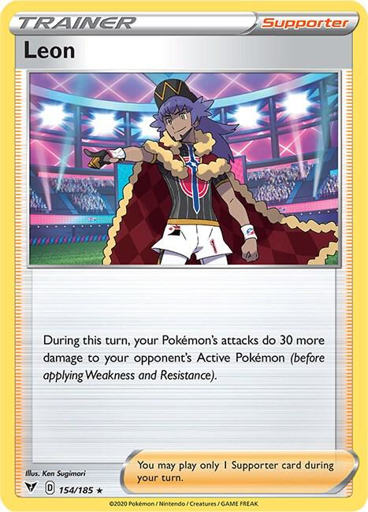
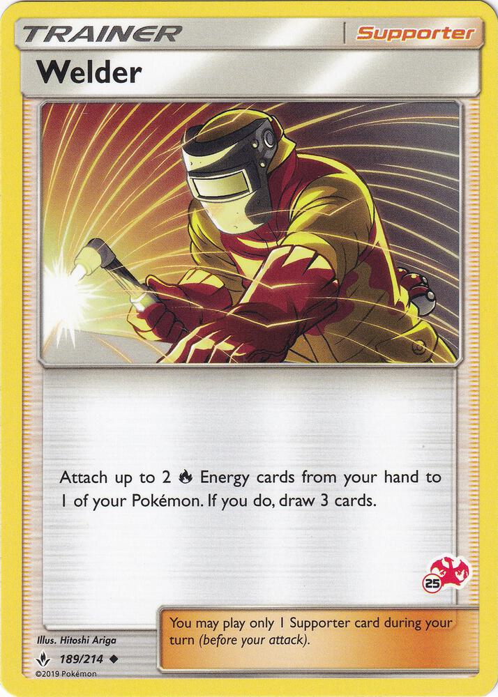
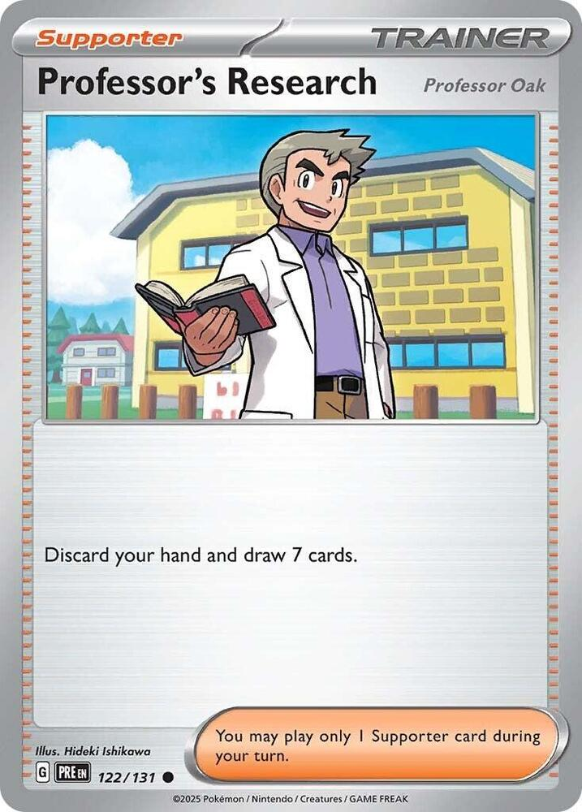
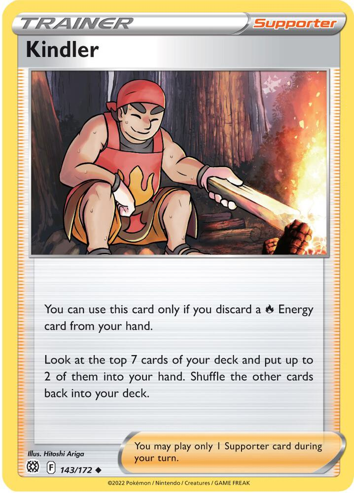
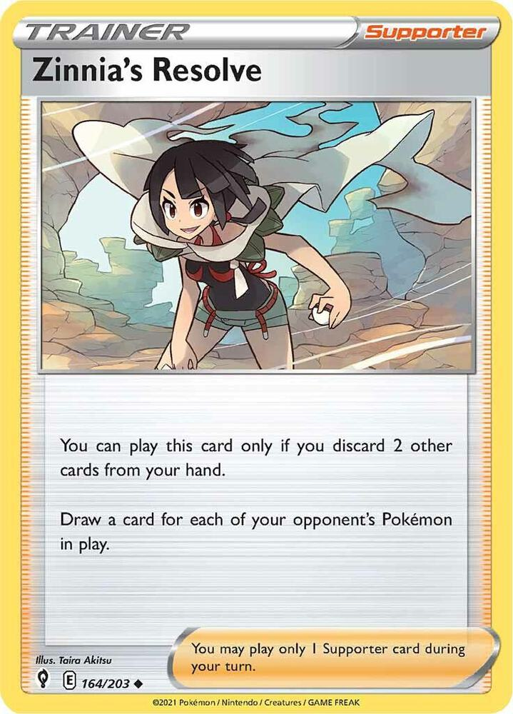
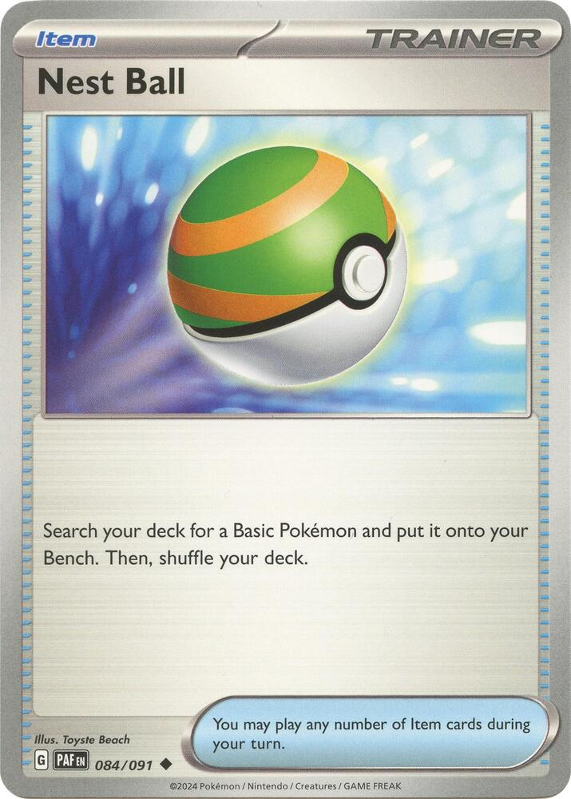
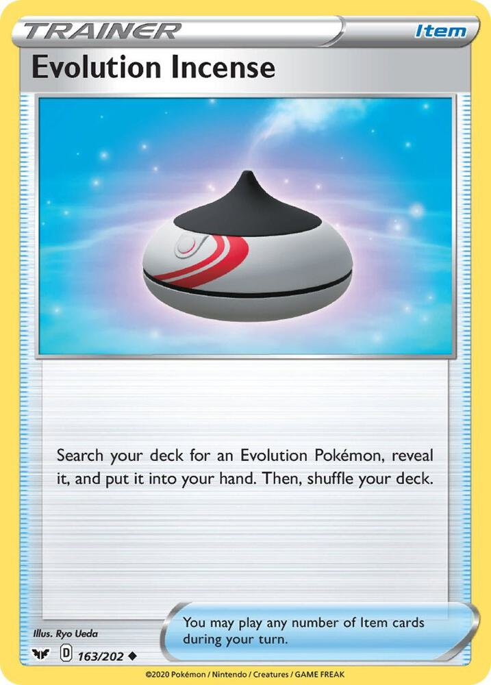
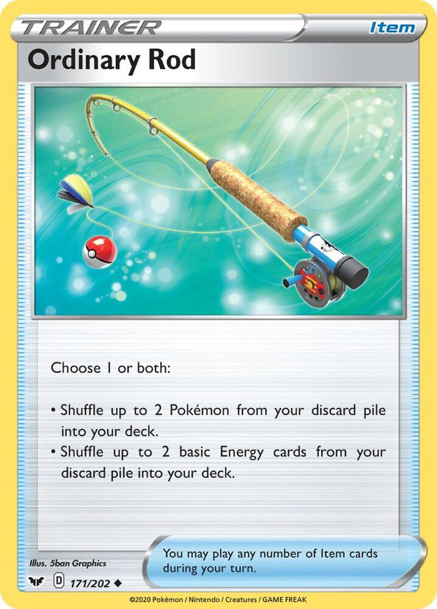
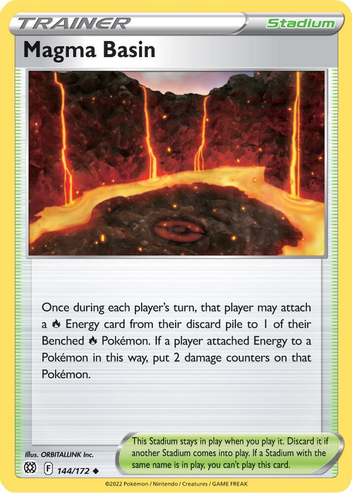

# Fox's Fire Force

> [!NOTE]
> **How to read this file.**
>
> This is your deck. All 60 cards are in here, one at a time.
>
> Start with the **[Word List](#word-list)** below. It explains every game word you will see in this file. If you hit a word you don't know, it's in there. You do not have to read the whole list first — just look things up when you need them.
>
> Then each card has its own page. Every card page has the same parts:
>
> - **General use** — what the card is *for*. Plain and short. If you only read one part, read this one.
> - **Pairing** — the other cards that work well with this one. These are links. Click them and you can follow a combo around the file.
> - **Strategy** — the deeper stuff. When to play it, when *not* to, and the tricks people miss.
> - **Evolution** (Pokémon only) — where the card sits in its family.
>
> The little table on each card page just copies the numbers off the real card, so you can check something fast.
>
> At the end is **[Game Plans](#game-plans)**. That's the good part. The card pages teach you the pieces. The Game Plans teach you how to win.

---

> [!TIP]
> **Your deck is 60 cards.** 16 Pokémon, 31 Trainers, 13 Energy.
>
> Every Pokémon in your deck is worth **1 Prize card**. So is every Pokémon in your dad's deck. That means nobody has a giant unfair monster. Whoever plays better wins. That's on purpose.

---

## Word List

Every game word you need, in order of how much you'll use it.

### The board

| Word | What it means |
| :--- | :--- |
| **Active Spot** | The one Pokémon out front. It's the only one that can attack, and it's the only one that can be attacked. |
| **Bench** | Your other Pokémon, waiting behind. You can have up to **5**. They're safe from most attacks, but they can't attack either. |
| **Hand** | The cards you're holding. |
| **Deck** | Your face-down pile you draw from. |
| **Discard pile** | Where used and knocked-out cards go. Not gone forever — some cards fish things back out. |
| **Prize cards** | 6 cards you set aside at the start. Every time you knock out a Pokémon, you take one. **Take all 6 and you win.** |

### Pokémon

| Word | What it means |
| :--- | :--- |
| **Basic** | A Pokémon you can play straight from your hand onto the Bench. Charmander, Eevee, and Sudowoodo are your Basics. |
| **Stage 1** | Evolves from a Basic. You put it *on top* of the Basic. |
| **Stage 2** | Evolves from a Stage 1. The biggest ones. |
| **Evolve** | Put an evolution card on top of the Pokémon it grows from. It keeps its Energy and its damage. **You can't evolve a Pokémon the same turn you played it** — unless a card says you can. |
| **HP** | How much damage a Pokémon can take before it's knocked out. |
| **Damage counter** | A little marker worth **10 damage**. So 3 damage counters = 30 damage. |
| **Knocked Out (KO)** | When damage reaches a Pokémon's HP, it goes to the discard pile and your opponent takes a Prize card. |
| **Weakness** | If a Pokémon is Weak to a type, attacks of that type do **double** damage to it. Your Charizard is Weak to Water ×2. |
| **Resistance** | The opposite — that type does less damage. None of your cards have it. |
| **Retreat cost** | How much Energy you discard to move your Active Pokémon back to the Bench. Charizard's is **3**, which is a lot. |
| **Ability** | Free text on a Pokémon that just *works*. It is **not** an attack. Using an Ability does not end your turn. |

### Energy and attacks

| Word | What it means |
| :--- | :--- |
| **Energy** | Cards you attach to Pokémon so they can attack. **You may attach only 1 Energy per turn** from your hand. |
| **[R]** | A Fire Energy symbol. Only a Fire Energy pays for it. |
| **[C]** | A Colorless symbol. **Any** Energy pays for it — including a Fire Energy. |
| **Attack cost** | The symbols next to an attack. You need that much Energy attached to use it. |
| **Attacking ends your turn.** | Do everything else *first*. Once you attack, your turn is over. |

### Trainer cards

| Word | What it means |
| :--- | :--- |
| **Trainer** | Any card that isn't a Pokémon or an Energy. There are four kinds: |
| **Supporter** | **Only 1 per turn.** These are the powerful ones. Choosing which one is your biggest decision each turn. |
| **Item** | Play as many as you want in a turn. |
| **Stadium** | Stays on the table and changes the rules for **both** players. Only one Stadium can be out at a time — playing a new one throws the old one away. |
| **Pokémon Tool** | Attaches to a Pokémon and stays there. Your deck doesn't have any, but your dad's does. |

### Rules that trip people up

| Word | What it means |
| :--- | :--- |
| **Mulligan** | If your first 7 cards have **no Basic Pokémon**, show your hand, shuffle it back, and draw 7 again. Your opponent draws 1 extra card. It's not a loss — just a do-over. |
| **Going first** | Whoever goes first **cannot attack on their first turn.** Use that turn to set up instead. |
| **Confused** | A Special Condition. When a Confused Pokémon tries to attack, flip a coin. **Tails = the attack does nothing, that Pokémon takes 30 damage, and the turn ends.** It only wears off when the Pokémon leaves the Active Spot. Your dad's Weezing does this a lot. |
| **Special Condition** | Confused, Asleep, Paralyzed, Poisoned, or Burned. They all go away when the Pokémon leaves the Active Spot. |
| **Rule Box** | A grey box of extra rules at the bottom of really strong cards (the ones marked **ex** or **V**). Those are worth **2 or 3** Prize cards instead of 1. **Nobody is playing any in these two decks.** |
| **4-copy limit** | You may have at most **4 cards with the same name** in a deck. Basic Energy is the one exception — you can have as many as you want. |

> [!NOTE]
> **Why this deck isn't "Standard legal."**
>
> Real tournaments only allow newer cards. Some of yours — Charizard, Leon, Welder, Sudowoodo — are a few years old, so they're not allowed there.
>
> That's fine. We play at home, and we picked those cards *because* they're old: the old ones are cheap and really fun. Just know that if you ever go to a real tournament, this exact deck won't be legal there.

---

> ### Table of Contents
>
> **Pokémon** — [Charmander](#charmander) · [Charmeleon](#charmeleon) · [Charizard](#charizard) · [Eevee](#eevee) · [Flareon](#flareon) · [Sudowoodo](#sudowoodo)
> **Supporters** — [Leon](#leon) · [Welder](#welder) · [Professor's Research](#professors-research-professor-oak) · [Boss's Orders](#bosss-orders-ghetsis) · [Kindler](#kindler) · [Zinnia's Resolve](#zinnias-resolve)
> **Items** — [Rare Candy](#rare-candy) · [Ultra Ball](#ultra-ball) · [Nest Ball](#nest-ball) · [Evolution Incense](#evolution-incense) · [Switch](#switch) · [Ordinary Rod](#ordinary-rod)
> **Stadium** — [Magma Basin](#magma-basin)
> **Energy** — [Basic Fire Energy](#basic-fire-energy)
>
> [**Game Plans**](#game-plans) · [**Your Other Eevees and Charizards**](#your-other-eevees-and-charizards)

---
---

# Pokémon

---

### Charmander


| Key | Val |
| :--- | :--- |
| **How many** | 4 |
| **Set** | SWSH04: Vivid Voltage |
| **Number** | 023/185 |
| **Type** | Fire |
| **HP** | 70 |
| **Stage** | Basic |
| **Weakness** | Water ×2 |
| **Retreat** | 1 |
| **Attack 1** | *Collect* **[R]** — Draw a card. |
| **Attack 2** | *Flare* **[R][R] 30** |

<br clear="all">

#### Evolution

**charmander** → charmeleon → charizard

#### General use

Charmander is a seed. Its job is to sit on your Bench early so you can grow a Charizard on top of it later. That's it. Don't expect it to fight.

You have 4 because you can't build a Charizard without one, and because you need a Basic Pokémon in your opening hand or you have to mulligan.

#### Pairing

- **[Rare Candy](#rare-candy)** — turns a Charmander straight into a Charizard. Skips Charmeleon completely.
- **[Nest Ball](#nest-ball)** — grabs a Charmander from your deck and puts it right on the Bench.
- **[Magma Basin](#magma-basin)** — can load Energy onto a benched Charmander before it grows up.

#### Strategy

**Play more than one.** The most common beginner mistake is putting down one Charmander and saving the rest "for later." Don't. Your dad can only knock out one Pokémon per turn. Every Charmander you *didn't* bench is a Charizard you can't build.

Two or three Charmander on the Bench early is not being greedy. It's insurance.

*Collect* costs one Fire Energy and draws a card. It's a real option on a turn where you have nothing better to do — but if you're attacking with Charmander, something has already gone wrong.

> [!WARNING]
> **Watch out for Risky Ruins.** Your dad's Stadium card puts **2 damage counters (20 damage)** on every Basic Pokémon he *or you* put on the Bench — unless it's a Darkness Pokémon. All his are. None of yours are.
>
> So under Risky Ruins, your Charmander shows up at 50 HP instead of 70. That is a real problem, and it's the main reason to bench your Charmanders **before** he gets that Stadium down.

---

### Charmeleon


| Key | Val |
| :--- | :--- |
| **How many** | 2 |
| **Set** | SWSH04: Vivid Voltage |
| **Number** | 024/185 |
| **Type** | Fire |
| **HP** | 90 |
| **Stage** | Stage 1 (from Charmander) |
| **Weakness** | Water ×2 |
| **Retreat** | 2 |
| **Attack 1** | *Slash* **[R] 20** |
| **Attack 2** | *Raging Flames* **[R][R] 60** — Discard the top 3 cards of your deck. |

<br clear="all">

#### Evolution

charmander → **charmeleon** → charizard

#### General use

Charmeleon is the slow road to Charizard. When you have a Rare Candy, you skip right past him. When you don't, he's how you get there anyway.

You only have 2 because he's the backup plan, not the main plan.

#### Pairing

- **[Charizard](#charizard)** — the only reason he's in the deck.
- **[Evolution Incense](#evolution-incense)** — finds a Charmeleon *or* a Charizard from your deck.
- **[Rare Candy](#rare-candy)** — the card that lets you **skip** him. If Candy is in your hand, leave Charmeleon alone.

#### Strategy

Here's the timing rule that matters most: **Rare Candy can't be used on your first turn, and can't be used on a Basic you played that same turn.**

So if you can't Rare Candy yet, evolving Charmander → Charmeleon is *still* a good play. A Charmeleon on turn two is a Charizard on turn three. A Charmander sitting there hoping for a Rare Candy might be a Charizard on turn three... or might still be a Charmander on turn six.

**Don't use *Raging Flames* unless you have to.** 60 damage sounds nice, but throwing away the top 3 cards of your deck can lose you a Charizard, a Leon, or an Energy you needed. *Slash* for 20 is often the smarter attack while you wait.

---

### Charizard


| Key | Val |
| :--- | :--- |
| **How many** | 3 |
| **Set** | SWSH04: Vivid Voltage |
| **Number** | 025/185 |
| **Type** | Fire |
| **HP** | **170** |
| **Stage** | Stage 2 (from Charmeleon) |
| **Weakness** | Water ×2 |
| **Retreat** | **3** |
| **Ability** | *Battle Sense* — Once during your turn, look at the top 3 cards of your deck and put 1 into your hand. Discard the other 2. |
| **Attack** | *Royal Blaze* **[R][R] 100+** — Does **50 more** damage for each **Leon** card in your discard pile. |

<br clear="all">

#### Evolution

charmander → charmeleon → **charizard**

#### General use

This is your best card and the whole point of the deck. 170 HP is the biggest number on either side of the table.

*Royal Blaze* starts at 100 damage for just two Fire Energy. Then it gets bigger every time a **Leon** card ends up in your discard pile. Learn this table — it's the most important math in your deck:

| Leon cards in your discard pile | Royal Blaze damage |
| :--- | :--- |
| 0 | 100 |
| 1 | **150** |
| 2 | **200** |
| 3 | 250 |
| 4 | 300 |

**Your dad's Gengar and Weezing both have 130 HP.** So with just **one** Leon in your discard pile, Royal Blaze knocks out anything he has, in one hit. That's the number to aim for.

*Battle Sense* is free every single turn. **Use it every turn.** It costs nothing, it doesn't end your turn, and it digs you toward what you need.

#### Pairing

- **[Leon](#leon)** — read the Game Plan called **[The Leon Engine](#1-the-leon-engine)**. These two cards are really one card.
- **[Rare Candy](#rare-candy)** — the fast way here from Charmander.
- **[Welder](#welder)** — puts both Fire Energy on in a single turn, so Charizard can attack the moment it arrives.
- **[Switch](#switch)** — with a retreat cost of 3, Switch is basically the only way to move Charizard.
- **[Magma Basin](#magma-basin)** — loads Energy onto Charizard while it's still on the Bench.

#### Strategy

**Use *Battle Sense* before you do anything else, every turn.** It's the most-forgotten card text in the deck. Look at 3, keep 1. Even when you already know what you want to do, look first — you might find something better. Just remember the other 2 cards get discarded, so don't do it when you can't afford to lose them.

**Get the Energy on before Charizard arrives.** Charizard needs [R][R]. If it walks into the Active Spot with nothing attached, it just stands there for two turns getting hit. Load a benched Charmander or Charmeleon with Energy *first*, or use [Welder](#welder) the same turn Charizard shows up.

**That retreat cost of 3 is a real weakness, and your dad's deck knows it.** His Weezing makes your Active Pokémon **Confused**, and Confused only wears off when the Pokémon *leaves* the Active Spot. A Confused Charizard is stuck flipping coins unless you spend a [Switch](#switch) on it. Keep a Switch in hand when you can.

---

### Eevee


| Key | Val |
| :--- | :--- |
| **How many** | 3 |
| **Set** | SV: Prismatic Evolutions |
| **Number** | 074/131 |
| **Type** | Colorless |
| **HP** | 50 |
| **Stage** | Basic |
| **Weakness** | Fighting ×2 |
| **Retreat** | 1 |
| **Ability** | *Boosted Evolution* — As long as this Pokémon is in the **Active Spot**, it can evolve during your first turn or the turn you play it. |
| **Attack** | *Reckless Charge* **[C][C] 30** — This Pokémon also does 10 damage to itself. |

<br clear="all">

#### Evolution

**eevee** → flareon

*(Eevee can evolve into lots of things. In this deck, it becomes Flareon.)*

#### General use

Eevee's Ability breaks one of the game's biggest rules. Normally you **cannot** evolve a Pokémon on the turn you play it. Eevee can — as long as it's in the **Active Spot**.

That means: play Eevee Active, evolve it into Flareon *right away*. A Stage 1 attacker on turn one. Nothing else in your deck is that fast.

#### Pairing

- **[Flareon](#flareon)** — the whole reason Eevee is here.
- **[Evolution Incense](#evolution-incense)** — finds the Flareon to put on top.
- **[Nest Ball](#nest-ball)** — careful! Nest Ball puts a Basic on your **Bench**, and *Boosted Evolution* only works in the **Active Spot**.

#### Strategy

**Read the Ability really carefully. It says Active Spot.** An Eevee on the Bench is a normal, boring Eevee — you have to wait a full turn to evolve it. An Eevee in the Active Spot can turn into Flareon immediately.

So if you want the fast Flareon, **play Eevee as your Active Pokémon**, not to the Bench.

**50 HP is tiny.** It's the smallest number in either deck. Your dad's Gengar does 130 damage pretty easily, so an Eevee left sitting around is a free Prize card for him. Either evolve it fast or accept that you're using it as a shield.

**Careful with *Reckless Charge*.** 30 damage is okay, but the 10 damage to itself means Eevee is now at 40 HP and even easier to knock out. Only do it if you're fine losing that Eevee.

> [!WARNING]
> Eevee is Weak to **Fighting ×2**. Nothing in your dad's deck is Fighting, so you're safe there — but remember it if you ever play someone else.

---

### Flareon


| Key | Val |
| :--- | :--- |
| **How many** | 2 |
| **Set** | SV: Prismatic Evolutions |
| **Number** | 013/131 |
| **Type** | Fire |
| **HP** | 130 |
| **Stage** | Stage 1 (from Eevee) |
| **Weakness** | Water ×2 |
| **Retreat** | 2 |
| **Attack 1** | *Destructive Flame* **[R] 30** — Flip a coin. If heads, discard an Energy from your opponent's Active Pokémon. |
| **Attack 2** | *Fighting Blaze* **[R][C][C] 90+** — Does 90 more if your opponent's Active Pokémon is a Pokémon **ex** or **V**. |

<br clear="all">

#### Evolution

eevee → **flareon**

#### General use

Flareon is your early attacker. It shows up way faster than Charizard and it hits hard enough to matter — 130 HP is the same as your dad's Gengar and Weezing.

Its real weapon is *Destructive Flame*. Only 30 damage, but on heads it **throws away one of his Energy cards.**

#### Pairing

- **[Eevee](#eevee)** — play Eevee Active, then Flareon on the same turn. Fastest start in the deck.
- **[Evolution Incense](#evolution-incense)** — pulls Flareon out of your deck.
- **[Leon](#leon)** — Leon's +30 works on *any* of your attacks, not just Charizard's. Flareon with Leon does 120.
- **[Magma Basin](#magma-basin)** — Flareon is a Fire Pokémon, so Magma Basin can power it up on the Bench.

#### Strategy

**Destructive Flame is better than it looks, and here's why.** Your dad's deck has only **12 Energy cards in 60**, and he can only attach **1 per turn**. Every Energy you knock off is a whole turn of his stolen. Doing that to a Weezing he's setting up can wreck his big two-turn combo.

It's a coin flip, so it won't always work. Do it anyway — 30 damage plus a 50% chance to ruin his turn is a fine deal.

> [!IMPORTANT]
> **Fighting Blaze will never get its bonus against your dad's deck.** The +90 only works against a Pokémon **ex** or **V**, and he isn't playing any. So *Fighting Blaze* is just "90 damage for 3 Energy" in this matchup.
>
> 90 doesn't knock out his 130 HP Gengar or Weezing. So most of the time, **the cheap attack is the better attack**: use *Destructive Flame* for 30 and steal his Energy, or add a [Leon](#leon) to *Fighting Blaze* to reach 120.
>
> Save *Fighting Blaze* for the day someone brings out an ex. Then it does **180**.

---

### Sudowoodo


| Key | Val |
| :--- | :--- |
| **How many** | 2 |
| **Set** | SWSH01: Sword & Shield Base Set |
| **Number** | 100/202 |
| **Type** | **Fighting** |
| **HP** | 100 |
| **Stage** | Basic |
| **Weakness** | Grass ×2 |
| **Retreat** | 1 |
| **Attack 1** | *Double Draw* **[C]** — Draw 2 cards. |
| **Attack 2** | *Flail* **[C]** — Does **10 damage for each damage counter on this Pokémon.** |

<br clear="all">

#### Evolution

**sudowoodo** *(doesn't evolve)*

#### General use

Sudowoodo is the secret weapon, and it is the card your dad is most scared of. Here's why:

**Sudowoodo is a Fighting type. Every single Pokémon in your dad's deck is Weak to Fighting ×2.**

That means Sudowoodo's damage gets **doubled** against Gastly, Haunter, Gengar, Koffing, and Weezing. All of them.

And *Flail* gets stronger the more beaten up Sudowoodo is. Every damage counter on Sudowoodo is 10 more damage — then doubled.

#### Pairing

- **[Switch](#switch)** — get a damaged Sudowoodo into the Active Spot right when it's scariest.
- **[Nest Ball](#nest-ball)** — finds one from your deck.
- **[Ordinary Rod](#ordinary-rod)** — puts a knocked-out Sudowoodo back in your deck to use again.

#### Strategy

**Learn this table. It wins games.**

| Damage on Sudowoodo | *Flail* does | Doubled vs Dark Pokémon |
| :--- | :--- | :--- |
| 20 | 20 | **40** |
| 40 | 40 | **80** |
| 50 | 50 | **100** |
| **70** | 70 | **140** ← knocks out Gengar *or* Weezing |
| 90 | 90 | **180** |

**At 70 damage taken, Sudowoodo one-shots anything your dad has.** For **one** Energy. Any Energy.

**So Sudowoodo is a revenge attacker.** You *want* it to get hurt. The plan:

1. Put Sudowoodo out where it will take a hit.
2. Let your dad attack it. Now it's damaged — which means it's dangerous.
3. [Switch](#switch) it into the Active Spot if it isn't already.
4. *Flail* for double damage.

**Free bonus: his own Stadium helps you.** His **Risky Ruins** puts 2 damage counters on your Basic Pokémon when you bench them. On Sudowoodo, that's **20 free Flail damage — 40 after doubling.** His own card arms your best weapon. Don't tell him.

**The danger:** Sudowoodo only has 100 HP. At 70 damage it's terrifying, but it's also 30 away from dying. You get about one shot. Make it count — use [Boss's Orders](#bosss-orders-ghetsis) to drag out the Pokémon you most want gone, *then* Flail it.

> [!TIP]
> *Flail* costs **[C]** — one Colorless. That means **any** Energy pays for it, including a Fire Energy. You never need special Energy for Sudowoodo.

---
---

# Trainers — Supporters

> [!IMPORTANT]
> **You may play only ONE Supporter per turn.**
>
> You have 15 of them. Picking the right one is the biggest choice you make each turn. Quick guide:
>
> - Need **damage**? → [Leon](#leon)
> - Need **Energy**? → [Welder](#welder)
> - Need a **whole new hand**? → [Professor's Research](#professors-research-professor-oak)
> - Can **win a Prize this turn**? → [Boss's Orders](#bosss-orders-ghetsis)

---

### Leon



| Key | Val |
| :--- | :--- |
| **How many** | 4 |
| **Set** | SWSH04: Vivid Voltage |
| **Number** | 154/185 |
| **Type** | Trainer — Supporter |

> During this turn, your Pokémon's attacks do 30 more damage to your opponent's Active Pokémon (before applying Weakness and Resistance).

<br clear="all">

#### General use

Leon does two jobs at once, and the second one is the sneaky part.

**Job 1 (right now):** every attack you make this turn does **+30 damage**.

**Job 2 (forever after):** when your turn ends, the Leon card goes to your **discard pile** — and [Charizard's](#charizard) *Royal Blaze* does **50 more damage for each Leon in your discard pile.**

So Leon isn't a card you "use up." Using it is how you power up Charizard. **Every Leon you play makes every future Royal Blaze permanently stronger.**

#### Pairing

- **[Charizard](#charizard)** — this is the deck's main engine. See **[The Leon Engine](#1-the-leon-engine)**.
- **[Flareon](#flareon)** — Leon boosts *any* attack. Flareon's *Fighting Blaze* goes from 90 to 120.
- **[Sudowoodo](#sudowoodo)** — Leon's +30 happens **before** Weakness doubles it, so it turns into **+60** against your dad's Dark Pokémon.
- **[Professor's Research](#professors-research-professor-oak)** — can dump extra Leons into the discard, which is exactly where you want them.

#### Strategy

**The +30 lands before the doubling. That matters a lot.** The card says "before applying Weakness and Resistance." So if you Leon up a Sudowoodo *Flail*, the +30 gets added first and *then* the whole thing doubles. That's a hidden **+60**.

**The first Leon is the most important one.** Look at the jump:

- 0 Leon in discard → Royal Blaze does 100. His Gengar (130 HP) survives.
- 1 Leon in discard → Royal Blaze does **150**. His Gengar dies.

Getting that first Leon into the discard is the single biggest power spike in your deck.

**The perfect first Charizard turn:** play **Leon**, then attack with *Royal Blaze*. 100 + 30 = **130**, which knocks out a Gengar or a Weezing exactly. And the Leon you just played is now in your discard, so **next** turn Royal Blaze does 150 all by itself.

You have 4 Leons. Play them freely. They're worth more used than saved.

---

### Welder



| Key | Val |
| :--- | :--- |
| **How many** | 2 |
| **Set** | Battle Academy (#25 Charizard Stamped) |
| **Number** | 189/214 |
| **Type** | Trainer — Supporter |

> Attach up to 2 Fire Energy cards from your hand to 1 of your Pokémon. If you do, draw 3 cards.

<br clear="all">

#### General use

Welder is the strongest card in either deck. It breaks the biggest rule in the game.

Normally you attach **1 Energy per turn**. Welder attaches **2 more** — and then **draws you 3 cards** for doing it.

Two Fire Energy is exactly what [Charizard's](#charizard) *Royal Blaze* costs. So Welder can turn a bare Charizard into a fully-loaded Charizard in one turn.

#### Pairing

- **[Charizard](#charizard)** — [R][R] in one turn. This is the dream.
- **[Flareon](#flareon)** — also loves a sudden pile of Energy.
- **[Kindler](#kindler)** — Kindler wants Fire Energy in your hand; Welder wants Fire Energy in your hand. Don't run out.

#### Strategy

> [!NOTE]
> **You only have 2, and that was on purpose.**
>
> Welder is so strong that 4 copies would make your deck much better than your dad's, and the games would stop being close. Two means you get the awesome turn sometimes, not every game. That's the trade for a fair fight.

**Save it for the big turn.** Don't Welder a Charmander on turn one just because you can. Welder is worth the most when it turns "my Charizard can't attack" into "my Charizard attacks right now." Hold it until that turn exists.

**Remember it still uses your Supporter for the turn.** A turn where you Welder is a turn you *cannot* play [Leon](#leon). So think it through: is it better to power up Charizard this turn, or hit 30 harder this turn? Usually the answer is get the Energy down first — you can Leon next turn.

---

### Professor's Research [Professor Oak]



| Key | Val |
| :--- | :--- |
| **How many** | 3 |
| **Set** | SV: Prismatic Evolutions |
| **Number** | 122/131 |
| **Type** | Trainer — Supporter |

> Discard your hand and draw 7 cards.

<br clear="all">

#### General use

The big reset. Throw your whole hand away, draw 7 fresh cards. Simple and powerful.

#### Pairing

- **[Leon](#leon)** — discarding a spare Leon is *good*, because Charizard counts Leons in your discard pile.
- **[Ordinary Rod](#ordinary-rod)** — gets back Pokémon and Energy you threw away.
- **[Magma Basin](#magma-basin)** — Fire Energy you discard here isn't lost. Magma Basin pulls it back out.

#### Strategy

> [!WARNING]
> **This card DISCARDS your hand. It does not shuffle it back.**
>
> Whatever you throw away is gone from your deck for the rest of the game unless another card rescues it. Before you play this, look at your hand and ask: *is there anything in here I really need?* If yes, play something else.

**But in this deck, discarding is sometimes a bonus.** You are one of the few decks that *wants* things in its discard pile:

- Extra **Leon** → makes Royal Blaze bigger. Great.
- Extra **Fire Energy** → [Magma Basin](#magma-basin) can put it right back onto a Pokémon. Fine.
- A spare **Charmander** → [Ordinary Rod](#ordinary-rod) can shuffle it back. Fine.
- Your only **Rare Candy** or your only **Charizard** → bad. Don't.

**Best time to play it:** when your hand is down to 1 or 2 useless cards. Trading 2 junk cards for 7 fresh ones is fantastic. Trading 6 good cards for 7 random ones usually isn't.

---

### Boss's Orders [Ghetsis]


| Key | Val |
| :--- | :--- |
| **How many** | 3 |
| **Set** | ME01: Mega Evolution |
| **Number** | 114/132 |
| **Type** | Trainer — Supporter |

> Switch in 1 of your opponent's Benched Pokémon to the Active Spot.

<br clear="all">

#### General use

This is how you choose who you fight.

Your dad puts a big healthy Pokémon in front and hides the hurt ones on his Bench. Boss's Orders reaches past the big one and **drags out whoever you want.**

#### Pairing

- **[Charizard](#charizard)** — drag out the Pokémon Royal Blaze can finish.
- **[Sudowoodo](#sudowoodo)** — drag out a Gengar, then *Flail* it for double.
- **[Leon](#leon)** — you can't play both in one turn (one Supporter per turn!), so plan a turn ahead.

#### Strategy

**This is your finishing card.** Late in the game, when you need one more Prize to win, the answer is almost always Boss's Orders. He hides a hurt Pokémon on the Bench thinking it's safe. It isn't.

**Use it on Gengar before it grows up.** Your dad's Gengar has an Ability called *Infinite Shadow*: if it gets knocked out, it goes back to his **hand** instead of the discard pile, and it brings its whole family with it. Annoying!

But that only helps him **after** it's already a Gengar. If you Boss's Orders a **Gastly** off his Bench and knock it out while it's still small, there's no Gengar yet — so nothing comes back. Killing the little ones early is worth more than it looks.

> [!TIP]
> Boss's Orders is *not* a draw card and *not* a setup card. If playing it doesn't take a Prize this turn, or stop him from taking one next turn, play a different Supporter instead. You only have 3.

---

### Kindler



| Key | Val |
| :--- | :--- |
| **How many** | 2 |
| **Set** | SWSH09: Brilliant Stars |
| **Number** | 143/172 |
| **Type** | Trainer — Supporter |

> You can use this card only if you discard a [R] Energy card from your hand. Look at the top 7 cards of your deck and put up to 2 of them into your hand. Shuffle the other cards back into your deck.

<br clear="all">

#### General use

Dig deep. Throw away one Fire Energy, then look at the top **7** cards of your deck and keep any **2** you like.

Seven cards is a lot. You will almost always find something good.

#### Pairing

- **[Magma Basin](#magma-basin)** — the perfect partner. Kindler's discarded Energy goes to the discard pile, and Magma Basin attaches Energy **from the discard pile**. So the cost is basically free.
- **[Charizard](#charizard)** — the card you're usually digging for.
- **[Basic Fire Energy](#basic-fire-energy)** — you need one in hand or you can't play Kindler at all.

#### Strategy

**Kindler + Magma Basin is a real combo, and it's a good one to learn.** On its own, Kindler costs you an Energy card. But if Magma Basin is on the table, that Energy isn't gone — it's just moved to a place where Magma Basin can pick it up and attach it to a benched Fire Pokémon.

You paid nothing and looked at 7 cards. That's a great deal.

**You must have a Fire Energy in hand.** If you don't, you can't play Kindler at all — it's a dead card. Keep that in mind before you dump your whole hand to [Professor's Research](#professors-research-professor-oak).

**Pick carefully from the 7.** You only keep 2, and the rest get shuffled back. Usually the right picks are: whatever you need to attack this turn, plus whatever you need to attack next turn.

---

### Zinnia's Resolve



| Key | Val |
| :--- | :--- |
| **How many** | 1 |
| **Set** | SWSH07: Evolving Skies |
| **Number** | 164/203 |
| **Type** | Trainer — Supporter |

> You can play this card only if you discard 2 other cards from your hand. Draw a card for each of your opponent's Pokémon in play.

<br clear="all">

#### General use

The bigger your dad's board, the more cards you draw. "In play" means **everything** — his Active Pokémon and his whole Bench.

His deck *loves* a big Bench. He plays Gastly and Koffing everywhere so his Gengar hits harder. Every one of those is a card for you.

#### Pairing

- **[Ordinary Rod](#ordinary-rod)** — gets back Pokémon and Energy you discarded to pay for it.
- **[Leon](#leon)** — a great thing to discard as your cost, since Leon is *better* in your discard pile.

#### Strategy

**How many cards is it really?** Count his side of the table:

| His Pokémon in play | You draw |
| :--- | :--- |
| 2 | 2 (not worth it) |
| 4 | 4 (okay) |
| **5** | **5 (good)** |
| **6** | **6 (great)** |

He can have at most 6 — 1 Active plus 5 on the Bench. So Zinnia's Resolve tops out at 6 cards.

**Wait for his board to fill up.** Playing this on turn one when he has one lonely Gastly out draws you **1 card** and costs you **2**. That's terrible. Playing it on turn four against a full board draws 6.

**Pick your discards on purpose.** You have to throw away 2 cards. Best choices: a spare **Leon** (goes where you want it anyway) and a spare **Fire Energy** (Magma Basin can get it back). Worst choices: your only Charizard, your only Rare Candy.

You only have **1** of this card, so there's no rush. Wait for the great turn.

---
---

# Trainers — Items

> Items are free. Play as many as you want in one turn. Play them **before** your Supporter — you'll often learn something that changes which Supporter you want.

---

### Rare Candy


| Key | Val |
| :--- | :--- |
| **How many** | 4 |
| **Set** | ME01: Mega Evolution |
| **Number** | 125/132 |
| **Type** | Trainer — Item |

> Choose 1 of your Basic Pokémon in play. If you have a Stage 2 card in your hand that evolves from that Pokémon, put that card onto the Basic Pokémon to evolve it, skipping the Stage 1. You can't use this card during your first turn or on a Basic Pokémon that was put into play this turn.

<br clear="all">

#### General use

A time machine. Charmander goes **straight** to Charizard, and Charmeleon never happens. It turns a three-turn wait into one turn.

#### Pairing

- **[Charmander](#charmander)** → **[Charizard](#charizard)** — the only line it works on in your deck.
- **[Ultra Ball](#ultra-ball)** / **[Evolution Incense](#evolution-incense)** — find the Charizard so the Candy has something to put down.
- **[Nest Ball](#nest-ball)** — gets the Charmander down early so the Candy is legal when you want it.

#### Strategy

> [!WARNING]
> **Two rules you will forget. Read them twice.**
>
> 1. **Not on your first turn.** Ever. Doesn't matter what else is true.
> 2. **Not on a Basic that came into play this turn.** It has to have been sitting there since before this turn started — including ones that Nest Ball put there.
>
> Both problems have the same fix: **put your Charmanders down a turn earlier than you think you need to.**

The fastest legal Charizard is **turn two**: bench Charmander on turn one, Rare Candy on turn two.

**Don't Rare Candy a Charmander that's Active and about to die.** If you put your Charizard on top of a Charmander that's one hit from being knocked out, your dad takes a Prize card **and** your Charizard in the same turn. Rare Candy the Charmander on your **Bench**, and bring Charizard out when *you* choose.

---

### Ultra Ball


| Key | Val |
| :--- | :--- |
| **How many** | 3 |
| **Set** | ME01: Mega Evolution |
| **Number** | 131/132 |
| **Type** | Trainer — Item |

> You can use this card only if you discard 2 other cards from your hand. Search your deck for a Pokémon, reveal it, and put it into your hand. Then, shuffle your deck.

<br clear="all">

#### General use

Finds **any** Pokémon in your deck. Basic, Stage 1, Stage 2 — doesn't matter. The price is throwing away 2 cards from your hand first.

You must be able to pay. With fewer than 2 other cards in hand, you can't play it at all.

#### Pairing

- **[Charizard](#charizard)** — the main thing you're hunting.
- **[Rare Candy](#rare-candy)** — Ultra Ball finds the Charizard, Rare Candy puts it in play.
- **[Ordinary Rod](#ordinary-rod)** — takes back what you discarded.
- **[Leon](#leon)** — the best card to discard, because your discard pile is where Leon belongs.

#### Strategy

**Discard smart, and the cost almost disappears.** The perfect Ultra Ball discards a spare **Leon** (which powers up Royal Blaze) and a spare **Fire Energy** (which [Magma Basin](#magma-basin) can put back into play). You just paid nothing.

**Never discard:** your last Rare Candy, your last Charizard, or a Supporter you were about to play.

**Play it before your Supporter.** Once you know what you found, you'll know which Supporter you actually want.

---

### Nest Ball



| Key | Val |
| :--- | :--- |
| **How many** | 3 |
| **Set** | SV: Paldean Fates |
| **Number** | 084/091 |
| **Type** | Trainer — Item |

> Search your deck for a Basic Pokémon and put it onto your Bench. Then, shuffle your deck.

<br clear="all">

#### General use

Free and easy. Grab a Basic Pokémon out of your deck and put it **straight onto the Bench** — no cost, no discard, no Energy.

#### Pairing

- **[Charmander](#charmander)** — the usual pick.
- **[Sudowoodo](#sudowoodo)** — grab your secret weapon exactly when you need it.
- **[Rare Candy](#rare-candy)** — Nest Ball a Charmander *this* turn so you can Candy it *next* turn.

#### Strategy

**It goes to the Bench, not the Active Spot.** That's almost always what you want — but it's the one thing to watch with **[Eevee](#eevee)**. Eevee's *Boosted Evolution* Ability only works in the **Active Spot**. A Nest Ball Eevee lands on the Bench and can't use it.

If you want the fast Flareon, play Eevee from your **hand** as your Active Pokémon instead.

**Turn one, use these first.** Nest Ball costs you nothing, so there's never a reason to hold it. Get your board built.

> [!TIP]
> Nest Ball puts the Pokémon into play, which means **[Rare Candy](#rare-candy) can't be used on it that same turn.** Nest Ball now, Candy next turn.

---

### Evolution Incense



| Key | Val |
| :--- | :--- |
| **How many** | 1 |
| **Set** | SWSH01: Sword & Shield Base Set |
| **Number** | 163/202 |
| **Type** | Trainer — Item |

> Choose an Evolution Pokémon from your deck, reveal it, and put it into your hand.

<br clear="all">

#### General use

Finds any Pokémon that **isn't** a Basic. In your deck that means: Charmeleon, Charizard, or Flareon.

It's like [Ultra Ball](#ultra-ball) but you don't have to discard anything. The trade is that it can't get Basics.

#### Pairing

- **[Charizard](#charizard)** — the usual target.
- **[Flareon](#flareon)** — grab it to drop on an Active Eevee for a fast start.
- **[Rare Candy](#rare-candy)** — Incense finds the Charizard, Candy puts it down.

#### Strategy

**Free is a big deal.** No discard cost means you can play this when your hand is nearly empty, which is exactly when Ultra Ball stops working. Keep that difference in mind.

**You only have 1.** Save it for the turn you actually need a specific evolution. If you already have a Charizard in hand, don't waste it.

---

### Switch


| Key | Val |
| :--- | :--- |
| **How many** | 2 |
| **Set** | ME01: Mega Evolution |
| **Number** | 130/132 |
| **Type** | Trainer — Item |

> Switch your Active Pokémon with 1 of your Benched Pokémon.

<br clear="all">

#### General use

Free retreat. Move your Active Pokémon to the Bench and bring out whoever you want, without paying any Energy.

#### Pairing

- **[Charizard](#charizard)** — retreat cost **3** is huge. Switch is basically the only way to move it.
- **[Sudowoodo](#sudowoodo)** — bring a beaten-up Sudowoodo out at the perfect moment to *Flail*.
- **[Flareon](#flareon)** — retreat 2. Also expensive.

#### Strategy

> [!IMPORTANT]
> **Switch cures Confused.** This is the most useful thing to know about this card in this matchup.
>
> Your dad's Weezing and his Dark Bell both make your Active Pokémon **Confused**, and Confused only goes away when that Pokémon **leaves the Active Spot**. Retreating a Charizard costs 3 Energy. A Switch costs nothing.
>
> So a Confused Charizard plus a Switch = a healthy Charizard. Try to keep one in hand for exactly this.

**Only 2 copies, so don't waste them.** Save Switch for a stuck attacker or a Confusion problem — not just to shuffle things around.

**Switch also saves a Pokémon that's about to die.** If your Charizard is at 20 HP and it's his turn next, Switching it to the Bench means he has to knock out something else first.

---

### Ordinary Rod



| Key | Val |
| :--- | :--- |
| **How many** | 1 |
| **Set** | SWSH01: Sword & Shield Base Set |
| **Number** | 171/202 |
| **Type** | Trainer — Item |

> Choose 1 or both: • Shuffle up to 2 Pokémon from your discard pile into your deck. • Shuffle up to 2 basic Energy cards from your discard pile into your deck.

<br clear="all">

#### General use

The undo button. Takes up to **2 Pokémon and up to 2 Energy** back out of your discard pile — that's up to **4 cards** — and shuffles them into your deck.

#### Pairing

- **[Professor's Research](#professors-research-professor-oak)** — the card that throws stuff away. This is the card that gets it back.
- **[Ultra Ball](#ultra-ball)** / **[Kindler](#kindler)** / **[Zinnia's Resolve](#zinnias-resolve)** — all of these make you discard. Ordinary Rod fixes it.
- **[Charizard](#charizard)** — the card you most want back after one gets knocked out.

#### Strategy

> [!IMPORTANT]
> **It shuffles into your DECK, not into your hand.** You don't get the cards right away — you have to draw them or search them out again. So play it *early enough that you'll still draw them*, not on your very last turn.

**Save it for when you actually need it.** You only have 1. Playing it on turn two to rescue one Charmander is a waste. Playing it late, when both your Charizards are dead and you're running low on Energy, can win the game.

**"Basic Energy" means your Fire Energy.** All 13 of your Energy cards are Basic, so any of them can come back.

---
---

# Stadium

---

### Magma Basin



| Key | Val |
| :--- | :--- |
| **How many** | 2 |
| **Set** | SWSH09: Brilliant Stars |
| **Number** | 144/172 |
| **Type** | Trainer — Stadium |

> Once during each player's turn, that player may attach a Fire Energy card from their discard pile to 1 of their Benched Fire Pokémon. If a player attached Energy to a Pokémon in this way, put 2 damage counters on that Pokémon.

<br clear="all">

#### General use

Extra Energy, every single turn, out of your **discard pile**. This is the closest thing you have to unlimited fuel.

It costs you 2 damage counters (20 damage) on whatever you attach to, and it only works on **Benched Fire Pokémon**.

#### Pairing

- **[Kindler](#kindler)** — Kindler discards a Fire Energy; Magma Basin picks it right back up. The two cards cancel each other's cost out.
- **[Professor's Research](#professors-research-professor-oak)** — makes discarding Energy safe.
- **[Charizard](#charizard)** / **[Flareon](#flareon)** — both are Fire, so both can be loaded up on the Bench.

#### Strategy

> [!TIP]
> **This card only helps you.** It says "Benched **Fire** Pokémon." Your dad's whole deck is **Darkness**. He has zero Fire Pokémon, so he can never use your Stadium even though the card says both players may.
>
> Free Energy every turn, and he gets nothing. Excellent.

**Remember: Bench only.** You can't use Magma Basin on your Active Pokémon. So power things up **before** they go out to fight.

**Sudowoodo can't use it either.** [Sudowoodo](#sudowoodo) is a *Fighting* Pokémon, not a Fire one. Magma Basin skips it.

**The Stadium war.** Your dad plays **Risky Ruins**, which is also a Stadium — and only one Stadium can be on the table at a time. Playing yours throws his away, and playing his throws yours away.

That's why you have **2**. When he replaces your Magma Basin, you can put it right back. Whoever runs out of Stadiums first has to live with the other person's.

> [!NOTE]
> **His Risky Ruins hurts you; your Magma Basin doesn't hurt him.** So getting your Stadium down is worth more than it looks — it's not just "I get Energy," it's also "his card stops working."

---
---

# Energy

---

### Basic Fire Energy


| Key | Val |
| :--- | :--- |
| **How many** | 13 |
| **Set** | MEE: Mega Evolution Energies (any Fire Energy works) |
| **Number** | 002 |
| **Type** | Energy — Basic |

> *No rules text. It provides [R] Fire Energy.*

<br clear="all">

#### General use

Fuel. Every attack in your deck is paid for with these.

**You may attach only 1 Energy per turn** from your hand. That's the rule that decides how fast your deck goes — which is exactly why [Welder](#welder) and [Magma Basin](#magma-basin) are so good, because they get around it.

Basic Energy is the one card type with **no 4-copy limit**. You can play as many as you like.

#### Pairing

- Everything. But especially **[Welder](#welder)** (2 at once from hand) and **[Magma Basin](#magma-basin)** (1 per turn from the discard).
- **[Ordinary Rod](#ordinary-rod)** — puts up to 2 back in your deck.
- **[Kindler](#kindler)** — you must have one in hand to play Kindler at all.

#### Strategy

**Attach ahead of time.** Put Energy on Pokémon **while they're still on the Bench**, before you need them out front. A Charizard that arrives with [R][R] already attached can attack immediately. One that arrives empty stands there doing nothing for two turns while it gets hit.

This is the number one mistake new players make. Plan one turn ahead.

**Fire Energy also pays for [C].** A Colorless symbol means "any Energy." So a Fire Energy works fine for [Sudowoodo's](#sudowoodo) *Flail* [C] and [Eevee's](#eevee) *Reckless Charge* [C][C]. You never need a second Energy type.

**Here's what each attacker costs:**

| Pokémon | Attack | Cost | Energy needed |
| :--- | :--- | :--- | :--- |
| Sudowoodo | *Flail* | [C] | **1** |
| Flareon | *Destructive Flame* | [R] | **1** |
| Charizard | *Royal Blaze* | [R][R] | **2** |
| Eevee | *Reckless Charge* | [C][C] | **2** |
| Flareon | *Fighting Blaze* | [R][C][C] | **3** |

Notice that your two best attacks — Royal Blaze and Flail — only need 1 or 2 Energy. Your deck is cheaper to run than it looks.

---
---

# Game Plans

> These are the real plans. Learn these and you know how to play the deck. Everything above is just the parts list.

---

## 1. The Leon Engine

**This is your deck's main plan. If you only learn one thing, learn this.**

[Charizard's](#charizard) *Royal Blaze* does **50 more damage for every Leon card in your discard pile.** And [Leon](#leon) goes to your discard pile the moment you play it.

So the more you use Leon, the stronger Charizard gets — **forever**.

### The perfect Charizard turn

```
1. Use Battle Sense (free, every turn).
2. Play LEON.                      → all your attacks do +30 this turn
3. Attack with Royal Blaze.        → 100 + 30 = 130 damage
4. Your turn ends. Leon lands in the discard pile.
```

**130 damage knocks out his Gengar or his Weezing exactly** — they both have 130 HP.

And now here's the good part. **Next turn**, you don't even need to play a Leon:

| Turn | Leons in discard | Royal Blaze does |
| :--- | :--- | :--- |
| First Charizard turn (playing a Leon) | 0 | 100 + 30 = **130** |
| Next turn | 1 | **150** |
| Turn after that (playing another Leon) | 1 | 150 + 30 = **180** |
| After that | 2 | **200** |

**150 is the magic number.** Once one Leon is in your discard, every Royal Blaze knocks out anything he owns in one hit, with no help. Getting there is your whole early game.

> [!TIP]
> Leon is worth **more in the discard pile than in your hand.** So when a card asks you to discard something — [Ultra Ball](#ultra-ball), [Professor's Research](#professors-research-professor-oak), [Zinnia's Resolve](#zinnias-resolve) — a spare Leon is the best possible thing to throw away. You're not losing it. You're loading it.

---

## 2. Two Speeds

**Your deck has a fast plan and a strong plan. Run both at the same time.**

Charizard is a Stage 2. It takes turns to build. If you spend those turns doing nothing, you'll be three Prize cards behind before your best card even shows up.

So you have a second, faster attacker: **[Flareon](#flareon)**.

| | Fast plan | Strong plan |
| :--- | :--- | :--- |
| **Pokémon** | Eevee → Flareon | Charmander → Charizard |
| **Ready by** | Turn 1 or 2 | Turn 3 or 4 |
| **How** | Play Eevee **Active**, evolve same turn | Bench Charmander, then Rare Candy |
| **Damage** | 30 (and steals Energy) | 130-200 |
| **Job** | Buy time, take early Prizes | Win the game |

### How to run both

1. **Turn one:** play **Eevee in the Active Spot** and evolve it into Flareon right away. (*Boosted Evolution* lets you break the "no evolving the turn you play it" rule — but **only in the Active Spot**.) At the same time, put a **Charmander on the Bench**.
2. **Turns two and three:** attack with Flareon while Charizard grows up behind it. *Destructive Flame* is only 30 damage, but the coin flip can knock an Energy right off his Pokémon — and his deck only has 12 Energy in it.
3. **Turn three or four:** Flareon has done its job. Bring out a fully-loaded Charizard and start the [Leon Engine](#1-the-leon-engine).

**The point:** Flareon isn't supposed to win. It's supposed to keep you in the game until Charizard can.

---

## 3. The Rock That Hits Back

**How [Sudowoodo](#sudowoodo) wins you a game nobody expected.**

Every Pokémon in your dad's deck — Gastly, Haunter, Gengar, Koffing, Weezing — is **Weak to Fighting ×2**. Sudowoodo is the only Fighting Pokémon in either deck.

So Sudowoodo's damage gets **doubled**. Always. Against everything he has.

And *Flail* does 10 damage **for each damage counter on Sudowoodo itself.** The more hurt it is, the harder it hits.

### The plan

```
1. Bench Sudowoodo. Let it sit there.
2. Let your dad attack it. Now it's damaged — which is GOOD.
3. Boss's Orders to drag out whatever you most want gone.
4. Switch Sudowoodo into the Active Spot.
5. FLAIL. For one Energy.
```

### The numbers

| Damage on Sudowoodo | *Flail* | Doubled vs his Dark Pokémon |
| :--- | :--- | :--- |
| 20 | 20 | 40 |
| 50 | 50 | 100 |
| **70** | 70 | **140** — knocks out Gengar or Weezing |
| 90 | 90 | 180 |

Add a **[Leon](#leon)** and it gets silly: the +30 happens *before* the doubling, so Leon is really **+60** here. A Sudowoodo with 50 damage on it plus a Leon does **(50 + 30) × 2 = 160**.

> [!TIP]
> **His own Stadium helps you.** Risky Ruins puts 2 damage counters on your Basic Pokémon when you bench them. On Sudowoodo that's **20 free Flail damage — 40 after doubling.** Every other card in your deck hates Risky Ruins. Sudowoodo loves it.

**The catch:** Sudowoodo has only 100 HP. At 70 damage it's a monster, but it's also 30 away from dying. You get roughly **one** big Flail. Set it up properly and make it the one that matters.

---

## 4. Winning the Stadium War

**A small fight inside the big fight.**

Only **one Stadium** can be on the table at a time. Playing a new one throws the old one in the discard pile.

- **Your [Magma Basin](#magma-basin)** gives you a free Energy every turn from your discard pile. He can't use it — he has no Fire Pokémon.
- **His Risky Ruins** puts 20 damage on every Basic Pokémon you bench. You can't dodge it — you have no Darkness Pokémon.

So the Stadium on the table is worth a lot to whoever put it there. You each have **2**.

**How to play it:**

- **Don't play Magma Basin on turn one for no reason.** Wait until you actually have Fire Energy in the discard pile to pick up, or until his Risky Ruins is out and hurting you.
- **Replacing his Risky Ruins does two things at once:** you get your Energy engine *and* you turn off his damage. That's why it's worth more than it looks.
- **Keep the second one.** When he puts Risky Ruins back, you want an answer. Whoever runs out first has to live with the other person's Stadium for the rest of the game.

---

## 5. Reading Your First Hand

**Turn one decides a lot of games. Here's how to play it.**

### Step 1: Do you have a Basic Pokémon?

If not, you **mulligan** — show your hand, shuffle it back, draw 7 more. Your dad draws 1 extra card. It's not a big deal, it's just a do-over.

Your Basics are **Charmander, Eevee, and Sudowoodo** — 9 of them in 60 cards. You'll mulligan roughly 3 games out of 10. That's normal. Don't get frustrated.

### Step 2: What do you play?

| Your hand has… | Do this |
| :--- | :--- |
| **Eevee + Flareon** | Play Eevee **Active**, evolve to Flareon immediately. Best possible start. |
| **Nest Ball** | Play it. It's free. Get a Charmander on the Bench. |
| **Charmander + Charizard** | Bench the Charmander. **Do not try to Rare Candy** — it's illegal on turn one. Candy it next turn. |
| **A bad hand** | **Professor's Research.** Throw it away, draw 7 fresh. |
| **Welder** | **Hold it.** Save it for the turn Charizard needs Energy. |
| **Zinnia's Resolve** | **Hold it.** His board is empty; it'd draw you 1 card. |

### Step 3: Attach your Energy

Put it on whatever will be attacking soonest. Usually that's the Active Eevee or Flareon.

### Step 4: Remember the turn-one rules

- If you went **first**, you **cannot attack.** Just set up. That's fine — it's the trade for going first.
- You **cannot Rare Candy** on turn one, no matter what.

---

## 6. What Your Dad's Deck Is Trying To Do

**Know the other side and you'll see plays coming.**

His deck is all **Darkness** Pokémon. Two main threats:

### Weezing — his early attacker (130 HP)

It's a two-turn combo:

- **Turn A:** *Pervasive Gas* — 30 damage, and your Active Pokémon is now **Confused**.
- **Turn B:** *Crazy Blast* — **170 damage.**

**170 is exactly your Charizard's HP.** Weezing is the one card he has that can one-shot your best Pokémon.

**How to fight it:** the huge 170 only works if **the same Weezing** used *Pervasive Gas* on his previous turn. So when you see a Weezing use *Pervasive Gas*, you have **one turn** to react. Knock it out, or move your Charizard somewhere safe, or accept the hit on something you don't mind losing.

### Gengar — his closer (130 HP)

*Mind Jack* costs one Energy and does **10 damage, plus 30 for every Pokémon on YOUR Bench.**

| Your Bench | Mind Jack does |
| :--- | :--- |
| 2 | 70 |
| 3 | 100 |
| 4 | **130** |
| 5 | **160** |

**This is the one time a big Bench is bad for you.** 130 knocks out your Flareon. 160 still doesn't kill Charizard (170 HP) — Charizard is the only thing he *can't* one-shot with Gengar.

**How to fight it:** don't bench Pokémon you don't need. There's a real balance here — [Zinnia's Resolve](#zinnias-resolve) and Charizard both want you developing your board, but every extra Pokémon out there is 30 more Mind Jack damage. When Gengar is out, think before you bench.

### His annoying cards

| Card | What it does | What you do |
| :--- | :--- | :--- |
| **Dark Bell** | Confuses your Active for free | Keep a [Switch](#switch) around |
| **Risky Ruins** | 20 damage to each Basic you bench | Replace it with [Magma Basin](#magma-basin) |
| **Punk Helmet** | You take 40 damage for attacking it | Just accept it — or knock that Pokémon out first |
| **Infinite Shadow** | His knocked-out Gengar goes back to his hand | **You still get the Prize card.** Knock it out anyway. |

> [!IMPORTANT]
> **Infinite Shadow does NOT stop you from taking a Prize.** It just means the Gengar card goes back to his hand instead of the discard pile. You still take your Prize card. So never be afraid to knock out a Gengar.

---

## 7. Mistakes That Will Cost You The Game

The specific traps in *your* deck. Read this one twice.

| Mistake | What actually happens |
| :--- | :--- |
| Forgetting to use *Battle Sense* | It's free, every turn, and it doesn't end your turn. You just threw away a free card. |
| Bringing Charizard out with no Energy | It sits there for 2 turns getting hit. Load it **on the Bench** first. |
| Trying to Rare Candy on turn one | Not allowed. Ever. |
| Rare Candy on a Charmander you played this turn | Not allowed. It had to be there since before this turn. |
| Rare Candy onto an Active Charmander that's about to die | He takes a Prize **and** your Charizard, in one turn. Candy the **benched** one. |
| Playing Eevee to the **Bench** and expecting to evolve it | *Boosted Evolution* only works in the **Active Spot**. |
| Using *Fighting Blaze* expecting 180 | He has no ex or V Pokémon. It's just 90. Use *Destructive Flame* instead. |
| Professor's Research with a good hand | It **discards** — it does not shuffle back. Those cards are gone. |
| Zinnia's Resolve on turn one | His board is empty. You'd discard 2 to draw 1. |
| Kindler with no Fire Energy in hand | You literally can't play it. Dead card. |
| Playing two Supporters in one turn | Not allowed. **One per turn.** |
| Attacking, then trying to do other stuff | **Attacking ends your turn.** Do everything else first. |

---

## 8. The Turn Checklist

Stick to this order and you'll stop forgetting things.

```
1. DRAW your card.
2. BATTLE SENSE  — free, every turn, if a Charizard is in play.
3. ITEMS         — as many as you want. Balls, Candy, Switch.
4. ENERGY        — attach 1 from your hand.
5. MAGMA BASIN   — 1 more Energy, from the discard, to a BENCHED Fire Pokémon.
6. EVOLVE        — put your evolutions down.
7. SUPPORTER     — only ONE. Leon? Welder? Boss's Orders?
8. ATTACK        — this ENDS your turn. Always do it last.
```

**Why this order?** Because every step gives you information for the next one. If you attack first, you lose all seven other steps. If you play your Supporter before your Items, you might pick the wrong Supporter.

The single most common mistake in this whole game is **attacking too early in your turn.** Attack last. Always.

---

---
---

# Your Other Eevees and Charizards

**A note about the cards you own that aren't in the deck.**

You have a bunch of other Eevee, Charmander, Charmeleon, and Flareon cards. Some of them look *cooler* than the ones in your deck. Some of them have way bigger numbers.

They're still not in the deck, and **it's got nothing to do with them being old.** Half your deck is old — Charizard is from 2020, Welder is from 2019, Sudowoodo is from 2020. Old is fine. Old is why we could afford good cards.

Here are the actual reasons.

---

## Reason 1: The 4-copy limit counts NAMES, not pictures

> **The rule:** you may have at most **4 cards with the same name** in a deck.

That's **names**, not versions. Every card called "Charmander" shares the same 4 slots — it doesn't matter which set it's from or what the art looks like.

You already run **4 Charmander**. That's the whole allowance, used up. So these five are locked out by arithmetic, not by opinion:

| Card | HP | Why it's out |
| :--- | :--- | :--- |
| Charmander — Pokémon GO 008 | 60 | 4-copy limit already full |
| Charmander — Obsidian Flames 026 | 60 | 4-copy limit already full |
| Charmander — Paldean Fates 007 | 70 | 4-copy limit already full |
| Eevee — Hidden Fates 49 | 60 | See Reason 2 |
| Eevee — Twilight Masquerade 135 | 50 | See Reason 2 |
| Eevee — Shrouded Fable 050 | 70 | See Reason 2 |

> [!TIP]
> This cuts the other way too. Any Charmander card can evolve into **any** Charmeleon card — evolution goes by **name**, not by set. So if you ever needed to, a Paldean Fates Charmander turns into a Vivid Voltage Charmeleon just fine. They don't have to match.

---

## Reason 2: Your Eevee has an Ability. The others are blank.


This is the whole reason your Eevee is the one it is.

**Eevee — Prismatic Evolutions 074** has *Boosted Evolution*: while it's in the Active Spot, it can evolve **the turn you play it.** That breaks one of the biggest rules in the game, and it's what gives you a Flareon on turn one.

<br clear="all">

Your other three Eevees — Hidden Fates, Twilight Masquerade, Shrouded Fable — have **no Ability at all.** They're just a small Pokémon that sits there for a full turn before it can become anything.

The Shrouded Fable one even has more HP (70 vs 50). Doesn't matter. **A turn is worth more than 20 HP.** Getting your attacker out a whole turn earlier beats surviving one extra poke, every time.

> [!NOTE]
> **One of them is secretly the same card.**
>
> 
>
> **Eevee (Poké Ball Pattern) — Prismatic Evolutions 074** has the *same set*, the *same number*, and the *exact same Boosted Evolution Ability* as the Eevee in your deck. The only difference is the shiny Poké Ball pattern printed over the art.
>
> That means it's **not a different card** — it's the same card wearing a nicer jacket. You run 3 Eevee right now, and the limit is 4. **You can absolutely play this one as your fourth**, and it'll look great doing it.
>
> <br clear="all">

---

## Reason 3: Charmeleon is the card you're trying to skip


Be honest with yourself about this one, because the numbers look bad for us:

| Charmeleon | HP |
| :--- | :--- |
| **Vivid Voltage 024** (in your deck) | 90 |
| Paldean Fates 008 | 90 |
| Scarlet & Violet 151 005 | 100 |
| **Phantasmal Flames 012** | **110** |

<br clear="all">

The Phantasmal Flames one has **20 more HP** than yours. On paper it's just better.

**So why isn't it in?** Because you run **4 [Rare Candy](#rare-candy)** and only **2 Charmeleon**. Rare Candy takes Charmander *straight* to Charizard and skips Charmeleon completely. Charmeleon is your backup plan for when you don't draw a Candy.

**Spending your good cards on the backup plan is a mistake.** The 20 extra HP only matters in the games where your main plan already failed. Meanwhile, having 2 identical Charmeleon means you always know exactly what your backup does — no surprises.

> [!TIP]
> **This is a real deckbuilding idea, so it's worth saying out loud:** four *identical* cards beat four *slightly different* cards, because you can plan around them. If 1 of your 4 Charmanders is special, you draw the special one only 1 time in 4 — so you can never actually count on it. Same-ness is a feature.
>
> (For the record: **Charmander — Phantasmal Flames 011** is a genuinely nice card. 80 HP, and an Ability called *Agile* that gives it **free retreat** when it has no Energy on it. If you ever end up with 4 of them, we should talk about swapping. With just 1, it's not worth breaking up the set.)

---

## Reason 4: The ex, V, and VMAX cards would break the game


<br clear="all">

These are your best-looking, most expensive cards. **Flareon ex** has 270 HP. **Flareon VMAX** has 320. Your whole deck's biggest Pokémon is a 170 HP Charizard.

So why aren't they in? Two reasons, and neither is "they're bad."

### They give away extra Prize cards

> **The rule:** a Pokémon with a **Rule Box** (the grey box at the bottom) is worth more than one Prize card when it's knocked out.

| Your card | HP | Prizes it gives your opponent |
| :--- | :--- | :--- |
| Charizard | 170 | **1** |
| Eevee V | 190 | **2** |
| Flareon V | 210 | **2** |
| Eevee ex | 200 | **2** |
| Flareon ex | 270 | **2** |
| **Flareon VMAX** | 320 | **3** |

Your dad's entire deck is **1-Prize** Pokémon. Every single one.

Games go to **6 Prize cards**. So if you play a Flareon VMAX and he knocks it out, he's taken **half the game from one attack.** He'd only need three good turns instead of six. You'd be handing him a shortcut every time something died.

### They're too strong for his deck to answer

His hardest hit is Weezing's *Crazy Blast* at **170 damage**, and that takes him two full turns to set up.

A **Flareon ex** with 270 HP would need him to land that combo **twice** — around four turns — while your Flareon ex knocks out a 130 HP Gengar every single turn. That's not a close game. That's not really a game.

> [!IMPORTANT]
> The plan is that both decks **level up together.** When your dad adds his **Mega Gengar ex** (350 HP, gives up **3** Prizes), that's the day your Flareon ex and Eevee ex come out of the box. Then it's fair again, and it'll be awesome.
>
> Until then, your job is beating a 130 HP Gengar with a 170 HP Charizard, which is a *much* better game than either of us steamrolling the other.

> [!TIP]
> **Flareon VMAX has a hidden catch.** A VMAX evolves from a **V**. So you can't play Flareon VMAX without also playing Flareon V first — that's two cards, two turns, and if it gets knocked out it's **3 Prizes**. It's the coolest card you own and one of the riskiest to actually use.

> [!NOTE]
> **Here's the fun part.** Look back at your own [Flareon's](#flareon) *Fighting Blaze*: **90 damage, +90 more if your opponent's Active Pokémon is a Pokémon ex or V.**
>
> Right now that bonus never happens, because your dad plays none. But the day he brings out Mega Gengar ex, your regular little Flareon suddenly hits for **180**.
>
> Your deck already has the answer to his upgrade built into it. It's just waiting.

---

**Where the card text came from:** [PkmnCards](https://pkmncards.com/) · [Bulbapedia — Confused (TCG)](https://bulbapedia.bulbagarden.net/wiki/Confused_(TCG))
